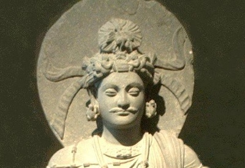

  
[Intangible Textual Heritage](../../index)  [Buddhism](../index.md) 

------------------------------------------------------------------------

<table width="75%">
<colgroup>
<col style="width: 50%" />
<col style="width: 50%" />
</colgroup>
<tbody>
<tr class="odd">
<td width="50%" data-valign="TOP"></td>
<td width="50%" data-valign="CENTER"><h1 id="the-jataka" data-align="CENTER">The Jataka</h1>
<h2 id="volume-i" data-align="CENTER">Volume I</h2>
<h4 id="tr.-robert-chalmers" data-align="CENTER">tr. Robert Chalmers</h4>
<h5 id="ed.-e.-b.-cowell" data-align="CENTER">ed. E. B. Cowell</h5>
<h4 id="section" data-align="CENTER">[1895]</h4></td>
</tr>
</tbody>
</table>

------------------------------------------------------------------------

[Contents](#contents)    [Start Reading](j1000.md)    [Page
Index](pageidx)    [Text \[Zipped\]](j1.txt.gz.md)

------------------------------------------------------------------------

**VOLUME I**   \|    [VOLUME II](../j2/index.md)   \|    [VOLUME
III](../j3/index)   \|    [VOLUME IV](../j4/index.md)   \|    [VOLUME
V](../j5/index)   \|    [VOLUME VI](../j6/index.md)

------------------------------------------------------------------------

The Jataka is a massive collection of Buddhist folklore about previous
incarnations of the Buddha, both in human and animal form. Originally
written in Pali, and dating to at least 380 BCE, the Jataka includes
many stories which have traveled afar. Many of these can be traced
cross-culturally in the folklore of many countries.

------------------------------------------------------------------------

 [Title Page](j1000.md)  
[Preface](j1001.md)  
[Contents](j1002.md)  
[Errata](j1003.md)  

### Book I.--Ekanipāta

[No. 1. Apaṇṇaka-Jātaka](j1004.md)  
[No. 2. Vaṇṇupatha-Jātaka](j1005.md)  
[No. 3. Serivāṇija-Jātaka](j1006.md)  
[No. 4. Cullaka-Seṭṭhi-Jātaka](j1007.md)  
[No. 5. Taṇḍulanāli-Jātaka](j1008.md)  
[No. 6. Devadhamma-Jātaka](j1009.md)  
[No. 7. Kaṭṭhahāri-Jātaka](j1010.md)  
[No. 8. Gāmani-Jātaka](j1011.md)  
[No. 9. Makhādeva-Jātaka](j1012.md)  
[No. 10. Sukhavihāri-Jātaka](j1013.md)  
[No. 11. Lakkhaṇa-Jātaka](j1014.md)  
[No. 12. Nigrodhamiga-Jātaka](j1015.md)  
[No. 13. Kaṇḍina-Jātaka](j1016.md)  
[No. 14. Vātamiga-Jātaka](j1017.md)  
[No. 15. Kharādiya-Jātaka](j1018.md)  
[No. 16. Tipallattha-Miga-Jātaka](j1019.md)  
[No. 17. Māluta-Jātaka](j1020.md)  
[No. 18. Matakabhatta-Jātaka](j1021.md)  
[No. 19. Āyācitabhatta-Jātaka](j1022.md)  
[No. 20. Naḷapāna-Jātaka](j1023.md)  
[No. 21. Kuruṅga-Jātaka](j1024.md)  
[No. 22. Kukkura-Jātaka](j1025.md)  
[No. 23. Bhojājānīya-Jātaka](j1026.md)  
[No. 24. Ājañña-Jātaka](j1027.md)  
[No. 25. Tittha-Jātaka](j1028.md)  
[No. 26. Mahilāmukha-Jātaka](j1029.md)  
[No. 27. Abhiṇha-Jātaka](j1030.md)  
[No. 28. Nandivisāla-Jātaka](j1031.md)  
[No. 29. Kaṇha-Jātaka](j1032.md)  
[No. 30. Muṇika-Jātaka](j1033.md)  
[No. 31. Kulāvaka-Jātaka](j1034.md)  
[No. 32. Nacca-Jātaka](j1035.md)  
[No. 33. Sammodamāna-Jātaka](j1036.md)  
[No. 34. Maccha-Jātaka](j1037.md)  
[No. 35. Vaṭṭaka-Jātaka](j1038.md)  
[No. 36. Sakuṇa-Jātaka](j1039.md)  
[No. 37. Tittira-Jātaka](j1040.md)  
[No. 38. Baka-Jātaka](j1041.md)  
[No. 39. Nanda-Jātaka](j1042.md)  
[No. 40. Khadiraṅgāra-Jātaka](j1043.md)  
[No. 41. Losaka-Jātaka](j1044.md)  
[No. 42. Kapota-Jātaka](j1045.md)  
[No. 43. Veḷuka-Jātaka](j1046.md)  
[No. 44. Makasa-Jātaka](j1047.md)  
[No. 45. Rohiṇī-Jātaka](j1048.md)  
[No. 46. Ārāmadūsaka-Jātaka](j1049.md)  
[No. 47. Vāruṇi-Jātaka](j1050.md)  
[No. 48. Vedabbha-Jātaka](j1051.md)  
[No. 49. Nakkhatta-Jātaka](j1052.md)  
[No. 50. Dummedha-Jātaka](j1053.md)  
[No. 51. Mahāsīlava-Jātaka](j1054.md)  
[No. 52. Cūḷa-Janaka-Jātaka](j1055.md)  
[No. 53. Puṇṇapāti-Jātaka](j1056.md)  
[No. 54. Phala-Jātaka](j1057.md)  
[No. 55. Pañcāvudha-Jātaka](j1058.md)  
[No. 56. Kañcanakkhandha-Jātaka](j1059.md)  
[No. 57. Vānarinda-Jātaka](j1060.md)  
[No. 58. Tayodhamma-Jātaka](j1061.md)  
[No. 59. Bherivāda-Jātaka](j1062.md)  
[No. 60. Saṁkhadhamana-Jātaka](j1063.md)  
[No. 61. Asātamanta-Jātaka](j1064.md)  
[No. 62. Aṇḍabhūta-Jātaka](j1065.md)  
[No. 63. Takka-Jātaka](j1066.md)  
[No. 64. Durājāna-Jātaka](j1067.md)  
[No. 65. Anabhirati-Jātaka](j1068.md)  
[No. 66. Mudulakkhaṇa-Jātaka](j1069.md)  
[No. 67. Ucchaṅga-Jātaka](j1070.md)  
[No. 68. Sāketa-Jātaka](j1071.md)  
[No. 69. Visavanta-Jātaka](j1072.md)  
[No. 70. Kuddāla-Jātaka](j1073.md)  
[No. 71. Varaṇa-Jātaka](j1074.md)  
[No. 72. Sīlavanāga-Jātaka](j1075.md)  
[No. 73. Saccaṁkira-Jātaka](j1076.md)  
[No. 74. Rukkhadhamma-Jātaka](j1077.md)  
[No. 75. Maccha-Jātaka](j1078.md)  
[No. 76. Asaṁkiya-Jātaka](j1079.md)  
[No. 77. Mahāsupina-Jātaka](j1080.md)  
[No. 78. Illīsa-Jātaka](j1081.md)  
[No. 79. Kharassara-Jātaka](j1082.md)  
[No. 80. Bhīmasena-Jātaka](j1083.md)  
[No. 81. Surāpāna-Jātaka](j1084.md)  
[No. 82. Mittavinda-Jātaka](j1085.md)  
[No. 83. Kālakaṇṇi-Jātaka](j1086.md)  
[No. 84. Atthassadvāra-Jātaka](j1087.md)  
[No. 85. Kimpakka-Jātaka](j1088.md)  
[No. 86. Sīlavīmaṁsana-Jātaka](j1089.md)  
[No. 87. Maṁgala-Jātaka](j1090.md)  
[No. 88. Sārambha-Jātaka](j1091.md)  
[No. 89. Kuhaka-Jātaka](j1092.md)  
[No. 90. Akataññu-Jātaka](j1093.md)  
[No. 91. Litta-Jātaka](j1094.md)  
[No. 92. Mahāsāra-Jātaka](j1095.md)  
[No. 93. Vissāsabhojana-Jātaka](j1096.md)  
[No. 94. Lomahaṁsa-Jātaka](j1097.md)  
[No. 95. Mahāsudassana-Jātaka](j1098.md)  
[No. 96. Telapatta-Jātaka](j1099.md)  
[No. 97. Nāmasiddhi-Jātaka](j1100.md)  
[No. 98. Kūṭavāṇija-Jātaka](j1101.md)  
[No. 99. Parosahassa-Jātaka](j1102.md)  
[No. 100. Asātarūpa-Jātaka](j1103.md)  
[No. 101. Parosata-Jātaka](j1104.md)  
[No. 102. Paṇṇika-Jātaka](j1105.md)  
[No. 103. Veri-Jātaka](j1106.md)  
[No. 104. Mittavinda-Jātaka](j1107.md)  
[No. 105. Dubbalakaṭṭha-Jātaka](j1108.md)  
[No. 106. Udañcani-Jātaka](j1109.md)  
[No. 107. Sālittaka-Jātaka](j1110.md)  
[No. 108. Bāhiya-Jātaka](j1111.md)  
[No. 109. Kuṇḍakapūva-Jātaka](j1112.md)  
[No. 110. Sabbasaṁhāraka-Pañha](j1113.md)  
[No. 111. Gadrabha-Pañha](j1114.md)  
[No. 112. Amarādevī-Pañha](j1115.md)  
[No. 113. Sigāla-Jātaka](j1116.md)  
[No. 114. Mitacinti-Jātaka](j1117.md)  
[No. 115. Anusāsika-Jātaka](j1118.md)  
[No. 116. Dubbaca-Jātaka](j1119.md)  
[No. 117. Tittira-Jātaka](j1120.md)  
[No. 118. Vaṭṭaka-Jātaka](j1121.md)  
[No. 119. Akālarāvi-Jātaka](j1122.md)  
[No. 120. Bandhanamokkha-Jātaka](j1123.md)  
[No. 121. Kusanāḷi-Jātaka](j1124.md)  
[No. 122. Dummedha-Jātaka](j1125.md)  
[No. 123. Naṅgalīsa-Jātaka](j1126.md)  
[No. 124. Amba-Jātaka](j1127.md)  
[No. 125. Kaṭāhaka-Jātaka](j1128.md)  
[No. 126. Asilakkhaṇa-Jātaka](j1129.md)  
[No. 127. Kalaṇḍuka-Jātaka](j1130.md)  
[No. 128. Biḷāra-Jātaka](j1131.md)  
[No. 129. Aggika-Jātaka](j1132.md)  
[No. 130. Kosiya-Jātaka](j1133.md)  
[No. 131. Asampadāna-Jātaka](j1134.md)  
[No. 132. Pañcagaru-Jātaka](j1135.md)  
[No. 133. Ghatāsana-Jātaka](j1136.md)  
[No. 134. Jhānasodhana-Jātaka.](j1137.md)  
[No. 135. Candābha-Jātaka](j1138.md)  
[No. 136. Suvaṇṇahaṁsa-Jātaka](j1139.md)  
[No. 137. Babbu-Jātaka](j1140.md)  
[No. 138. Godha-Jātaka](j1141.md)  
[No. 139. Ubhatobhaṭṭha-Jātaka](j1142.md)  
[No. 140. Kāka-Jātaka](j1143.md)  
[No. 141. Godha-Jātaka](j1144.md)  
[No. 142. Sigāla-Jātaka](j1145.md)  
[No. 143. Virocana-Jātaka](j1146.md)  
[No. 144. Naṅguṭṭha-Jātaka](j1147.md)  
[No. 145. Rādha-Jātaka](j1148.md)  
[No. 146. Kāka-Jātaka](j1149.md)  
[No. 147. Puppharatta-Jātaka](j1150.md)  
[No. 148. Sigāla-Jātaka](j1151.md)  
[No. 149. Ekapaṇṇa-Jātaka](j1152.md)  
[No. 150. Sañjīva-Jātaka](j1153.md)  
[Index of Proper Names](j1154.md)  
