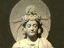

  
[Intangible Textual Heritage](../../index)  [Buddhism](../index.md) 
[Index](index)  [Previous](j1009)  [Next](j1011.md) 

------------------------------------------------------------------------

  
*The Jataka, Volume I*, tr. by Robert Chalmers, \[1895\], at Intangible
Textual Heritage

------------------------------------------------------------------------

### No. 7.

### KAṬṬHAHĀRI-JĀTAKA.

"*Your son am I*."--This story was told by the Master while at Jetavana
about the story of Vāsabha-Khattiyā, which will be found in the Twelfth
Book in the Bhaddasāla-jātaka [1](#fn_38.md).
Tradition tells us that she was the daughter of Mahānāma Sakka by a
slave-girl named Nāgamuṇḍā, and that she afterwards became the consort
of the king of Kosala. She conceived a son by the king; but the king,
coming to know of her servile origin, degraded her from her rank, and
also degraded her son Viḍūḍabha. Mother and son never came outside the
palace.

Hearing of this, the Master at early dawn came to the palace attended by
five hundred Brethren \[134\], and, sitting down on the seat prepared
for him, said, "Sire, where is Vāsabha-Khattiyā?"

Then the king told him what had happened.

Sire, whose daughter is Vāsabha-Khattiyā?" "Mahānāma's daughter, sir."
"When she came away, to whom did she come as wife?" "To me, sir." "Sire,
she is a king's daughter; to a king she is wed; and to a king she bore
her

p. 28

son. Wherefore is that son not in authority over the realm which owns
his father's sway? In bygone days, a monarch who had a son by a
casual [1](#fn_39.md) faggot-gatherer gave that son
his sovereignty."

The king asked the Blessed One to explain this. The Blessed One made
clear what had been concealed from him by re-birth.

\_\_\_\_\_\_\_\_\_\_\_\_\_\_\_\_\_\_\_\_\_\_\_\_\_\_\_\_\_

Once on a time in Benares Brahmadatta the king, having gone in great
state to his pleasaunce, was roaming about looking for fruits and
flowers when he came on a woman who was merrily singing away as she
picked up sticks in the grove. Falling in love at first sight, the king
became intimate with her, and the Bodhisatta was conceived then and
there. Feeling as heavy within as though weighed down with the bolt of
Indra, the woman knew that she would become a mother, and told the king
so. He gave her the signet-ring from his finger and dismissed her with
these-words:--"If it be a girl, spend this ring on her nurture; but if
it be a boy, bring ring and child to me."

When the woman's time was come, she bore the Bodhisatta. And when he
could run about and was playing in the playground, a cry would arise,
"No-father has hit me!" Hearing this, the Bodhisatta ran away to his
mother and asked who his father was.

"You are the son of the King of Benares, my boy." "What proof of this is
there, mother?" "My son, the king on leaving me gave me this signet-ring
and said, 'If it be a girl, spend this ring on her nurture; but if it be
a boy, bring ring and child to me.'" "Why then don't you take me to my
father, mother?"

\[135\] Seeing that the boy's mind was made up, she took him to the gate
of the palace, and bade their coming be announced to the king. Being
summoned in, she entered and bowing before his majesty said, "This is
your son, sire."

The king knew well enough that this was the truth, but shame before all
his court made him reply, "He is no son of mine." "But here is your
signet-ring, sire; you will recognise that." "Nor is this my
signet-ring." Then said the woman, "Sire, I have now no witness to prove
my words, except to appeal to truth. Wherefore, if you be the father of
my child, I pray that he may stay in mid-air; but if not, may he fall to
earth and be killed." So saying, she seized the Bodhisatta by the foot
and threw him up into the air.

p. 29

Seated cross-legged in mid-air, the Bodhisatta in sweet tones repeated
this stanza to his father, declaring the truth:--

Your son am I, great monarch; rear me, Sire!  
The king rears others, but much more his child.

Hearing the Bodhisatta thus teach the truth to him from mid-air, the
king stretched out his hands and cried, "Come to me, my boy! None, none
but me shall rear and nurture you!" A thousand hands were stretched out
to receive the Bodhisatta; \[136\] but it was into the arms of the king
and of no other that he descended, seating himself in the king's lap.
The king made him viceroy, and made his mother queen-consort. At the
death of the king his father, he came to the throne by the title of King
Kaṭṭhavāhana--the faggot-bearer--, and after ruling his realm
righteously, passed away to fare according to his deserts.

\_\_\_\_\_\_\_\_\_\_\_\_\_\_\_\_\_\_\_\_\_\_\_\_\_\_\_\_\_

His lesson to the king of Kosala ended, and his two stories told, the
Master made the connexion linking them both together, and identified the
Birth by saying:--"Mahāmāyā was the mother of those days, King
Suddhodana was the father, and I myself King Kaṭṭhavāhana."

\[*Note*. Cf. Dhammapada, p. 218, Jātaka No. 465, and Rogers'
Buddhaghosha's Parables, p. 146. See also an endeavour, in the Ceylon
R.AṢ. Journal, 1884, to trace this Jātaka back to the story of Dushyanta
and Çakuntalā in the *Mahābhārata* and to Kālidāsa's drama of the Lost
Ring.\]

------------------------------------------------------------------------

### Footnotes

[27:1](j1010.htm#fr_38.md) No. 465.

[28:1](j1010.htm#fr_39.md) The word *muhuttikāya*
means, literally, "momentary," or perhaps may be translated "with whom
he consorted but a little while." Professor Künte (Ceylon R. A. S.
Journal, 1884, p. 128) sees in the word a reference to the Muhūrta
(mohotura) form of marriage, which "obtains among the Mahrathas other
than the Brahmanas," and which he compares with the familiar Gāndharva
form, *i.e.* (legal) union by mutual consent, on the spur of the moment,
without any preliminary formalities.

------------------------------------------------------------------------

[Next: No. 8. Gāmani-Jātaka](j1011.md)

