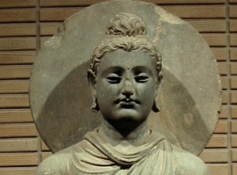

  
[Intangible Textual Heritage](../../index)  [Buddhism](../index) 

------------------------------------------------------------------------

<table width="75%">
<colgroup>
<col style="width: 50%" />
<col style="width: 50%" />
</colgroup>
<tbody>
<tr class="odd">
<td width="50%" data-valign="TOP"></td>
<td width="50%" data-valign="CENTER"><h1 id="the-jataka" data-align="CENTER">The Jataka</h1>
<h2 id="volume-ii" data-align="CENTER">Volume II</h2>
<h4 id="tr.-w.h.d.-rouse" data-align="CENTER">tr. W.H.D. Rouse</h4>
<h5 id="ed.-e.-b.-cowell" data-align="CENTER">ed. E. B. Cowell</h5>
<h4 id="section" data-align="CENTER">[1895]</h4></td>
</tr>
</tbody>
</table>

------------------------------------------------------------------------

[Contents](#contents)    [Start Reading](j2000)    [Page
Index](pageidx)    [Text \[Zipped\]](j2.txt.gz)

------------------------------------------------------------------------

[VOLUME I](../j1/index)   \|    **VOLUME II**   \|    [VOLUME
III](../j3/index)   \|    [VOLUME IV](../j4/index)   \|    [VOLUME
V](../j5/index)   \|    [VOLUME VI](../j6/index)

------------------------------------------------------------------------

The Jataka is a massive collection of Buddhist folklore about previous
incarnations of the Buddha, both in human and animal form. Originally
written in Pali, and dating to at least 380 BCE, the Jataka includes
many stories which have traveled afar. Many of these can be traced
cross-culturally in the folklore of many countries.

------------------------------------------------------------------------

 [Title Page](j2000)  
[Preface](j2001)  
[Contents](j2002)  
[Additions and Corrections](j2003)  

### Book II. Dukanipāta

[No. 151. Rājovāda-Jātaka](j2004)  
[No. 152. Sigāla-Jātaka](j2005)  
[No. 153 Sūkara-Jātaka](j2006)  
[No. 154. Uraga-Jātaka](j2007)  
[No. 155. Gagga-Jātaka](j2008)  
[No. 156. Alīnacitta-Jātaka](j2009)  
[No. 157. Guṇa-Jātaka](j2010)  
[No. 158. Suhanu-Jātaka](j2011)  
[No. 159. Mora-Jātaka](j2012)  
[No. 160. Vinīlaka-Jātaka](j2013)  
[No. 161. Indasamānagotta-Jātaka](j2014)  
[No. 162. Santhava-Jātaka](j2015)  
[No. 163. Susīma-Jātaka](j2016)  
[No. 164. Gijjha-Jātaka](j2017)  
[No. 165. Nakula-Jātaka](j2018)  
[No. 166. Upasāḷha-Jātaka](j2019)  
[No. 167. Samiddhi-Jātaka](j2020)  
[No. 168. Sakuṇagghi-Jātaka](j2021)  
[No. 169. Araka-Jātaka](j2022)  
[No. 170. Kakaṇṭaka-Jātaka](j2023)  
[No. 171. Kalyāṇa-Dhamma-Jātaka](j2024)  
[No. 172. Daddara-Jātaka](j2025)  
[No. 173. Makkaṭa-Jātaka](j2026)  
[No. 174. Dūbhiya-Makkaṭa-Jātaka](j2027)  
[No. 175. Ādiccupaṭṭhāna-Jātaka](j2028)  
[No. 176. Kalāya-Muṭṭhi-Jātaka](j2029)  
[No. 177. Tiṇḍuka-Jātaka](j2030)  
[No. 178. Kacchapa-Jātaka](j2031)  
[No. 179. Satadhamma-Jātaka](j2032)  
[No. 180. Duddada-Jātaka](j2033)  
[No. 181. Asadisa-Jātaka](j2034)  
[No. 182. Saṁgāmāvacara-Jātaka](j2035)  
[No. 183. Vālodaka-Jātaka](j2036)  
[No. 184. Giridanta-Jātaka](j2037)  
[No. 185. Anabhirati-Jātaka](j2038)  
[No. 186. Dadhi-Vāhana-Jātaka](j2039)  
[No. 187. Catumaṭṭa-Jātaka](j2040)  
[No. 188. Sīhakoṭṭhuka-Jātaka](j2041)  
[No. 189. Sīhacamma-Jātaka](j2042)  
[No. 190. Sīlānisaṁsa-Jātaka](j2043)  
[No. 191. Ruhaka-Jātaka](j2044)  
[No. 192. Siri-Kāḷakaṇṇi-Jātaka](j2045)  
[No. 193. Culla-Paduma-Jātaka](j2046)  
[No. 194. Maṇicora-Jātaka](j2047)  
[No. 195. Pabbatūpatthara-Jātaka](j2048)  
[No. 196. Valāhassa-Jātaka](j2049)  
[No. 197. Mittāmitta-Jātaka](j2050)  
[No. 198.](j2051)  
[No. 199. Gahapati-Jātaka](j2052)  
[No. 200. Sādhusīla-Jātaka](j2053)  
[No. 201. Bandhanāgāra-Jātaka](j2054)  
[No. 202. Keḷi-Sīla-Jātaka](j2055)  
[No. 203. Khandha-Vatta-Jātaka](j2056)  
[No. 204. Vīraka-Jātaka](j2057)  
[No. 205. Gaṅgeyya-Jātaka](j2058)  
[No. 206. Kuruṅga-Miga-Jātaka](j2059)  
[No. 207. Assaka-Jātaka](j2060)  
[No. 208. Suṁsumāra-Jātaka](j2061)  
[No. 209. Kakkara-Jātaka](j2062)  
[No. 210. Kandagalaka-Jātaka](j2063)  
[No. 211. Somadatta-Jātaka](j2064)  
[No. 212. Ucchiṭṭha-Bhatta-Jātaka](j2065)  
[No. 213. Bharu-Jātaka](j2066)  
[No. 214. Puṇṇa-Nadī-Jātaka](j2067)  
[No. 215. Kacchapa-Jātaka](j2068)  
[No. 216. Maccha-Jātaka](j2069)  
[No. 217. Seggu-Jātaka](j2070)  
[No. 218. Kūṭa-Vāṇija-Jātaka](j2071)  
[No. 219. Garahita-Jātaka](j2072)  
[No. 220. Dhammaddhaja-Jātaka](j2073)  
[No. 221. Kāsāva-Jātaka](j2074)  
[No. 222. Cūla-Nandiya-Jātaka](j2075)  
[No. 223. Puṭa-Bhatta-Jātaka](j2076)  
[No. 224. Kumbhīla-Jātaka](j2077)  
[No. 225. Khanti-Vaṇṇana-Jātaka](j2078)  
[No. 226. Kosiya-Jātaka](j2079)  
[No. 227. Gūtha-Pāṇa-Jātaka](j2080)  
[No. 228. Kāmanīta-Jātaka](j2081)  
[No. 229. Palāyi-Jātaka](j2082)  
[No. 230. Dutiya-Palāyi-Jātaka](j2083)  
[No. 231. Upāhana-Jātaka](j2084)  
[No. 232. Vīṇā-Thūṇa-Jātaka](j2085)  
[No. 233. Vikaṇṇaka-Jātaka](j2086)  
[No. 234. Asitābhū-Jātaka](j2087)  
[No. 235. Vaccha-Nakha-Jātaka](j2088)  
[No. 236. Baka-Jātaka](j2089)  
[No. 237. Sāketa-Jātaka](j2090)  
[No. 238. Ekapada-Jātaka](j2091)  
[No. 239. Harita-Māta-Jātaka](j2092)  
[No. 240. Mahāpiṅgala-Jātaka](j2093)  
[No. 241. Sabbadāṭha-Jātaka](j2094)  
[No. 242. Sunakha-Jātaka](j2095)  
[No. 243. Guttila-Jātaka](j2096)  
[No. 244. Vīticcha-Jātaka](j2097)  
[No. 245. Mūla-Pariyāya-Jātaka](j2098)  
[No. 246. Telovāda-Jātaka](j2099)  
[No. 247. Pādañjali-Jātaka](j2100)  
[No. 248. Kiṁsukopama-Jātaka](j2101)  
[No. 249. Sālaka-Jātaka](j2102)  
[No. 250. Kapi-Jātaka](j2103)  

### Book III. Tika-Nipāta

[No. 251. Saṁkappa-Jātaka](j2104)  
[No. 252. Tila-Muṭṭhi-Jātaka](j2105)  
[No. 253. Maṇi-Kaṇṭha-Jātaka](j2106)  
[No. 254. Kuṇḍaka-Kucchi-Sindhava-Jātaka](j2107)  
[No. 255. Suka-Jātaka](j2108)  
[No. 256. Jarudapāna-Jātaka](j2109)  
[No. 257. Gāmaṇi-Caṇḍa-Jātaka](j2110)  
[No. 258. Mandhātu-Jātaka](j2111)  
[No. 259. Tirīṭa-Vaccha-Jātaka](j2112)  
[No. 260. Dūta-Jātaka](j2113)  
[No. 261. Paduma-Jātaka](j2114)  
[No. 262. Mudu-Pāṇi-Jātaka](j2115)  
[No. 263. Culla-Palobhana-Jātaka](j2116)  
[No. 264. Mahā-Panāda-Jātaka](j2117)  
[No. 265. Khurappa-Jātaka](j2118)  
[No. 266. Vātagga-Sindhava-Jātaka](j2119)  
[No. 267. Kakkatā-Jātaka](j2120)  
[No. 268. Ārāma-Dūsa-Jātaka](j2121)  
[No. 269. Sujāta-Jātaka](j2122)  
[No. 270. Ulūka-Jātaka](j2123)  
[No. 271. Udapāna-Dūsaka-Jātaka](j2124)  
[No. 272. Vyaggha-Jātaka](j2125)  
[No. 273. Kacchapa-Jātaka](j2126)  
[No. 274. Lola-Jātaka](j2127)  
[No. 275.](j2128)  
[No. 276. Kurudhamma-Jātaka](j2129)  
[No. 277. Romaka-Jātaka](j2130)  
[No. 278. Mahisa-Jātaka](j2131)  
[No. 279. Satapatta-Jātaka](j2132)  
[No. 280. Puṭa-Dūsaka-Jātaka](j2133)  
[No. 281. Abbhantara-Jātaka](j2134)  
[No. 282. Seyya-Jātaka](j2135)  
[No. 283. Vaḍḍhaki-Sūkara-Jātaka](j2136)  
[No. 284. Siri-Jātaka](j2137)  
[No. 285. Maṇisūkara-Jātaka](j2138)  
[No. 286. Sālūka-Jātaka](j2139)  
[No. 287. Lābha-Garaha-Jātaka](j2140)  
[No. 288. Macch-Uddāna-Jātaka](j2141)  
[No. 289. Nāna-Cchanda-Jātaka](j2142)  
[No. 290. Sīla-Vīmaṁsa-Jātaka](j2143)  
[No. 291. Bhadra-Ghaṭa-Jātaka](j2144)  
[No. 292. Supatta-Jātaka](j2145)  
[No. 293. Kāya-Vicchinda-Jātaka](j2146)  
[No. 294. Jambu-Khādaka-Jātaka](j2147)  
[No. 295. Anta-Jātaka](j2148)  
[No. 296. Samudda-Jātaka](j2149)  
[No. 297. Kāma-Vilāpa-Jātaka](j2150)  
[No. 298. Udumbara-Jātaka](j2151)  
[No. 299. Komāya-Putta-Jātaka](j2152)  
[No. 300. Vaka-Jātaka](j2153)  
[Index of Names and Pali Words](j2154)  
[Index of Matters](j2155)  
