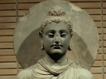

  
[Intangible Textual Heritage](../../index)  [Buddhism](../index) 
[Index](index)  [Previous](j2101)  [Next](j2103) 

------------------------------------------------------------------------

  
*The Jataka, Vol. II*, tr. by W.H.D. Rouse, \[1895\], at Intangible
Textual Heritage

------------------------------------------------------------------------

p. 186 

### No. 249.

### SĀLAKA-JĀTAKA.

"*Like my own son*," *etc*.--This story the Master told whilst living in
Jetavana, about a distinguished Elder.

It is said that he had ordained a youth, whom he treated unkindly. The
novice at last could stand it no longer, and returned to the world. Then
the Elder tried to coax him. \[267\] "Look here, lad," said he, "your
robe shall be your own, and your bowl too; I have another bowl and robe
which I'll give you. Join us again!" At first he refused, but at last
after much asking he did so. From the day he joined the brotherhood the
Elder maltreated him as before. Again the lad found it too much, and
left the order. As the Elder begged him again several times to join, the
lad replied, "You can neither do with me nor without me; let me alone--I
will not join!"

The Brethren got talking about this in the Hall of Truth. "Friend," said
they, "a sensitive lad that! He knew the Elder too well to join us." The
Master came in and asked what they were talking about. They told him. He
rejoined, "Not only is the lad sensitive now, Brethren, but he was just
the same of old; when once he saw the faults of that man, he would not
accept him again." And he told a story of the olden time.

\_\_\_\_\_\_\_\_\_\_\_\_\_\_\_\_\_\_\_\_\_\_\_\_\_\_\_\_\_

Once upon a time, in the reign of Brahmadatta king of Benares, the
Bodhisatta was born into a landowner's family, and gained a living by
selling corn. Another man, a snake-charmer, had trained a monkey, made
him swallow an antidote, and making a snake play with the monkey he
gained his livelihood in this way.

A merrymaking had been proclaimed; this man wished to make merry at the
feast, and he entrusted the monkey to this merchant, bidding him not
neglect it. Seven days after he cane to the merchant, and asked for his
monkey. The monkey heard his master's voice, and came out quickly from
the grain shop. At once the man beat him over the back with a piece of
bamboo; then he took him off to the woods, tied him up and fell asleep.
So soon as the monkey saw that he was asleep, he loosed his bonds,
scampered off and climbed a mango tree. He ate a mango, and dropped the
stone upon the snake-charmer's head. The man awoke, and looked up: there
was the monkey. "I'll wheedle him!" he thought, "and when he comes down
from the tree, I'll catch him! "So to wheedle him, he repeated the first
verse:--

"Like my own son you shall be,  
Master in our family:  
\[268\] Come down, Nuncle [1](#fn_153) from the
tree--  
Come and hurry home with me?"

p. 187

The monkey listened, and repeated the second verse:--

"You are laughing in your sleeve!  
Have you quite forgot that beating?  
Here I am content to live  
(So good-bye) ripe mangoes eating."

Up he arose, and was soon lost in the wood; while the snake-charmer
returned to his house in high dudgeon.

\_\_\_\_\_\_\_\_\_\_\_\_\_\_\_\_\_\_\_\_\_\_\_\_\_\_\_\_\_

When this discourse was ended, the Master identified the Birth: "Our
novice was the Monkey. The Elder was the snake-charmer, and I myself was
the corn-merchant."

------------------------------------------------------------------------

### Footnotes

[186:1](j2102.htm#fr_153) *sālaka*, lit.
'brother-in-law,' often used as a term of abuse.

------------------------------------------------------------------------

[Next: No. 250. Kapi-Jātaka](j2103)

