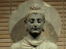

  
[Intangible Textual Heritage](../../index)  [Buddhism](../index) 
[Index](index)  [Previous](j2107)  [Next](j2109) 

------------------------------------------------------------------------

  
*The Jataka, Vol. II*, tr. by W.H.D. Rouse, \[1895\], at Intangible
Textual Heritage

------------------------------------------------------------------------

### No. 255.

### SUKA-JĀTAKA.

"*What time the bird*," *etc*.--This story the Master told while
dwelling at Jetavana, about a Brother who died of over-eating.

\[2921 On his death, the brethren assembled in the Hall of Truth, and
discussed his demerits on this fashion: "Friend, Brother So-and-so was
ignorant how much he could safely eat. So he ate more than he could
digest, and died in consequence." The Master entered, and asked what
they talked of now as they sat together; and they told him. "Brethren,"
he said, "this is not the first time our friend died of surfeit; the
same has happened before." Then he told them an old-world tale.

\_\_\_\_\_\_\_\_\_\_\_\_\_\_\_\_\_\_\_\_\_\_\_\_\_\_\_\_\_

Once on a time, when king Brahmadatta reigned over Benares, the
Bodhisatta became a Parrot, and dwelt in the Himalaya region. He was
king over several thousands of his kind, who lived on the seaward side
of the Himalayas; and one son was his. When his son grew up to be
strong, the father Parrot's eyes became weak. The truth is, that parrots
fly with great swiftness; wherefore when they be old it is the eye that
weakens first. His son kept his parents in the nest, and would bring
them food to feed them.

It happened one day that our young Parrot went to the place where he
found his food, and alighted upon a mountain-top. Thence he looked over
the ocean, and beheld an island, in which was a mango grove full of
sweet golden fruit. So next day, at the time of the fetching of food, he
rose in the air and flew to this grove of mangoes, where he sucked the
mango juice,

p. 204

and took of the fruit, and bore it home to his mother and father. As the
Bodhisatta ate of it, he knew the taste.

"My son," said he, "this is a mango of such and such an island," naming
it.

"Even so, father!" replied the young Parrot.

"Parrots that go thither, my son, have not length of life," he said. "Go
not to that island again!"--But the son obeyed him not, and went yet
again.

Then one day it befel that he went as usual, and drank much of the mango
juice. With a mango in his beak \[293\] he was passing over the ocean,
when he grew worn out with so long carrying, and sleep mastered him;
sleeping he flew on, and the fruit which he carried fell from out of his
beak. And by degrees he left his path, and sinking down skimmed the
surface of the water, till in the end he fell in. And then a fish caught
and devoured him. 'When he should have returned, he returned not, and
the Bodhisatta knew that he must have fallen into the water. Then his
parents, receiving no sustenance, pined away and died.

\_\_\_\_\_\_\_\_\_\_\_\_\_\_\_\_\_\_\_\_\_\_\_\_\_\_\_\_\_

The Master, having told this tale, in his perfect wisdom, uttered the
following stanzas:

"What time the bird without excess did eat,  
He found the way, and brought his mother meat.

"But once he ate too much, forgot the mean,  
He fell; and afterward was no more seen.

"So be not greedy; modest be in all.  
To spare is safe; greed goeth before a fall [1](#fn_161)."

 

p. 205

When the Master had ended this discourse, he declared the Truths (at the
conclusion of which many persons entered the First Path, or the Second,
or Third, or Fourth), and identified the Birth: "At that time, the
brother who has over-eaten was the young Parrot, and the king of the
Parrots was I myself."

------------------------------------------------------------------------

### Footnotes

[204:1](j2108.htm#fr_161) The Scholiast adds
the following lines:

"Be moderate in eating wet or dry,  
And this thy hunger's need will satisfy.  
Who eats with care, whose belly is not great,  
Will be a holy hermit soon or late.  
\[291\] Four or five mouthfuls,--then a drink is right;  
Enough for any earnest eremite.  
A careful moderate eater has small pain,  
Slowly grows old, lives twice as long again."

And these:

"When sons bring meat to fathers in the wood,  
Like ointment to the eye, ’tis very good.  
Thus for bare life, with weariness forspent,  
He nourished him upon such nourishment."

------------------------------------------------------------------------

[Next: No. 256. Jarudapāna-Jātaka](j2109)

