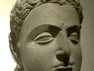

  
[Intangible Textual Heritage](../../index)  [Buddhism](../index.md) 
[Index](index)  [Previous](j3054)  [Next](j3056.md) 

------------------------------------------------------------------------

  
*The Jataka, Vol. III*, tr. by H.T. Francis and R.A. Neil, \[1897\], at
Intangible Textual Heritage

------------------------------------------------------------------------

### No. 354.

#### URAGA-JĀTAKA.

\[162\] *"Man quits his mortal frame," etc.* This story the Master,
while dwelling at Jetavana, told concerning a landowner whose son had
died. The introductory story is just the same as that of the man who
lost both his wife and father. Here too the Master in the same way went
to the man's house, and after saluting him as he was seated, asked him
saying, "Pray, Sir, are you grieving?" And on his replying, "Yes,
Reverend Sir, ever since my son's death I grieve," he said, "Sir, verily
that which is subject to dissolution is dissolved, and that which is
subject to destruction is destroyed [1](#fn_64.md),
and this happens not to one man only, nor in one village merely, but in
countless spheres, and in the three modes of existence, there is no
creature that is not subject to death, nor is there any existing thing
that is capable of abiding in the same condition. All beings are subject
to

p. 108

death, and all compounds are subject to dissolution. But sages of old,
when they lost a son, said, "That which is subject to destruction is
destroyed," and grieved not." And hereupon at the man's request he
related a story of the past.

------------------------------------------------------------------------

Once upon a time when Brahmadatta was reigning in Benares, the
Bodhisatta was born in a brahmin household, in a village outside the
gates of Benares, and rearing a family he supported them by field
labour. He had two children, a son and a daughter. When the son was
grown up, the father brought a wife home for him from a family of equal
rank with his own. Thus with a female slave they composed a household of
six: the Bodhisatta and his wife, the son and daughter, the
daughter-in-law and the female slave. They lived happily and
affectionately together. The Bodhisatta thus admonished the other five;
"According as ye have received, give alms, observe holy days, keep the
moral law, dwell on the thought of death, be mindful of your mortal
state. For in the case of beings like ourselves, death is certain, life
uncertain: all existing things are transitory and subject to decay.
Therefore take heed to your ways day and night." They readily accepted
his teaching and dwelt earnestly on the thought of death.

Now one day the Bodhisatta went with his son to plough his field.
\[163\] The son gathered together the rubbish and set fire to it. Not
far from where he was, lived a snake in an anthill. The smoke hurt the
snake's eyes. Coming out from his hole in a rage, it thought, "This is
all due to that fellow," and fastening upon him with its four teeth it
bit him. The youth fell down dead. The Bodhisatta on seeing him fall,
left his oxen and came to him, and finding that he was dead, he took him
up and laid him at the foot of a certain tree, and covering him up with
a cloak, he neither wept nor lamented. He said, "That which is subject
to dissolution is dissolved, and that which is subject to death is dead.
All compound existences are transitory and liable to death." And
recognizing the transitory nature of things he went on with his
ploughing. Seeing a neighbour pass close by the field, he asked,
"Friend, are you going home?" And on his answering "Yes," he said,
"Please then to go to our house and say to the mistress, "You are not
to-day as formerly to bring food for two, but to bring it for one only.
And hitherto the female slave alone has brought the food, but to-day all
four of you are to put on clean garments, and to come with perfumes and
flowers in your hands."

"All right," he said, and went and spoke these very words to the
brahmin's wife.

She asked, "By whom, Sir, was this message given?"

"By the brahmin, lady," he replied.

p. 109

Then she understood that her son was dead. But she did not so much as
tremble. Thus showing perfect self-control, and wearing white garments
and with perfumes and flowers in her hand, she bade them bring food, and
accompanied the other members of the family to the field. But no one of
them all either shed a tear or made lamentation. The Bodhisatta, still
sitting in the shade where the youth lay, ate his food. And when his
meal was finished, they all took up fire-wood and lifting the body on to
the funeral pile, they made offerings of perfumes and flowers, and then
set fire to it. But not a single tear was shed by any one. All were
dwelling on the thought of death. Such was the efficacy of their virtue
that the throne of Sakka manifested signs of heat. \[164\] Sakka said,
"Who, I wonder, is anxious to bring me down from my throne?" And on
reflection he discovered that the heat was due to the force of virtue
existing in these people, and being highly pleased he said, "I must go
to them and utter a loud cry of exultation like the roaring of a lion,
and immediately afterwards fill their dwelling place with the seven
treasures." And going there in haste he stood by the side of the funeral
pyre and said, "What are you doing?"

"We are burning the body of a man, my lord."

"It is no man that you are burning," he said. "Methinks you are roasting
the flesh of some beast that you have slain."

"Not so, my lord," they said. "It is merely the body of a man that we
are burning."

Then he said, "It must have been some enemy."

The Bodhisatta said, "It is our own true son, and no enemy,"

"Then he could not have been dear as a son to you."

"He was very dear, my lord."

"Then why do you not weep?"

Then the Bodhisatta, to explain the reason why he did not weep, uttered
the first stanza:—

Man quits his mortal frame, when joy in life is past,  
E’en as a snake is wont its worn out slough to cast.  
No friend's lament can touch the ashes of the dead:  
Why should I grieve? He fares the way he had to tread.

\[165\] Sakka on hearing the words of the Bodhisatta, asked the
brahmin's wife, "How, lady, did the dead man stand to you?"

"I sheltered him ten months in my womb, and suckled him at my breast,
and directed the movements of his hands and feet, and he was my grown up
son, my lord."

"Granted, lady, that a father from the nature of a man may not weep, a
mother's heart surely is tender. Why then do you not weep?"

And to explain why she did not weep, she uttered a couple of stanzas:—

p. 110

Uncalled he hither came, unbidden soon to go;  
E’en as he came, he went. What cause is here for woe?

No friend's lament can touch the ashes of the dead:  
Why should I grieve? He fares the way he had to tread.

On hearing the words of the brahmin's wife, Sakka asked the sister:
"Lady, what was the dead man to you?"

"He was my brother, my lord."

"Lady, sisters surely are loving towards their brothers. Why do you not
weep?"

But she to explain the reason why she did not weep, repeated a couple of
stanzas:—

Though I should fast and weep, how would it profit me?  
My kith and kin alas! would more unhappy be.

\[166\] No friend's lament can touch the ashes of the dead:  
Why should I grieve? He fares the way he had to tread.

Sakka on hearing the words of the sister, asked his wife: "Lady, what
was he to you?"

"He was my husband, my lord."

"Women surely, when a husband dies, as widows are helpless. Why do you
not weep?"

But she to explain the reason why she did not weep, uttered two
stanzas:—

As children cry in vain to grasp the moon above,  
So mortals idly mourn the loss of those they love.

No friend's lament can touch the ashes of the dead:  
Why should I grieve? He fares the way he had to tread.

\[167\] Sakka on hearing the words of the wife, asked the handmaid,
saying, "Woman, what was he to you?"

"He was my master, my lord."

"No doubt you must have been abused and beaten and oppressed by him and
therefore, thinking he is happily dead, you weep not."

"Speak not so, my lord. This does not suit his case. My young master was
full of long-suffering and love and pity for me, and was as a foster
child to me."

"Then why do you not weep?"

And she to explain why she did not weep, uttered a couple of stanzas:—

A broken pot of earth, ah! who can piece again?  
So too to mourn the dead is nought but labour vain.

No friend's lament can touch the ashes of the dead:  
Why should I grieve? He fares the way he had to tread.

p. 111

Sakka after hearing what they all had to say, was greatly pleased and
said, "Ye have carefully dwelt on the thought of death. Henceforth ye
are not to labour with your own hands. I am Sakka, king of heaven. I
will create the seven treasures in countless abundance in your house.
\[168\] Ye are to give alms, to keep the moral law, to observe holy
days, and to take heed to your ways." And thus admonishing them, he
filled their house with countless wealth, and so parted from them.

------------------------------------------------------------------------

The Master having finished his exposition of the Law, declared the
Truths and identified the Birth:—At the conclusion of the Truths the
landowner attained the fruit of the First Path:—" At that time
Khujjuttarā was the female slave, Uppalavaṇṇā the daughter, Rāhula the
son, Khemā the mother, and I myself was the brahmin."

------------------------------------------------------------------------

### Footnotes

[107:1](j3055.htm#fr_64.md) Compare the story of
Epictetus as given by Bacon, *Advancement of Learning,* i. 8. The
philosopher one day saw a woman weeping for a broken pitcher, and next
day saw another woman weeping over her dead son. Whereupon he said,
*"Heri vidi fragilem frangi, hodie vidi mortalem mori."*

------------------------------------------------------------------------

[Next: No. 355.: Ghata-Jātaka.](j3056.md)

