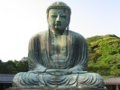

  
[Intangible Textual Heritage](../../index)  [Buddhism](../index.md) 
[Index](index)  [Previous](j4001)  [Next](j4003.md) 

------------------------------------------------------------------------

  
*The Jataka, Vol. IV*, tr. by W.H.D. Rouse, \[1901\], at Intangible
Textual Heritage

------------------------------------------------------------------------

p. xiii

### ADDITIONAL NOTES AND CORRECTIONS.

#### VOLUME II.

[9](j4005.htm#page_9.md) No. 154, line 3. Fick *(Sociale Gliederung zu
Buddha's Zeit)* would render *seṇibandham* a "guild quarrel."

[12](j4006.htm#page_12.md) At a sneeze, a Hindu in the N. W. Provinces will
still say, "May you live a hundred years." *North Indian Notes and
Queries,* iv. 388.

[104](j4030.htm#page_104.md) For the first stanza compare Dhammapada, p.
146.

[167](j4047.htm#page_167.md) For the second and third stanzas compare
Dhammapada, p. 149.

[207](j4054.htm#page_207.md) A Russian variant of the Gāmaṇicaṇḍa Birth is
given in Prof. S. Oldenburg's Review of volume I. of the present
translation: (Журналъ Министерства Народнаго Просвѣщенія) 1896, pp. 47
foll.

[251](j4063.htm#page_251.md) I have to thank Fick (*Soc. Glied.* p. 87
note) for a correction of the list of righteous persons, which should
run thus; "…younger brother (who was) viceroy, brahmin family priest,
courtier-charioteer, treasurer, noble master of the granaries, porter,
slave-girl courtesan."

[257](j4064.htm#page_257.md) Fick explains the *rajjugāhakaamacco* as a
kind of royal surveyor for tax purposes, which suits the context.

The *rajju* will be his chain, symbol of office (*Soc. Glied.* 7 note).

#### VOLUME III.

No. 316. Jātaka-Mālā no. 6, çaça.

          Cariyā-Piṭaka no. 10, Sasapaṇḍita.

#### VOLUME IV.

No. 443. Jātaka-Mālā no. 21, Cullabodhi.

          Cariyā-piṭaka no. 14, Cullabodhi.

No. 463. Jātaka-Mālā no. 14, Sapāraga.

No. 480. Jātaka-Mā1ā no. 7, Agastya.

          Cariyā-piṭaka no. 1, Akatti.

No. 482. Jātaka-Mālā no. 26, Ruru.

No. 483. Jātaka-Mālā no. 25, Çarabha.

No. 488. Jātaka-Mālā no. 19, Bisa.

          Cariyā-piṭaka no. 24, Bhisa.

No. 502. Jātaka-Mālā, no. 22, Haṁsa.

No. 510. Jātaka-Mālā no. 32, Ayogṛha.

           Cariyā-piṭaka no. 23, Ayoghara.

Page 125, line 26, for Teacher *read* Being.

Page 256, line 4 from foot, *read* Anuruddha.

------------------------------------------------------------------------

[Next: No. 439.: Catu-Dvāra-Jātaka.](j4003.md)

