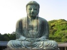

  
[Intangible Textual Heritage](../../index)  [Buddhism](../index.md) 
[Index](index)  [Previous](j4011)  [Next](j4013.md) 

------------------------------------------------------------------------

  
*The Jataka, Vol. IV*, tr. by W.H.D. Rouse, \[1901\], at Intangible
Textual Heritage

------------------------------------------------------------------------

### No. 448.

#### KUKKUṬA-JĀTAKA.

*"Trust not in those," etc.* This story the Master told in the Bamboo
Grove, on the subject of going about to kill. In the Hall of Truth, the
Brethren were discussing the evil nature of Devadatta. "Why, Sir, by
suborning archers and others to the task, Devadatta is making an attempt
to murder the Dasabala!" \[56\] The Master, entering, enquired, "What is
this, Brethren, that ye speak of

p. 36

as ye sit here together?" They told him. Said he, "’Tis not now the
first time that he has tried to murder me, but it was the same before" ;
and he told them a story of the past.

------------------------------------------------------------------------

Once upon a time there reigned in Kosambī [1](#fn_39.md) a king named Kosambaka. At that time the
Bodhisatta became the offspring of a wild hen that dwelt in a grove of
bamboo trees, and afterwards was the chief of a flock of several hundred
fowls in the forest. Not far off lived a Falcon, which as he found
opportunity caught the fowls one by one and ate them, and in course of
time he devoured all the others, and the Bodhisatta was left alone. But
he used all caution in seeking his food, and dwelt in a thicket of
bamboo. Here the Falcon could not get at him, so he set about thinking
by what trick he might entice him to capture.

Then he alighted on a branch hard by, and called out, "Worthy Fowl, what
makes you fear me? I am anxious to make friends with you. Now in such a
place (naming it) is food in plenty; let us feed there together, and
live like friends in company."—"No, good Sir," replied the Bodhisatta,
"betwixt you and me no friendship can ever be; so begone!"—"Good Sir,
for my former sins you cannot trust me now; but I promise that I will
never do so again!"—"No, I care not for such a friend; begone, I say!"
Again for the third time the Bodhisatta refused: "With a creature of
such qualities," quoth he, "friendship there must never be"; and he made
the wide woods resound, the deities applauding as he uttered this
discourse:

"Trust not in those whose words are lies, nor those who only know  
Self-interest, nor who have sinned, nor who too-pious show.

"Some men have nature like the kine, thirsty and full of greed:  
Have words in truth a friend to soothe, but never come to deed.

"These hold out dry and empty hands; the voice conceals their heart;  
From those who know not gratitude (vain creatures!) keep apart.

\[57\] "Put not thy trust in woman or in man of fickle mind,  
Nor such as having made a pact to break it are inclined.

"The man who walks in evil ways, to all things threatening death,  
Unstedfast, put no trust in him, like keenest sword in sheath.

"Some speak smooth words that come not from the heart, and try to
please  
With many a show of friendship feigned: put not thy trust in these.

"When such an evil-minded man beholds or food or gain,  
He works all ill, and go he will, but first will be thy bane."

------------------------------------------------------------------------

p. 37

\[58\] These seven stanzas were repeated by the King of the Fowls. Then
were the four stanzas following recited by the King of the Faith, words
inspired by a Buddha's insight:

"In friendly show full many a foe follows, his aid to give;  
As the Fowl left the Falcon, so ’twere best bad men to leave.

"Who is not quick to recognise the meaning of events,  
Under his foes' control he goes, and afterward repents.

"Whoso the meaning of events is quick to recognise,  
As from the Falcon's toils the Fowl, so from his foes he flies.

"From such inevitable and treacherous snare,  
Deadly, set deep mid many a forest tree,  
As from the Falcon far the Fowl did flee,  
The man of seeing eye afar should fare."

------------------------------------------------------------------------

And he again, after reciting these stanzas, called the Falcon, and
reproached him, saying, "If you continue to live in this place, I shall
know what to do." The Falcon flew away thence and went to another place.

------------------------------------------------------------------------

\[59\] The Master, having ended this. discourse, said, "Brethren, long
ago as now Devadatta tried to compass my destruction," and then he
identified the Birth: "At that time, Devadatta was the Falcon, and I was
myself the Fowl."

------------------------------------------------------------------------

### Footnotes

[35:1](j4011.htm#fr_38.md) These four lines occur
in the *Life of Buddha* which is prefixt to the Jātaka, vol. i. p. 31
(Pali), not in the present translation (Rhys Davids, *Buddhist Birth
Stories,* p. 34). Compare also *Dhammapada,* p. 126; *Theragāthā,* p.
35.

[36:1](j4012.htm#fr_39.md) A city on the Ganges.

------------------------------------------------------------------------

[Next: No. 449.: Maṭṭa-Kuṇḍali-Jātaka.](j4013.md)

