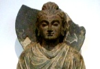

  
[Intangible Textual Heritage](../../index)  [Buddhism](../index) 
[Index](index)  [Next](j5001) 

------------------------------------------------------------------------

  
*The Jataka, Vol. V*, tr. by H.T. Francis, \[1905\], at Intangible
Textual Heritage

------------------------------------------------------------------------

p. i p. ii p. iii p. iv p. v p. vi

### THE JĀTAKA

#### OR

### STORIES OF THE BUDDHA'S

### FORMER BIRTHS.

#### TRANSLATED FROM THE PALI BY VARIOUS HANDS

##### UNDER THE EDITORSHIP OF

#### PROFESSOR E. B. COWELL.

### VOL. V.

##### TRANSLATED BY

#### H. T. FRANCIS, M.A.,

##### SOMETIME FELLOW OF GONVILLE AND CAIUS COLLEGE, CAMBRIDGE.

##### LONDON

##### PUBLISHED FOR THE PALI TEXT SOCIETY

##### BY

#### LUZAC & COMPANY, LTD.

##### 46 GREAT RUSSELL STREET, W.C.1

##### Originally Published by The Cambridge University Press

##### \[1905\]

Scanned, proofed and formatted at Intangible Textual Heritage, December
2009. This text is in the public domain in the US because it was
published prior to 1923.

##### PIAE MEMORIAE

#### EDWARDI BYLES COWELL

##### DOCTISSIMI DILECTISSIMI

##### ET

#### ROBERTI ALEXANDRI NEIL

#### DESIDERATISSIMI

#### SACRUM

------------------------------------------------------------------------

[Next: Preface](j5001)

