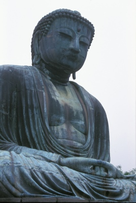

  
[Intangible Textual Heritage](../../index)  [Buddhism](../index.md) 

------------------------------------------------------------------------

<table width="75%">
<colgroup>
<col style="width: 50%" />
<col style="width: 50%" />
</colgroup>
<tbody>
<tr class="odd">
<td width="50%" data-valign="TOP"></td>
<td width="50%" data-valign="CENTER"><h1 id="the-jataka" data-align="CENTER">The Jataka</h1>
<h2 id="volume-vi" data-align="CENTER">Volume VI</h2>
<h5 id="tr.-e.-b.-cowell" data-align="CENTER">tr. E. B. Cowell</h5>
<h5 id="and-w.-h.-d.-rouse" data-align="CENTER">and W. H. D. Rouse</h5>
<h4 id="section" data-align="CENTER">[1907]</h4></td>
</tr>
</tbody>
</table>

------------------------------------------------------------------------

[Contents](#contents)    [Start Reading](j6000.md)    [Page
Index](pageidx)    [Text \[Zipped\]](j6.txt.gz.md)

------------------------------------------------------------------------

[VOLUME I](../j1/index)   \|    [VOLUME II](../j2/index.md)   \|    [VOLUME
III](../j3/index)   \|    [VOLUME IV](../j4/index.md)   \|    [VOLUME
V](../j5/index.md)   \|    **VOLUME VI**

------------------------------------------------------------------------

This is the sixth and final volume of the complete Jataka, translated
here by E.B. Cowell and W.D.H. Rouse. The Jataka is the treasure-house
of stories about the Buddha's previous incarnations.

------------------------------------------------------------------------

 [Title Page](j6000.md)  
[Preface](j6001.md)  
[Errata](j6002.md)  
[Contents](j6003.md)  
[No. 538.: Mūga-Pakkha Jātaka.](j6004.md)  
[No. 539.: Mahājanaka-Jātaka.](j6005.md)  
[No. 540.: Sāma-Jātaka.](j6006.md)  
[No. 541.: Nimi-Jātaka.](j6007.md)  
[No. 542.: The Khaṇḍahāla-Jātaka.](j6008.md)  
[No. 543.: Bhūridatta-Jātaka.](j6009.md)  
[No. 544: Mahānāradakassapa-Jātaka.](j6010.md)  
[No. 545.: Vidhurapaṇḍita-Jātaka.](j6011.md)  
[No. 546.: The Mahā-Ummagga-Jātaka.](j6012.md)  
[No. 547.: Vessantara-Jātaka.](j6013.md)  
[Index](j6014.md)  
