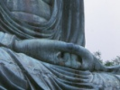

  
[Intangible Textual Heritage](../../index)  [Buddhism](../index.md) 
[Index](index)  [Next](j6001.md) 

------------------------------------------------------------------------

  
*The Jataka, Vol. VI*, tr. by E. B. Cowell and W. H. D. Rouse, \[1907\],
at Intangible Textual Heritage

------------------------------------------------------------------------

p. i p. ii p. iii

### THE JATAKA

#### OR

### STORIES OF THE BUDDHA'S

### FORMER BIRTHS.

#### TRANSLATED FROM THE PALI BY VARIOUS HANDS

##### UNDER THE EDITORSHIP OF

#### PROFESSOR E. B. COWELL.

#### VOL. VI.

##### TRANSLATED BY

#### E. B. COWELL, M.A.,

##### FORMERLY PROFESSOR OF SANSKRIT IN THE UNIVERSITY OF CAMBRIDGE

#### AND

#### W. H. D. ROUSE, M.A., LITTḌ.,

##### UNIVERSITY TEACHER OF SANSKRIT, AND HEADMASTER OF THE PERSE GRAMMAR SCHOOL

#### The Cambridge University Press

#### \[1907\]

Scanned, proofed and formatted at Intangible Textual Heritage, February
2010. This text is in the public domain in the US because it was
published prior to 1923.

------------------------------------------------------------------------

[Next: Preface](j6001.md)

