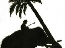

  
[Intangible Textual Heritage](../../index)  [Buddhism](../index) 
[Index](index)  [Next](jt01) 

------------------------------------------------------------------------

[Buy this Book at
Amazon.com](https://www.amazon.com/exec/obidos/ASIN/B00295RH78/internetsacredte)

------------------------------------------------------------------------

  
*Jataka Tales*, Ellen C. Babbit, \[1912\], at Intangible Textual
Heritage

------------------------------------------------------------------------

# JATAKA TALES

## Re-Told by

## Ellen C. Babbitt

### With illustrations by

### Ellsworth Young

#### New York

#### The Century Co.

#### 1912

###### Scanned by Eliza Fegley at sacredspiral.com. Additional formatting by John Bruno Hare at Intangible Textual Heritage, March, 2004. This text is in the public domain in the US because it was published prior to 1923.

------------------------------------------------------------------------

[Next: Foreword](jt01)
