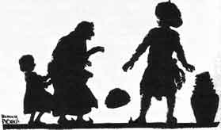
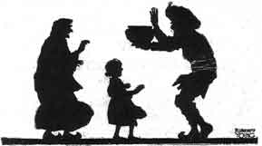

  
[Intangible Textual Heritage](../../index)  [Buddhism](../index) 
[Index](index)  [Previous](jt04)  [Next](jt06) 

------------------------------------------------------------------------

[Buy this Book at
Amazon.com](https://www.amazon.com/exec/obidos/ASIN/B00295RH78/internetsacredte)

------------------------------------------------------------------------

  
*Jataka Tales*, Ellen C. Babbit, \[1912\], at Intangible Textual
Heritage

------------------------------------------------------------------------

### III

### THE MERCHANT OF SERI

THERE was once a merchant of Seri who sold brass and tinware. He went
from town to town, in company with another man, who also sold brass and
tinware. This second man was greedy, getting all he could for nothing,
and giving as little as he could for what he bought.

When they went into a town, they divided the streets between them. Each
man went up and down the streets he had chosen, calling, "Tinware for
sale. Brass for sale." People came out to their door-steps, and bought,
or traded, with them.

In one house there lived a poor old woman and her granddaughter. The
family had once been rich, but now the only thing they had left of all
their riches was a golden bowl. The grandmother did not know it was a
golden bowl, but she had kept this because her husband used to eat out
of it in the old days. It stood on a shelf among the other pots and
pans, and was not often used.

The greedy merchant passed this house, calling, "Buy my water-jars! Buy
my pans!" The granddaughter said: "Oh, Grandmother, do buy something for
me!"

"My dear," said the old woman, "we are too poor to buy anything. I have
not anything to trade, even."

"Grandmother, see what the merchant will give for the old bowl. We do
not use that, and perhaps he will take it and give us something we want
for it."

The old woman called the merchant and showed him the bowl, saying, "Will
you take this, sir, and give the little girl here something for it?"

|                   |
|-------------------|
|  |

The greedy man took the bowl and scratched its side with a needle. Thus
he found that it was a golden bowl. He hoped he could get it for
nothing, so he said: "What is this worth? Not even a halfpenny." He
threw the bowl on the ground, and went away.

By and by the other merchant passed the house. For it was agreed that
either merchant might go through any street which the other had left. He
called: "Buy my water-jars! Buy my tinware! Buy my brass!"

The little girl heard him, and begged her grandmother to see what he
would give for the bowl.

"My child," said the grandmother, "the merchant who was just here threw
the bowl on the ground and went away. I have nothing else to offer in
trade."

"But, Grandmother," said the girl, "that was a cross man. This one looks
pleasant. Ask him. Perhaps he 'll give some little tin dish."

"Call him, then, and show it to him," said the old woman.

As soon as the merchant took the bowl in his hands, he knew it was of
gold. He said: "All that I have here is not worth so much as this bowl.
It is a golden bowl. I am not rich enough to buy it."

|                   |
|-------------------|
|  |

"But, sir, a merchant who passed here a few moments ago, threw it on the
ground, saying it was not worth a halfpenny, and he went away," said the
grandmother. "It was worth nothing to him. If you value it, take it,
giving the little girl some dish she likes for it."

But the merchant would not have it so. He gave the woman all the money
he had, and all his wares. "Give me but eight pennies," he said.

So he took the pennies, and left. Going quickly to the river, he paid
the boatman the eight pennies to take him across the river.

Soon the greedy merchant went back to the house where he had seen the
golden bowl, and said: "Bring that bowl to me, and I will give you
something for it."

"No," said the grandmother. "You said the bowl was worthless, but
another merchant has paid a great price for it, and taken it away."

Then the greedy merchant was angry, crying out, "Through this other man
I have lost a small fortune. That bowl was of gold."

He ran down to the riverside, and, seeing the other merchant in the boat
out in the river, he called: "Hallo, Boatman! Stop your boat!"

But the man in the boat said: "Don't stop!" So he reached the city on
the other side of the river, and lived well for a time on the money the
bowl brought him.

------------------------------------------------------------------------

[Next: IV. The Turtle Who Couldn't Stop Talking](jt06)
