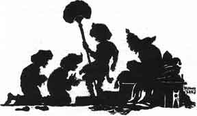
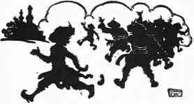

  
[Intangible Textual Heritage](../../index)  [Buddhism](../index.md) 
[Index](index)  [Previous](jt09)  [Next](jt11.md) 

------------------------------------------------------------------------

[Buy this Book at
Amazon.com](https://www.amazon.com/exec/obidos/ASIN/B00295RH78/internetsacredte.md)

------------------------------------------------------------------------

  
*Jataka Tales*, Ellen C. Babbit, \[1912\], at Intangible Textual
Heritage

------------------------------------------------------------------------

### VIII

### THE MEASURE OF RICE

AT one time a dishonest king had a man called the Valuer in his court.
The Valuer set the price which ought to be paid for horses and elephants
and the other animals. He also set the price on jewelry and gold, and
things of that kind.

This man was honest and just, and set the proper price to be paid to the
owners of the goods.

The king was not pleased with this Valuer, because he was honest. "If I
had another sort of a man as Valuer, I might gain more riches," he
thought.

One day the king saw a stupid, miserly peasant come into the palace
yard. The king sent for the fellow and asked him if he would like to be
the Valuer. The peasant said he would like the position. So the king had
him made Valuer. He sent the honest Valuer away from the palace.

Then the peasant began to set the prices on horses and elephants, upon
gold and jewels. He did not know their value, so he would say anything
he chose. As the king had made him Valuer, the people had to sell their
goods for the price he set.

|                   |
|-------------------|
|  |

By and by a horse-dealer brought five hundred horses to the court of
this king. The Valuer came and said they were worth a mere measure of
rice. So the king ordered the horse-dealer to be given the measure of
rice, and the horses to be put in the palace stables.

The horse-dealer went then to see the honest man who had been the
Valuer, and told him what had happened.

"What shall I do?" asked the horse-dealer.

"I think you can give a present to the Valuer which will make him do and
say what you want him to do and say," said the man. "Go to him and give
him a fine present, then say to him: 'You said the horses are worth a
measure of rice, but now tell what a measure of rice is worth! Can you
value that standing in your place by the king?' If he says he can, go
with him to the king, and I will be there, too."

The horse-dealer thought this was a good idea. So he took a fine present
to the Valuer, and said what the other man had told him to say.

The Valuer took the present, and said: "Yes, I can go before the king
with you and tell what a measure of rice is worth. I can value that
now."

"Well, let us go at once," said the horse-dealer. So they went before
the king and his ministers in the palace.

The horse-dealer bowed down before the king, and said: "O King, I have
learned that a measure of rice is the value of my five hundred horses.
But will the king be pleased to ask the Valuer what is the value of the
measure of rice?"

The king, not knowing what had happened, asked: "How now, Valuer, what
are five hundred horses worth?"

"A measure of rice, O King!" said he.

"Very good, then! If five hundred horses are worth a measure of rice,
what is the measure of rice worth?"

"The measure of rice is worth your whole city," replied the foolish
fellow.

The ministers clapped their hands, laughing, and saying, "What a foolish
Valuer! How can such a man hold that office? We used to think this great
city was beyond price, but this man says it is worth only a measure of
rice."

|                   |
|-------------------|
|  |

Then the king was ashamed, and drove out the foolish fellow.

"I tried to please the king by setting a low price on the horses, and
now see what has happened to me!" said the Valuer, as he ran away from
the laughing crowd.

------------------------------------------------------------------------

[Next: IX. The Foolish, Timid Rabbit](jt11.md)
