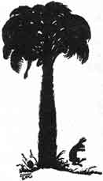
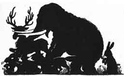
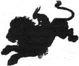

  
[Intangible Textual Heritage](../../index)  [Buddhism](../index.md) 
[Index](index)  [Previous](jt10)  [Next](jt12.md) 

------------------------------------------------------------------------

[Buy this Book at
Amazon.com](https://www.amazon.com/exec/obidos/ASIN/B00295RH78/internetsacredte.md)

------------------------------------------------------------------------

  
*Jataka Tales*, Ellen C. Babbit, \[1912\], at Intangible Textual
Heritage

------------------------------------------------------------------------

### IX

### THE FOOLISH, TIMID RABBIT

ONCE upon a time, a Rabbit was asleep under a palm-tree.

|                   |
|-------------------|
|  |

All at once he woke up, and thought: "What if the world should break up!
What then would become of me?"

At that moment, some Monkeys dropped a cocoanut. It fell down on the
ground just back of the Rabbit.

Hearing the noise, the Rabbit said to himself: "The earth is all
breaking up!"

And he jumped up and ran just as fast as he could, without even looking
back to see what made the noise.

Another Rabbit saw him running, and called after him, "What are you
running so fast for?"

"Don't ask me!" he cried.

But the other Rabbit ran after him, begging to know what was the matter.

Then the first Rabbit said: "Don't you know? The earth is all breaking
up!"

And on he ran, and the second Rabbit ran with him.

The next Rabbit they met ran with them when he heard that the earth was
all breaking up.

One Rabbit after another joined them, until there were hundreds of
Rabbits running as fast as they could go.

They passed a Deer, calling out to him that the earth was all breaking
up. The Deer then ran with them.

The Deer called to a Fox to come along because the earth was all
breaking up.

On and on they ran, and an Elephant joined them.

|                   |
|-------------------|
|  |

At last the Lion saw the animals running, and heard their cry that the
earth was all breaking up.

|                   |
|-------------------|
|  |

He thought there must be some mistake, so he ran to the foot of a hill
in front of them and roared three times.

This stopped them, for they knew the voice of the King of Beasts, and
they feared him.

"Why are you running so fast?" asked the Lion.

"Oh, King Lion," they answered him, "the earth is all breaking up!"

"Who saw it breaking up?" asked the Lion.

"I didn't," said the Elephant. "Ask the Fox--he told me about it."

"I didn't," said the Fox.

"The Rabbits told me about it," said the Deer.

One after another of the Rabbits said: "I did not see it, but another
Rabbit told me about it."

At last the Lion came to the Rabbit who had first said the earth was all
breaking up.

"Is it true that the earth is all breaking up?" the Lion asked.

"Yes, O Lion, it is," said the Rabbit. "I was asleep under a palm-tree.
I woke up and thought, 'What would become of me if the earth should all
break up?' At that very moment, I heard the sound of the earth breaking
up, and I ran away."

"Then," said the Lion, "you and I will go back to the place where the
earth began to break up, and see what is the matter."

So the Lion put the little Rabbit on his back, and away they went like
the wind. The other animals waited for them at the foot of the hill.

|                   |
|-------------------|
|  |

The Rabbit told the Lion when they were near the place where he slept,
and the Lion saw just where the Rabbit had been sleeping.

He saw, too, the cocoanut that had fallen to the ground near by. Then
the Lion said to the Rabbit, "It must have been the sound of the
cocoanut falling to the ground that you heard. You foolish Rabbit!"

And the Lion ran back to the other animals, and told them all about it.

If it had not been for the wise King of Beasts, they might be running
still.

------------------------------------------------------------------------

[Next: X. The Wise and the Foolish Merchant](jt12.md)
