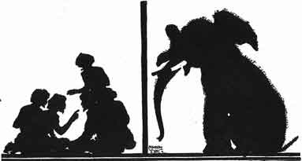
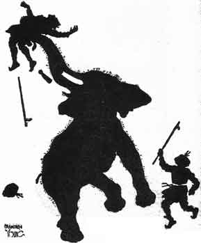

  
[Intangible Textual Heritage](../../index)  [Buddhism](../index) 
[Index](index)  [Previous](jt12)  [Next](jt14) 

------------------------------------------------------------------------

[Buy this Book at
Amazon.com](https://www.amazon.com/exec/obidos/ASIN/B00295RH78/internetsacredte)

------------------------------------------------------------------------

  
*Jataka Tales*, Ellen C. Babbit, \[1912\], at Intangible Textual
Heritage

------------------------------------------------------------------------

### XI

### THE ELEPHANT GIRLY-FACE

ONCE upon a time a king had an Elephant named Girly-face. The Elephant
was called Girly-face because he was so gentle and good and looked so
kind. "Girly-face never hurts anybody," the keeper of the Elephants
often said.

Now one night some robbers came into the courtyard and sat on the ground
just outside the stall where Girly-face slept. The talk of the robbers
awoke Girly-face.

|                   |
|-------------------|
|  |

"This is the way to break into a house," they said. "Once inside the
house kill any one who wakens. A robber must not be afraid to kill. A
robber must be cruel and have no pity. He must never be good, even for a
moment."

Girly-face said to himself, "Those men are teaching me how I should act.
I will be cruel. I will show no pity. I will not be good--not even for a
moment."

So the next morning when the keeper came to feed Girly-face he picked
him up in his trunk and threw the poor keeper to the ground, killing
him.

|                   |
|-------------------|
|  |

Another keeper ran to see what the trouble was, and Girly-face killed
him, too.

For days and days Girly-face was so ugly that no one dared go near. The
food was left for him, but no man would go near him.

By and by the king heard of this and sent one of his wise men to find
out what ailed Girly-face.

The wise man had known Girly-face a long time. He looked the Elephant
over carefully and could find nothing that seemed to be the matter.

|                   |
|-------------------|
|  |

He thought at last, "Girly-face must have heard some bad men talking.
Have there been any bad men talking about here?" asked the wise man.

"Yes," one of the keepers said, "a band of robbers were caught here a
few weeks ago. They had met in the yard to talk over their plans. They
were talking together near the stall where Girly-face sleeps."

So the wise man went back to the king. Said he, "I think Girly-face has
been listening to bad talk. If you will send some good men to talk where
Girly-face can hear them I think he will be a good Elephant once more."

So that night the king sent a company of the best men to be found to sit
and talk near the stall where Girly-face lived. They said to one
another, "It is wrong to hurt any one. It is wrong to kill. Every one
should be gentle and good."

"Now those men are teaching me," thought Girly-face. "I must be gentle
and good. I must hurt no one. I must not kill any one." And from that
time on Girly-face was tame and as good as ever an Elephant could be.

------------------------------------------------------------------------

[Next: XII. The Banyan Deer](jt14)
