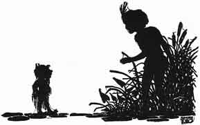
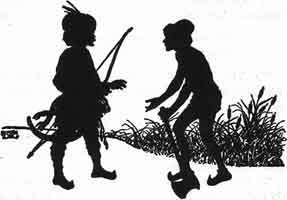

  
[Intangible Textual Heritage](../../index)  [Buddhism](../index) 
[Index](index)  [Previous](jt14)  [Next](jt16) 

------------------------------------------------------------------------

[Buy this Book at
Amazon.com](https://www.amazon.com/exec/obidos/ASIN/B00295RH78/internetsacredte)

------------------------------------------------------------------------

  
*Jataka Tales*, Ellen C. Babbit, \[1912\], at Intangible Textual
Heritage

------------------------------------------------------------------------

### XIII

### THE PRINCES AND THE WATER-SPRITE

ONCE upon a time a king had three sons. The first was called Prince of
the Stars. The next was called the Moon Prince and the third was called
the Sun Prince. The king was so very happy when the third son was born
that he promised to give the queen any boon she might ask.

The queen kept the promise in mind, waiting until the third son was
grown before asking the king to give her the boon.

On the twenty-first birthday of the Sun Prince she said to the king,
"Great King, when our youngest child was born you said you would give me
a boon. Now I ask you to give the kingdom to Sun Prince."

But the king refused, saying that the kingdom must go to the oldest son,
for it belonged by right to him. Next it would belong by right to the
second son, and not until they were both dead could the kingdom go to
the third son.

The queen went away, but the king saw that she was not pleased with his
answer. He feared that she would do harm to the older princes to get
them out of the way of the Sun Prince.

So he called his elder sons and told them that they must go and live in
the forest until his death. "Then come back and reign in the city that
is yours by right," he said. And with tears he kissed them on the
foreheads and sent them away.

As they were going down out of the palace, after saying good-by to their
father, the Sun Prince called to them, "Where are you going?"

And when he heard where they were going and why, he said, "I will go
with you, my brothers."

So off they started. They went on and on and by and by they reached the
forest. There they sat down to rest in the shade of a pond. Then the
eldest brother said to Sun Prince, "Go down to the pond and bathe and
drink. Then bring us a drink while we rest here."

Now the King of the Fairies had given this pond to a water-sprite. The
Fairy King had said to the water-sprite, "You are to have in your power
all who go down into the water except those who give the right answer to
one question. Those who give the right answer will not be in your power.
The question is, 'What are the Good Fairies like?'"

|                   |
|-------------------|
|  |

When the Sun Prince went into the pond the water–sprite saw him and
asked him the question, "What are the Good Fairies like?"

"They are like the Sun and the Moon," said the Sun Prince.

"You don't know what the Good Fairies are like," cried the water-sprite,
and he carried the poor boy down into her cave.

By and by the eldest brother said, "Moon Prince, go down and see why our
brother stays so long in the pond!"

As soon as the Moon Prince reached the water's edge the water-sprite
called to him and said, "Tell me what the Good Fairies are like!"

"Like the sky above us," replied the Moon Prince.

"You don't know, either," said the water-sprite, and dragged the Moon
Prince down into the cave where the Sun Prince sat.

"Something must have happened to those two brothers of mine," thought
the eldest. So he went to the pond and saw the marks of the footsteps
where his brothers had gone down into the water. Then he knew that a
water-sprite must live in that pond. He girded on his sword, and stood
with his bow in his hand.

The water-sprite soon came along in the form of a woodsman.

|                   |
|-------------------|
|  |

"You seem tired, Friend," he said to the prince. "Why don't you bathe in
the lake and then lie on the bank and rest?"

But the prince knew that it was a water-sprite and he said, "You have
carried off my brothers!"

"Yes," said the water-sprite.

"Why did you carry them off?"

"Because they did not answer my question," said the water-sprite, "and I
have power over all who go down into the water except those who do give
the right answer."

"I will answer your question," said the eldest brother. And he did. "The
Good Fairies are like

The pure in heart who fear to sin,

The good, kindly in word and deed."

"O Wise Prince, I will bring back to you one of your brothers. Which
shall I bring?" said the water-sprite.

"Bring me the younger one," said the prince. "It was on his account that
our father sent us away. I could never go away with Moon Prince and
leave poor Sun Prince here."

"O Wise Prince, you know what the good should do and you are kind. I
will bring back both your brothers," said the water-sprite.

After that the three princes lived together in the forest until the king
died. Then they went back to the palace. The eldest brother was made
king and he had his brothers rule with him. He also built a home for the
water-sprite in the palace grounds.

------------------------------------------------------------------------

[Next: XIV. The King's White Elephant](jt16)
