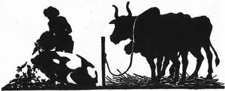
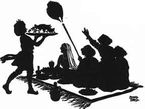

  
[Intangible Textual Heritage](../../index)  [Buddhism](../index.md) 
[Index](index)  [Previous](jt16)  [Next](jt18.md) 

------------------------------------------------------------------------

[Buy this Book at
Amazon.com](https://www.amazon.com/exec/obidos/ASIN/B00295RH78/internetsacredte.md)

------------------------------------------------------------------------

  
*Jataka Tales*, Ellen C. Babbit, \[1912\], at Intangible Textual
Heritage

------------------------------------------------------------------------

### XV

### THE OX WHO ENVIED THE PIG

ONCE upon a time there was an Ox named Big Red. He had a younger brother
named Little Red. These two brothers did all the carting on a large
farm.

Now the farmer had an only daughter and she was soon to be married. Her
mother gave orders that the Pig should be fattened for the wedding
feast.

|                   |
|-------------------|
|  |

Little Red noticed that the Pig was fed on choice food. He said to his
brother, "How is it, Big Red, that you and I are given only straw and
grass to eat, while we do all the hard work on the farm? That lazy Pig
does nothing but eat the choice food the farmer gives him."

Said his brother, "My dear Little Red, envy him not. That little Pig is
eating the food of death! He is being fattened for the wedding feast.
Eat your straw and grass and be content and live long."

|                   |
|-------------------|
|  |

Not long afterwards the fattened Pig was killed and cooked for the
wedding feast.

Then Big Red said, "Did you see, Little Red, what became of the Pig
after all his fine feeding?"

"Yes," said the little brother, "we can go on eating plain food for
years, but the poor little Pig ate the food of death and now he is dead.
His feed was good while it lasted, but it did not last long."

------------------------------------------------------------------------

[Next: XVI. Grannie's Blackie](jt18.md)
