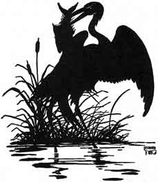
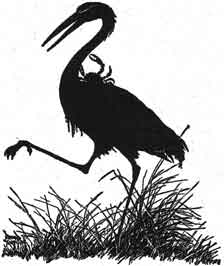

  
[Intangible Textual Heritage](../../index)  [Buddhism](../index.md) 
[Index](index)  [Previous](jt18)  [Next](jt20.md) 

------------------------------------------------------------------------

[Buy this Book at
Amazon.com](https://www.amazon.com/exec/obidos/ASIN/B00295RH78/internetsacredte.md)

------------------------------------------------------------------------

  
*Jataka Tales*, Ellen C. Babbit, \[1912\], at Intangible Textual
Heritage

------------------------------------------------------------------------

### XVII

### THE CRAB AND THE CRANE

IN the Long Ago there was a summer when very little rain fell.

All the Animals suffered for want of water, but the Fishes suffered most
of all.

In one pond full of Fishes, the water was very low indeed.

A Crane sat on the bank watching the Fishes.

"What are you doing?" asked a little Fish.

"I am thinking about you Fishes there in the pond. It is so nearly dry,"
answered the Crane.

"Yes," the Crane went on, "I was wishing I might do something for you. I
know of a pond in the deep woods where there is plenty of water."

"I declare," said the little Fish, "you are the first Crane that ever
offered to help a Fish."

"That may be," said the Crane, "but the water is so low in your pond. I
could easily carry you one by one on my back to that other pond where
there is plenty of water and food and cool shade."

"I don't believe there is any such pond," said the little Fish. "What
you wish to do is to eat us, one by one."

"If you don't believe me," said the Crane, "send with me one of the
Fishes whom you can believe. I'll show him the pond and bring him back
to tell you all about it."

A big Fish heard the Crane and said, "I will go with you to see the
pond--I may as well be eaten by the Crane as to die here."

|                   |
|-------------------|
|  |

So the Crane put the big Fish on his back and started for the deep
woods.

Soon the Crane showed the big Fish the pool of water. "See how cool and
shady it is here," he said, "and how much larger the pond is, and how
full it is!"

"Yes!" said the big Fish, "take me back to the little pond and I'll tell
the other Fishes all about it." So back they went.

The Fishes all wanted to go when they heard the big Fish talk about the
fine pond which he had seen.

Then the Crane picked up another Fish and carried it away. Not to the
pool, but into the woods where the other Fishes could not see them.

Then the Crane put the Fish down and ate it. The Crane went back for
another Fish. He carried it to the same place in the woods and ate it,
too.

This he did until he had eaten all the Fishes in the pond.

The next day the Crane went to the pond to see if he had left a Fish.
There was not one left, but there was a Crab on the sand.

"Little Crab," said the Crane, "would you let me take you to the fine
pond in the deep woods where I took the Fishes?"

"But how could you carry me?" asked the Crab.

"Oh, easily," answered the Crane. "I'll take you on my back as I did the
Fishes."

"No, I thank you," said the Crab, "I can't go that way. I am afraid you
might drop me. If I could take hold of your neck with my claws, I would
go. You know we Crabs have a tight grip."

The Crane knew about the tight grip of the Crabs, and he did not like to
have the Crab hold on with his claws. But he was hungry, so he said:

"Very well, hold tight."

|                   |
|-------------------|
|  |

And off went the Crane with the Crab.

When they reached the place where the Crane had eaten the Fishes, the
Crane said:

"I think you can walk the rest of the way. Let go of my neck."

"I see no pond," said the Crab. "All I can see is a pile of Fish bones.
Is that all that is left of the Fishes?"

"Yes," said the Crane, "and if you will let go of my neck, your shell
will be all that will be left of you."

And the Crane put his head down near the ground so that the Crab could
get off easily.

But the Crab pinched the Crane's neck so that his head fell off.

"Not my shell, but your bones are left to dry with the bones of the
Fishes," said the Crab.

------------------------------------------------------------------------

[Next: XVIII. Why the Owl Is Not King of the Birds](jt20.md)
