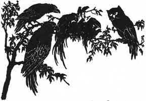

  
[Intangible Textual Heritage](../../index)  [Buddhism](../index) 
[Index](index)  [Previous](jt19) 

------------------------------------------------------------------------

[Buy this Book at
Amazon.com](https://www.amazon.com/exec/obidos/ASIN/B00295RH78/internetsacredte)

------------------------------------------------------------------------

  
*Jataka Tales*, Ellen C. Babbit, \[1912\], at Intangible Textual
Heritage

------------------------------------------------------------------------

### XVIII

### WHY THE OWL IS NOT KING OF THE BIRDS

WHY is it that Crows torment the Owls as they sleep in the daytime? For
the same reason that the Owls try to kill the Crows while they sleep at
night.

Listen to a tale of long ago and then you will see why.

Once upon a time, the people who lived together when the world was young
took a certain man for their king. The four-footed animals also took one
of their number for their king. The fish in the ocean chose a king to
rule over them. Then the birds gathered together on a great flat rock,
crying:

"Among men there is a king, and among the beasts, and the fish have one,
too; but we birds have none. We ought to have a king. Let us choose one
now."

And so the birds talked the matter over and at last they all said, "Let
us have the Owl for our king."

No, not all, for one old Crow rose up and said, "For my part, I don't
want the Owl to be our king. Look at him now while you are all crying
that you want him for your king. See how sour he looks right now. If
that's the cross look he wears when he is happy, how will he look when
he is angry? I, for one, want no such sour-looking king!"

|                   |
|-------------------|
|  |

Then the Crow flew up into the air crying, "I don't like it! I don't
like it!" The Owl rose and followed him. From that time on the Crows and
the Owls have been enemies. The birds chose a Turtle Dove to be their
king, and then flew to their homes.
