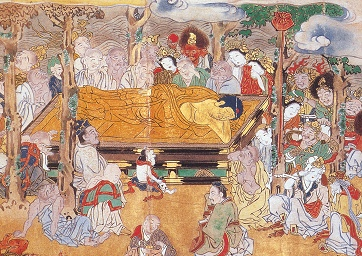

  
[Intangible Textual Heritage](../../index)  [Buddhism](../index.md) 

------------------------------------------------------------------------

[Buy this Book at
Amazon.com](https://www.amazon.com/exec/obidos/ASIN/B00292BROK/internetsacredte.md)

------------------------------------------------------------------------

<table width="75%">
<colgroup>
<col style="width: 50%" />
<col style="width: 50%" />
</colgroup>
<tbody>
<tr class="odd">
<td width="50%" data-valign="TOP"> 
The Death of Buddha, Japanese print, 17th century, detail (public domain image);</td>
<td width="50%" data-valign="CENTER"><h1 id="the-life-of-buddha" data-align="CENTER">The Life of Buddha</h1>
<h2 id="by-andre-ferdinand-herold" data-align="CENTER">by Andre Ferdinand Herold</h2>
<h4 id="section" data-align="CENTER">[1922]</h4>
<h5 id="tr.-from-the-french-by-paul-c.-blum" data-align="CENTER">tr. from the French by Paul C. Blum</h5>
<h4 id="section-1" data-align="CENTER">[1927]</h4></td>
</tr>
</tbody>
</table>

------------------------------------------------------------------------

[Contents](#contents)    [Start Reading](lob00.md)    [Page
Index](pageidx)    [Text \[Zipped\]](lob.txt.gz.md)

------------------------------------------------------------------------

|                                                                                                                           |
|---------------------------------------------------------------------------------------------------------------------------|
|  |

This is a biography of Buddha retold in a simple and engaging style. It
strings together a coherent narrative arc from the several classic
Buddhist texts, particularly the Buddhacharita of Asvaghosa (see
[SBE49](../sbe49/index).md), the Lalita-Vistara, and the
[Jataka](../index.htm#jataka.md). It is thankfully free of technical
Buddhist terminology. This book dimensionalizes the story of Siddhartha,
born into luxury, who seeks and find enlightenment, the sometimes
painful growth of the Buddhist community, and his eventual departure for
Nirvana. It is short and very readable, and can be recommended for young
adults.

------------------------------------------------------------------------

 [Title Page](lob00.md)  
[Foreword](lob01.md)  
[Table of Contents](lob02.md)  

### Part One

[1. King Suddhodana And Queen Maya](lob03.md)  
[2. Maya's Dream](lob04.md)  
[3. The Birth of Siddhartha](lob05.md)  
[4. Asita's Prediction](lob06.md)  
[5. Siddhartha at the Temple](lob07.md)  
[6. Siddhartha's First Meditation](lob08.md)  
[7. The Marriage of Siddhartha](lob09.md)  
[8. Siddhartha Leads a Life of Pleasure](lob10.md)  
[9. The Three Encounters](lob11.md)  
[10. Gopa's Dream](lob12.md)  
[11. Siddhartha is Eager to Know the Great Truths](lob13.md)  
[12. Siddhartha Leaves His Father's Palace](lob14.md)  
[13. Siddhartha the Hermit](lob15.md)  
[14. Gopa and Suddhodana Grieve](lob16.md)  
[15. The Doctrine of Arata Kalama](lob17.md)  
[16. Siddhartha and King Vimbasara](lob18.md)  
[17. Siddhartha Deserted by His First Disciples](lob19.md)  
[18. Siddhartha Under the Tree of Knowledge](lob20.md)  
[19. Mara's Defeat](lob21.md)  
[20. Siddhartha Becomes the Buddha](lob22.md)  

### Part Two

[1. Trapusha and Bhallika](lob23.md)  
[2. The Buddha is Prepared to Preach the Doctrine](lob24.md)  
[3. The Buddha Leaves for Benares](lob25.md)  
[4. The Buddha Finds His Former Disciples](lob26.md)  
[5. The Story of the Hermit and the Hare](lob27.md)  
[6. The Story of Padmaka](lob28.md)  
[7. The Buddha at the Bamboo Grove](lob29.md)  
[8. Sariputra and Maudgalyayana](lob30.md)  
[9. The Buddha Pacifies the Malcontents of Rajagriha](lob31.md)  
[10. Suddhodana Sends Messengers to His Son](lob32.md)  
[11. The Story of the Crane and the Fish](lob33.md)  
[12. The Story of Visvantara](lob34.md)  
[13. The Story of Dharmapala](lob35.md)  
[14. Gopa's Great Virtue](lob36.md)  
[15. Nanda Renounces Royalty](lob37.md)  
[16. The Buddha Leaves Kapilavastu](lob38.md)  
[17. Anathapindika's Offering](lob39.md)  
[18. The New Disciples](lob40.md)  
[19. Nanda's Pride](lob41.md)  
[20. The Death of Suddhodana](lob42.md)  

### Part Three

[1. Mahaprajapati is Admitted to the Community](lob43.md)  
[2. The Buddha Exposes the Imposters](lob44.md)  
[3. Suprabha](lob45.md)  
[4. Virupa](lob46.md)  
[5. Sinca's Deceit](lob47.md)  
[6. The Buddha Tames a Wild Buffalo](lob48.md)  
[7. Dissension Among the Monks](lob49.md)  
[8. Kuvalaya the Dancer](lob50.md)  
[9. The God Alavaka Defeated by the Buddha](lob51.md)  
[10. Devadatta Expelled from the Community](lob52.md)  
[11. Ajatasatru's Treachery](lob53.md)  
[12. The Death of Devadatta](lob54.md)  
[13. Prasenajit and Ajatasatru](lob55.md)  
[14. The Buddha Teaches the Doctrine](lob56.md)  
[15. The Buddha and the Shepherd](lob57.md)  
[16. The Buddha Instructs the Monks of Vaisali](lob58.md)  
[17. The Meal at Cunda's](lob59.md)  
[18. The Buddha Enters Nirvana](lob60.md)  
