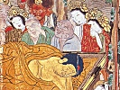

  
[Intangible Textual Heritage](../../index)  [Buddhism](../index.md) 
[Index](index)  [Previous](lob00)  [Next](lob02.md) 

------------------------------------------------------------------------

[Buy this Book at
Amazon.com](https://www.amazon.com/exec/obidos/ASIN/B00292BROK/internetsacredte.md)

------------------------------------------------------------------------

  
*The Life of Buddha*, by A. Ferdinand Herold, tr. by Paul C Blum
\[1922\], at Intangible Textual Heritage

------------------------------------------------------------------------

p. vii

### FOREWORD

*This Life of Buddha is not a work of fiction, and I think it would be
well to mention the books, both ancient and modern, which I have most
frequently consulted.*

*I have, for the most part, relied upon the LALITA-VISTARA. This book is
a jumbled collection of legends and scholastic dissertations, and yet in
these pages are preserved many precious traditions regarding the
Buddha's origin, his childhood and his youth, and here, likewise, we are
told of his early education and of his first deeds.*

*I have also made great use of an excellent poem, the BUDDHACARITA of
Asvaghosa. In a few of the chapters I have repeated the lines almost
word for word. The text of the BUDDHACARITA was edited by E. B. Cowell.*

*In the Life, I have interpolated several JATAKAS. These are stories in
which the Buddha recalls his former lives. Some of them will be found in
a vast collection, the AVADANASATAKA.*

*Two modern books: LE BOUDDHA, by H. Oldenberg, translated by A.
Foucher, and the HISTOIRE DU BOUDDHISME DANS L’INDE, by* 

p. viii

\[paragraph continues\] *H. Kern,
translated by Gédéon Huet, have also been very useful to me; as well as
other works that have appeared in scientific reviews. Thus, for the
touching story of Visvantara, I am indebted to a sogdian version
published by R. Gauthiot in the JOURNAL ASIATIQUE.*

*Finally, I would be guilty of the deepest ingratitude if I did not
publicly thank my old friend Sylvain Lévi for his generous and kindly
advice.*

*And may the reader find of interest this marvellous story of Prince
Siddhartha who, through meditation, was able to attain supreme wisdom*.

*A. F. HEROLD*

------------------------------------------------------------------------

[Next: Table of Contents](lob02.md)
