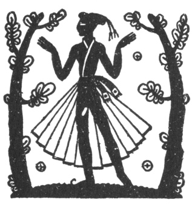

  
[Intangible Textual Heritage](../../index)  [Buddhism](../index) 
[Index](index)  [Previous](lob21)  [Next](lob23) 

------------------------------------------------------------------------

[Buy this Book at
Amazon.com](https://www.amazon.com/exec/obidos/ASIN/B00292BROK/internetsacredte)

------------------------------------------------------------------------

  
*The Life of Buddha*, by A. Ferdinand Herold, tr. by Paul C Blum
\[1922\], at Intangible Textual Heritage

------------------------------------------------------------------------

p. 96

### 20. Siddhartha Becomes the Buddha

BY sunset the army of the Evil One had fled. Nothing had disturbed the
hero's meditation, and, in the first watch of the night, he arrived at
the knowledge of all that had transpired in previous existences. In the
second watch, he learned the present state of all beings. In the third,
he understood the chain of causes and effects.

He now clearly saw all creatures being continually reborn, and, whether
of high or of low caste, in the path of virtue or of evil, he saw them
going through the round of existences, at the mercy of their actions.
And the hero thought:

"How miserable is this world that is born, grows old and dies, then is
reborn only to grow old and die again! And man knows no way out!"

And in profound meditation, he said to himself:

"What is the cause of old age and death? There is old age and death
because there is birth. Old age and death are due to birth. What is the
cause of

p. 97

birth? There is birth because there is existence. Birth is due to
existence. What is the cause of existence? There is existence because
there are ties. Existence is due to ties. What is the cause of ties?
There are ties because there is desire. Ties are due to desire. What is
the cause of desire? There is desire because there is sensation. Desire
is due to sensation. What is the cause of sensation? There is sensation
because there is contact. Sensation is due to contact. What is the cause
of contact? There is contact because there are six senses. Contact is
due to the six senses. What is the cause of the six senses? There are
six senses because there is name and form. The six senses are due to
name and form. What is the cause of name and form? There is name and
form because there is perception. Name and form are due to perception.
What is the cause of perception? There is perception because there is
impression. Perception is due to impression. What is the cause of
impression? There is impression because there is ignorance. Impression
is due to ignorance."

And he thought:

"Thus does ignorance lie at the root of death, of old age, of suffering,
of despair. To suppress ignorance is to suppress impression. To suppress
impression is to suppress perception. To suppress perception is to
suppress name and form. To suppress

p. 98

name and form is to suppress the six senses. To suppress the six senses
is to suppress contact. To suppress contact is to suppress sensation. To
suppress sensation is to suppress desire. To suppress desire is to
suppress ties. To suppress ties is to suppress existence. To suppress
existence is to suppress birth. To suppress birth is to suppress old age
and death. To exist is to suffer. Desire leads from birth to rebirth,
from suffering to further suffering. By stifling desire, we prevent
birth, we prevent suffering. By leading a life of holiness, desire is
stifled, and we cease to endure birth and suffering."

When dawn appeared, this most noble of men was a Buddha. He exclaimed:

"I have had numerous births. In vain have I sought the builder of the
house. Oh, the torment of perpetual rebirth! But I have seen you at
last, O builder of the house. You no longer build the house. The rafters
are broken; the old walls are down. The ancient mountain crumbles; the
mind attains to nirvana; birth is no more for desire is no more."

Twelve times the earth shook; the world was like a great flower. The
Gods sang:

"He has come, he who brings light into the world; he has come, he who
protects the world! Long blinded, the eye of the world has opened, and
the eye of the world is dazzled by the light.

p. 99

O conqueror, you will give all beings that which they hunger after.
Guided by the sublime light of the law, all creatures will reach the
shores of deliverance. You hold the lamp; go now and dispel the
darkness!"

 

------------------------------------------------------------------------

[Next: 1. Trapusha and Bhallika](lob23)
