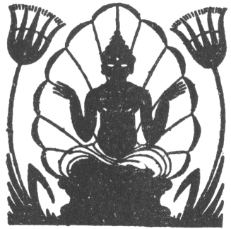

  
[Intangible Textual Heritage](../../index)  [Buddhism](../index.md) 
[Index](index)  [Previous](lob41)  [Next](lob43.md) 

------------------------------------------------------------------------

[Buy this Book at
Amazon.com](https://www.amazon.com/exec/obidos/ASIN/B00292BROK/internetsacredte.md)

------------------------------------------------------------------------

  
*The Life of Buddha*, by A. Ferdinand Herold, tr. by Paul C Blum
\[1922\], at Intangible Textual Heritage

------------------------------------------------------------------------

p. 206

### 20. The Death of Suddhodana

NEAR the city of Vaisali, there was an immense wood that had been
presented to the Master, and there he was living when the news came to
him that his father, King Suddhodana, had fallen sick. The king was an
old man; the illness was serious; it was feared that he was dying. The
Master decided to visit him, and flying through the air he came to
Kapilavastu.

The king lay mournfully on his couch. He was gasping for breath. Death
was very near. Yet he smiled when he saw his son. And the Master spoke
these words:

"Long is the road you have travelled, O king, and always did you strive
to do good. You knew nothing of evil desires; your heart was innocent of
hatred, and anger never blinded your mind. Happy is he who is given to
doing good! Happy is he who looks into a limpid pool and sees his
unsullied countenance, but far happier is he who examines his mind and
knows the purity thereof! Your mind is pure, O king, and your death as
calm as the close of a lovely day."

p. 207

"Blessed One," said the king, "I understand now the inconstancy of the
worlds. I am free of all desire; I am free of the chains of life."

Once again, he paid homage to the Buddha. Then he turned to the
servants, assembled in the hall.

"Friends," said he, "I must have wronged you many times, yet never once
did you show me that you bore malice. You were kind and good. But before
I die, I must have your forgiveness. The wrongs I did you were
unintentional; forgive me, Friends."

The servants were weeping. They murmured: "No, you have never wronged
us, lord!" Suddhodana continued:

"And you, Mahaprajapati, you who were my pious consort, you whom I see
in tears, calm your grief. My death is a happy death. Think of the glory
of this child you brought up; gaze at him in all his splendor, and
rejoice."

He died. The sun was setting.

The Master said:

"Behold my father's body. He is no longer what he was. No one has ever
conquered death. He who is born must die. Show your zeal for good works;
walk in the path that leads to wisdom. Make a lamp of wisdom, and
darkness will vanish of its own accord. Do not follow evil laws; do not
plant poisonous roots; do not add to the evil in the world.

p. 208

\[paragraph continues\] Like the
charioteer who, having left the highroad for a rough path, weeps at the
sight of a broken axle, even so does the fool, who has strayed from the
law, weep when he falls into the jaws of death. The wise man is the
torch that gives light to the ignorant; he guides mankind, for he has
eyes, and the others are sightless."

The body was carried to a great funeral pile. The Master set fire to it,
and while his father's body was being consumed by the flames, while the
people of Kapilavastu wept and lamented, he repeated these sacred
truths:

"Suffering is birth, suffering is old age, suffering is sickness,
suffering is death. O thirst to be led from birth to birth! Thirst for
power, thirst for pleasure, thirst for being, thirsts that are the
source of all suffering! O evil thirsts, the saint knows you not, the
saint who extinguishes his desires, the saint who knows the noble
eight-fold path."

 

------------------------------------------------------------------------

[Next: 1. Mahaprajapati is Admitted to the Community](lob43.md)
