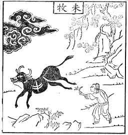
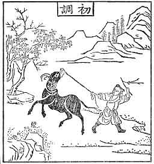
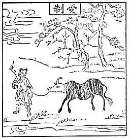
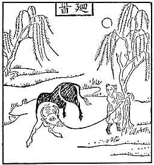
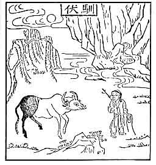
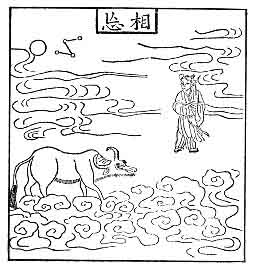

  
[Intangible Textual Heritage](../../index)  [Buddhism](../index) 
[Index](index)  [Previous](mzb03)  [Next](mzb05) 

------------------------------------------------------------------------

# IV. FROM THE CHINESE ZEN MASTERS

There is a large mass of literature to be called especially Zen because
of its style and terminology. Until the time of Hui-neng (Yeno in
Japanese) and his immediate disciples, there was not much, as far as
literary expressions were concerned, to distinguish treatises
specifically on Zen from the rest of Buddhist literature. But as time
went on there grew up what is now known as the Yu-lu (*goroku* in
Japanese), containing the sayings and sermons, "gatha" poems, and other
literary works of a Zen master. Strictly speaking, the Yu-lu or Goroku
is not limited to Zen. One of the chief characteristics of the Zen
Goroku is the free use of colloquial expressions which are not found in
the classical literature of China. As long as Zen appeals to one's
direct experience, abstraction is too inane for the mind of a master.

# FROM THE CHINESE ZEN MASTERS

## I

## BODHIDHARMA ON THE TWOFOLD ENTRANCE TO THE TAO\[1\]

There are many ways to enter the Path, but briefly Speaking they are of
two sorts only. The one is "Entrance by Reason" and the other "Entrance
by Conduct".\[2\] By "Entrance by Reason" we mean the realization of the
spirit of Buddhism by the aid of the scriptural teaching. We then come
to have a deep faith in the True Nature which is the same in all
sentient beings. The reason why it does not manifest itself is due to
the overwrapping of external objects and false thoughts. When a man,
abandoning the false and embracing the true, in singleness of thought
practises the

\[1. From *The Transmission of the Lamp*, XXX.

2\. "Entrance by Reason" may also be rendered "Entrance by Higher
Intuition", and "Entrance by Conduct", "Entrance by Practical Living".\]

Pi-kuan\[1\] he finds that there is neither self nor other, that the
masses and the worthies are of one essence, and he firmly holds on to
this belief and never moves away therefrom. He will not then be a slave
to words, for he is in silent communion with the Reason itself, free
from conceptual discrimination; he is serene and not-acting. This is
called "Entrance by Reason".

By "Entrance by Conduct" is meant the four acts in which all other acts
are included. What are the four? 1. To know how to requite hatred; 2. To
be obedient to karma; 3. Not to crave anything; and 4. To be in accord
with the Dharma.

1\. What is meant by "How to requite hatred"? He who disciplines himself
in the Path should think thus when he has to struggle with adverse
conditions: "During the innumerable past ages I have wandered through a
multiplicity of existences, all the while giving myself to unimportant
details of life at the expense of essentials, and thus creating infinite
occasions for hate, ill-will, and wrongdoing. While no violations have
been committed in this life, the fruits of evil deeds in the past are to
be gathered now. Neither gods nor men can foretell what is coming upon
me. I will submit myself willingly and patiently to all the ills that
befall me, and I will never bemoan or complain. The Sutra teaches me not
to worry over ills that may happen to me. Why? Because when things are
surveyed by a higher intelligence, the foundation of causation is
reached." When this thought is awakened in a man, he will be in accord
with the Reason because he makes the best use of hatred and turns it
into the service in his advance towards the Path. This is called the
"way to requite hatred".

2\. By "being obedient to karma" is meant this: There is no self
(*atman*) in whatever beings are produced by the interplay of karmaic
conditions; the pleasure and pain I suffer are also the results of my
previous action. If I am rewarded with fortune, honour, etc., this is
the outcome of my past deeds which by reason of causation affect my
present

\[1. "Wall-gazing".\]

life. When the force of karma is exhausted, the result I am enjoying now
will disappear; what is then the use of being joyful over it? Gain or
loss, let me accept the karma as it brings to me the one or the other;
the Mind itself knows neither increase nor decrease. The wind of
pleasure \[and pain\] will not stir me, for I am silently in harmony
with the Path. Therefore this is called "being obedient to karma".

3\. By "not craving (*ch'iu*) anything" is meant this: Men of the world,
in eternal confusion, are attached everywhere to one thing or another,
which is called craving. The wise however understand the truth and are
not like the ignorant. Their minds abide serenely in the uncreated while
the body moves about in accordance with the laws of causation. All
things are empty and there is nothing desirable to seek after. Where
there is the merit of brightness there surely lurks the demerit of
darkness. This triple world where we stay altogether too long is like a
house on fire; all that has a body suffers, and nobody really knows what
peace is. Because the wise are thoroughly acquainted with this truth,
they are never attached to things that change; their thoughts are
quieted, they never crave anything. Says the Sutra: "Wherever there is a
craving, there is pain; cease from craving and you are blessed." Thus we
know that not to crave anything is indeed the way to the Truth.
Therefore, it is taught not "to crave anything".

14\. By "being in accord with the Dharma" is meant that the Reason which
we call the Dharma in its essence is pure, and that this Reason is the
principle of emptiness (*sunyata*) in all that is manifested; it is
above defilements and attachments, and there is no "self", no "other" in
it. Says the Sutra: "In the Dharma there are no sentient beings, because
it is free from the stain of being; in the Dharma there is no 'self'
because it is free from the stain of selfhood." When the wise understand
this truth and believe in it, their lives will be "in accordance with
the Dharma".

As there is in the essence of the Dharma no desire to possess, the wise
are ever ready to practise charity with their body, life, and property,
and they never begrudge, they never know what an ill grace means. As
they have a perfect understanding of the threefold nature of emptiness,
they are above partiality and attachment. Only because of their will to
cleanse all beings of their stains, they come among them as of them, but
they are not attached to form. This is the self-benefiting phase of
their lives. They, however, know also how to benefit others, and again
how to glorify the truth of enlightenment. As with the virtue of
charity, so with the other five virtues \[of the Prajnaparamita\]. The
wise practise the six virtues of perfection to get rid of confused
thoughts, and yet there is no specific consciousness on their part that
they are engaged in any meritorious deeds. This is called "being in
accord with the Dharma".\[1\]

## II

## ON BELIEVING IN MIND (SHINJIN-NO-MEI)\[2\]

1\. The Perfect Way knows no difficulties  
Except that it refuses to make preferences;  
Only when freed from hate and love,  
It reveals itself fully and without disguise;

\[1. Since this translation from the *Transmission of the Lamp*, two
Tun-huang MSS. containing the text have come to light. The one is in the
*Masters and Disciples of the Lanka* (*Leng-chia Shihtzu Chi*), already
published, and the other still in MS., which however the present author
intends to have reproduced in facsimile before long. They differ in
minor points with the translation here given.

2 By Seng-t'san (Sosan in Japanese). Died 606 C.E. Mind = *hsin*. *Hsin*
is one of those Chinese words which defy translation. When the Indian
scholars were trying to translate the Buddhist Sanskrit works into
Chinese, they discovered that there were five classes of Sanskrit terms
which could not be satisfactorily rendered into Chinese. We thus find in
the Chinese Tripitaka such words as *prajna*, *bodhi*, *buddha*,
*nirvana*, *dhyana*, *bodhisattva*, etc., almost always untranslated;
and they now appear in their original Sanskrit form among the technical
Buddhist terminology. If we could leave *hsin* with all its nuance of
meaning in this translation, it would save us from the many difficulties
that face us in its English rendering. For hsin means "mind", "heart",
"soul", "spirit"--each singly as well as all inclusively. In the present
composition by the third patriarch of Zen, it has sometimes an
intellectual connotation but at other times it can properly be given as
"heart". But as the predominant note of Zen Buddhism is more
intellectual than anything else, though not in the sense of being
logical or philosophical, I decided here to translate *hsin* by "mind"
rather than by "heart", and by this mind I do not mean our psychological
mind, but what may be called absolute mind, or Mind.\]

A tenth of an inch's difference,  
And heaven and earth are set apart;  
If you wish to see it before your own eyes,  
Have no fixed thoughts either for or against it.

2\. To set up what you like against what you dislike--  
This is the disease of the mind:  
When the deep meaning \[of the Way\] is not understood  
Peace of mind is disturbed to no purpose.

3\. \[The Way is\] perfect like unto vast space,  
With nothing wanting, nothing superfluous:  
It is indeed due to making choice  
That its suchness is lost sight of.

4\. Pursue not the outer entanglements,  
Dwell not in the inner void;  
Be serene in the oneness of things,  
And \[dualism\] vanishes by itself.

5\. When you strive to gain quiescence by stopping motion,  
The quiescence thus gained is ever in motion;  
As long as you tarry in the dualism,  
How can you realize oneness?

6\. And when oneness is not thoroughly understood,  
In two ways loss is sustained:  
The denying of reality is the asserting of it,  
And the asserting of emptiness is the denying of it.\[1\]

\[1. This means: When the absolute oneness of things is not properly
understood, negation as well as affirmation tends to be a one-sided view
of reality. When Buddhists deny the reality of an objective world, they
do not mean that they believe in the unconditioned emptiness of things;
they know that there is something real which cannot be done away with.
When they uphold the doctrine of emptiness this does not mean that all
is nothing but an empty hollow, which leads to a self-contradiction. The
philosophy of Zen avoids the error of one-sidedness involved in realism
as well as in nihilism.\]

7\. Wordiness and intellection--  
The more with them the further astray we go;  
Away therefore with wordiness and intellection,  
And there is no place where we cannot pass freely.

8\. When we return to the root, we gain the meaning;  
When we pursue external objects, we lose the reason.  
The moment we are enlightened within,  
We go beyond the voidness of a world confronting us.

9\. Transformations going on in an empty world which confronts us  
Appear real all because of Ignorance:  
Try not to seek after the true,  
Only cease to cherish opinions.

10\. Abide not with dualism,  
Carefully avoid pursuing it;  
As soon as you have right and wrong,  
Confusion ensues, and Mind' is lost.

11\. The two exist because of the One,  
But hold not even to this One;  
When a mind is not disturbed,  
The ten thousand things offer no offence.

12\. No offence offered, and no ten thousand things;  
No disturbance going, and no mind set up to work:  
The subject is quieted when the object ceases,  
The object ceases when the subject is quieted.

13\. The object is an object for the subject,  
The subject is a subject for the object:  
Know that the relativity of the two  
Rests ultimately on one Emptiness.

\[1. The Mind = the Way = the One = Emptiness.\]

14\. In one Emptiness the two are not distinguished,  
And each contains in itself all the ten thousand things;  
When no discrimination is made between this and that.  
How can a one-sided and prejudiced view arise?

15\. The Great Way is calm and large-hearted,  
For it nothing is easy, nothing is hard;  
Small views are irresolute,  
The more in haste the tardier they go.

16\. Clinging is never kept within bounds,  
It is sure to go the wrong way;  
Quit it, and things follow their own courses,  
While the Essence neither departs nor abides.

17\. Obey the nature of things, and you are in concord with the Way,  
Calm and easy and free from annoyance;  
But when your thoughts are tied, you turn away from the truth,  
They grow heavier and duller and are not at all sound.

18\. When they are not sound, the spirit is troubled;  
What is the use of being partial and one-sided then?  
If you want to walk the course of the One Vehicle,  
Be not prejudiced against the six sense-objects.

19\. When you are not prejudiced against the six sense-objects,  
You are then one with the Enlightenment;  
The wise are non-active,  
While the ignorant bind themselves up;  
While in the Dharma itself there is no individuation,  
They ignorantly attach themselves to particular objects.  
It is their own mind that creates illusions--  
Is this not the greatest of all self-contradictions?

20\. The ignorant cherish the idea of rest and unrest,  
The enlightened have no likes and dislikes:  
All forms of dualism  
Are contrived by the ignorant themselves.  
They are like unto visions and flowers in the air;  
Why should we trouble ourselves to take hold of them?  
Gain and loss, right and wrong--  
Away with them once for all!

21\. If an eye never falls asleep,  
All dreams will by themselves cease:  
If the Mind retains its absoluteness,  
The ten thousand things are of one Suchness.\[1\]

22\. When the deep mystery of one Suchness is fathomed,  
All of a sudden we forget the external entanglements;  
When the ten thousand things are viewed in their oneness,  
We return to the origin and remain where we ever have been.

23\. Forget the wherefore of things,  
And we attain to a state beyond analogy;  
Movement stopped and there is no movement,  
Rest set in motion and there is no rest;  
When dualism does no more obtain,  
Oneness itself abides not.

\[1. *The Masters and Disciples of the Lanka* also quotes a poetical
composition of So-san on "The Mysterious" in which we find the following
echoing the idea given expression here:

"One Reality only--  
How deep and far-reaching!  
The ten thousand things--  
How confusingly multifarious!  
The true and the conventional are indeed intermingling,  
But essentially of the same substance they are.  
The wise and the unenlightened are indeed distinguishable,  
But in the Way they are united as one.  
Desirest thou to find its limits?  
How broadly expanding! It is limitless!  
How vaguely it vanishes away! Its ends are never reached!  
It originates in beginningless time, it terminates in endless time."\]

24\. The ultimate end of things where they cannot go any further  
Is not bound by rules and measures:  
In the Mind harmonious \[with the Way\] we have the principle of
identity,  
In which we find all strivings quieted;  
Doubts and irresolutions are completely done away with,  
And the right faith is straightened;  
There is nothing left behind, There is nothing retained,  
All is void, lucid, and self-illuminating;  
There is no exertion, no waste of energy--  
This is where thinking never attains,  
This is where the imagination fails to measure.

25\. In the higher realm of true Suchness  
There is neither "self" nor "other":  
When direct identification is sought,  
We can only say, "Not two".\[1\]

26\. In being "not two" all is the same,  
All that is is comprehended in it;  
The wise in the ten quarters,  
They all enter into this Absolute Reason.

27\. This Absolute Reason is beyond quickening \[time\] and extending
\[space\],  
For it one instant is ten thousand years;  
Whether we see it or not,  
It is manifest everywhere in all the ten quarters.

28\. Infinitely small things are as large as large things can be,  
For here no external conditions obtain;  
Infinitely large things are as small as small things can be,  
For objective limits are here of no consideration.

\[1. I.e. Tat tvam asi.\]

29\. What is is the same as what is not,  
What is not is the same as what is:  
Where this state of things fails to obtain,  
Indeed, no tarrying there.

30\. One in All,  
All in One--  
If only this is realized,  
No more worry about your not being perfect!

31\. Where Mind and each believing mind are not divided,  
And undivided are each believing mind and Mind,  
This is where words fail;  
For it is not of the past, present, and future.

## III

## FROM HUI-NENG'S TAN-CHING\[1\]

24\. *Mahaprajnaparamita* is a Sanskrit term of the Western country; in
T'ang it means "great-wisdom (*chih-hui*), other-shore reached". This
Truth (*dharma*=*fa*) is to be lived, it is not to be \[merely\]
pronounced with the mouth. When it is not lived, it is like a phantom,
like an apparition. The Dharmakaya of the Yogin is the same as the
Buddha.

What is *maha*? *Maha* means "great". The capacity of Mind is wide and
great, it is like emptiness of space. To sit with a mind emptied makes
one fall into emptiness of indifference. Space contains the sun, the
moon, stars, constellations, great earth, mountains, and rivers. All
grasses and plants, good men and bad men, bad things and good things,
Heaven and hell-they are all in empty space. The emptiness of \[Self-\]
nature as it is in all people is just like this.

25\. \[Self-\] nature contains in it all objects; hence it is great. All
objects without exception are of Self-nature. Seeing all human beings
and non-human beings as they are,

\[1. The Tun-huang copy, edited by D. T. Suzuki, 1934. Hui-neng = Yeno,
637-712.\]

evil and good, evil things and good things, it abandons them not, nor is
it contaminated with them; it is like the emptiness of space. So it is
called great, that is, *maha*. The confused pronounce it with their
mouths, the wise live it with their minds. Again, there are people
confused \[in mind\]; they conceive this to be great when they have
their minds emptied of thoughts--which is not right. The capacity of
Mind is great; when there is no life accompanying it it is small. Do not
merely pronounce it with the mouth. Those who fail to discipline
themselves to live this life, are not my disciples.

26\. What is *prajna*? *Prajna* is *chih-hui* (wisdom). When every
thought of yours is not benighted at all times, when you always live
*chih-hui* (=*prajna*, wisdom), this is called the life of Prajna. When
a single thought of yours is benighted, then Prajna ceases to work. When
a single thought of yours is of chih, i.e. enlightened, then Prajna is
born. Being always benighted in their minds, people yet declare
themselves to be living Prajna. Prajna has no shape, no form, it is no
other than the essence (*hsing*) of *chih-hui* (wisdom).

What is *Paramita*? This is a Sanskrit term of the Western country. In
Yang it means "the other shore reached". When the meaning (*artha* in
Sanskrit) is understood, one is detached from birth and death. When the
objective world (*visaya*) is clung to, there is the rise of birth and
death; it is like the waves rising from the water; this is called "this
shore". When you are detached from the objective world, there is no
birth and death for you; it is like the water constantly running its
course: this is "reaching the other shore". Hence *Paramita*.

The confused pronounce \[Prajna\] with their mouths; the wise live it in
their minds. When it is merely pronounced, there is at that very moment
a falsehood; when there is a .falsehood, it is not a reality. When
Prajna is lived in every thought of yours, this is known as reality.
Those who understand this truth, understand the truth of Prajna and
practise the life of Prajna. Those who do not practise it are ordinary
people. When you practise and live it in one thought of yours, You are
equal to the Buddha.

Good friends, the passions are no other than enlightenment (*bodhi*).
When your antecedent thought is confused yours is an ordinary mind; as
soon as your succeeding thought is enlightened, you are a Buddha.

Good friends, Prajnaparamita is the most honoured, the highest, the
foremost; it is nowhere abiding, nowhere departing, nowhere coming; all
the Buddhas of the past, present, and future issue out of it. By means
of Great Wisdom (*ta-chih-hui*=*mahaprajna*) that leads to . the other
shore (*paramita*), the five skandhas, the passions, and the innumerable
follies are destroyed. When thus disciplined, one is a Buddha, and the
three passions \[i.e. greed, anger, and folly\] will turn into Morality
(*sila*), Meditation (*dhyana*), and Wisdom (*prajna*).

27\. Good friends, according to my way of understanding this truth,
84,000 wisdoms (*chih-hui*) are produced from one Prajna. Why? Because
there are 84,000 follies. If there were no such innumerable follies,
Prajna is eternally abiding, not severed from Self-nature. He who has an
insight into this truth is free from thoughts, from recollections, from
attachments; in him there is no deceit and falsehood. This is where the
essence of Suchness is by itself. When all things are viewed in the
light of wisdom (*chih-hui*=prajna), there is neither attachment nor
detachment. This is seeing into one's Nature and attaining the truth of
Buddhahood.

28\. Good friends, if you wish to enter into the deepest realm of Truth
(*dharmadhatu*), and attain the Prajnasamadhi, you should at once begin
to exercise yourselves in the life of Prajnaparamita; you just devote
yourselves to the one volume of the *Vajracchedika-prajnaparamita
Sutra*, and you will, seeing into the nature of your being, enter upon
the Prajnasamadhi. It should be known that the merit of such a person is
immeasurable, as is distinctly praised in the sutras, of which I need
not speak in detail.

This Truth of the highest order is taught to people of great
intelligence and superior endowments. If people of small intelligence
and inferior endowments happen to hear it, no faith would ever be
awakened in their minds. Why? It is like a great dragon pouring rains
down in torrents over the Jambudipa: cities, towns, villages are all
deluged and carried away in the flood, as if they were grass-leaves. But
when the rain, however much, falls on the great ocean, there is in it
neither an increase nor a decrease.

When people of the Great Vehicle listen to a discourse on the
*Vajracchedika* their minds are opened and there is an intuitive
understanding. They know thereby that their own Nature is originally
endowed with Prajna-wisdom and that all things are to be viewed in the
light of this wisdom (*chih-hui*) of theirs, and they need not depend
upon letters. It is like rain-waters not being reserved in the sky; but
the water is drawn up by the dragon-king out of the rivers and oceans,
whereby all beings and all plants, sentient and non-sentient,
universally share the wet. All the waters flowing together once more are
poured into the great ocean, and the ocean accepting all the waters
fuses them into one single body of water. It is the same with
Prajna-wisdom which is the original Nature of all beings.

29\. When people of inferior endowments hear this "abrupt" doctrine here
discoursed on, they are like those plants naturally growing small on
earth, which, being once soaked by a heavy rain, are all unable to raise
themselves up and continue their growth. It is the same with people of
inferior endowments. They are endowed with Prajna-wisdom as much as
people of great intelligence; there is no distinction. Why is it then
that they have no insight even when listening to the Truth? It is due to
the heaviness of hindrance caused by false views and to the
deep-rootedness of the passions. It is like an overcasting cloud
screening the s un; unless it blows hard no rays of light are visible.

There is no greatness or smallness in Prajna-wisdom, but since all
beings cherish in themselves confused thoughts, they seek the Buddha by
means of external exercises, and are unable to see into their
Self-nature. That is why they are known to be people of inferior
endowments.

Those beings who, listening to the "Abrupt" doctrine, do not take
themselves to external exercises, but reflecting within themselves raise
this original Nature all the time to the proper viewing \[of the
Truth\], remain \[always Undefiled by\] the passions and the innumerable
follies; and at that moment they all have an insight \[into the Truth\].
It is like the great ocean taking in all the rivers, large and small,
and merging them into one body of water -'this is seeing into one's own
Nature. \[He who thus sees into his own Nature\] does not abide anywhere
inside or outside; he freely comes and departs; he knows how to get rid
of attaching thoughts; his passage has no obstructions. When one is able
to practise this life, he realizes that there is from the first no
difference between \[his Self-Nature\] and Prajnaparamita.\[1\]

30\. All the sutras and writings, all the letters, the two vehicles
Major and Minor, the twelve divisions \[of Buddhist literature\]-these
are all set forth because of the people of the world. Because there is
wisdom-nature (*chih-hui-hsing*), therefore there is the establishment
of all these works. If there were no people of the world, no
multitudinous objects would ever be in existence. Therefore, we know
that all objects rise originally because of the people of the world. All
the sutras and writings are said to have their existence because of the
people of the world.

The distinction of stupidity and intelligence is only possible among the
people of the world. Those who are stupid are inferior people and those
who are intelligent are superior people. The confused ask the wise, and
the wise discourse for them on the Truth in order to make the stupid
enlightened and have an intuitive understanding of it. When the confused
are enlightened and have their minds opened, they are not to be
distinguished from the people of great intelligence.

Therefore, we know that Buddhas when not enlightened are no other than
ordinary beings; when there is one thought of enlightenment, ordinary
beings at once turn into Buddhas. Therefore, we know that all
multitudinous objects are every

\[1. The text has "the Prajnaparamita Sutra" here. But I take it to mean
Prajna itself instead of the sutra.\]

one of them in one's own mind.\[1\] Why not, from within one's own mind,
at once reveal the original essence of Suchness? Says the
*Bodhisattvasila Sutra*: "My original Self-nature is primarily pure;
when my Mind is known and my Nature is seen into I naturally attain the
path of Buddhahood." Says the Vimalakirti Sutra: "When you have an
instant opening of view you return to your original Mind."

48\. The Great Master died on the third day of the eighth month of the
second year of Hsien-t'ien (713 C.E.). On the eighth day of the seventh
month of this year he had a farewell gathering of his followers as he
felt that he was to leave them forever in the following month, and told
them to have all the doubts they might have about his teaching once for
all settled on this occasion. As he found them weeping in tears he said:
"You are all weeping, but for whom are you so sorry? If you are sorry
for my not knowing where I am departing to, you are mistaken; for I know
where I am going. Indeed, if I did not, I would not part with you. The
reason why you are in tears is probably that you do not yourselves know
whither I am going. If you did, you would not be weeping so. The Essence
of the Dharma knows no birth-and-death, no coming-and-going. Sit down,
all of you, and let me give you a gatha with the title, "On the
Absolute"\[2\]

There is nothing true anywhere,  
The true is nowhere to be seen;  
If you say you see the true,  
This seeing is not the true one.\[3\]

\[1. The text has the "body", while the Koshoji edition and the current
one have "mind".

2\. The title literally reads: "the true-false moving-quiet". "True"
stands against "false" and "moving" against "quiet" and as long as there
is an opposition of any kind, no true spiritual insight is possible. And
this insight does not grow from a quietistic exercise of meditation.

3\. That is, the Absolute refuses to divide itself into two: that which
sees and that which is seen.\]

Where the true is left to itself,  
There is nothing false in it, which is Mind itself.  
When Mind in itself is not liberated from the false,  
There is nothing true, nowhere is the true to be found.

A conscious being alone understands what is meant by "moving";\[1\]  
To those not endowed with consciousness, the moving is unintelligible;  
If you exercise yourself in the practice of keeping your mind unmoved,
\[i.e. in a quietistic meditation\],  
The immovable you gain is that of one who has no consciousness.

If you are desirous for the truly immovable,  
The immovable is in the moving itself,  
And this immovable is the \[truly\] immovable one;  
There is no seed of Buddhahood where there is no consciousness.

Mark well how varied are aspects \[of the immovable one\],  
And know that the first reality is immovable;  
Only when this insight is attained,  
The true working of Suchness is understood.

I advise you, O students of the Truth  
To exert yourselves in the proper direction;  
Do not in the teaching of the Mahayana  
Commit the fault of clinging to the relative knowledge\[2\] of birth and
death.

\[1. "Moving" means "dividing" or "limiting". When the absolute moves, a
dualistic interpretation of it takes place, which is consciousness.

2\. *Chih*, *jnana* in Sanskrit, is used in contradistinction to
*Prajna* which is the highest form of knowledge, directly seeing into
the Immovable or the Absolute.\]

Where there is an all-sided concordance of views  
You may talk together regarding the Buddha's teaching;  
Where there is really no such concordance,  
Keep your hands folded and your joy within yourself.

There is really nothing to argue about in this teaching;  
Any arguing is sure to go against the intent of it;  
Doctrines given up to confusion and argumentation  
Lead by themselves to birth and death.

## IV

## YOKA DAISHI'S "SONG OF ENLIGHTENMENT"\[1\]

1\. Knowest thou that leisurely philosopher who has gone beyond learning
and is not exerting himself in anything?  
He neither endeavours to avoid idle thoughts nor seeks after the
Truth;  
\[For he knows that\] ignorance in reality is the Buddha-nature,  
\[And that\] this empty visionary body is no less than the Dharma-body.

2\. When one knows what the Dharma-body is, there is not an object \[to
be known as such\],  
The source of all things, as far as its self-nature goes, is the Buddha
in his absolute aspect;  
The five aggregates (*skandha*) are like a cloud floating hither and
thither with no fixed purpose,  
The three poisons (*klesa*) are like foams appearing and disappearing as
it so happens to them.

\[1. Yoka Daishi (died 713, Yung-chia Ta-shih, in Chinese), otherwise
known as Gengaku (Hsuan-chiao), was one of the chief disciples of
Hui-neng, the, sixth patriarch of Zen Buddhism. Before he was converted
to Zen he was a student of the T'ien-tai. His interview with Hui-neng is
recorded in the Tan-ching. He died in 713 leaving a number of short
works on Zen philosophy, and of them the present composition in verse is
the most popular one. The Original title reads: *Cheng-tao Ke*,
"realization-way-song".\]

3\. When Reality is attained, it is seen to be without an ego-substance
and devoid of all forms of objectivity,  
And thereby all the karma which leads us to the lowest hell is instantly
wiped out;  
Those, however, who cheat beings with their false knowledge,  
Will surely see their tongues pulled out for innumerable ages to come.

4\. In one whose mind is at once awakened to \[the intent of\] the
Tathagata-dhyana  
The six paramitas and all the other merits are fully matured;  
While in a world of dreams the six paths of existence arc vividly
traced,  
But after the awakening there is vast Emptiness only and not even a
great chiliocosm exists.

5\. Here one sees neither sin nor bliss, neither loss nor gain;  
In the midst of the Eternally Serene no idle questionings are invited;  
The dust \[of ignorance\] has been since of old accumulating on the
mirror never polished,  
Now is the time once for all to see the clearing positively done.

6\. Who is said to have no-thought? and who not-born?  
If really not-born, there is no no-birth either;  
Ask a machine-man and find out if this is not so;  
As long as you seek Buddhahood, specifically exercising yourself for it,
there is no attainment for you.

7\. Let the four elements go off your hold,  
And in the midst of the Eternally Serene allow yourself to quaff or to
peck, as you like;  
Where all things of relativity are transient and ultimately empty,  
There is seen the great perfect enlightenment of the Tathagata realized.

8\. True monkhood consists in having a firm conviction;  
If, however, you fail to have it, ask me according to your ideas, \[and
you will be enlightened\].  
To have a direct understanding in regard to the root of all things, this
is what the Buddha affirms;  
If you go on gathering leaves and branches, there is no help for you.

9\. The whereabouts of the precious *mani*-jewel is not known to people
generally,  
Which lies deeply buried in the recesses of the Tathagata-garbha;  
The sixfold function miraculously performed by it is an illusion and yet
not an illusion,  
The rays of light emanating from one perfect sun belong to the realm of
form and yet not to it.

10\. The fivefold eye-sight\[1\] is purified and the fivefold power\[2\]
is gained,  
When one has a realization, which is beyond \[intellectual\]
measurement;  
There is no difficulty in recognizing images in the mirror,  
But who can take hold of the moon reflected in water?

11\. \[The enlightened one\] walks always by himself, goes about always
by himself;  
Every perfect one saunters along one and the same passage of Nirvana;  
His tone is classical, his spirit is transparent, his airs are naturally
elevated,  
His features are rather gaunt, his bones are firm, he pays no attention
to others.

\[1. The fivefold eye-sight (*cakshus*) : (1) Physical, (2) Heavenly,
(3) Prajna-, (4) Dharma-, and (5) Buddha-eye.

3 The fivefold power (*bala*): (1) Faith, (2) Energy, (3) Memory, (4)
Meditation, and (5) Prajna.\]

12\. Sons of the Sakya are known to be poor;  
But their poverty is of the body, their spiritual life knows no
poverty;  
The poverty-stricken body is wrapped in rags,  
But their spirit holds within itself a rare invaluable gem.

13\. The rare invaluable gem is never impaired however much one uses
it,  
And beings are thereby benefited ungrudgingly as required by
occasions;  
The triple body\[1\] and the fourfold jnana\[2\] are perfected within
it,  
The eightfold emancipation\[3\] and the sixfold miraculous power\[4\]
are impressed on it.

14\. The superior one has it settled once for all and forever  
The middling one learns much and holds much doubt;  
The point is to cast aside your soiled clothes you so dearly keep with
you;  
What is the use of showing off your work before others?

15\. Let others speak ill of me, let others spite me;  
Those who try to burn the sky with a torch end in tiring themselves
out;  
I listen to them and taste \[their evil-speaking\] as nectar;  
All melts away and I find myself suddenly within the Unthinkable itself.

\[1. (1) The Dharma-body, (2) the Body of Enjoyment, and (3) the Body of
Transformation.

2\. (1) Mirror-intuition, (2) intuition of identity, (3) knowledge of
doing Works, and (4) clear perception of relations.

3\. The *Abhidharmakosa*, VIII, gives an explanation of the eight
Vimoksha. See La Vallee Poussin's French translation, Chap. VIII, pp.
203-221.

4\. For the six Riddhi, which are the supernatural products of the
meditations, see op. cit., VII, 122 *ff.*\]

16\. Seeing others talk ill of me, I acquire the chance of gaining
merit,  
For they are really my good friends;  
When I cherish, being vituperated, neither enmity nor favouritism,  
There grows within me the power of love and humility which is born of
the Unborn.

17\. Let us be thoroughgoing not only in inner experience but in its
interpretation,  
And our discipline will be perfect in Dhyana as well as in Prajna, not
one-sidedly abiding in Sunyata (emptiness);  
This is not where we alone have finally come to,  
But all the Buddhas, as numerous as the Ganga sands, are of the same
essence.

18\. The lion-roaring of the doctrine of fearlessness--  
Hearing this, the timid animals' brains are torn in pieces,  
Even the scented elephant runs wild forgetting its native dignity;  
It is the heavenly dragon alone that feels elated with joy, calmly
listening \[to the lion-roaring of the Buddha\].

19\. I crossed seas and rivers, climbed mountains, and forded
freshets,  
In order to interview the masters, to inquire after Truth, to delve into
the secrets of Zen;  
And ever since I was enabled to recognize the path of Sokei,\[1\]  
I know that birth-and-death is not the thing I have to be concerned
with.

\[1. T'sao-ch'i is the name of the locality where Hui-neng had his
monastery, means the master himself.\]

20\. For walking is Zen, sitting is Zen,  
Whether talking or remaining silent, whether moving or standing quiet,
the Essence itself is ever at ease;  
Even when greeted with swords and spears it never loses its quiet way,  
So with poisonous drugs, they fail to perturb its serenity.

2 1. Our Master, \[Sakyamuni\], anciently served Dipankara the Buddha,  
And again for many kalpas disciplined himself as an ascetic called
Kshanti.  
\[I have also\] gone through many a birth and many a death;  
Births and deaths-how endlessly they recur!

22\. But ever since my realization of No-birth, which quite abruptly
came on me,  
Vicissitudes of fate, good and bad, have lost their power over me.  
Far away in the mountains I live in an humble hut;  
High are the mountains, thick the arboreous shades, and under an old
pine-tree  
I sit quietly and contentedly in my monkish home;  
Perfect tranquillity and rustic simplicity rules here.

23\. When you are awakened \[to the Dharma\], all is understood, no
strivings are required;  
Things of the *samskrita*\[1\] are not of this nature;  
Charity practised with the idea of form (*rupa*) may result in a
heavenly birth,  
But it is like shooting an arrow against the sky,  
When the force is exhausted the arrow falls on the ground.  
Similarly, \[when the heavenly reward comes to an end\], the life that
follows is sure to be one of fortune.  
Is it not far better then to be with Reality which is *asamskrita* and
above all strivings,  
And whereby one instantly enters the stage of Tathagatahood?

\[1. According to Buddhist philosophy, existence is divided into two
groups, *samskrita* and *asamskrita*. The samskrita applies to anything
that does any kind of work in any possible manner, while the asamskrita
accomplishes nothing. Of this class are space regarded as a mode of
reality, Nirvana, and nonexistence owing to lack of necessary
conditions.\]

24\. Only let us take hold of the root and not worry about the
branches;  
It is like a crystal basin reflecting the moon,  
And I know now what this *mani*-gem is,  
Whereby not only oneself is benefited but others, inexhaustibly;  
The moon is serenely reflected on the stream, the breeze passes softly
through the pines,  
Perfect silence reigning unruffled-what is it for?

25\. The morality-jewel inherent in the Buddha-nature stamps itself on
the mind-ground \[of the enlightened one\];  
Whose robe is cut out of mists, clouds, and dews,  
Whose bowl anciently pacified the fiery dragons, and whose staff once
separated the fighting tigers;  
Listen now to the golden rings of his staff giving out mellifluous
tunes.  
These are not, however, mere symbolic expressions, devoid of historical
contents;  
Wherever the holy staff of Tathagatahood moves, the traces are
distinctly marked.

26\. He neither seeks the true nor severs himself from the defiled,  
He clearly perceives that dualities are empty and have no reality,  
That to have no reality means not to be one-sided, neither empty nor
not-empty,  
For this is the genuine form of Tathagatahood.

27\. The Mind like a mirror is brightly illuminating and knows no
obstructions,  
It penetrates the vast universe to its minutest crevices;  
All its contents, multitudinous in form, are reflected in the Mind,  
Which, shining like a perfect gem, has no surface, nor the inside.

28\. Emptiness negatively defined denies a world of causality,  
All is then in utter confusion, with no orderliness in it, which surely
invites evils all around;  
The same holds true when beings are clung to at the expense of
Emptiness,  
For it is like throwing oneself into a flame, in order to avoid being
drowned in the water.

29\. When one attempts to take hold of the true by abandoning the
false,  
This is discrimination and there are artificialities and falsehoods;  
When the Yogin, not understanding \[what the Mind is\], is given up to
mere discipline,  
He is apt, indeed, to take an enemy for his own child.

30\. That the Dharma-materials are destroyed and merit is lost,  
Comes in every case from the relative discriminatory mind;  
For this reason Zen teaches to have a thorough insight into the nature
of Mind,  
When the Yogin abruptly by means of his intuitive power realizes the
truth of No-birth.

31\. A man of great will carries with him a sword of Prajna,  
Whose flaming Vajra-blade cuts all the entanglements of knowledge and
ignorance;  
It not only smashes in pieces the intellect of the philosophers  
But disheartens the spirit of the evil ones.

32\. He causes the Dharma-thunder to roar, he beats the Dharma-drum,  
He raises mercy-clouds, he pours nectar-showers,  
He conducts himself like the lordly elephant or dragon and beings
innumerable are thereby blessed,  
The three Vehicles and the five Families are all equally brought to
enlightenment.

Hini the herb grows on the Himalaya where no other grasses are found,  
And the crows feeding on it give the purest of milk, and this I always
enjoy.  
One Nature, perfect and pervading, circulates in all natures;  
One Reality, all comprehensive, contains within itself all realities;  
The one moon reflects itself wherever there is a sheet of water,  
And all the moons in the waters are embraced within the one moon;  
The Dharma-body of all the Buddhas enters into my own being,  
And my own being is found in union with theirs.

33\. In one stage are stored up all the stages;  
\[Reality\] is neither form, nor mind, nor work;  
Even before fingers are snapped, more than eighty thousand holy
teachings are fulfilled;  
Even in the space of a second the evil karma of three asamkhyeya kalpas
is destroyed;  
Whatever propositions are made by logic are no \[true\] propositions,  
For they stand in no intrinsic relation to my inner Light.

34\. \[This inner Light\] is beyond both praise and abuse,  
Like unto space it knows no boundaries;  
Yet it is right here with us ever retaining its serenity and fulness;  
It is only when you seek it that you lose it.  
You cannot take hold of it, nor can you get rid of it;  
While you can do neither, it goes on its own way;  
You remain silent and it speaks; you speak and it is silent;  
The great gate of charity is wide open with no obstructions whatever
before it.

35\. Should someone ask me what teaching I understand,  
I tell him that mine is the power of Mahaprajna;  
Affirm it or negate it as you like-it is beyond your human
intelligence;  
Walk against it or along with it, and Heaven knows not its whereabouts.

36\. 1 have been disciplined in it for ever so many kalpas of my life;  
This is no idle talk of mine, nor am I deceiving you;  
I erect the Dharma-banner to maintain this teaching,  
Which I have gained at Sokei and which is no other than the one
proclaimed by the Buddha.

37\. Mahakashyapa was the first, leading the line of transmission;  
Twenty-eight Fathers followed him in the West;  
The Lamp was then brought over the sea to this country;  
And Bodhidharma became the First Father here:  
His mantle, as we all know, passed over six Fathers,  
And by them many minds came to see the Light.

38\. Even the true need not be \[specifically\] established, as to the
false none such have ever been in existence;  
When both being and non-being are put aside, even non-emptiness loses
its sense;  
The twenty forms of Emptiness are not from the first to be adhered to;  
The eternal oneness of Tathagatahood remains absolutely the same.

39\. The mind functions through the sense-organs, and thereby an
objective world is comprehended--  
This dualism marks darkly on the mirror;  
When the dirt is wiped off, the light shines out;  
So when both the mind and the objective world are forgotten, the Essence
asserts its truth.

40\. Alas! this age of degeneration is full of evils;  
Beings are most poorly endowed and difficult to control;  
Being further removed from the ancient Sage, they deeply cherish false
views;  
The Evil One is gathering up his forces while the Dharma is weakened,
and hatred is growing rampant;  
Even when they learn of the "abrupt" school of the Buddhist teaching,  
What a pity that they fail to embrace it and thereby to crush evils like
a piece of brick!

41\. The mind is the author of all works and the body the sufferer of
all ills;  
Do not blame others plaintively for what properly belongs to you;  
If you desire not to incur upon yourself the karma for a hell,  
Cease from blaspheming the Tathagata-wheel of the good Dharma.

42\. There are no inferior trees in the grove of sandalwoods,  
Among its thickly-growing primeval forest lions alone find their
abode;  
Where no disturbances reach, where peace only reigns, there is the place
for lions to roam;  
All the other beasts are kept away, and birds do not fly in the
vicinity.

43\. It is only their own cubs that follow their steps in the woods,  
When the young ones are only three years old, they roar.  
How can jackals pursue the king of the Dharma?  
With all their magical arts the elves gape to no purpose.

44\. The perfect "abrupt" teaching has nothing to do with human
imagination;  
Where a shadow of doubt is still left, there lies the cause for
argumentation;  
My saying this is not the outcome of my egotism,  
My only fear is lest your discipline lead you astray either to nihilism
or positivism.

45\. "No" is not necessarily "No", nor is "Yes" "Yes";  
But when you miss even a tenth of an inch, the difference widens up to
one thousand miles;  
When it is "Yes", a young Naga girl in an instant attains Buddhahood,  
When it is "No", the most learned Zensho\[1\] while alive falls into
hell.

\[1. Shang-hsing, lit. "good star", was a great scholar of his age.\]

46\. Since early years I have been eagerly after scholarly attainment,  
I have studied the sutras and sastras and commentaries,  
I have been given up to the analysis of names and forms, and never known
what fatigue meant;  
But diving into the ocean to count up its sands is surely an exhausting
task and a vain one;  
The Buddha has never spared such, his scoldings are just to the point,  
For what is the use of reckoning the treasures that are not mine?  
All my past achievements have been efforts vainly and wrongly applied-I
realize it fully now,  
I have been a vagrant monk for many years to no end whatever.

47\. When the notion of the original family is not properly
understood,  
You never attain to the understanding of the Buddha's perfect "abrupt"
system;  
The two Vehicles exert themselves enough, but lack the aspirations \[of
the Bodhisattva\];  
The philosophers are intelligent enough but wanting in Prajna;  
\[As to the rest of us\] they are either ignorant or puerile;  
They take an empty fist as containing something real, and the pointing
finger for the object pointed;  
When the finger is adhered to as the moon itself, all their efforts are
lost;  
They are indeed idle dreamers lost in a world of senses and objects.

48\. The Tathagata is interviewed when one enters upon a realm of
no-forms,  
Such is to be really called a Kwanjizai (Avalokitesvara)  
When this is understood, the karma-hindrances are by nature empty;  
When not understood, we all pay for the past debts contracted.

49\. A royal table is set before the hungry, but they refuse to eat;  
If the sick turn away from a good physician, how are they cured?  
Practise Zen while in a world of desires, and the genuine power of
intuition is manifested;  
When the lotus blooms in the midst of a fire, it is never destroyed.  
Yuse (Yung-shih) the Bhikshu\[1\] was an offender in one of the gravest
crimes, but when he had an enlightened insight into No-birth  
He instantly attained to Buddhahood and is still living in another
world.

50\. The doctrine of fearlessness is taught as loudly as a lion roars:  
What a pity that confused minds inflexibly hardened like leather  
Understand only that grave offences are obstructions to Enlightenment,  
And are unable to see into the secrets of the Tathagata's teaching.

51\. Anciently, there were two Bhikshus, the one committing murder and
the other a carnal offence:  
Upali's insight was like that of the glowworm, and ended only in
tightening the knots of offence;  
But when they were instantly enlightened by the wisdom of Vimalakirti,  
Their griefs and doubts melted away like the frost and snow before the
blazing sun.

52\. The power of incomprehensible emancipation  
Works wonders as innumerable as the sands of the Ganga and knows no
limits;  
\[To him\] the four kinds of offerings are most willingly made,  
By him thousands of pieces of gold are disbursed without involving
anybody in debts;  
The bones may be crushed to powders, the body cut  
up to pieces, and yet we cannot repay him enough for what he does for
us;  
Even a phrase \[issuing from him\] holds true for hundreds of thousands
of kotis of kalpas.

\[1. The story of this Bhikshu is told in the *Sutra on Cleansing the
Karma-hindrances* (*Ching Yeh-chang Ching*).\]

53\. He is the Dharma-king deserving the highest respect;  
The Tathagatas, as many in number as the Ganga-sands, all testify to the
truth of his attainment;  
I now understand what this mani jewel is,  
And know that all those who accept it in faith are in correspondence
\[with it\].

54\. As to seeing it, the seeing is clear enough, but no objects are
here to be seen,  
Not a person here, nor the Buddha;  
Chiliocosms numberless are mere bubbles in the ocean,  
All the sages and worthies are flashes of lightning.

55\. However rapidly revolves the iron-wheel over my head,  
The perfect brightness of Dhyana and Prajna in me is never effaced;  
The sun may turn cold. and the moon hot;  
With all the power of the evil ones the true doctrine remains forever
indestructible.  
The elephant-carriage steadily climbs up the steepest hill,  
Before whose wheels how can the beetle stand?

56\. The great elephant does not walk on the hare's lane,  
Supreme Enlightenment goes beyond the narrow range of intellection;  
Cease from measuring heaven with a tiny piece of reed;  
If you have no insight yet, I will have the matter settled for you.

## V

## BASO (MA-TSU) AND SEKITO (SHIH-T'OU), TWO GREAT MASTERS OF THE T'ANG DYNASTY

Ma-tsu (Baso) whose posthumous title was the Zen Master of Great
Quietude (*ta-chi*) was to be properly called Tao-i (Doichi). His family
name was Ma, from the district of Han-chou. His teaching which was
originally propagated in the province of Chiang-hsi proved of great
influence in the Buddhist world of the time, and he came to be generally
known as Ma the Father, that, Ma-tsu.

Historically, Zen Buddhism was introduced to China by an Indian monk
called Bodhidharma during the South and North Dynasties, probably late
in the fifth century. But it was not until the time of Hui-neng and
Shen-hsiu that Bodhidharma was recognized as the first patriarch of Zen
Buddhism in China; for this was the time when Zen to be properly so
called came to establish itself as one of the strong Buddhist movements
created by Chinese religious genius. The movement firmly took root with
Ma-tsu (-788) and Shih-t'ou (700-790). The latter had his monastery in
the province of Hu-nan, and thus Hu-nan and Chiang-hsi became the
hot-bed of the Zen movement. All the followers of Zen in China as well
as in Japan at present trace back their lineage to these two masters of
the T'ang.

Shih-t'ou (Sekito) whose family name was Chen came from the district of
Tuan-chou. His other name was Hsi-ch'ien. While still young, his
religious feeling was strongly stirred against a barbarous custom which
was practised among the Liao race. The custom consisted in sacrificing
bulls in order to appease the wrath of the evil spirits which were
worshipped by the people. Shih-t'ou destroyed many such shrines
dedicated to the spirits and saved the victims. He probably acted quite
decisively and convincingly so that even the elders of his village
failed to prevent him from so rashly working against popular
superstitions. He later embraced Buddhism, becoming a disciple of
Hui-neng. The latter however died before this young man had been
formally ordained as a Buddhist monk. He then went to Hsing-ssu (-740),
of Chi-chou and studied Zen Buddhism. Hsing-ssu like Nan-yueh Huai-jang
who was the teacher of Ma-tsu, was also a disciple of Hui-neng.

 

Before quoting Ma-tsu, let me acquaint you with some of Shih-t'ou's
questions-and-answers (*mondo* = *wen-to*) as recorded in the
*Transmission of the Lamp*.

Hsing-ssu one day asked: "Some say that an intelligence comes from the
south of the Ling."

T'ou: "There is no such intelligence from anybody."

Ssu: "If not, whence are all those sutras of the Tripitaka?"

T'ou: "They all come out of here, and there is nothing wanting."

 

Shih-t'ou, "Stone-head", gains his name because of his having a hut over
the flat surface of a rock in his monastery grounds in Heng-chou. He
once gave the following sermon: "My teaching which has come down from
the ancient Buddhas is not dependent on meditation (*dhyana*) or on
diligent application of any kind. When you attain the insight as
attained by the Buddha, you realize that Mind is Buddha and Buddha is
Mind, that Mind, Buddha, sentient beings, Bodhi (enlightenment), and
Klesa (passions) are of one and the same substance while they vary in
names. You should know that your own mind-essence is neither subject to
annihilation nor eternally subsisting, is neither pure nor defiled, that
it remains perfectly undisturbed and self-sufficient and the same with
the wise and the ignorant, that it is not limited in its working, and
that it is not included in the category of mind (*citta*), consciousness
(*manas*), or thought (*vijnana*). The three worlds of desire, form, and
no-form, and the six paths of existence are no more than manifestations
of your mind itself. They are all like the moon reflected in water or
images in the mirror. How can we speak of them as being born or as
passing away? When you come to this understanding, you will be furnished
with all the things you are in need of."

Tao-wu, one of Shih-t'ou's disciples, then asked: "Who has attained to
the understanding of Hui-neng's teaching?"

T'ou: "The one who understands Buddhism."

Wu: "Have you then attained it?"

T'ou: "No, I do not understand Buddhism."

 

A monk asked: "How does one get emancipated?"

The master said: "Who has ever put you in bondage?"

Monk: "What is the Pure Land?"

Master: "Who has ever defiled you?"

Monk: "What is Nirvana?"

Master: "Who has ever subjected you to birth-and-death?"

 

Shih-t'ou asked a monk newly arrived: "Where do you come from?"

"From Chiang-hsi."

"Did you see Ma the great teacher?"

"Yes, master."

Shih-t'ou then pointed at a bundle of kindlings and said: "How does Ma
the teacher resemble this?"

The monk made no answer. Returning to Ma the teacher, he reported the
interview with Shih-t'ou. Ma asked: "Did you notice how large the bundle
was?"

"An immensely large one it was."

"You are a very strong man indeed."

"How?" asked the monk.

"Because you have carried that huge bundle from Nan-yueh even up to this
monastery. Only a strong man can accomplish such a feat."

 

A monk asked: "What is the meaning of the First Patriarch's coming from
the West?"

Master: "Ask the post over there."

Monk: "I do not understand you."

Master: "I do not either, any more than you."

 

Ta-tien asked: "According to an ancient sage it is a dualism to take the
Tao either as existing or as not-existing. Please tell me how to remove
this obstruction."

"Not a thing here, and what do you wish to remove?"

Shih-t'ou turned about and demanded: "Do away with your throat and lips,
and let me see what you can say."

Said Ta-tien, "No such things have I."

"If so, you may enter the gate."

 

Tao-wu asked: "What is the ultimate teaching of Buddhism?"

"You won't understand it until you have it."

"Is there anything over and above it whereby one may have a new turn?"

"Boundlessly expands the sky and nothing obstructs the white clouds from
freely flying about."

 

"What is Zen?" asked a monk.

"Brick and stone."

"What is the Tao?"

"A block of wood."

 

\[1\]Someone asked Ma-tsu: "How does a man discipline himself in the
Tao?"

The master replied: "In the Tao there is nothing to discipline oneself
in. If there is any discipline in it, the completion of such discipline
means the destruction of the Tao. One then will be like the Sravaka. But
if there is no discipline whatever in the Tao, one remains an
ignoramus."

"By what kind of understanding does a man attain the Tao?"

On this, the master gave the following sermon:

"The Tao in its nature is from the first perfect and

\[1. The following mondo are all taken from a book known as Sayings of
the Ancient Worthies, fas. I (*Ku tsun-hsiu yu-lu*).\]

self-sufficient. When a man finds himself unhalting in his management of
the affairs of life good or bad, he is known as one who is disciplined
in the Tao. To shun evils and to become attached to things good, to
meditate on Emptiness and to enter into a state of samadhi--this is
doing something. If those who run after an outward object, they are the
farthest away \[from the Tao\].

Only let a man exhaust all his thinking and imagining he can possibly
have in the triple world. When even an iota of imagination is left with
him, this is his triple world and the source of birth and death in it.
When there is not a trace of imagination, he has removed all the source
of birth and death, he then holds the unparalleled treasure belonging to
the Dharmaraja. All the imagination harboured since the beginningless
past by an ignorant being, together with his falsehood, flattery,
self-conceit, arrogance, and other evil passions, are united in the body
of One Essence, and all melt away.

"It is said in the sutra that many elements combine themselves to make
this body of ours, and that the rising of the body merely means the
rising together of all these elements and the disappearance of the body
means also merely that of the elements. When the latter rise, they do
not declare that they are now to rise; when they disappear they do not
declare that they are now to disappear.

So with thoughts, one thought follows another without interruption, the
preceding one does not wait for the succeeding, each one is
self-contained and quiescent. This is called the Sagaramudra-samadhi,
"Meditation of the Ocean-stamp", in which are included all things, like
the ocean where all the rivers however different in size, etc., empty
themselves. In this great ocean of one salt-water, all the waters in it
partake of one and the same taste. A man living in it diffuses himself
in all the streams pouring into it. A man bathing in the great ocean
uses all the waters emptied into it.

"The Sravaka is enlightened and yet going astray; the ordinary man is
out of the right path and yet in a way enlightened. The Sravaka fails to
perceive that Mind as it is in itself knows no stages, no causation, no
imaginations. Disciplining himself in the cause he has attained the
result and abides in the Samadhi of Emptiness itself for ever so many
kalpas. However enlightened in his way, the Sravaka is not at all on the
right track. From the point of view of the Bodhisattva, this is like
suffering the torture of hell. The Sravaka has buried himself in
emptiness and does not know how to get out of his quiet contemplation,
for he has no insight into the Buddha-nature itself.

If a man is of superior character and intelligence he will, under the
instruction of a wise director, at once see into the essence of the
thing and understand that this is not a matter of stages and processes.
He has an instant insight into his own Original Nature. So we read in
the sutra that ordinary beings change in their thoughts but the Sravaka
knows no such changes \[which means that he never comes out of his
meditation of absolute quietude\].

"'Going astray' stands against 'being enlightened'; but when there is
primarily no going astray there is no being enlightened either. All
beings since the beginningless past have never been outside the
Dharma-essence itself; abiding for ever in the midst of the
Dharma-essence, they eat, they are clothed, they talk, they respond; all
the functioning of the six senses, all their doings are of the
Dharma-essence itself. When they fail to understand to go back to the
Source they follow names, pursue forms, allow confusing imaginations to
rise, and cultivate all kinds of karma. Let them once in one thought
return to the Source and their entire being will be of Buddha-mind.

"O monks, let each of you see into his own Mind. Do not memorize what I
tell you. However eloquently I may talk about all kinds of things as
innumerable as the sands of the Ganges, the Mind shows no increase; even
when no talk is possible, the Mind shows no decrease. You may talk ever
so much about it, and it is still your own Mind; you may not at all talk
about it, and it is just the same your own Mind. You may divide your
body into so many forms, and emitting rays of supernatural light perform
the eighteen miracles, and yet what you have gained is after all no more
than your own dead ashes.

"The dead ashes thoroughly wet have no vitality and are likened to the
Sravaka's disciplining himself in the cause in order to attain its
result. The dead ashes not yet wet are full of vitality and are likened
to the Bodhisattva, whose life in the Tao is pure and not at all dyed in
evils. If I begin to talk about the various teachings given out by the
Tathagata, there will be no end however long through ages I may go on.
They are like an endless series of chains. But once you have an insight
into the Buddha-mind, nothing in Lore is left to you to attain.

"I have kept you standing long enough, fare you well!"

 

P'ang the lay-disciple' asked one day when Ma-tsu appeared in the
pulpit: "Here is the Original Body altogether unbedimmed! Raise your
eyes to it!" Ma-tsu looked straight downward. Said Fang, "How
beautifully the master plays on the first-class stringless lute!" The
master looked straight up. P'ang made a bow, and the master returned to
his own room. Fang followed him and said, "A while ago you made a fool
of yourself, did you not?"

Someone asked: "What is the Buddha?"

"Mind is the Buddha, and there's no other."

 

A monk asked: "Without resorting to the four statements and an endless
series of negations, can you tell me straightway what is the idea of our
Patriarch's coming from the West?"

The master said: "I don't feel like answering it today. You go to the
Western Hall and ask Shih-tsang about it."

The monk went to the Western Hall and saw the priest, who pointing at
his head with a finger said, "My head aches today and I am unable to
explain it to you today. I advise you to go to Brother Hai."

\[1. Ho-koji in Japanese. He was one of the greatest disciples of Ma,
and for further quotations see my *Essays on Zen*, I, II, and III.\]

The monk now called on Hai, and Hai said: "As to that I do not
understand."

The monk finally returned to the master and told him about his
adventure. Said the master: "Tsang's head is black while Hai's is
white."

 

A monk asked: "Why do you teach that Mind is no other than Buddha?"

"In order to make a child stop its crying."

"When the crying is stopped, what would you say?"

"Neither Mind nor Buddha."

"What teaching would you give to him who is not in these two groups?"

"I will say, 'It is not a something.'

"If you unexpectedly interview a person who is in it what would you do?"
finally, asked the monk.

"I will let him realize the great Tao."

 

The master asked Pai-chang, one of his chief disciples: How would you
teach others?"

Pai-chang raised his *hossu*.

The master remarked, "Is that all? No other way?"

Pai-chang threw the *hossu* down.

 

A monk asked: "How does a man set himself in harmony with the Tao?"

"I am already out of harmony."

 

Tan-yuan, one of Ma-tsu's personal disciples, came back from his
pilgrimage. When he saw the master, he drew a circle on the floor and
after making bows stood on it facing the master. Said Ma-tsu: "So you
wish to become a Buddha?"

The monk said: "I do not know the art of putting my own eyes out of
focus."

"I am not your equal."

The monk had no answer.

 

One day in the first month of the fourth year of Chen-yuan (788), while
walking in the woods at Shih-men Shan, Ma-tsu noticed a cave with a flat
floor. He said to his attendant monk, "My body subject to decomposition
will return to earth here in the month to come." On the fourth of the
second month, he was indisposed as he predicted, and after a bath he sat
cross-legged and passed away.

## VI

## HUANG-PO'S SERMON, FROM "TREATISE ON THE ESSENTIALS OF THE TRANSMISSION OF MIND" (DENSHIN HOYO)

The master\[1\] said to Pai-hsiu:

Buddhas and sentient beings\[2\] both grow out of One Mind, and there is
no other reality than this Mind. It has been in existence since the
beginningless past; it knows neither birth nor death; it is neither blue
nor yellow; it has neither shape nor form; it is beyond the category of
being and non-being; it is not to be measured by age, old or new; it is
neither long nor short; it is neither large nor small; for it transcends
all limits, words, traces, and opposites. It must be taken just as it is
in itself; when an attempt is made on our part to grasp it in our
thoughts, it eludes. It is like space whose boundaries are altogether
beyond measurement; no concepts are applicable here.

\[1. Wobaku Ki-un in Japanese, died 850.

2 One of the first lessons in the understanding of Buddhism is to know
what is meant by the Buddha and by sentient beings. This distinction
goes on throughout all branches of the Buddhist teaching. The Buddha is
an enlightened one who has seen into the reason of existence, while
sentient beings are ignorant multitudes confused in mind and full of
defilements. The object of Buddhism is to have all sentient beings
attain enlightenment like the Buddha. The question is whether they are
of the same nature as the latter; for if not they can never be
enlightened as he is. The spiritual cleavage between the two being
seemingly too wide for passage, it is often doubted whether there is
anything in sentient beings that will transform them into Buddhahood.
The position of Zen Buddhism is that One Mind pervades all and therefore
there is no distinction to be made between the Buddha and sentient
beings and that as far as Mind is concerned the two are of one nature.
What then is this Mind? Huang-po attempts to solve this question for his
disciple Pai-hsiu in these sermons.\]

This One Mind only is the Buddha, who is not to be segregated from
sentient beings. But because we seek it outwardly in a world of form,
the more we seek the further it moves away from us. To make Buddha seek
after himself, or to make Mind take hold of itself--this is an
impossibility to the end of eternity. We do not realize that as soon as
our thoughts cease and all attempts at forming ideas are forgotten the
Buddha reveals himself before us.

This Mind is no other than the Buddha, and Buddha is no other than
sentient being. When Mind assumes the form of a sentient being, it has
suffered no decrease; when it becomes a Buddha, it has not added
anything to itself. Even when we speak of the six virtues of perfection
(paramitas) and other ten thousand meritorious deeds equal in number to
the sands of the Ganges, they are all in the being of Mind itself; they
are not something that can be added to it by means of discipline. When
conditions' are at work, it is set up; when conditions cease to operate,
it remains quiet. Those who have no definite faith in this, that Mind is
Buddha and attempt an achievement by means of a discipline attached to
form, are giving themselves up to wrong imagination; they deviate from
the right path.

This Mind is no other than Buddha; there is no Buddha outside Mind, nor
is there any Mind outside Buddha. This Mind is pure and like space has
no specific forms \[whereby it can be distinguished from other
objects\]. As soon as you raise a thought and begin to form an idea of
it, you ruin the reality itself, because you then attach yourself to
form. Since the beginningless past, there is no Buddha who has ever had
an attachment to form. If you seek Buddhahood by practising the six
virtues of perfection and other ten thousand deeds of merit, this is
grading \[the attainment of Buddhahood\]; but since the begnningless
past there is no Buddha whose attainment was so graded. When you get an
insight into the One Mind you find there that is no particular reality

\[1. *Yuan* in Chinese and *pratyaya* in Sanskrit. One of the most
significant technical terms in the philosophy of Buddhism.\]

\[which you can call Mind\]. This unattainability is no other than the
true Buddha himself.

Buddhas and sentient beings grow out of the One Mind and there are no
differences between them. It is like space where there are no
complexities, nor is it subject to destruction. It is like the great sun
which illumines the four worlds: when it rises, its light pervades all
over the world, but space itself gains thereby no illumination. When the
sun sets, darkness reigns everywhere, but space itself does not share
this darkness. Light and darkness drive each other out and alternately
prevail, but space itself is vast emptiness and suffers no vicissitudes.

The same may be said of the Mind that constitutes the essence of Buddha
as well as that of sentient being. When you take Buddha for a form of
purity, light, and emancipation and sentient beings for a form of
defilement, darkness, and transmigration, you will never have the
occasion however long \[your striving may go on\] for attaining
enlightenment; for so long as you adhere to this way of understanding,
you are attached to form. And in this One Mind there is not a form of
particularity to lay your hand on.

That Mind is no other than Buddha is not understood by Buddhists of the
present day; and because of their inability of seeing into the Mind as
it is, they imagine a mind beside Mind itself and seek Buddha outwardly
after a form. This way of disciplining is an error, is not the way of
enlightenment.

It is better to make offerings to a spiritual man who is free from
mind-attachment' than to make offerings to all

\[1. *Wu-hsin*, or *mu-shin* in Japanese. The term literally means
"no-mind" or "no-thought". It is very difficult to find an English word
corresponding to it. "Unconsciousness" approaches it, but the
connotation is too psychological. Mu-shin is decidedly an Oriental idea.
"To be free from mind-attachment" is somewhat circumlocutionary, but the
idea is briefly to denote that state of consciousness in which there is
no hankering, conscious or unconscious ' after an ego-substance, or a
soul-entity, or a mind as forming the structural unit of our mental
life. Buddhism considers this hankering the source of all evils moral
and intellectual. It is the disturbing agency not only of an individual
life but of social life at large. A special article in one of my *Zen
Essays* will be devoted to the subject.\]

the Buddhas in the ten quarters. Why? Because to be free from
mind-attachment means to be free from all forms of imagination.

Suchness as it expresses itself inwardly may be likened o wood or rock,
it remains there unmoved, unshaken; while outwardly it is like space,
nothing is obstructed or checked. Suchness, as it is free both from
activity and passivity, knows no orientation, it has no form, there is
in it neither gain nor loss. Those who are running \[wildly\] do not
dare enter this path, for they are afraid of falling into an emptiness
where there is no foothold to keep them supported. They beat a retreat
as they face it. They are as a rule seekers of learning and intellectual
understanding. Many are indeed such seekers, like hair, while those who
see into the truth are as few as horns.

Manjusri corresponds to *li* (reason or principle) and Samantabhadra to
*hsing* (life or action). *Li* is the principle of true emptiness and
non-obstruction, hsing is a life of detachment from form, and
inexhaustible. Avalokitesvara 'corresponds to perfect love and
Sthamaprapta to perfect wisdom. Vimala-kirti means "undefiled name";
undefiled is Essence and name is form. Essence and form are not two
different things, hence the name Vimala-kirti ("pure-name"). All that is
represented by each one of the great Bodhisattvas is present in each of
us, for it is the contents of One Mind. All will be well when we are
awakened to the truth.

Buddhists of the present day look outward, instead of inwardly into
their own minds. They get themselves attached to forms and to the
world--which is the violation of the truth.

To the sands of the Ganges the Buddha refers in this way: these sands
are trodden and passed over by all the Buddhas, Bodhisattvas, Sakrendra,
and other devas, but the sands are not thereby gladdened; they are again
trodden y cattle, sheep, insects, and ants, but they are not thereby
incensed; they may hide within themselves all kinds of treasures and
scented substances, but they are not covetous; they may be soiled with
all kinds of filth and ill-smelling material, but they do not loathe
them. A mental attitude Of this nature is that of one who has realized
the state of *mushin* ("being free from mind-attachment").

When a mind is free from all form, it sees into \[the fact\] that there
is no distinction between Buddhas and sentient beings; when once this
state of *mushin* is attained it completes the Buddhist life. If
Buddhists are unable to see into the truth of *mushin* without anything
mediating, all their discipline of aeons would not enable them to attain
enlightenment. They would ever be in bondage with the notion of
discipline and merit as cherished by followers of the Triple Vehicle,
they would never achieve emancipation.

In the attainment of this state of mind (mushin), some are quicker than
others. There are some who attain to a state of mushin all at once by
just listening to a discourse on the Dharma, while there are others who
attain to it only after going through all the grades of Bodhisattvaship
such as the ten stages of faith, the ten stages of abiding, the ten
stages of discipline, and the ten stages of turning-over. More or less
time may be required in the attainment of *mushin*, but once attained it
puts an end to all discipline, to all realization and yet there is
really nothing attained. It is truth and not falsehood. Whether this
*mushin* is attained in one thought or attained after going through the
ten stages its practical working is the same and there is no question of
the one being deeper or shallower than the other. Only the one has
passed through long ages of hard discipline.

Committing evils or practising goodness-both are the outcome of
attachment to form. When evils are committed on account of attachment to
form, one has to suffer transmigration; when goodness is practised on
account of attachment to form, one has to go through a life of
hardships. It is better therefore to see all at once into the essence of
the Dharma as you listen to it discoursed.

By the Dharma is meant Mind, for there is no Dharma apart from Mind.
Mind is no other than the Dharma, for there is no Mind apart from the
Dharma. This Mind in itself is no-mind (*mushin*), and there is no
no-mind either. When no-mind is sought after by a mind, this is making
it a particular object of thought. There is only testimony of silence,
it goes beyond thinking. Therefore it is said that \[the Dharma\] cuts
off the passage to words and puts an end to all form of mentation.

This Mind is the Source, the Buddha absolutely pure in its nature, and
is present in every one of us. All sentient beings however mean and
degraded are not in this particular respect different from Buddhas and
Bodhisattvas--they are all of one substance. Only because of their
imaginations and false discriminations, sentient beings work out their
karma and reap its result, while, in their Buddha-essence itself, there
is nothing corresponding to it; the Essence is empty and allows
everything to pass through, it is quiet and at rest, it is illuminating,
it is peaceful and productive of bliss.

When you have within yourself a deep insight into this you immediately
realize that all that you need is there in perfection, and in abundance,
and nothing is at all wanting in you. You may have most earnestly and
diligently disciplined yourself for the past three asamkhyeya kalpas and
passed through all the stages of Bodhisattvahood; but when you come to
have a realization in one thought, it is no other than this that you are
from the first the Buddha himself and no other. The realization has not
added anything to you over this truth. When you look back and survey all
the disciplinary measures you have gone through, you only find that they
have been no more than so many idle doings in a dream. Therefore, it is
told by the Tathagata that he had nothing attained when he had
enlightenment, and that if he had really something attained, Buddha
Dipankara would never have testified to it.

It is told again by the Tathagata that this Dharma is perfectly even and
free from irregularities. By Dharma is meant Bodhi. That is, this pure
Mind forming the source of all things is perfectly even in all sentient
beings, in all the Buddha-lands, and also in all the other worlds
together with mountains, oceans, etc., things with form and things
without form. They are all even, and there arc no marks of distinction
between this object and that. This pure Mind, the Source of all things,
is always perfect and illuminating and all-pervading. People are
ignorant of this and take what they see or hear or think of or know for
Mind itself; and their insight is then veiled and unable to penetrate
into the substance itself which is clear and illuminating. When you
realize mushin without anything intervening \[that is, intuitively\],
the substance itself is revealed to you. It is like the sun revealing
itself in the sky, its illumination penetrates the ten quarters and
there is nothing that will interfere with its passage.

For this reason, when followers of Zen fail to go beyond a world of
their senses and thoughts, all their doings and movements are of no
significance. But when the senses and thoughts are annihilated, all the
passages to the Mind are blocked and no entrance then becomes possible.
The original Mind is to be recognized along with the working of the
senses and thoughts, only it does not belong to them, nor is it
independent of them. Do not build up your views on your senses and
thoughts, do not carry on your understanding based on the senses and
thoughts; but at the same time do not seek the Mind away from your
senses and thoughts, do not grasp the Dharma by rejecting your senses
and thoughts. When you are neither attached to nor detached from them,
when you are neither abiding with nor clinging to them, then you enjoy
your perfect unobstructed freedom, then you have your seat of
enlightenment.

When people learn that what is transmitted from one Buddha to another is
Mind itself, they imagine that there is a particular object known as a
mind which they attempt to grasp or to realize; but this is seeking
something outside Mind itself, or creating something which does not
exist. In reality, Mind alone is. You cannot pursue it by setting up
another mind; however long, through hundreds of thousands of kalpas, you
are after it, no time will ever come to you when you can say that you
have it. Only when you have an immediate awakening to the state of
*mushin* you have your own Mind. It is like the strong man's seeking for
his own gem hidden within his forehead: as long as he seeks it outside
himself in the ten quarters, he will not come across it; but let the
wise once point at it where it lies hidden, and the man instantly
perceives his own gem as having been there from the very first.

That followers of Zen fail to recognize the Buddha is due to their not
rightly recognizing Where their own Mind is. They seek it outwardly, set
up all kinds of exercises which they hope to master by degrees, and
themselves work out diligently throughout ages. Yet they fail to reach
enlightenment. No works compare with an immediate awakening to a state
of *mushin* itself.

When you come to a most decided understanding to the effect that all
things in their nature are without possessions, without attainments,
without dependence, without an abiding place, without mutual
conditioning, you will become free from cherishing imagination, which is
to realize Bodhi. When Bodhi is realized, your own Mind which is Buddha
is realized. All the doings of long ages are then found to have been
anything but real disciplining. When the strong man recovered his own
gem in his own forehead the recovery had nothing to do with all his
efforts wasted in his outside research. So says the Buddha, "I have not
had anything attained in my attainment of Enlightenment." Being anxious
about our not believing this, he refers to the five eyes\[1\] and the
five statements.\[2\] But it is truth, not falsehood, for it is the
first true statement.

\[1. The five eyes are: (1) the physical eye, (2) the heavenly eye, (3)
the eye of wisdom, (4) the eye of the Dharma, and (5) the eye of the
Buddha.

2\. In the *Diamond Sutra* (*Vajracchedika*), the Buddha makes five
statements as regards the truth of his teaching.\]

## VII

## GENSHA ON THE: THREE INVALIDS\[1\]

### Preliminary Remark

When gates and courts are established, then there are twos, there are
threes, there is a realm of multiplicities; when a deep discourse is
carried on on the highest subjects of intuition a world of sevens and
eights is thoroughly broken through. In whatever ways views and opinions
may be presented, they are crushed to pieces so that the barricades even
when they are of golden chains are successfully brushed aside. When
orders are given from the highest quarters, all traces are wiped off,
leaving nothing whereby trailing is made possible. When do we come
across such a *koan*? Let one who has an eye on the forehead see to
it.\[2\]

### Illustrative Case

Gensha gave the following sermon:

"It is asserted by all the worthy masters of the present time that they
are working for the benefit of all beings. \[--Each keeps a shop
according to his means.--Some are rich and others are poor.\]

"This being the case, what will you do if there suddenly appear before
you three kinds of invalids? \[--By beating up the weeds, we mean to
frighten snakes out.--As for me, it makes my eyes open wide and my mouth
close.-We all have to beat a retreat even for three thousand *1i*.\]

"Those who are blind fail to see you even when you

\[1. Hsuan-sha, 835-908. The following is a literal translation of Case
LXXXVIII of the *Pi-yen Chi*, which is one of the most important and at
the same time the most popular of Zen texts. The words in brackets in
the "Illustrative Case" and in Seccho's verse are those of Yengo. As to
the nature and composition of the Pi-yen Chi, see my Zen Essays, Series
II, p. 237 et seq.

2\. The Remark purposes to make the reader abandon his usual relative
point of view so that he can reach the absolute ground of all things.\]

hold up a mallet or a *hossu*. \[--Blind to the very core.--This is no
other than 'benefiting all beings'.--Not necessarily failing to see.\]

"Those who are deaf fail to hear you even when you talk volubly enough.
\[--Deaf to the very core!--This is no other than 'benefiting all
beings'.--Not necessarily altogether deaf.--That something is still
unheard.\]

"Those who are dumb fail to speak out, whatever under. standing they may
have inwardly. \[--Dumb to the very core!--This is no other than
'benefiting all beings'.--Not necessarily altogether dumb.--That
something is still left untold of.\]

"What treatment are you going to accord to such people? If you do not
know how to go on with them, Buddhism must be said to be lacking in
miraculous works." \[--Quite true, this world-I am ready to give myself
up with my hands folded.--"Benefiting" already accomplished!--"He then
struck."\]

A monk asked Ummon (Yun-men) to be enlightened. \[--It is also important
to go about and inquire.--Hit!\]

Said Ummon, "You make bows." \[--As the wind blows, the grass
bends.--Ch'ua!\]

When the monk rose from making bows, \[--This monk's staff is broken!\]

Ummon poked him with a staff, and the monk drew back. Said Ummon, "You
are not blind then?" \[--Blind to the very core!--Do not say that this
monk has a failing eye-sight.\]

Ummon now told him to approach, and the monk approached. \[--Washed with
a second dipperful of dirty water.--Kwan-non is come! To give a
"*Kwatz!*" was better.\] Said Ummon, "You are not deaf then?" \[--Deaf
to the very core!--Do not say that this monk is deaf in his ears.\]

Ummon further continued, "Do you understand?" \[--Why does he not feed
him with the right forage?--Pity that he then uttered a word at all.\]

"No, master, I do not," was the reply. \[--A double koan!--What a
pity!\]

Ummon said, "You are not dumb then?" \[--Dumb is to the very core!--What
eloquence!--Do not say that this monk is dumb.\]

The monk now grasped the point. \[--Stretching the bow when the burglar
is off.--What old bowl is he after?\]

### Commentary Notes

Gensha gives this sermon from his standpoint where he is now able to
sit, after years of his study of Zen, in absolute nakedness with no
trumpery trimmings about him, altogether shorn of imaginations and free
from conceptualism. In those days there were many Zen monasteries each
of which rivalled the others. Gensha used to give this sermon to his
monks:

"It is asserted by all the worthy masters of the present time that they
are working for the benefit of all beings. This being the case, what
will you do if three kinds of invalids suddenly appear before you here?
Those who are blind fail to see you even when you hold up a mallet or a
hossu. Those who are deaf fail to hear you even when you may talk
volubly enough. Those who are dumb fail to speak out whatever
understanding they may have inwardly. What treatment are you going to
accord to such people? If you do not know how to go on with them,
Buddhism must be said to be lacking in miraculous works."

If people understand him here as merely making reference to the blind,
to the deaf, to the dumb, they are vainly groping in the dark.
Therefore, it is said that you are not to search for the meaning in the
words which kill; you are requested to enter directly into the spirit
itself of Gensha, when you will grasp the meaning.

As Gensha ordinarily tested his monks with this statement, a monk who
was staying for some time with him one day accosted him when he came up
to the Dharma-hall, and asked: "Will you allow me to present my way of
reasoning about your sermon on the three invalids?" Gensha said, "Yes,
you may go on." Whereupon the monk remarked, "Fare thee well, O master!"
and left the room. Gensha said, "Not that, not that." We can see that
this monk has fully grasped Gensha.

Later on, Hogen (Fa-yen, died 958) made this statement: "When I listened
to Master Jizo (Ti-tsang) making reference is to this monk's remark, I
was enabled to understand Gensha's sermon on the three invalids."

I ask you now. "\[Here is a puzzle for you, O monks!\] If that monk did
not understand Gensha, how was it that Hogen made this statement of his?
If that monk understood Gensha, why did the latter declare, 'Not that,
not that'?"

One day Jizo said to Gensha, "I am told that you have given a sermon on
the three invalids, is that so?" Gensha answered, "Yes." Jizo then said,
"I have my eyes, cars, nose, and tongue; what treatment would you give
me?" Gensha was quite satisfied with this request on the part of Jizo.

When Gensha is understood, you will realize that his spirit is not to be
sought in words. You will also see that those who understand make
themselves naturally distinguishable from the rest.

Later when a monk came to Ummon (Yun-men, died 949) and asked him about
Gensha's sermon, Ummon was ready to demonstrate it in the following way,
for he thoroughly understood Gensha. Said Ummon to the monk, "You make
bows." When the monk rose from making bows, Ummon poked him with a
staff, and the monk drew back. Said Ummon, "You are not blind then?"
Ummon now told him to approach, and the monk approached. Said Ummon,
"You are not deaf then?" Finally, he said, "Do you understand?" "No,
master", being the reply, Ummon remarked, "You are not dumb then?" This
made the monk grasp the point.

If this monk of Ummon's had any sort of understanding about Gensha, he
would have kicked up the master's chair when he was told to make bows,
and no more fussing would have been necessary. In the meantime let me
ask you whether Ummon and Gensha both understood the problem in the same
way, or not. I tell you that their understanding is directed to one
point. That the ancient masters come out among us and make all kinds of
contrivance is because they wish to see somebody bite their hook and be
caught up. They thus make bitter remarks in order to have us see into
the great event of this life.

My own master Goso (Wu-tsu, died 1104) had this to say: "Here is one who
can talk well but has no understanding; here is another who understands
but is unable to talk about it. When these two present themselves before
you, how will you distinguish the one from the other? If you cannot make
this discrimination, you cannot expect to free people from their bondage
and attachment. But when you can, I will see to it that, as soon as you
enter my gate, I put on a pair of sandals and run through the inside of
your body several times even before you realize. In case, however, you
fail to have an insight in this matter, what is the use of hunting
around for an old bowl? Better be gone!"

Do you wish to know what is the ultimate meaning of these complications
in regard to the blind, deaf, and dumb? Let us see what Seccho says
about it.

### Seccho's Remarks in Verse

Blind, deaf, dumb! \[--Even before any word is uttered.--The three
sense-organs are perfectly sound.--Already finished is one paragraph!\]

Infinitely beyond the reach of imaginative contrivances! \[--Where do
you wish to hunt for it?--Is there anything here which permits your
calculations?--What relationship have they after all?\]

Above the heavens and below the heavens! \[--Perfectly free is the
working of Truth.--Thou hast said!\]

How ludicrous! How disheartening! \[--What is it that is so ludicrous,
so disheartening?--Partly bright and partly dark.\]

Li-lou does not know how to discriminate the right colour. \[--Blind
fellow!--A good craftsman leaves no trace.--Blind to the very core!\]

How can Shih-k'uang recognize the mysterious tune? \[--Deaf in his
ears!--There is no way to appreciate the greatest merit.--Deaf to the
very core!\]

What life can compare with this?--Sitting alone quietly by the window,
\[--This is the way to go on.--Do not try to get your livelihood in a
cave of ghosts.--Break up all at once this cask of coal tar!\]

I observe the leaves fall and the flowers bloom as the seasons come and
go. \[--What season do you think it is now?--Do not regard this as
doing-nothingness.--Today, morning is followed by evening; tomorrow,
morning is followed by evening.\]

Seccho now remarked: "Do you understand, or not?" \[--"Repeated in the
gatha."I

An iron bar without a hole! \[--Coming up with your own confession!--Too
bad that he was released too easily,--"Then he struck."\]

### Yengo's Comment on Seccho

"Blind, deaf, dumb!  
Infinitely beyond the reach of imaginative contrivances!"

In this, Seccho has swept everything away for you what you see together
with what you do not see, what you hear together with what you do not
hear, and what you talk about together with what you cannot talk about.
All these are completely brushed off, and you attain the life of the
blind, deaf, and dumb. Here all your imaginations, contrivances' and
calculations are once for all put an end to, they are no more made use
of this is where lies the highest point of Zen, this is where we have
true blindness, true deafness, and true dumbness, each in its artless
and effectless aspect.

"Above the heavens and below the heavens!  
How ludicrous! how disheartening!"

Here Seccho lifts up with one hand and with the other puts down. Tell me
what he finds to be ludicrous, what he finds to be disheartening. It is
ludicrous that this dumb person is not after all dumb, that this deaf
one is not after all deaf; it is disheartening that the one who is not
at all blind is blind for all that, and that the one who is not at all
deaf is deaf for all that.

'Li-lou does not know how to discriminate the right colour."

When he is unable to discriminate between blue and yellow, red and
white, he is certainly a blind man. He lived in the reign of the Emperor
Huang. He is said to have been able to discern the point of a soft hair
at a distance of one hundred steps. His eye-sight was extraordinary.
When the Emperor Huang had a pleasure-trip to the River Chih, he dropped
his precious jewel in the water and made Li fetch it up. But he failed.
The Emperor made Ch'ih-kou search for it, but he also failed to locate
it. Later Hsiang-wang was ordered to get it, and he got it. Hence:

"When Hsiang-wang goes down, the precious gem shines most brilliantly;  
But where Li-lou walks about, the waves rise even to the sky."

When we come up to these higher spheres, even the eyes of Li-lou are
incapacitated to distinguish which is the right colour.

"How can Shih-kuang recognize the mysterious tune?"

Shih-kuang was son of Ching-kuang of Chin in the province of Chiang in
the Chou dynasty. His other name was Tzu-yeh. He could thoroughly
distinguish the five sounds and the six notes, he could even hear the
ants fight on the other side of a hill. When Chin and Ch'u were at war,
Shih-kuang could tell, by merely quietly playing on the strings of his
lute, that the engagement would surely be unfavourable for Chu. In spite
of his extraordinary sensitiveness, Seccho (Hsueh-t'ou) declares that he
is unable to recognize the mysterious tune. After all, one who is not at
all deaf is really deaf in his ears. The most exquisite note in the
higher spheres is indeed beyond the ear of Shih-kuang. Says Seccho: "I
am not going to be a Li-lou, nor to be a Shih-kuang, but

"What life can compare with this?--Sitting alone quietly by the
window,  
I observe the leaves fall, the flowers bloom as the seasons come and
go."

When one attains this stage of realization, seeing is no-seeing, hearing
is no-hearing, preaching is no-preaching. When hungry one eats, when
tired one sleeps. Let the leaves fall, let the flowers bloom as they
like. When the leaves fall, I know it is the autumn; when the flowers
bloom, I know it is the spring. Each season has its own features.

Having swept everything clean before you, Seccho now opens a passageway,
saying: "Do you understand, or not?" He has done all he could for you,
he is exhausted, only able to turn about and present to you this
iron-bar without a hole. It is a most significant expression. Look and
see with your own eyes! If you hesitate, you miss the mark for ever.

Yengo (Yuan-wu, the author of this commentary note) now raised his
*hossu* and said, "Do you see?" He then struck his chair and said, "Do
you hear?" Coming down from the chair, he said, "Was anything talked
about?"

## VIII

## THE TEN OXHERDING PICTURES

### Preliminary

The author of these "Ten Oxherding Pictures" is said to be a Zen master
of the Sung Dynasty known as Kaku-an Shi-en (Kuo-an Shih-yuan) belonging
to the Rinzai school. He is also the author of the poems and
introductory words attached to the pictures. He was not however the
first who attempted to illustrate by means of pictures stages of Zen
discipline, for in his general preface to the pictures he refers to
another Zen master called Seikyo (Ching-chu), probably a contemporary of
his, who made use of the ox to explain his Zen teaching. But in Seikyo's
case the gradual development of the Zen life was indicated by a
progressive whitening of the animal, ending in the disappearance of the
whole being. There were in this only five pictures, instead of ten as by
Kaku-an. Kaku-an thought this was somewhat misleading because of an
empty circle being made the goal of Zen discipline. Some might take mere
emptiness as all important and final. Hence his improvement resulting in
the "Ten Oxherding Pictures" as we have them now.

According to a commentator of Kaku-an's Pictures, there is another
series of the Oxherding Pictures by a Zen master called jitoku Ki
(Tzu-te Hui), who apparently knew of the existence of the Five Pictures
by Seikyo, for jitoku's are six in number. The last one, No. 6, goes
beyond the stage of absolute emptiness where Seikyo's end: the poem
reads:

"Even beyond the ultimate limits there extends a passageway,  
Whereby he comes back among the six realms of existence;  
Every worldly affair is a Buddhist work,  
And wherever he goes he finds his home air;  
Like a gem he stands out even in the mud,  
Like pure gold he shines even in the furnace;  
Along the endless road \[of birth and death\] he walks sufficient unto
himself,  
In whatever associations he is found he moves leisurely unattached."

Jitoku's ox grows whiter as Seikyo's, and in this particular respect
both differ from Kaku-an's conception. In the latter there is no
whitening process. In Japan Kaku-an's Ten Pictures gained a wide
circulation, and at present all the oxherding books reproduce them. The
earliest one belongs I think to the fifteenth century. In China however
a different edition seems to have been in vogue, one belonging to the
Seikyo and Jitoku series of pictures. The author is not known. The
edition containing the preface by Chu-hung, 1585, has ten pictures, each
of which is preceded by Pu-ming's poem. As to who this Pu-ming was,
Chu-hung himself professes ignorance. In these pictures the ox's
colouring changes together with the oxherd's management of him. The
quaint original Chinese prints are reproduced below, and also Pu-ming's
verses translated into English.

Thus as far as I can identify there are four varieties of the Oxherding
Pictures: (1) by Kaku-an, (2) by Seikyo, (3) by Jitoku, and (4) by an
unknown author.

Kaku-an's "Pictures" here reproduced are by Shubun, a Zen priest of the
fifteenth century. The original pictures are preserved at Shokokuji,
Kyoto. He was one of the greatest painters in black and white in the
Ashikaga period.

### The Ten Oxherding Pictures, I. by Kaku-an

#### I

Searching for the Ox. The beast has never gone astray, and what is the
use of searching for him? The reason why the oxherd is not on intimate
terms with him is because the oxherd himself has violated his own inmost
nature. The beast is lost, for the oxherd has himself been led out of
the way through his deluding senses. His home is receding farther away
from him, and byways and crossways are ever confused. Desire for gain
and fear of loss burn like fire; ideas of right and wrong shoot up like
a phalanx.

Alone in the wilderness, lost in the jungle, the boy is searching,
searching!  
The swelling waters, the far-away mountains, and the unending path;  
Exhausted and in despair, he knows not where to go,  
He only hears the evening cicadas singing in the maple-woods.

#### II

Seeing the Traces. By the aid of the sutras and by inquiring into the
doctrines, he has come to understand something, he has found the traces.
He now knows that vessels, however varied, are all of gold, and that the
objective world is a reflection of the Self. Yet, he is unable to
distinguish what is good from what is not, his mind is still confused as
to truth and falsehood. As he has not yet entered the gate, he is
provisionally said to have noticed the traces.

By the stream and under the trees, scattered are the traces of the
lost;  
The sweet-scented grasses are growing thick--did he find the way?  
However remote over the hills and far away the beast may wander,  
His nose reaches the heavens and none can conceal it.

#### III

Seeing the Ox. The boy finds the way by the sound he hears; he sees
thereby into the origin of things, and all his senses are in harmonious
order. In all his activities, it is manifestly present. It is like the
salt in water and the glue in colour. \[It is there though not
distinguishable as an individual entity.\] When the eye is properly
directed, he will find that it is no other than himself,

On a yonder branch perches a nightingale cheerfully singing;  
The sun is warm, and a soothing breeze blows, on the bank the willows
are green;  
The ox is there all by himself, nowhere is he to hide himself;  
The splendid head decorated with stately horns what painter can
reproduce him?

#### IV

Catching the Ox. Long lost in the wilderness, the boy has at last found
the ox and his hands are on him. But, owing to the overwhelming pressure
of the outside world, the ox is hard to keep under control. He
constantly longs for the old sweet-scented field. The wild nature is
still unruly, and altogether refuses to be broken. If the oxherd wishes
to see the ox completely in harmony with himself, he has surely to use
the whip freely.

With the energy of his whole being, the boy has at last taken hold of
the ox:  
But how wild his will, how ungovernable his power!  
At times he struts up a plateau,  
When lo! he is lost again in a misty unpenetrable mountain-pass.

#### V

Herding the Ox. When a thought moves, another follows, and then
another-an endless train of thoughts is thus awakened. Through
enlightenment all this turns into truth; but falsehood asserts itself
when confusion prevails. Things oppress us not because of an objective
world, but because of a self-deceiving mind. Do not let the nose-string
loose, hold it tight, and allow no vacillation.

The boy is not to separate himself with his whip and tether,  
Lest the animal should wander away into a world of defilements;  
When the ox is properly tended to, he will grow pure and docile;  
Without a chain, nothing binding, he will by himself follow the oxherd.

#### VI

Coming Home on the Ox's Back. The struggle is over; the man is no more
concerned with gain and loss. He hums a rustic tune of the woodman, he
sings simple songs of the village-boy. Saddling himself on the ox's
back, his eyes are fixed on things not of the earth, earthy. Even if he
is called, he will not turn his head; however enticed he will no more be
kept back.

Riding on the animal, he leisurely wends his way home:  
Enveloped in the evening mist, how tunefully the flute vanishes away!  
Singing a ditty, beating time, his heart is filled with a joy
indescribable!  
That he is now one of those who know, need it be told?

#### VII

The Ox Forgotten, Leaving the Man Alone. The dharmas are one and the ox
is symbolic. When you know that what you need is not the snare or
set-net but the hare or fish, it is like gold separated from the dross,
it is like the moon rising out of the clouds. The one ray of light
serene and penetrating shines even before days of creation.

Riding on the animal, he is at last back in his home,  
Where lo! the ox is no more; the man alone sits serenely.  
Though the red sun is high up in the sky, he is still quietly
dreaming,  
Under a straw-thatched roof are his whip and rope idly lying.

#### VIII

The Ox and the Man Both Gone out of Sight.\[1\] All confusion is set
aside, and serenity alone prevails; even the idea of holiness does not
obtain. He does not linger about where the Buddha is, and as to where
there is no Buddha he speedily passes by. When there exists no form of
dualism, even a thousand-eyed one fails to detect a loop-hole. A
holiness before which birds offer flowers is but a farce.

All is empty-the whip, the rope, the man, and the ox:  
Who can ever survey the vastness of heaven?  
Over the furnace burning ablaze, not a flake of snow can fall:  
When this state of things obtains, manifest is the spirit of the ancient
master.

#### IX

Returning to the Origin, Back to the Source. From the very beginning,
pure and immaculate, the man has never been affected by defilement. He
watches the growth of things, while himself abiding in the immovable
serenity of nonassertion. He does not identify himself with the
maya-like transformations \[that are going on about him\], nor has he
any use of himself \[which is artificiality\]. The waters are blue, the
mountains are green; sitting alone, he observes things undergoing
changes.

\[1. It will be interesting to note what a mystic philosopher has to say
about this: "A man shall become truly poor and as free from his creature
will as he was when he was born. And I say to you, by the eternal truth,
that as long as ye desire to fulfil the will of God, and have any desire
after eternity and God; so long are ye not truly poor. He alone hath
true spiritual poverty who wills nothing, knows nothing, desires
nothing. "--(From Eckhart as quoted by Inge in *Light, Life, and
Love*.)\]

To return to the Origin, to be back at the Source--already a false step
this!  
Far better it is to stay at home, blind and deaf, and without much
ado;  
Sitting in the hut, he takes no cognisance of things outside,  
Behold the streams flowing-whither nobody knows; and the flowers vividly
red-for whom are they?

#### X

Entering the City with Bliss-bestowing Hands. His thatched cottage gate
is closed, and even the wisest know him not. No glimpses of his inner
life are to be caught; for he goes on his own way without following the
steps of the ancient sages. Carrying a gourd\[1\] he goes out into the
market, leaning against a staff\[2\] he comes home. He is found in
company with wine-bibbers and butchers, he and they are all converted
into Buddhas.

Bare-chested and bare-footed, he comes out into the market-place;  
Daubed with mud and ashes, how broadly he smiles!  
There is no need for the miraculous power of the gods,  
For he touches, and lo! the dead trees are in full bloom.

\[1. Symbol of emptiness (*sunyata*).

2\. No extra property he has, for he knows that the desire to possess is
the curse of human life.\]

### The Ten Oxherding Pictures, II.

 

#### 1. Undisciplined

With his horns fiercely projected in the air the beast snorts,  
Madly running over the mountain paths, farther and farther he goes
astray!  
A dark cloud is spread across the entrance of the valley,  
And who knows how much of the fine fresh herb is trampled under his wild
hoofs!

 

#### 2. Discipline Begun

I am in possession of a straw rope, and I pass it through his nose,  
For once he makes a frantic attempt to run away, but he is severely
whipped and whipped;  
The beast resists the training with all the power there is in a nature
wild and ungoverned,  
But the rustic oxherd never relaxes his pulling tether and ever-ready
whip.

 

#### 3. In Harness

Gradually getting into harness the beast is now content to be led by the
nose,  
Crossing the stream, walking along the mountain path, he follows every
step of the leader;  
The leader holds the rope tightly in his hand never letting it go,  
All day long he is on the alert almost unconscious of what fatigue is.

 

#### 4. Faced Round

After long days of training the result begins to tell and the beast is
faced round,  
A nature so wild and ungoverned is finally broken, he has become
gentler;  
But the tender has not yet given him his full confidence,  
He still keeps his straw rope with which the ox is now tied to a tree.

 

#### 5. Tamed

Under the green willow tree and by the ancient mountain stream,  
The ox is set at liberty to pursue his own pleasures;  
At the eventide when a grey mist descends on the pasture,  
The boy wends his homeward way with the animal quietly following.

 

#### 6. Unimpeded

On the verdant field the beast contentedly lies idling his time away,  
No whip is needed now, nor any kind of restraint;  
The boy too sits leisurely under the pine tree,  
Playing a tune of peace, overflowing with joy.

 

#### 7. Laissez Faire

The spring stream in the evening sun flows languidly along the
willow-lined bank,  
In the hazy atmosphere the meadow grass is seen growing thick;  
When hungry he grazes, when thirsty he quaffs, as time sweetly slides,  
While the boy on the rock dozes for hours not noticing anything that
goes on about him.

 

#### 8. All Forgotten

The beast all in white now is surrounded by the white clouds,  
The man is perfectly at his case and care-free, so is his companion;  
The white clouds penetrated by the moon-light cast their white shadows
below,  
The white clouds and the bright moon-light-each following its course of
movement.

 

#### 9. The Solitary Moon

Nowhere is the beast, and the oxherd is master of his time,  
He is a solitary cloud wafting lightly along the mountain peaks;  
Clapping his hands he sings joyfully in the moon-light,  
But remember a last wall is still left barring his homeward walk.

 

#### 10. Both Vanished

Both the man and the animal have disappeared, no traces are left,  
The bright moon-light is empty and shadowless with all the ten-thousand
objects in it;  
If anyone should ask the meaning of this,  
Behold the lilies of the field and its fresh sweet-scented verdure.

------------------------------------------------------------------------

[Next: V. From the Japanese Zen Masters](mzb05)
