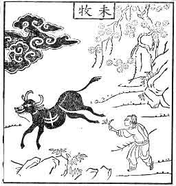
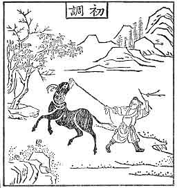
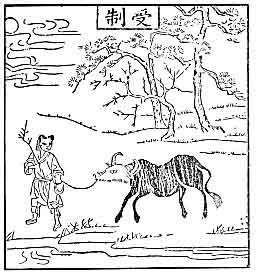
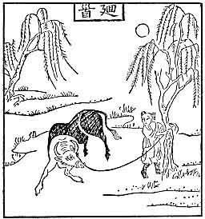
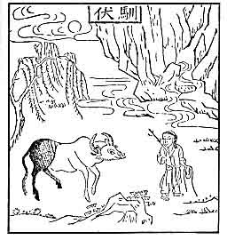
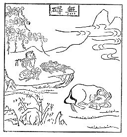
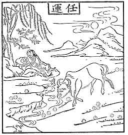
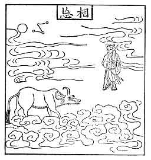
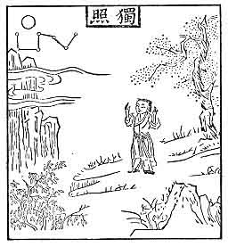
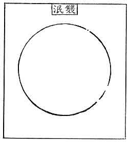

  
[Intangible Textual Heritage](../../index)  [Buddhism](../index.md) 
[Index](index)  [Next](mzb00.md) 

------------------------------------------------------------------------

# The Ten Oxherding Pictures

## From The Manual of Zen Buddhism, D.T. Suzuki

### By Shubun (15th Century)

 

#### 1. Undisciplined

With his horns fiercely projected in the air the beast snorts,  
Madly running over the mountain paths, farther and farther he goes
astray!  
A dark cloud is spread across the entrance of the valley,  
And who knows how much of the fine fresh herb is trampled under his wild
hoofs!

 

#### 2. Discipline Begun

I am in possession of a straw rope, and I pass it through his nose,  
For once he makes a frantic attempt to run away, but he is severely
whipped and whipped;  
The beast resists the training with all the power there is in a nature
wild and ungoverned,  
But the rustic oxherd never relaxes his pulling tether and ever-ready
whip.

 

#### 3. In Harness

Gradually getting into harness the beast is now content to be led by the
nose,  
Crossing the stream, walking along the mountain path, he follows every
step of the leader;  
The leader holds the rope tightly in his hand never letting it go,  
All day long he is on the alert almost unconscious of what fatigue is.

 

#### 4. Faced Round

After long days of training the result begins to tell and the beast is
faced round,  
A nature so wild and ungoverned is finally broken, he has become
gentler;  
But the tender has not yet given him his full confidence,  
He still keeps his straw rope with which the ox is now tied to a tree.

 

#### 5. Tamed

Under the green willow tree and by the ancient mountain stream,  
The ox is set at liberty to pursue his own pleasures;  
At the eventide when a grey mist descends on the pasture,  
The boy wends his homeward way with the animal quietly following.

 

#### 6. Unimpeded

On the verdant field the beast contentedly lies idling his time away,  
No whip is needed now, nor any kind of restraint;  
The boy too sits leisurely under the pine tree,  
Playing a tune of peace, overflowing with joy.

 

#### 7. Laissez Faire

The spring stream in the evening sun flows languidly along the
willow-lined bank,  
In the hazy atmosphere the meadow grass is seen growing thick;  
When hungry he grazes, when thirsty he quaffs, as time sweetly slides,  
While the boy on the rock dozes for hours not noticing anything that
goes on about him.

 

#### 8. All Forgotten

The beast all in white now is surrounded by the white clouds,  
The man is perfectly at his ease and care-free, so is his companion;  
The white clouds penetrated by the moon-light cast their white shadows
below,  
The white clouds and the bright moon-light-each following its course of
movement.

 

#### 9. The Solitary Moon

Nowhere is the beast, and the oxherd is master of his time,  
He is a solitary cloud wafting lightly along the mountain peaks;  
Clapping his hands he sings joyfully in the moon-light,  
But remember a last wall is still left barring his homeward walk.

 

#### 10. Both Vanished

Both the man and the animal have disappeared, no traces are left,  
The bright moon-light is empty and shadowless with all the ten-thousand
objects in it;  
If anyone should ask the meaning of this,  
Behold the lilies of the field and its fresh sweet-scented verdure.

------------------------------------------------------------------------

[Next: Introduction](mzb00.md)
