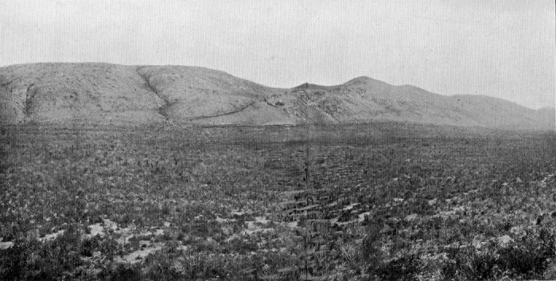

  
[Intangible Textual Heritage](../../index)  [Buddhism](../index) 
[Index](index)  [Previous](pos06)  [Next](pos08) 

------------------------------------------------------------------------

## CANTO II PSALMS OF TWO VERSES

### XIX Abhirūpa-Nandā.

BORN in the time of the Buddha Vipassi, in
his native town of Bandhumatī, as the daughter of a wealthy burgess, she
became a pious lay-adherent, and at the Master's death she made an
offering to the shrine of his ashes of a golden umbrella
[117](pos07.htm#22-1) surrounded with jewels. Reborn for this
in various heavens, she was, in this Buddha-dispensation, reborn at
Kapilavatthu as the daughter of the chief wife of Khemaka, the Sākiyan,
and named Nandā. But because of her excessive beauty, charm, and
loveliness, she was known as Nandā the Fair.

Now, on the day when she was to choose among her
suitors,[118](pos07.htm#22-2) Carabhūta, her young Sākiyan
kinsman, died. Then her parents made her leave the world against her
will. But she, even after she had entered the Order, was infatuated with
her own beauty, and, fearing the Master's rebuke, avoided his presence.
Now the Exalted One knew that she was ripe for knowledge, and directed
the Great Pajājatī to let all the Bhikkhunīs come to him for
instruction. Nandā sent another in her place. And the Exalted One said,
'Let no one come by proxy.' So she was compelled to come. And the
Exalted One, by his mystic power, conjured up a beautiful woman, and
showed her becoming aged and fading, causing anguish to arise in Nandā.
And he addressed her in these words:

<table data-align="center">
<colgroup>
<col style="width: 100%" />
</colgroup>
<tbody>
<tr class="odd">
<td><strong></strong>

Behold, Nandā, the foul compound, diseased, 
Impure! Compel thy heart to contemplate 
What is not fair to view. So steel thyself 
And concentrate the well-composèd mind. (19) 
That ponder where no Threefold Sign <a href="pos07.htm#23-1">119</a> is seen. 
Cast out the baneful bias of conceit. 
Hath the mind mastered vain imaginings, <a href="pos07.htm#23-2">120</a> 
Then mayst thou go thy ways, calm and serene. (20)
</td>
</tr>
</tbody>
</table>

And when he had finished speaking, she attained Arahantship. Repeating
to herself the verses, she made them the announcement of her AÑÑĀ.

------------------------------------------------------------------------

> 117 Or tee, surmounting the cupola. Vipassi was the first
> of the seven Buddhas of the Pitakas.

> 118 I read *vāreyyadivase* (*cf.* p. 276, verse 464), which
> makes sense anyway. It would appear that Carabhūta (pronounced Chără-)
> would have been the object of her choice.

> 119 *Animittaŋ*, ideals not depending on what is
> impermanent, or on what makes for sorrow, or on the presence of a
> persisting soul-entity (Rhys Davids, *Yogāvacara's Manual*, xxvii.,
> xxviii.).

> 120 *Māna*, conceit, pride, vanity, one of the seven forms
> of bias. *Majjh. Nik.*, i. 109, 110; *Vibh.*, 340. Translator's
> *Buddh. Psy.*, 298, *n.* 3.

------------------------------------------------------------------------

### XX Jentī (or Jentā).

The story of her past and present is like that of Nandā the Fair; but it
was at Vesālī, in the princely family of the Licchavis, that she was
reborn. [121](pos07.htm#23-3) There is this further
difference: she attained Arahantship after hearing the Master preach the
Dhamma, and it was when reflecting on the change that had come over her
that she, in joy, uttered these verses:

<table data-align="center">
<colgroup>
<col style="width: 100%" />
</colgroup>
<tbody>
<tr class="odd">
<td><strong></strong>

The Seven Factors of the awakened mind <a href="pos07.htm#24-1">122</a>– 
Seven ways whereby we may Nibbana win– 
All, all have I developed and made ripe, 
Even according to the Buddha's word. (21) 
For I therein have seen as with mine eyes 
The Bless'd, the Exalted One.<a href="pos07.htm#24-2">123</a> Last of all lives 
Is this that makes up Me. The round of births 
Is vanquishèd–Ne'er shall I be again! (22)
</td>
</tr>
</tbody>
</table>

------------------------------------------------------------------------

> 121 *Cf.* Rhys Davids, *Buddhist India*, 25, 40.

> 122 The Bojjhangas or Sambojjhangas; lit., parts or limbs
> of Bodhi. They were mindfulness, research in the Dhamma, energy, joy,
> serenity, concentration, equanimity (*B. Psy.*, 84, *n.* 2. *Cf.* [Ps.
> xxxi.](pos08.htm#XXXI)).

> 123 'For inasmuch as the Exalted One is the very Body of
> the Norm, to discern the Ariyan Dhamma which is His is to see Him. The
> Buddhas and other Ariyans are said to be seen, not only by the sight
> of their visible shape, but also by insight into the Ariyan Dhamma,
> according as He said: "Verily, Vakkhali, he that seeth the Norm, he
> seeth me"' (*Saŋyutta Nikāya*, iii., p. 120). '"The Ariyan disciple
> who hears, brethren, is one who sees the Ariyans"' (Commentary).

------------------------------------------------------------------------

### XXI Sumangala's Mother.

She, too, having made her resolve under former Buddhas, and heaping up
good in this rebirth and that, was born under this Buddha-dispensation
in a poor family at Sāvatthī, and was married to a rush-plaiter. Her
firstborn was a son, come for the last time to birth, who grew up to
become the Elder Sumangala and an
Arahant.[124](pos07.htm#24-3) And her name not becoming
known, she was called in the Pali text a certain unknown Therī, and is
known as Sumangala's mother. She became a Bhikkhunī, and one day, while
reflecting on all she had suffered as a laywoman, she was much affected,
and, her insight quickening, she attained Arahantship, with thorough
knowledge of the form and meaning of the Dhamma. Thereupon she
exclaimed:

O woman well set free! how free am I,
[125](pos07.htm#25-1)  
How throughly free from kitchen drudgery!  
Me stained and squalid 'mong my cooking-pots  
My brutal husband ranked as even less  
Than the sunshades he sits and weaves
alway.[126](pos07.htm#25-2) (23)  
  
Purged now of all my former lust and hate,  
I dwell, musing at ease beneath the shade  
Of spreading boughs–O, but 'tis well with me! (24)

------------------------------------------------------------------------

> 124 This is the Elder Sumangala, who in his verse
> (*Theragāthā*, 43) celebrates his release from three 'crooked things'
> (*supra*, [Ps. xi.](pos06.htm#XI))–rom sickle, plough, and spade.

> 125 Expressed in the text by the representative drudgery of
> the 'mortar' (*musala*).

> 126 In the Pali the first two lines depart from the *śloka*
> metre, being apparently a curious variety of some metre I cannot
> identify. See [Introduction.](pos04.htm#INTRODUCTION) The last two
> lines revert to the *śloka*, *sukhato* being an obvious gloss. Quite
> literally, the quaint and elliptical passage runs: 'The shameless one
> me "sunshade" only,' which the Commentary explains as 'My husband
> calls me not even an umbrella which he makes for his livelihood.'
> There seems nothing in verses or Commentary to justify Dr. Neumann's
> inference that her husband lived on her adulterous earnings. Toil has
> spoilt her looks, and he takes no further pleasure in them.

------------------------------------------------------------------------

### XXII Aḍḍhakāsī.

Born of a respectable family, in the time of Kassapa Buddha, she won
understanding, and became a Bhikkhunī, established in the precepts. But
she reviled an Arahant Elder Sister by calling her a
prostitute,[127](pos07.htm#25-3) and for this she went to
purgatory. In this Buddha-dispensation she was reborn in the kingdom of
Kāsī as the child of a distinguished and prosperous citizen. But because
of the persistent effect of her former evil speech, she became herself a
prostitute. How she left the world and was ordained by special messenger
is related in the Culla Vagga. [128](pos07.htm#26-1) For she
wished to go to Sāvatthī to be ordained by the Exalted One. But the
libertines of Benares barred the ways, so she sent and asked the Exalted
One's advice, and he permitted her to be ordained by a messenger. Then
she, working at insight, not long after obtained Arahantship, with
thorough knowledge of the Dhamma in form and meaning. Thereupon she
exclaimed:

<table data-align="center">
<colgroup>
<col style="width: 100%" />
</colgroup>
<tbody>
<tr class="odd">
<td><strong></strong>

No less my fee was than the Kāsī realm 
Paid in revènue–this was based on that, 
Value for value,–so the sheriff fixed. (25) 
 
But irksome now is all my loveliness; 
I weary of it, disillusionized. 
Ne'er would I more, again and yet again, 
Run on the round of rebirth and of death! 
Now real and true for me the Triple Lore.<a href="pos07.htm#26-2">129</a> 
Accomplished is the bidding of the Lord. (26)
</td>
</tr>
</tbody>
</table>

------------------------------------------------------------------------

> 127 *Cf.* [Ps. lxvi.](pos18.htm#LXVI)

> 128 *Vinaya Texts* (*S.B.E.* xx.), iii., p. 360.
> (Pronounced 'Chul'la.') Benares was the capital of Kāsī. On the name
> Aḍḍha Kāsī (lit., half-Kāsī), see *op. cit.*, ii. 195, *n.* 2.

> 129 *Tisso vijjā*. The Brahmanic phrase, *tevijjo*, often
> recurring below –*e.g.*, [Ps. xxxvii](pos09.htm#XXXVII).–and
> signifying 'versed in the three Vedas,' was, according to
> *Anguttara-Nikāya*, i. 163-5, adopted by the Buddha and applied to the
> three attainments of *paññā*, entitled reminiscence of former births,
> the Heavenly Eye, and the destruction of the Asavas.

------------------------------------------------------------------------

### XXIII Cittā.

She, too, having made her resolve under former Buddhas, and heaping up
good of age-enduring efficacy in this rebirth and that, was born in the
94th æon [130](pos07.htm#27-1) as a fairy. She worshipped
with offering of flowers a Silent (Pacceka) Buddha.
[131](pos07.htm#27-2) And after many other births among men
and gods, she was, in this Buddha-dispensation, born at Rājagaha in the
family of a leading burgess. When she had come to years of discretion
she heard the Master teaching at the gate of Rājagaha, and, becoming a
believer, she was ordained by the Great Pajāpatī the Gotamid. And at
length, in her old age, when she had climbed the Vulture's Peak, and had
done the exercises of a recluse, her insight expanded, and she won to
Arahantship. Reflecting thereon, she gave utterance as follows:

<table data-align="center">
<colgroup>
<col style="width: 100%" />
</colgroup>
<tbody>
<tr class="odd">
<td><strong></strong>

Though I be suffering and weak, and all 
My youthful spring be gone, yet have I climbed, 
Leaning upon my staff, the mountain crest. (27) 
Thrown from my shoulder hangs my cloak, o'erturned 
My little bowl. So 'gainst the rock I lean 
And prop this self of me, and break away 
The wildering gloom that long had closed me in. (28)
</td>
</tr>
</tbody>
</table>

------------------------------------------------------------------------

> 130 *I.e.*, before this present age.

> 131 *Cf.* [Ps. iii.](pos06.htm#III)

------------------------------------------------------------------------

### XXIV Mettikā.

Heaping up merit under former Buddhas, she was born during the time of
Siddhattha, [132](pos07.htm#28-1) the Exalted One, in a
burgess's family, and worshipped at his shrine by offering there a
jewelled girdle. After many births in heaven and on earth, through the
merit thereof, she became, in this Buddha-dispensation, the child of an
eminent brahmin at Rājagaha. In other respects her case is like the
preceding one, save that it was another hill corresponding to Vulture's
Peak up which she climbed. [133](pos07.htm#28-2)

She, too, reflecting on what she had won, said in exultation:

<table data-align="center">
<colgroup>
<col style="width: 100%" />
</colgroup>
<tbody>
<tr class="odd">
<td><strong></strong>

Though I be suffering and weak, and all 
My youthful spring be gone, yet have I come, 
Leaning upon my staff, and clomb aloft 
The mountain peak. (29) 
             My cloak thrown off, 
My little bowl o'erturned: so sit I here 
Upon the rock. And o'er my spirit sweeps 
The breath <a href="pos07.htm#28-3">134</a> of Liberty! I win, I win 
The Triple Lore! The Buddha's will is done!(30)
</td>
</tr>
</tbody>
</table>

------------------------------------------------------------------------

> 132 One of the (later elaborated) twenty-four Buddhas.

> 133 Rājgir (the ancient burg) is surrounded by some seven
> hills. See Cunningham's *Archæological Survey*, iii., Pl. xli.

> 134 Lit., 'Now is my heart (or mind) set free!' For lovers
> of the mountain, the 'great air' and the sense of spiritual freedom
> will be tightly bound up. The age of the two climbers throws into
> relief the arduousness of their spiritual ascent.

------------------------------------------------------------------------

  
THE GIJJHAKŪṬI (VULTURE PEAK) RANGE ABOVE OLD RĀJAGAHA.  
To face p. 28.

### XXV Mittā.[135](pos07.htm#29-1)

Born in the time of Vipassi Buddha of a noble family, and become a lady
of his father's court, she won meritorious karma by bestowing food and
precious raiment on an Arahant Elder Sister.
[136](pos07.htm#29-2) Born finally, in this
Buddha-dispensation, in the princely family of the Sākiyas, at
Kapilavatthu, she left the world together with Great Pajāpatī the
Gotamid, and, going through the requisite training for insight, not long
after won Arahantship.

Reflecting thereon, joy and gladness stirred her to say:

<table data-align="center">
<colgroup>
<col style="width: 100%" />
</colgroup>
<tbody>
<tr class="odd">
<td><strong></strong>

On full-moon day and on the fifteenth day, 
And eke the eighth of either half the month, 
I kept the feast; I kept the precepts eight, 
The extra fasts, <a href="pos07.htm#29-3">137</a> enamoured of the gods, 
And fain to dwell in homes celestial. (31) 
 
To-day one meal, head shaved, a yellow robe– 
Enough for me. I want no heaven of gods. 
Heart's pain, heart's pining, have I trained away. (32)
</td>
</tr>
</tbody>
</table>

------------------------------------------------------------------------

> 135 Mettā in the Commentary. Mittā=amica. *Cf.* [Ps.
> viii.](pos06.htm#VIII) Both Mittā and Mettikā ([Ps.
> xxiv.](pos07.htm#XXIV)) may be patronymics, derived ultimately from
> Mitra (Mithra), the Vedic propitious, friendly Day or Sun god.

> 136 In the Apadāna it is 'a *religieux*' of no specified
> Order.

> 137 See Rhys Davids, Buddhism, 139-141.

------------------------------------------------------------------------

### XXVI Abhayā's Mother.

Heaping up merit under former Buddhas, she, in the time of Tissa
Buddha,[138](pos07.htm#30-1) saw him going round for alms,
and with glad heart took his bowl and placed in it a spoonful of food.
Reborn for that among gods and among men, she was born also for that, in
this Buddha-dispensation, and became the town belle of Ujjenī, by name
Padumavatī.[139](pos07.htm#30-2) And King Bimbisāra (of
Magadha) heard of her, and expressed to his chaplain the wish to see
her. By the power of his spells, the chaplain summoned a Yakkha who, by
his might, brought the King to Ujjenī. And when she afterwards sent word
to the King that she was with child by him, he sent back word, saying:
'If it be a son, let me see him when he is grown.' And she bore a son
and called him Abhaya. When he was seven years old she told him who was
his father, and sent him to Bimbisāra. The King loved the boy, and let
him grow up with the boys of his court. His conversion and ordination is
told in the Psalms of the Elders.[140](pos07.htm#30-3) And,
later on, his mother heard her son preach the Dhamma, and she, too, left
the world and afterwards attained Arahantship, with thorough grasp of
the Dhamma in form and meaning. She thereupon recalled and repeated the
verse wherewith her son had admonished her, and added her own thereto:

'Upward from sole of foot, O mother dear,  
Downward from crown of hair this body see.  
Is't not impure, the evil-smelling thing?' (33)  
This have I pondered. meditating still,  
Till every throb of lust is rooted out.  
Expunged is all the fever of desire.  
Cool am I now and calm–Nibbana's peace. (34)

------------------------------------------------------------------------

> 138 One of the twenty-four.

> 139 *I.e.*, she of the Lotus

> 140 Abhaya's verses (*Th*., 26, 98) do not refer to his
> mother.

------------------------------------------------------------------------

### XXVII Abhayā.[141](pos07.htm#31-1)

She, too, having made her resolve under former Buddhas, and heaping up
merit of age-enduring efficacy in this and that state of becoming, was,
in the time of Sikhi Buddha,[142](pos07.htm#31-2) reborn in a
great noble's family, and became the chief queen of his father Aruṇa.
And one day she worshipped the Exalted One with offering of red lotuses
given her by the King, when Sikhi Buddha, at alms-time, entered the
palace. Reborn for this among gods and men, she was, in this
Buddha-dispensation, born once more at Ujjenī in a respectable family,
and became the playmate of Abhaya's mother. And when the latter had left
the world, Abhayā, for love of her, also took orders. Dwelling with her
at Rājagaha, she went one day to Cool-Grove to contemplate on a basis of
some foul thing.[143](pos07.htm#31-3) The Master, seated in
his Fragrant Chamber, caused her to see before her the kind of object
she had been directed to choose. Seeing the vision, dread seized her.
Then the Master, sending forth glory, appeared as if seated before her,
and said:

<table data-align="center">
<colgroup>
<col style="width: 100%" />
</colgroup>
<tbody>
<tr class="odd">
<td><strong></strong>

Brittle, O Abhayā, the body is, 
Whereto the worldling's happiness is bound. 
For me I shall lay down this mortal frame, 
Mindful and self-possessed in all I do. (35) 
For all my heart was in the work whereby 
I struggled free from all that breedeth Ill. 
Craving have I destroyed, and brought to pass 
That which the Buddhas have revealed to men.<a href="pos07.htm#32-1">144</a> (36)
</td>
</tr>
</tbody>
</table>

And when he had finished speaking she attained Arahantship. Exulting
herein, she turned the verses round into an address to herself.

------------------------------------------------------------------------

> 141 Fearless.

> 142 Second of the Seven Buddhas.

> 143 *B. Psy.*, p. 69. The 'foul things' were corpses or
> human bones, such as might be seen in any charnel field, where the
> dead were exposed and not cremated. I have before me a photograph of a
> Ceylonese bhikkhu seated in the cleft of a rock contemplating two
> skulls and other bones lying before him–a modern snapshot of a scene
> that might be 2,500 years old instead of 250 days.

> 144 Lit. (as in many other verses), 'done is the will, or
> rather the system or teaching (*sāsanaŋ*) of the Buddha.' Verses
> [36](pos07.htm#36), [38](pos07.htm#38), and [41](pos08.htm#41) (except
> the last two lines) are in the text identical, though varied in
> translation.

------------------------------------------------------------------------

### XXVIII Sāmā.

She, too, having made her resolve under former Buddhas, and heaping up
good of age-enduring efficacy in this and that state of becoming, being
reborn in fortunate conditions, took birth, in this Buddha-dispensation,
at Kosambī, in the family of an eminent burgess. When her dear friend,
the lay-disciple Sāmāvatī, died, she, in her distress, left the world.
But being unable to subdue her grief for her friend, she was unable to
grasp the Ariyan Way. Now, while she was seated in the sitting-room,
listening to Elder Ānanda preaching, she was established in insight,
and, on the seventh day after, attained Arahantship, with thorough grasp
of the Dhamma in form and meaning.

And reflecting on what she had won, she expressed it in this psalm:

<table data-align="center">
<colgroup>
<col style="width: 100%" />
</colgroup>
<tbody>
<tr class="odd">
<td><strong></strong>

Four times, nay, five, I sallied from my cell, 
And roamed afield to find the peace of mind 
I sought in vain, and governance of thoughts 
I could not bring into captivity. <a href="pos07.htm#32-2">145</a> (37) 
To me, even to me, on that eighth day 
It came: all craving ousted from my heart. 
'Mid many sore afflictions, I had wrought 
With passionate endeavour, and had won! 
Craving was dead, and the Lord's will was done. (38)
</td>
</tr>
</tbody>
</table>

------------------------------------------------------------------------

> 145 *Cf.* 2 Cor. x. 5.

------------------------------------------------------------------------

[Next: Canto III. Psalms of Three Verses](pos08)
