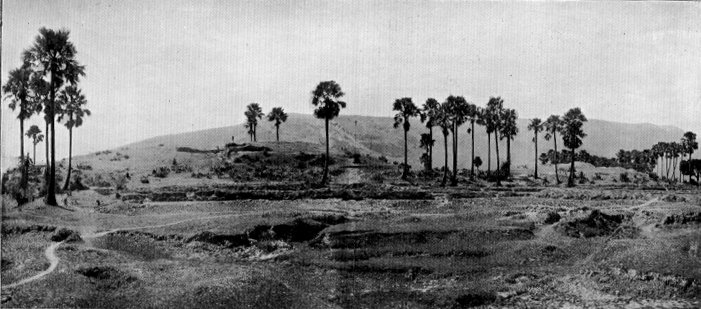

  
[Intangible Textual Heritage](../../index)  [Buddhism](../index.md) 
[Index](index)  [Previous](pos07)  [Next](pos09.md) 

------------------------------------------------------------------------

## CANTO III PSALMS OF THREE VERSES

### XXIX Another Sāmā.

SHE also, heaping up good like the foregoing,
was born, in the time of Vipassi Buddha, as a fairy on the banks of the
River Candabhāgā.[146](pos08.htm#34-1.md) Devoted to fairy
pastimes, she saw one day the Master walking on the bank, that he might
sow the good seed among creatures. And with great glee she worshipped,
offering flowers.[147](pos08.htm#34-2.md) For this she gained
rebirth among gods and men, till, in this Buddha-dispensation, she took
birth in a clansman's family at Kosambī. She too became the friend of
Sāmāvatī, and she too, out of grief at the death of the latter, entered
the Order. She too could not gain self-mastery for twenty-five years,
till in her old age she heard a timely sermon, through which her insight
expanded and she won Arahantship, with thorough grasp of the Dhamma in
form and meaning. Thereon reflecting, she broke forth:

<table data-align="center">
<colgroup>
<col style="width: 100%" />
</colgroup>
<tbody>
<tr class="odd">
<td><strong></strong>

Full five-and-twenty years since I came forth! 
But in my troubled heart in no way yet 
Could I discern the calm of victory. (39) 
The peace of mind, the governance of thoughts 
Long sought, I found not; and with anguish thrilled 
I dwelt in memory on the Conqueror's word.<a href="pos08.htm#35-1">148</a> (40) 
To free my path from all that breedeth Ill 
I strove with passionate ardour, and I won! 
Craving is dead, and the Lord's will is done. 
To-day is now the seventh day since first 
Was withered up within that ancient Thirst. (41)
</td>
</tr>
</tbody>
</table>

------------------------------------------------------------------------

> 146 *Cf*. [Ps. iii.](pos06.htm#III.md) and
> [xxiii.](pos07.htm#XXIII.md)

> 147 *Salaḷa-pupphāni*, possibly shoots of the Indian pine
> (*sarala*).

> 148 The Commentary holds that, by 'word' or teaching
> (*sāsana*) here were meant passages of doctrine declaring how rare was
> the opportunity, and brief, of birth as a human, when Nibbana might be
> won, illustrated by similes like that of the blind tortoise (*Majjh*.,
> iii. 169; *infra*, 500)

------------------------------------------------------------------------

### XXX Uttamā.

She, too, heaping up good under former Buddhas, was in the time of
Vipassi Buddha, born at Bandhumatī, in the house of a certain wealthy
landowner, and became a domestic servant. Grown up, she tended her
master's household. Now, at that time, King Bandhumā (Vipassi's father),
having restored Sabbath-keeping, gave gifts before dining and, after
dining, attended a sermon; and the people, following his pious example,
and keeping Sabbath, the slave thought: 'Why should not I, too, do as
they all are doing?' And for the thoroughness of her observance of the
feasts she was reborn among the Three-and-Thirty gods, and in other
happy realms, and finally, in this Buddha-era, in the house of the
Treasurer of Sāvatthī. Come to years of discretion, she heard Paṭācārā
preach, and entered the Order; but she was unable to attain the climax
of insight till Paṭācārā,[149](pos08.htm#35-2.md) seeing the
state of her mind, gave her admonition. Thereby established, she won
Arahantship, with thorough grasp of the Norm in form and in meaning. And
reflecting thereon, she exulted thus:

<table data-align="center">
<colgroup>
<col style="width: 100%" />
</colgroup>
<tbody>
<tr class="odd">
<td><strong></strong>

Four times, nay, five, I sallied from my cell, 
And roamed afield to find the peace of mind 
Long vainly sought, and governance of thoughts 
I could not bring into captivity. (42) 
To me she came, that noble Bhikkhunī, 
Who was my foster-mother in the faith– 
She taught to me the Norm, wherein I learnt 
The nature of this transitory self.<a href="pos08.htm#36-1">150</a>(43) 
And well I minded all, e'en as she taught. 
For seven days I sat in Jhāna-joy 
And ease, cross-legged; on the eighth day at last 
I stretched my limbs, and went my way serene, 
For I had burst asunder the surrounding gloom. (44)
</td>
</tr>
</tbody>
</table>

Now, this was the affirmation of her AÑÑĀ.

------------------------------------------------------------------------

> 149 See below, [xlvii.](pos10.htm#XLVII.md),
> [li](pos11.htm#LI.md).

> 150 Lit., the Khandhas, the nature of sense-perception and
> the elements of my being. *Cf.* [Ps. xxxviii.](pos10.htm#XXXVIII.md) for
> a more literal translation.

------------------------------------------------------------------------

### XXXI Another Uttamā.

She, too, having made her resolve under former Buddhas, and heaping up
good of age-enduring efficacy in this and that rebirth, was born, in the
time of Vipassi Buddha, as a domestic servant, at Bandhumatī. One day,
seeing an Arahant of the Master's Order seeking alms, she gladly offered
him three sweet cakes. Through this reborn to happiness, she finally
came to birth, in this Buddha-era, in the family of an eminent brahmin
in the country of Kosala. Come to years of discretion, she heard the
Master preach while touring in the country, and leaving the world, she
soon won Arahantship, together with thorough grasp of the Norm in form
and in meaning. And reflecting thereon, she exulted thus:

<table data-align="center">
<colgroup>
<col style="width: 100%" />
</colgroup>
<tbody>
<tr class="odd">
<td><strong></strong>

The Seven Factors of the Awakened mind–<a href="pos08.htm#37-1">151</a> 
Seven Ways whereby we may Nibbana win– 
All, all have I developed and made ripe, 
Even according to the Buddha's word. (45) 
Fulfilled is heart's desire: I win the Void, 
I win the Signless!<a href="pos08.htm#37-2">152</a> Buddha's daughter I, 
Born of his mouth, his blessed word, I stand, 
Transported with Nibbana's bliss alway. (46) 
And all the sense-desires that fetter gods, 
That hinder men, are wholly riven off. 
Abolished is the infinite round of births. 
Becoming cometh ne'er again for me. (47)
</td>
</tr>
</tbody>
</table>

------------------------------------------------------------------------

> 151 See [Ps. xx.](pos07.htm#XX.md)

> 152 'Void,, *i.e.*, I am empty of greed, ill-will, and
> dulness, the three springs of all evil. 'Signless,' *i.e.*, I am free
> from all attachment to anything 'marked' as impermanent, evil, or
> having a soul. See [Ps. xix.](pos07.htm#XIX.md), ver. 20, *n.* 1.

------------------------------------------------------------------------

### XXXII Dantikā.

She, too, having made her resolve under former Buddhas, and in this and
that rebirth heaping up good of age-enduring efficacy, was born, when
the world was empty of a Buddha, as a fairy by the River
Candabhāgā.[153](pos08.htm#37-3.md) Sporting one day with the
fairies, and straying awhile, she saw a silent Buddha seated at the foot
of a tree, and adored him in faith with flower-offerings. For this she
was reborn among gods and men, and, finally, in this Buddha-era, at
Sāvatthī, in the house of the King's chaplain-brahmin. Come to years of
discretion, she became a lay-believer in the Jeta Grove \[College\],
and, later, entered the Order under Great Pajāpatī the Gotamid. And one
day, while staying at Rājagaha, she ascended the Vulture's Peak, after
her meal, and while resting, she saw that which she tells of in her
verse, whereby she won Arahantship, with thorough grasp of the Norm in
form and in meaning. And afterwards, thrilled with happiness at the
thought of her attainment, she exulted thus:

<table data-align="center">
<colgroup>
<col style="width: 100%" />
</colgroup>
<tbody>
<tr class="odd">
<td><strong></strong>

Coming from noonday-rest on Vulture's Peak, 
I saw an elephant, his bathe performed, 
Forth from the river issue. And a man, (48) 
Taking his goad, bade the great creature <a href="pos08.htm#38-1">154</a> stretch 
His foot: 'Give me thy foot!' The elephant 
Obeyed, and to his neck the driver sprang. (49) 
I saw the untamed tamed, <a href="pos08.htm#38-2">155</a> I saw him bent 
To master's will; and marking inwardly, 
I passed into the forest depths and there 
I' faith I trained and ordered all my heart. (50)
</td>
</tr>
</tbody>
</table>

------------------------------------------------------------------------

> 153 See Pss. [iii.](pos06.htm#III.md),
> [xxiii.](pos07.htm#XXIII.md)

> 154 *Nāga*, a more poetic term for elephant.

> 155 Dantikā=little tamed (woman).

------------------------------------------------------------------------

### XXXIII Ubbirī.

She too, having made her resolve in the time of former Buddhas, and
heaping up, in this and that rebirth, Good valid for an æon of
evolution, was born, in the time of Padumuttara Buddha, at the town of
Haŋsavatī in a clansman's house. Come to years of discretion, she was
left alone one day, her parents being engaged with a party in the inner
court of the house. And seeing an Arahant approaching the house-door,
she bade him 'Come in hither, lord,' and did him homage, showing him to
a seat; she then took his bowl and filled it with food. The Elder
thanked her, and departed. But she, reborn therefore in the heaven of
the Three-and-Thirty gods, enjoying there a heavenly time and many a
happy life thereafter, was, in this Buddha-era, reborn at Sāvatthī in
the family of a very eminent burgess. And she was beautiful to see, and
was brought into the house of the King of Kosala
himself.[156](pos08.htm#39-1.md) After a few years a daughter
was born to her, whom she named Jīvā.[157](pos08.htm#39-2.md)
The King saw the child, and was so pleased that he had Ubbirī anointed
as Queen. But anon the little girl died, and the mother went daily
mourning to the charnel-field. And one day she went and worshipped the
Master, and sat down; but soon she left, and stood lamenting by the
River Achiravatī. Then the Master, seeing her from afar, revealed
himself, and asked her: 'Why dost thou weep?' 'I weep because of my
daughter, Exalted One.' 'Burnt in this cemetery are some 84,000
[158](pos08.htm#39-3.md) of thy daughters. For which of them
dost thou weep?' And pointing out the place where this one and that one
had been laid, he said half the psalm:

<table data-align="center">
<colgroup>
<col style="width: 100%" />
</colgroup>
<tbody>
<tr class="odd">
<td><strong></strong>

O Ubbirī, who wailest in the wood, 
Crying 'O Jīvā! O my daughter dear!' 
Come to thyself! Lo, in this burying-ground 
Are burnt full many a thousand daughters dear, 
And all of them were named like unto her. 
Now which of all those Jīvās dost thou mourn? (51)
</td>
</tr>
</tbody>
</table>

And she pondered with intelligence on the Norm thus taught by the
Master, and so stirred up insight that, by the charm of his teaching and
her own attainment of the requisite conditions, she reached the topmost
fruit, even Arahantship.[159](pos08.htm#40-1.md) And showing
forth the high distinction she had won, she spoke the second half of the
psalm:

<table data-align="center">
<colgroup>
<col style="width: 100%" />
</colgroup>
<tbody>
<tr class="odd">
<td><strong></strong>

Lo! from my heart the hidden shaft is gone! 
The shaft that nestled there hath he removed. 
And that consuming grief for my dead child 
Which poisoned all the life of me is dead. (52) 
To-day my heart is healed, my yearning stayed, 
And all within is purity and peace. <a href="pos08.htm#40-2">160</a> 
Lo! I for refuge to the Buddha go– 
The only wise–the Order and the Norm. <a href="pos08.htm#40-3">161</a> (53)
</td>
</tr>
</tbody>
</table>

------------------------------------------------------------------------

> 156 The King contemporary with Gotama Buddha was Pasenădĭ.

> 157 Meaning Psyche, or, more literally, 'alive,' 'Viva.'

> 158 A staple figure used when any great number is meant. Of
> course, the circumstances of infinitely numerous previous lives of
> Ubbirī are here implied.

> 159 She not only reaches it as a lay-woman, but her
> subsequent entry into the Order is not even mentioned.

> 160 A free rendering of the one word *parinibbutā*. *Cf.*
> ver. [132.](pos11.htm#132.md)

> 161 The orthodox sequence is Norm, Order, here inverted
> *metri causâ*. The inversion is actually met with in later Buddhism.

------------------------------------------------------------------------

### XXXIV Sukkā.

She, too, having fared in the past as the foregoing Sisters, was born in
a clansman's house. [162](pos08.htm#40-4.md) Come to years of
discretion, she went with lay-women disciples to the Vihāra,
[163](pos08.htm#40-5.md) and heard the Master preach. Becoming a
believer, she left the world and became learned, proficient in the
doctrine, and a ready speaker. Leading for centuries a religious life,
[164](pos08.htm#41-1.md) she yet died a worldling at heart, and
was reborn in the heaven of bliss.[165](pos08.htm#41-2.md)
Again, when Vipassi was Buddha, and again when Vessabhu was Buddha, she
kept the precepts, and was learned and proficient in doctrine. Again,
when Kakusandha was Buddha, and yet again when Konāgamana was Buddha,
she took Orders, and was pure in conduct, learnèd, and a preacher. At
length, she was, in this Buddha-era, reborn at Rājagaha, in the family
of an eminent burgess, and called Sukkā (bright, lustrous, 'Lucy'). Come
to years of discretion, she found faith in the Master at her own home,
and became a lay-disciple. But later, when she heard Dhammadinnā
preach,[166](pos08.htm#41-3.md) she was thrilled with emotion,
and renounced the world under her. And performing the exercises for
insight, she not long after attained Arahantship, together with thorough
grasp of the Norm in form and in meaning.

Thereupon, attended by 500 Bhikkhunīs, she became a great preacher. And
one day, when they had been into Rājagaha for alms, and had returned and
dined, they entered the Bhikkhunīs' settlement, and Sukkā, with a great
company seated around her, taught the doctrine in such wise that she
seemed to be giving them sweet mead to drink and sprinkling them with
ambrosia. And they all listened to her rapt, motionless, intent.
Thereupon the spirit[167](pos08.htm#41-4.md) of the tree that
stood at the end of the Sisters' terrace was inspired by her teaching,
and went out to Rājagaha, walking about the ways and the squares
proclaiming her excellence, and saying:

<table data-align="center">
<colgroup>
<col style="width: 100%" />
</colgroup>
<tbody>
<tr class="odd">
<td><strong></strong>

What would ye men of Rājagaha have? 
What have ye done? that mute and idle here 
Ye lie about, as if bemused with wine, 
Nor wait upon Sukkā, while she reveals 
The precious gospel by the Buddha taught. (54) 
The wise in heart, methinks, were fain to quaff 
That life's elixir, once won never lost, 
That welleth ever up in her sweet words, 
E'en as the wayfarer welcomes the rain. (55)
</td>
</tr>
</tbody>
</table>

And hearing what the tree-spirit said, the people were excited, and came
to the Sister and listened attentively.

At a later period, when the Sister, at the end of her life, was
completing her Nibbana, and wished to show how the system she had taught
led to salvation, she declared her AÑÑĀ thus:

<table data-align="center">
<colgroup>
<col style="width: 100%" />
</colgroup>
<tbody>
<tr class="odd">
<td><strong></strong>

O Child of light!<a href="pos08.htm#42-1">168</a> by light of truth set free 
From cravings dire, firm, self-possessed, serene, 
Bear to this end thy last incarnate frame, 
For thou hast conquered Mara and his host. (56)
</td>
</tr>
</tbody>
</table>

------------------------------------------------------------------------

> 162 Here it is not stated in which Buddha's ministry this
> took place.

> 163 In earliest times simply the hut or chalet, in a
> cluster of such, reserved for the Buddha or leading teacher,
> consisting of open hall and sleeping chamber adjoining.

> 164 The term of human life was believed to have been much
> longer in earlier ages. See *Dīgha Nikāya*, ii., p. 3. *Cf.* Gen. v.

> 165 See [p. 1.](pos04.htm#COMMENT.md)

> 166 See [Ps. xii.](pos06.htm#XII.md)

> 167 The word for spirit, *-devatā*, lit. deity, is
> feminine, as are all abstract nouns in *-tā*; but whether tree-spirits
> were more usually conceived of a male or female, or as sexless, is not
> clear. *Cf.* the plates in Cunningham's *Bharhut*, and, on
> tree-spirits generally, chaps. ii. and iii. in Mrs. Philpot's *The
> Sacred Tree.* See also [Appendix.](pos22.htm#APPENDIX.md)

> 168 Sukkā.

------------------------------------------------------------------------

  
THE SITE OF 'NEW' RĀJAGAHA, BUILT BY BIMBISĀRA.  
To face p. 42.

### XXXV Selā.

She, too, having fared in the past as the foregoing Sisters, was born in
a clansman's house at Haŋsavatī, [169](pos08.htm#42-2.md) and
was given in marriage by her parents to a clansman's son of equal birth.
With him she lived happily till his death. Then, being herself advanced
in years, and growing anxious as she sought to find Good,
[170](pos08.htm#42-3.md) she went about from park to park,
[171](pos08.htm#42-4.md) from vihāra to vihāra, with the
intention of teaching religion (*dhamma*) to votaries of religion. Then
one day she came up to the Bo-tree of the Master
[172](pos08.htm#43-1.md) and sat down, thinking: 'If a Buddha,
an Exalted One, be unequalled and peerless among men, may this one show
me the miracle of Buddhahood.' Scarce had the thought arisen when the
Tree blazed forth, the branches appeared as if made of gold, the horizon
shone all around. And she, inspired at that sight, fell down and
worshipped, and for seven days sat there. On the seventh day she
performed a grand feast of offering and worship to the
Buddha.[173](pos08.htm#43-2.md) By this meritorious karma she
was reborn in this Buddha-era, in the kingdom of Āḷavī, as the King's
daughter, and named Selā. [174](pos08.htm#43-3.md) But she was
also known as 'The Āḷavikan.' [175](pos08.htm#43-4.md) Come to
years of discretion, the Master converted her father, ordained him, and
went with him to the city of Āḷavī. Selā, being yet unmarried, went with
the King and heard the Master preach. She became a believer and a
lay-disciple. Afterwards, growing anxious, she took Orders, worked her
way to insight, and because of the promise in her and the maturity of
her knowledge, she, crushing the formations of thought, word and
deed,[176](pos08.htm#43-5.md) soon won Arahantship.

Thereafter, as an Elder, she lived at Sāvatthī. And one day she went
forth from Sāvatthī to take siesta in the Dark Grove, and sat down
beneath a tree. Then Māra, alone and wishing to interrupt her privacy,
approached in the guise of a stranger, saying:

<table data-align="center">
<colgroup>
<col style="width: 100%" />
</colgroup>
<tbody>
<tr class="odd">
<td><strong></strong>

Ne'er shalt thou find escape while in the world! 
What profiteth thee then thy loneliness? 
Take the good things of life while yet thou mayst. 
Repentance else too late awaiteth thee. (57)
</td>
</tr>
</tbody>
</table>

Then the Sister–thinking: 'Verily, 'tis that foolish Māra who would deny
me the Nibbana that is revealed to me, and bids me choose the sensuous
life. He knows not that I am an Arahant. Now will I tell him and
confound him'– recited the following: [177](pos08.htm#44-1.md)

<table data-align="center">
<colgroup>
<col style="width: 100%" />
</colgroup>
<tbody>
<tr class="odd">
<td><strong></strong>

Like spears and javelins are the joys of sense 
That pierce and rend the mortal frames of us. 
These that thou callest 'the good things of life'– 
Good of that ilk to me is nothing worth. (58) 
 
On every hand the love of pleasure yields, 
And the thick gloom of ignorance is rent 
In twain. Know this, O Evil One, avaunt! 
Here, O Destroyer, shalt thou not prevail. (59)
</td>
</tr>
</tbody>
</table>

------------------------------------------------------------------------

> 169 Under which Buddha is not stated.

> 170 *Kiŋ-kusalaŋ-gavesinī. Cf.* D., ii. 151:
> *Kiŋ-kusalānvesī*.

> 171 Members of religious orders frequented 'parks'
> (*ārāmā*) or 'pleasaunces' when dwelling near towns.

> 172 Every Buddha had his specific kind of Bo-tree under
> which he attained Buddhahood (Dīgha N., ii., p. 4).

> 173 Let it be noted that the heroine is an Indian widow!

> 174 Meaning 'Alpina' (*selo*=rock, or crag).

> 175 In the Bhikkhunī-Saŋyutta (translated in the
> [Appendix](pos22.htm#APPENDIX).md) she is so called. Āḷavī is stated to
> have been thirty yojanas (*c.* 260 miles) from Sāvatthī and twelve
> from Benares (Spence Hardy, Manual of Budhism, 262; Legge's Fa Hien,
> chap. xxxiv.; Yuan Chwang (Watters), ii. 61). The conversion of King
> Āḷavaka is deseribed in *Sutta Nipāta*, pp. 31. ſſ. (S.B.E., x.
> 29-31), and Saŋ. Nik., i. 213-215.

> 176 *Sankhārā*, *i.e.*, their potency to lead to rebirth.

> 177 *Cf.* the reply of Āḷavīkā in
> [Appendix](pos22.htm#APPENDIX.md), commencing with a direct contradiction
> omitted in this psalm.

------------------------------------------------------------------------

### XXXVI Somā. [178](pos08.htm#44-2.md)

She, too, having fared in the past as the foregoing Sisters, was, in the
time of Sikhi Buddha, [179](pos08.htm#44-3.md) reborn in the
family of an eminent noble, and, when grown up, was made the chief
consort of the King Aruṇavā. The story of her past is similar to that of
Sister Abhayā. [180](pos08.htm#45-1.md) The story of her present
is that, in this Buddha-era, she was reborn as the daughter of the
chaplain of King Bimbisāra [181](pos08.htm#45-2.md) at Rājagaha,
and named Somā. Come to years of discretion, she came to believe in the
Master in her own home, and became a lay-disciple. And later on, growing
anxious, she entered the Order of Bhikkhunīs, and, working her way to
insight, she not long after won Arahantship, with thorough grasp of the
Norm in letter and in spirit.

Then, dwelling at Sāvatthī in the bliss of emancipation, she went forth
one day to take siesta in the Dark Grove, and sat down beneath a tree.
And Māra, alone, and wishing to interrupt her privacy, approached her,
invisible and in the air, saying:

<table data-align="center">
<colgroup>
<col style="width: 100%" />
</colgroup>
<tbody>
<tr class="odd">
<td><strong></strong>

That vantage-ground the sages may attain is hard 
To reach. With her two-finger consciousness 
<em>That</em> is no woman competent to gain! (60)
</td>
</tr>
</tbody>
</table>

For women, from the age of seven or eight, boiling rice at all times,
know not the moment when the rice is cooked, but must take some grains
in a spoon and press it with two fingers; hence the expression
'two-finger' sense. [182](pos08.htm#45-3.md) Then the Elder
rebuked Māra:

<table data-align="center">
<colgroup>
<col style="width: 100%" />
</colgroup>
<tbody>
<tr class="odd">
<td><strong></strong>

How should the woman's nature hinder us? 
Whose hearts are firmly set, who ever move 
With growing knowledge onward in the Path? 
What can that signify to one in whom 
Insight doth truly comprehend the Norm? <a href="pos08.htm#45-4">183</a> (61) 
On every hand the love of pleasure yields, 
And the thick gloom of ignorance is rent 
In twain. Know this, O Evil One, avaunt! 
Here, O Destroyer! shalt thou not prevail. (62)
</td>
</tr>
</tbody>
</table>

------------------------------------------------------------------------

> 178 *Cf.* [her verses](pos22.htm#A-2.md) in
> [Appendix](pos22.htm#APPENDIX.md).

> 179 Second of the Seven (Pitaka) Buddhas, son of King Aruṇa
> (*sic* in Dīgha N., ii. 7) and Pabhāvatī.

> 180 [Ps. xxvii.](pos07.htm#XXVII.md)

> 181 *Cf.* [Ps. lii.](pos11.htm#LII.md)

> 182 The daughter of a Neapolitan told me that the identical
> idiom exists in Italian: *Una mente lunga di due dità.*

> 183 It is regrettable that, in this work, Somā's dignified
> retort lacks the noteworthy extension given to it in the Saŋyutta
> version (see [Appendix](pos22.htm#APPENDIX).md):
>
> > 'To one for whom the question doth arise:  
> > Am I a woman in these matters or  
> > Am I a man? or what not am I, then?–  
> > To such a one is Māra fit to talk!'

------------------------------------------------------------------------

[Next: Canto IV. Psalms of Four Verses](pos09.md)
