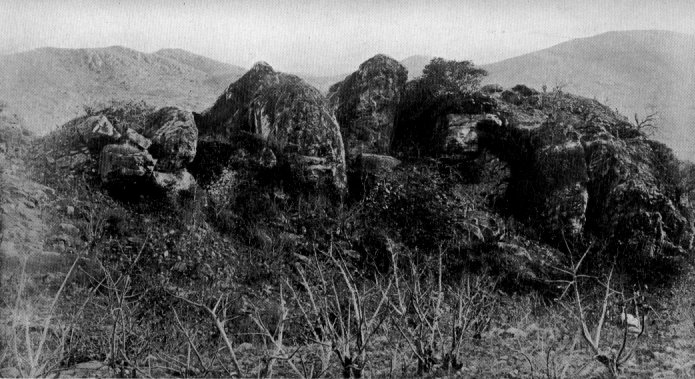

  
[Intangible Textual Heritage](../../index)  [Buddhism](../index) 
[Index](index)  [Previous](pos09)  [Next](pos11) 

------------------------------------------------------------------------

## CANTO V PSALMS OF FIVE VERSES

### XXXVIII An Anonymous Sister.

SHE, too, having fared in the past as the
foregoing Sisters, was, in this Buddha-era, reborn in the town of
Devadaha, and became the nurse of Great Pajāpatī the Gotamid. Her name
was Vaḍḍhesī, but the name of her family has not been handed down. When
her mistress renounced the world she did the same. But for
five-and-twenty years she was harassed by the lusts of the senses,
winning no concentration of mind even for a moment, and bewailing her
state with outstretched arms, till at length she heard Dhammadinnā
preaching the Norm. Then, with her mind diverted from the senses, she
fell to practising meditative exercises, and in no long time acquired
the Six Powers of Intuition. [190](pos10.htm#50-1) And,
reflecting on her attainment, she exulted thus:

<table data-align="center">
<colgroup>
<col style="width: 100%" />
</colgroup>
<tbody>
<tr class="odd">
<td><strong></strong>

For five-and-twenty years since I came forth, 
Not for one moment could my heart attain 
The blessedness of calm serenity. (67) 
No peace of mind I found. My every thought 
Was soaked in the fell drug of sense-desire. <a href="pos10.htm#51-1">191</a> 
With outstretched arms and shedding futile tears 
I gat me, wretched woman, to my cell. (68) 
 
Then She to this poor Bhikkhunī drew near, 
Who was my foster-mother in the faith. 
She taught to me the Norm, wherein I learnt 
The factors, organs, bases of this self, 
Impermanent compound. <a href="pos10.htm#51-2">192</a> Hearing her words, (69) 
Beside her I sat down to meditate. 
 
And now I know the days of the long past, 
And clearly shines the Eye Celestial, (70) 
I know the thoughts of other minds, and hear 
With sublimated sense the sound of things 
Ineffable. <a href="pos10.htm#51-3">193</a> The mystic potencies 
I exercise; and all the deadly Drugs 
That poisoned every thought are purged away. 
A living truth for me this Sixfold Lore, 
And the commandment of the Lord is done. (71)
</td>
</tr>
</tbody>
</table>

------------------------------------------------------------------------

> 190 *Chaḷabhiññā. Abhiññā* in the previous Psalm is
> rendered 'mystic lore profound.' The Six, otherwise defined as *paññā*
> (*Dialogues of the Buddha*, i., p. 57) and as *vijjā* (*ibid.*, p.
> 124), are Iddhi, the Purified Hearing, knowledge of the thoughts of
> others, memory of former lives, the evolution of the lives of other
> beings, the extinction of the Āsavas (see *Vibhanga*, 334). The last
> was virtually identical with Arahantship.

> 191 Lit. only, 'soaked with the passion of sense desires,'
> and explained as one whose mind was wetted by an exceedingly strong
> inclination, by an abundance of passionate desire for all the
> pleasures attainable through the senses. The metaphor of 'soaking'
> (*avassutā*) is nearly akin to that in the cardinal defects called
> Āsavas, one of which is precisely the predilection described above,
> and the extinction of which are named as the sixth *abhiññā* in the
> following verses.

> 192 The last five words are only implicit in the Pali.
> *Cf.* Ps. [xxx](pos08.htm#XXX). [43](pos08.htm#43). Compare
> Dhammadinnā's help with that given by Paṭācārā, [Ps.
> xxx.](pos08.htm#XXX)

> 193 See *Dialogues of the Buddha*, i., p. 89.

------------------------------------------------------------------------

### XXXIX Vimalā. (Formerly a Courtesan.)

She too, having fared in the past as the foregoing Sisters, was born, in
this Buddha-era, at Vesālī as the daughter of a certain woman who earned
her living by her beauty. Her name was Vimalā. When she was grown up,
and was imagining vicious things, she saw one day the venerable
Mahā-Moggallāna [194](pos10.htm#52-1) going about Vesālī for
alms, and feeling enamoured of him, she went to his dwelling and sought
to entice him. Some say she was instigated to do so by sectarians. The
Elder rebuked her unseemly behaviour and admonished her, as may be read
in the Psalms of the Brethren. [195](pos10.htm#52-2) And she
was filled with shame and self-reproach, and became a believer and
lay-sister. Later she entered the Order, and wrestling and striving–for
the root of attainment was in her–not long after won Arahantship.
Thereafter, reflecting on her gain, she exulted thus:

<table data-align="center">
<colgroup>
<col style="width: 100%" />
</colgroup>
<tbody>
<tr class="odd">
<td><strong></strong>

How was I once puff'd up, incens'd with the bloom of my beauty, <a href="pos10.htm#52-3">196</a> 
Vain of my perfect form, my fame and success 'midst the people, 
Fill'd with the pride of my youth, unknowing the Truth and unheeding! (<a href="pos23.htm#CORRIGENDUM">72</a>) 
Lo! I made my body, bravely arrayed, deftly painted, 
Speak for me to the lads, whilst I at the door of the harlot 
Stood, like a crafty hunter, weaving his snares, ever watchful. (73) 
Yea, I bared without shame my body and wealth of adorning; 
Manifold wiles I wrought, devouring the virtue of many. (<a href="pos23.htm#CORRIGENDUM">74</a>) 
 
To-day with shaven head, wrapt in my robe, 
I go forth on my daily round for food; 
And 'neath the spreading boughs of forest tree 
I sit, and Second-Jhana's rapture win, 
Where reas'nings cease, and joy and ease remain. <a href="pos10.htm#53-1">197</a> (75) 
Now all the evil bonds that fetter gods 
And men are wholly rent and cut away. 
Purg'd are the Āsavas that drugg'd my heart, 
Calm and content I know Nibbana's Peace. (<a href="pos23.htm#CORRIGENDUM">76</a>)
</td>
</tr>
</tbody>
</table>

------------------------------------------------------------------------

> 194 With Sāriputta and Mahā-Kassapa he belonged to the
> greatest of the Buddha's apostles.

> 195 *Theragāthā*, verses 1150-57.

> 196 There is no change in the Pali metre of this Psalm, but
> seventeen years ago the subject tripped off of itself into the metre
> as above, and I have so left it.

> 197 On 'Second Jhana,' see *B. Psy.*, pp. 43-46.

------------------------------------------------------------------------

### XL Sīhā.

She too, faring in the past as the foregoing Sisters, was in this
Buddha-era born at Vesālī as the daughter of General Sīha's
[198](pos10.htm#53-2) sister. And, being named after her
maternal uncle, she was called Sīhā. Come to years of discretion, she
heard the Master one day teaching the Norm to the General, and, becoming
a believer, gained her parents' consent to enter the Order. When she
strove for insight, she was unable to prevent her mind from running on
objects of external charm. Harassed thus for seven years, she concluded,
'How shall I extricate myself from this evil living? I will die.' And,
taking a noose, she hung it round the bough of a tree, and, fastening it
round her neck, with all the cumulative effect of former efforts, she
impelled her mind to insight. Then to her, who was really come to her
last birth, at that very moment, through her knowledge attaining
maturity, insight grew within, and she won Arahantship, together with
thorough grasp of the Norm in form and in meaning. So, loosening the
rope from her neck, she turned back again. Established as an Arahant,
she exulted thus:

<table data-align="center">
<colgroup>
<col style="width: 100%" />
</colgroup>
<tbody>
<tr class="odd">
<td><strong></strong>

Distracted, harassed by desires of sense, 
Unmindful of the 'what' and 'why' of things, <a href="pos10.htm#54-1">199</a> 
Stung and inflated by the memories 
Of former days, o'er which I lacked control– (77) 
Corrupting canker spreading o'er my heart– 
I followed heedless dreams of happiness, 
And got no even tenour to my mind, 
All given o'er to dalliance with sense. (78) 
So did I fare for seven weary years, 
In lean and sallow mis'ry of unrest. 
I, wretched, found no ease by day or night, (79) 
So took a rope and plunged into the wood: 
'Better for me a friendly gallows-tree! 
I'll live again the low life of the world.'<a href="pos10.htm#54-2">200</a> (80) 
Strong was the noose I made; and on a bough 
I bound the rope and flung it round my neck, 
When see! . . . my heart was set at liberty! (81)
</td>
</tr>
</tbody>
</table>

------------------------------------------------------------------------

> 198 On Sīha, General of the Licchavis, see Rhys Davids and
> Oldenberg, *Vinaya Texts* (*S.B.E.*), ii. 108 ſſ. 'Sīha'=lion.

> 199 *Ayoniso-manasikārā*, lit., 'from not attending to
> cause or source.'

> 200 *I.e.*, by continuing my round of rebirths. *Cf.* the
> Western idea of suicide–to 'put an end to it all'–with this of
> 'starting it again.'

------------------------------------------------------------------------

### XLI Sundarī-Nandā.

She, verily, was born, in the time of Padumuttara Buddha, in the town of
Haŋsavatī. And when she was come to years of discretion, she heard the
Master preaching, and assigning a certain Bhikkhunī the foremost place
in meditative power. Vowing that she would gain that rank, she went on
doing good. After æons upon æons of rebirth among gods and men, she took
birth in this Buddha-epoch in the reigning family of the Sākiyas. Named
Nandā, she became known as Beautiful Nandā,
[201](pos10.htm#55-1) the Belle of the country. And when our
Exalted One had acquired all knowledge, had gone to Kapilavatthu, and
caused the princes Nandā and Rāhula to join the Order; when too King
Suddhodana died, and the Great Pajāpatī entered the Order, then Nandā
thought: 'My elder brother [202](pos10.htm#55-2) has
renounced the heritage of empire, has left the world, and is become a
Buddha, a Superman. [203](pos10.htm#55-3) His son too,
Rāhula, has left the world, so has my brother, King Nanda, my mother,
Mahā-Pajāpatī, and my sister, Rāhula's mother. But I now, what shall I
do at home? I will leave the world.' Thus she went forth, not from
faith, but from love of her kin. And thus, even after her renunciation,
she was intoxicated with her beauty, and would not go into the Master's
presence, lest he should rebuke her. But it fared with her even as with
Sister Abbirūpa-Nandā, [204](pos10.htm#55-4) with this
difference: When she saw the female shape conjured up by the Master
growing gradually aged, her mind, intent on the impermanence and
suffering of life, turned to meditative discipline. And the Master,
seeing that, taught her suitable doctrine, thus:

<table data-align="center">
<colgroup>
<col style="width: 100%" />
</colgroup>
<tbody>
<tr class="odd">
<td><strong></strong>

Behold, Nandā, the foul compound, diseased, 
Impure! Compel thy heart to contemplate 
What is not fair to view. So steel thyself 
And concentrate the well-composèd mind. <a href="pos10.htm#56-1">205</a> (82) 
As with this body, so with thine; as with 
Thy beauty, so with this–thus shall it be 
With this malodorous, offensive shape, 
Wherein the foolish only take delight. (83) 
So look thou on it day and night with mind 
Unfalteringly steadfast, till alone, 
By thine own wit, delivered from the thrall 
Of beauty, thou dost gain vision serene.<a href="pos10.htm#56-2">206</a> (84)
</td>
</tr>
</tbody>
</table>

Then she, heeding the teaching, summoned up wisdom and stood firm in the
fruition of the First Path. And, to give her an exercise for higher
progress, he taught her, saying: 'Nandā, there is in this body not even
the smallest essence. 'Tis but a heap of bones smeared with flesh and
blood under the form of decay and death.' As it is said in the
Dhammapada:[207](pos10.htm#56-3)

> 'Have made a citadel of bones besmeared  
> With flesh and blood, where ever reign decay  
> And death, and where conceit and fraud is stored.

Then she, as he finished, attained Arahantship. And when she pondered on
her victory, she exulted in the Master's words, and added:

<table data-align="center">
<colgroup>
<col style="width: 100%" />
</colgroup>
<tbody>
<tr class="odd">
<td><strong></strong>

I, even I, have seen, inside and out, 
This body as in truth it really is, 
Who sought to know the 'what' and 'why' of it, 
With zeal unfaltering and ardour fired. (85) 
Now for the body care I never more, 
And all my consciousness is passion-free. 
Keen with unfettered zeal, detached, 
Calm and serene I taste Nibbana's peace. (86)
</td>
</tr>
</tbody>
</table>

------------------------------------------------------------------------

> 201 Sundarī-Nandā = 'beautiful delight.'

> 202 *I.e.*, half-brother. *Cf.* [p. 6.](pos05.htm#p6)

> 203 *Aggapuggalo.*

> 204 See [Ps. xix.](pos07.htm#XIX)

> 205 An elaboration of two Pali words difficult to render
> adequately with brevity–*ekaggaŋ susamāhitaŋ*.

> 206 The curious inflexion *dakkhisaŋ*, the reading adopted
> by the editors of both text and Commentary, is an aorist (first person
> singular) termination on the future stem of 'to see.' Dr. Neumann,
> disregarding the Commentary, takes it as aorist, making Nandā speak
> all the lines to and of herself. The Commentary divides the speech as
> above, paraphrasing by *passissaŋ* an artificially regular future of
> *passati*, to see, and a verbal noun, 'one who will see,' like
> *passaŋ*, 'one who sees.' In the corresponding Apadāna lines the
> Mandalay MSS. read the regular future (second person singular),
> *dakkhasi*, 'thou wilt see.' Either we must, with the Commentary, read
> some future form of the verb, or make Nandā repeat herself in verses
> 84 and 85, instead of responding in 85 to the Master's exordium in 84.
> Professor R. Otto Franke, in a learned note, most kindly responding to
> my question, 'does not venture to decide' whether to keep *dakkhisaŋ*,
> or adopt one of the other readings. The severe absence of redundancy
> in these short poems decides me to follow the tradition, and reserve
> 'I have seen' for 85: *yathābhūttaŋ ayaŋ kāyo diṭṭho.*

> 207 Verse 150.

------------------------------------------------------------------------

### XLII Nanduttarā.

She, too, faring in the past as the aforementioned Sisters, was, in this
Buddha-age, born in the kingdom of the Kurus at the town of
Kammāsadamma,[208](pos10.htm#57-1) in a brahmin family. And
when she had learnt from some of them their arts and sciences, she
entered the Order of the Nigaṇṭhas,[209](pos10.htm#57-2) and,
as a renowned speaker, took her rose-apple bough, like Bhaddā Curlyhair,
[210](pos10.htm#57-3) and toured about the plain of India.
Thus she met Mahā-Moggallāna the Elder, and in debate suffered defeat.
She thereupon listened to his advice, entered the Order, and not long
after attained Arahantship, together with thorough grasp of the letter
and meaning of the Norm. And meditating on her victory, she exulted
thus:

<table data-align="center">
<colgroup>
<col style="width: 100%" />
</colgroup>
<tbody>
<tr class="odd">
<td><strong></strong>

Fire and the moon, the sun and eke the gods 
I once was wont to worship and adore, 
Foregathering on the river-banks to go 
Down in the waters for the bathing rites. (87) 
Ay, manifold observances I laid 
Upon me, for I shaved one-half my head, 
Nor laid me down to rest save on the earth, 
Nor ever broke my fast at close of day. (88) 
 
I sought delight in decking out myself 
With gems and ornaments and tricks of art. 
By baths, unguents, massage, I ministered 
Unto this body, spurred by lusts of sense. (89) 
 
Then found I faith, and forth from home 
I went into the homeless life, for I 
Had seen the body as it really is, 
And nevermore could lusts of sense return. (90) 
 
All the long line of lives was snapt in twain, 
Ay, every wish and yearning for it gone. 
All that had tied me hand and foot was loosed, 
Peace had I won, peace thronèd in my heart. (91)
</td>
</tr>
</tbody>
</table>

------------------------------------------------------------------------

> 208 On this interesting place, see *J.P.T.S.*, 1909, art.
> by Dr. Watanabe.

> 209 Lit., the Unbound or Free Brethren–*i.e.*, the Jains.

> 210 See [Ps. xlvi.](pos10.htm#XLVI) The autobiographical
> evolution hinted at in verse 89 of the Psalm fits ill with the career
> sketched in the Commentarial tradition.

------------------------------------------------------------------------

### XLIII Mittakālī. [211](pos10.htm#58-1)

She, too, faring in the past as the aforementioned Sisters, was, in this
Buddha-era, born at the town of Kammāsadamma
[212](pos10.htm#58-2) in the kingdom of the Kurus, in a
brahmin's family. Come to years of discretion, she gained faith by
hearing the teaching of the great Discourse on the Applications of
Mindfulness,[213](pos10.htm#59-1) and entered the Order of
Sisters. For seven years she was liable to a fondness for gifts and
honours, and, while doing the duties of a recluse, she was quarrelsome
now and again. Later on she was reborn intellectually,
[214](pos10.htm#59-2) and becoming anxious she established
insight, and thereupon soon won Arahantship, together with thorough
grasp of the Norm in form and in meaning. Reflecting on her victory, she
exulted thus:

<table data-align="center">
<colgroup>
<col style="width: 100%" />
</colgroup>
<tbody>
<tr class="odd">
<td><strong></strong>

Leaving my home through call of faith, I sought 
The homeless life, and dwelt with eye intent 
On offerings from the faithful and the praise 
Of this one and the gratitude of that. (92) 
The path of insight <a href="pos10.htm#59-3">215</a> I neglected, turned 
From highest good to follow baser ends. 
I lay enthralled to worldly vice, and naught 
To win the goal of my high calling wrought. (93) 
 
But anguish crept upon me, even me, 
Whenas I pondered in my little cell: 
Ah me! how have I come into this evil road! 
Into the power of Craving have I strayed! (94) 
Brief is the span of life yet left to me; 
Old age, disease, hang imminent to crush. 
Now, ere this body perish and dissolve, 
Swift let me be; no time have I for sloth. (95) 
And contemplating, as they really are, 
The Aggregates of life that come and go, 
I rose and stood with mind emancipate! 
For me the Buddha's word had come to pass. (96)
</td>
</tr>
</tbody>
</table>

------------------------------------------------------------------------

> 211 In the Commentary she is called Mittãkãlikã (a
> diminutive form).

> 212 See [Ps. xlii.](pos10.htm#XLII), *n.* 1.

> 213 *Dīgha Nik.*, ii., pp. 290 ſſ.

> 214 *Yoniso uppajjantī*, a most unusual phrase for mental
> growth.

> 215 A phrase from the Commentary.

------------------------------------------------------------------------

### XLIV Sakulā. [216](pos10.htm#60-1)

Now she, at the time when Padumuttara was Buddha, came to birth at
Haŋsavatī as the daughter of King Ānanda and half-sister of the Master,
and was named Nandā. One day she sat listening to the Master, and
hearing him place a Bhikkhunī at the top of those who had the faculty of
the 'Heavenly Eye,' she vowed that this rank should one day be hers. And
after many good works and subsequent happy rebirths, she came to being
on earth when Kassapa was Buddha, as a brahminee, and renounced the
world as a Wanderer, [217](pos10.htm#60-2) vowed to a
solitary life. One day she offered her alms at the Master's shrine,
making a lamp-offering all night long. Reborn in the heaven of the
Three-and-Thirty Gods, she became possessed of the Heavenly Eye; and,
when this Buddha was living, she was born a brahminee at Sāvatthī, and
called Pakulā. Assisting at the Master's acceptance of the gift of the
Jeta Grove, she became a believer; and, later on, convinced by the
preaching of an Arahant brother, she grew anxious in mind, entered the
Order, strove and struggled for insight, and soon won Arahantship.

Thereafter, in consequence of her vow, she accumulated skill in the
heavenly sight, and was assigned foremost place therein by the Master.
And reflecting thereon, thrilled with gladness, she exulted thus:

<table data-align="center">
<colgroup>
<col style="width: 100%" />
</colgroup>
<tbody>
<tr class="odd">
<td><strong></strong>

While yet I dwelt as matron in the house, 
I heard a Brother setting forth the Norm. 
I SAW that Norm, the Pure, the Passionless, 
Track to Nibbana, past decease and birth. (97) 
 
Thereat I left my daughter, left my son, 
I left my treasures and my stores of grain; 
I called for robes and razors, cut my hair, 
And gat me forth into the homeless life. (98) 
 
And first as novice, virtuous and keen 
To cultivate the upward mounting Way, 
I cast out lust and with it all ill-will, 
And therewith, one by one, the deadly Drugs.<a href="pos10.htm#61-1">218</a> (99) 
Then to the Bhikkhunī of ripening power 
Rose in a vision mem'ries of the past.<a href="pos10.htm#61-2">219</a> 
Limpid and clear the mystic vistas grew, 
Expanding by persistent exercise. (100) 
Act, speech and thought I saw as not myself,<a href="pos10.htm#61-3">220</a> 
Children of cause, fleeting, impermanent. 
And now, with every poisonous Drug cast out, 
Cool and serene I see Nibbana's peace. (101)
</td>
</tr>
</tbody>
</table>

------------------------------------------------------------------------

> 216 Called Sakulā in the Anguttara (i. 25), but Pakulā in
> Commentary and Appendix.

> 217 *Paribbājakā*. *Cf.* Rhys Davids, *Buddhist India*, p.
> 141.

> 218 In Pali, simply 'Āsave.'

> 219 The powers here briefly indicated are the culminating
> stages of *Vijjā* or *Paññā*. See *Dialogues of the Buddha*, i., p.
> 124 (§§ 14-16), and *passim*, and *Cf.* [Ps.
> xxxviii.](pos10.htm#XXXVIII)

> 220 *Parato disvā*, lit., having seen as Other–*i.e.*, says
> the Commentary, following the Pitakas (*e.g.*, *Majjh. Nik.*, i. 500),
> as without Soul or Ego The oldest books specify compounds of act,
> word, and thought as *sankhāra's*.

------------------------------------------------------------------------

### XLV Soṇā. [221](pos10.htm#61-4)

She, too, was born at the time when Padumuttara was Buddha, at
Haŋsavatī, in a clansman's family. One day she sat listening to the
Master, and hearing him place a Bhikkhunī at the top of those
distinguished for capacity of effort, she vowed that this rank should
one day be hers. And after many happy rebirths, she came to being, when
this Buddha lived, in a clansman's family at Sāvatthī. She became, when
married, the mother of ten sons and daughters, and was known as 'the
Many-offspringed.' When her husband renounced the world, she set her
sons and daughters over the household, handing over all her fortune to
her sons, and keeping nothing for herself. Her sons and daughters-in-law
had not long supported her before they ceased to show her respect. And
saying, 'What have I to do with living in a house where no regard is
shown me?' she entered the Order of Bhikkhunīs. Then she thought: 'I
have left the world in my old age; I must work strenuously.' So, while
she waited on the Bhikkhunīs, she resolved also to give herself
religious studies all night. And she studied thus, steadfast and
unfaltering, as one might cling doggedly to a pillar on the veranda, or
to a tree in the dark, for fear of hitting one's head against obstacles,
never letting go. Thereupon her strenuous energy became known, and the
Master, seeing her knowledge maturing, sent forth glory, and appearing
as if seated before her, said thus:

> 'The man who, living for an hundred years,  
> Beholdeth never the Ambrosial Path,  
> Had better live no longer than one day,  
> So he behold within that day, that
> Path!'[222](pos10.htm#62-1)

And when he had thus spoken, she attained Arahantship. Now, the Exalted
One, in assigning rank of merit to the Bhikkhunīs, placed her first for
capacity of effort. One day, pondering hereon, she exulted thus:

<table data-align="center">
<colgroup>
<col style="width: 100%" />
</colgroup>
<tbody>
<tr class="odd">
<td><strong></strong>

Ten sons and daughters did I bear within 
This heap of visible decay. Then weak 
And old I drew near to a Bhhikkunī. (102) 
She taught to me the Norm,<a href="pos10.htm#62-2">223</a> wherein I learnt 
The factors, organs, bases of this self, 
Impermanent compound. Hearing her words, 
And cutting off my hair, I left the world. (103) 
Then as I grappled with the threefold course, <a href="pos10.htm#63-1">224</a> 
Clear shone for me the Eye Celestial. 
I know the 'how' and 'when' I came to birth 
Down the long past, and where it was I lived. (104) 
I cultivate the Signless,<a href="pos10.htm#63-2">225</a> and my mind 
In uttermost composure concentrate. 
Mine is the ecstasy of freedom won 
As Path merges in Fruit, and Fruit in Path. <a href="pos10.htm#63-3">226</a> 
Holding to nought, I in Nibbana live. (105) 
This five-grouped being have I understood. 
Cut from its root, all onward growth is stayed. 
I too am stayed, victor on basis sure, 
Immovable.<a href="pos10.htm#63-4">227</a> Rebirth comes never more. (106)
</td>
</tr>
</tbody>
</table>

------------------------------------------------------------------------

> 221 For an uncondensed account from the *Manoratanapūraṇī*,
> see Mrs. Bode, *op. cit.*, pp. 768 ſ.

> 222 See [Ps. lxiii.](pos15.htm#LXIII)

> 223 See [Pss. xxx.](pos08.htm#XXX),
> [xxxviii.](pos10.htm#XXXVIII)

> 224 See [Ps. iv.](pos06.htm#IV)

> 225 See [Ps. xxxi](pos08.htm#XXXI). 46.

> 226 *Anantarā-vimokhā 'sim.*

> 227 Lit., 'I am without longing, born of a stable base.'
> Possibly the passage, of which there are many corrupt variants, may
> have been *āṇejj' amhi*, 'I am immovable.'

------------------------------------------------------------------------

### XLVI Bhaddā Kuṇḍalakesā, the ex-Jain. [228](pos10.htm#63-5)

She, too, was reborn, when Padumuttara was Buddha, at Haŋsavatī, in a
clansman's family. One day she sat listening to the Master, and hearing
him place a Bhikkhunī at top of those whose intuition was swift, she
vowed that this rank should one day be hers. After working much merit,
and experiencing æons of rebirth among gods and men, she became, when
Kassapa was Buddha, one of the seven daughters
[229](pos10.htm#64-1) of Kiki, King of Kāsī. And for twenty
thousand years [230](pos10.htm#64-2) she kept the precepts,
and built a cell for the Order. Finally, in this Buddha-era, she was
born at Rājagaha, in the family of the king's treasurer, and called
Bhaddā. [231](pos10.htm#64-3) Growing up surrounded by
attendants, she saw, looking through her lattice, Satthuka, the
chaplain's son, a highwayman, being led to execution by the city guard
by order of the king. Falling in love with him, she fell prone on her
couch, saying: 'If I get him, I shall live; if not, I shall die.' Then
her father, hearing of her state, out of his great love for her, bribed
the guard heavily to release the thief, let him be bathed with perfumed
water, adorned him, and let him come where Bhaddā, decked in jewels,
waited upon him. Then Satthuka very soon coveted her jewels, and said:
'Bhaddā, when the city guards were taking me to the Robbers' Cliff, I
vowed to the Cliff deity that if my life were spared I would bring an
offering. Do you make one ready.' Wishing to please him, she did BO, and
adorning herself with all her jewels, mounted a chariot with him, and
drove to the Cliff. And Satthuka, to have her in his power, stopped the
attendants; and taking the offering, went up alone with her, but spoke
no word of affection to her. And by his behaviour she discerned his
plot. Then he bade her take off her outer robe and wrap in it the jewels
she was wearing. She asked him what had she done amiss, and he answered:
'You fool, do you fancy I have come here to make offering? I have come
to get your ornaments.' 'But whose, then, dear one, are the ornaments,
and whose am I?' 'I know nothing of that division.' 'So be it, dear; but
grant me this one wish: let me, while wearing my jewels, embrace you.'
He consented, saying: 'Very well.' She thereupon embraced him in front,
and then, as if embracing him from the back, pushed him over the
precipice. And the deity dwelling on the mountain saw her do this feat
and praised her cleverness, saying:

> Not in every case is Man tho wiser ever;  
> Woman, too, when swift to see, may prove as clever.  
> Not in every case is Man the wiser reckoned;  
> Woman, too, is clever, an she think but a second.'

Thereafter Bhaddā thought: 'I cannot, in this course of events, go home;
I will go hence, and leave the world.' So she entered the Order of the
Nigaṇṭhas. [232](pos10.htm#65-1) And they asked her: 'In what
grade do you make renunciation?' 'In whatever is your extreme grade,'
she replied, 'perform that on me.' So they tore out her hair with a
palmyra comb. (When the hair grew again in close curls they called her
Curlyhair.) During her probation she learnt their course of doctrine and
concluded that: 'So far as they go they know, but beyond that there is
nothing distinctive in their teaching.' So she left them, and going
wherever there were learned persons, she learnt their methods of
knowledge till, when she found none equal to debate with her, she made a
heap of sand at the gate of some village or town, and in it set up the
branch of a rose-apple, and told children to watch near it, saying:
'Whoever is able to join issue with me in debate, let him trample on
this bough.' Then she went to her dwelling, and if after a week the
bough still stood, she took it and departed.

Now at that time our Exalted One, rolling the wheel of the excellent
doctrine, came and dwelt in the Jeta Wood near Sāvatthī, just when
Curlyhair had set up her bough at the gate of that city.

Then the venerable Captain of the Norm [233](pos10.htm#65-2)
entered the city alone, and, seeing her bough, felt the wish to tame
her. And he asked the children: 'Why is this bough stuck up here?' They
told him. The Elder said: 'If that is so, trample on the bough.' And the
children did so. Then Curlyhair, after seeking her meal in the town,
came out and saw the trampled bough, and asked who had done it. When she
heard it was the Elder, she thought, 'An unsupported debate is not
effective,' and going back into Sāvatthī, she walked from street to
street, saying: 'Would ye see a debate between the Sākyan recluses and
myself?' Thus, with a great following, she went up to the Captain of the
Norm, who was seated beneath a tree, and, after friendly greeting,
asked: 'Was it by your orders that my rose-apple bough was trampled on?'
'Yes, by my orders.' 'That being so, let us have a debate together.'
'Let us, Bhaddā.' 'Which shall put questions, which shall answer?'
'Questions put to me; do you ask anything you yourself think of.' They
proceeded thus, the Elder answering everything, till she, unable to
think of further questions, became silent. Then the Elder said: 'You
have asked much; I, too, will ask, but only this question.' 'Ask it,
lord.' 'One–what is that?' [234](pos10.htm#66-1) Curlyhair,
seeing neither end nor point to this, was as one gone into the dark, and
said: 'I know not, lord.' Then he, saying, 'You know not even thus much.
How should you know aught else?' taught her the Norm. She fell at his
feet, saying: 'Lord, I take refuge with you.' 'Come not to me, Bhaddā,
for refuge; go for refuge to the Exalted One, supreme among men and
gods.' 'I will do so, lord,' she said; and that evening, going to the
Master at the hour of his teaching the Norm, and worshipping him she
stood on one side. The Master, discerning the maturity of her knowledge,
said:

> 'Better than a thousand verses, where no profit wings the word,  
> Is a solitary stanza bringing calm and peace when heard.'
> [235](pos10.htm#67-1)

  
THE SUMMIT OF VULTURE PEAK.  
To face p. 66.

And when he had spoken, she attained Arahantship, together with thorough
grasp of the letter and the spirit. Now she entered the Order as an
Arahant, the Master himself admitting her. And going to the Sisters'
quarters, she abode in the bliss of fruition and Nibbana, and exulted in
her attainment thus:

<table data-align="center">
<colgroup>
<col style="width: 100%" />
</colgroup>
<tbody>
<tr class="odd">
<td><strong></strong>

Hairless, dirt-laden and half-clad <a href="pos10.htm#67-2">236</a> –so fared 
I formerly, deeming that harmless things 
Held harm, nor was I 'ware of harm 
In many things wherein, in sooth, harm lay. (107) 
Then forth I went from siesta in the shade 
Up to the Vulture's Peak, <a href="pos10.htm#67-3">237</a> and there I saw 
The Buddha, the Immaculate, begirt 
And followed by the Bhikkhu-company. (108) 
Low on my knees I worshipped, with both hands 
Adoring. 'Come, Bhaddā!' the Master said! 
Thereby to me was ordination given. <a href="pos10.htm#67-4">238</a> (109) 
Lo! fifty years have I a pilgrim been, 
In Anga, Magadha and in Vajjī, 
In Kāsī and the land of Kosala, 
Nought owing, living on the people's alms. <a href="pos10.htm#68-1">239</a> (110) 
And great the merit by that layman gained, 
Sagacious man, who gave Bhaddā a robe– 
Bhaddā who now (captive once more to gear) 
Is wholly free from bondage of the mind. (111)
</td>
</tr>
</tbody>
</table>

------------------------------------------------------------------------

> 228 Spelt -kesī at the allusion to her in [Ps.
> xlii.](pos10.htm#XLII) For an uncondensed version of the chronicle,
> see Mrs. Bode, *op. cit.*, pp. 777 ſ.

> 229 See [Ps. xii.](pos06.htm#XII); Commentary, *n.* 1.

> 230 The average span of life in Kassapa Buddha's era
> (*Dīgha N.*, ii.).

> 231 See [Ps. xxxvii.](pos09.htm#XXXVII)

> 232 See [Ps. xlii.](pos10.htm#XLII)

> 233 The title reserved for the Apostle Sāriputta.

> 234 '*Ekaŋ nāma kiŋ?* or more fully, 'What is that which is
> called (named) "one"?' Tho Jains do not appear to have been any more
> monistically or pantheistically inclined than the Buddhists, hence
> possibly her lack of ready reply. The systems she is said to have
> acquired cannot well have included the more esoteric and more
> jealously reserved Brahmanic lore. It is difficult otherwise to
> imagine her at such a loss, unless it was because of the extreme
> vagueness of the question. 'In the beginning there was One only.' . .
> . 'He is one, he becomes three . . . five,' etc. 'All things become
> one in prājñā,' and so on:–the oldest Upanishads give plenty of such
> answers. Conceivably she may have known this monism, but have seen no
> end or point in it, because, as a sincere Jain, she rejected it.
> Neither would the Apostle have wished for a Brahmanic reply, except as
> an occasion to be improved upon. He would be more interested in the
> analysis and classification of phenomena bearing on the ethical life.
> Thus, in the ancient catechism, the Khuddakapātha, the question
> actually occurs: *Ekaŋ nāma kiŋ?* But the answer is, 'All beings are
> sustained by food.' Hence 'the point' really was, State any *one fact*
> true for the whole of any one class of things. (*Cf.* *Ang. Nik.*, v.
> 50, 55.)

> 235 Dhammapada, ver. 101.

> 236 Lit., having one garment or cloak. The Nigaṇṭhas were
> ascetics (*Dialogues of the Buddha*, i. 220, 221).

> 237 It is not impossible that Sāvatthi had its Vulture's
> Peak (Gijjhakūṭa) as well as Rājagaha in Magadha; but the latter peak
> is the one usually mentioned, and it seems more probable that
> Curlyhair's legend has been (badly) fitted on to another Bhaddā's
> Psalm. *Cf.* [Ps. xlii.](pos10.htm#XLII), also [Ps.
> xlvii.](pos10.htm#XLVII), [lxiii](pos15.htm#LXIII). The commentator is
> silent on the point.

> 238 Great importance came to be attached to a case of
> ordination–in the case, at least, of a woman–by the Master direct, as
> was this. Dhammapāla ends his Commentary with a note upon it.

> 239 That, from an Eastern standpoint, she incurred no debt
> as the people's pensioner, but more than repaid their charity by
> giving them opportunities for storing merit, is well shown in the
> following lines.

------------------------------------------------------------------------

### XLVII Paṭācārā.

She, too, was reborn, when Padumuttara was Buddha, at Haŋsavatī, in a
clansman's family. One day she sat listening to the Master, and hearing
him place a Bhikkhunī at top of those who were versed in the rules of
the Order, she vowed that this rank should one day be hers. After doing
good all her life, and being reborn in heaven and on earth, she gained
rebirth, in the time when Kassapa was Buddha, as one of the seven
Sisters, daughters of Kiki, King of Kāsī.
[240](pos10.htm#68-2) And for 20,000 years she lived a life
of righteousness, and built a cell for the Order. While no Buddha lived
on earth she dwelt in glory among the gods, and finally, in this
Buddha-era, was reborn in the Treasurer's house at Sāvatthī. Grown up,
she formed an intimacy with one of the serving-men of her house. When
the parents fixed a day on which to give her hand to a youth of her own
rank, she took a handful of baggage, and with her lover left the town by
the chief gate and dwelt in a hamlet. When the time for her confinement
was near, she said: 'Here there's none to take care of me; let us go
home, husband.' And he procrastinated, saying: 'We'll go to-day; we'll
go to-morrow' till she said: 'The foolish fellow will never take me
there'; and setting her affairs in order while he was out, she told her
neighbours to say she had gone home, and set forth alone. When he came
back and was told this, he exclaimed: 'Through my doing a lady of rank
is without protection,' and hurrying after her, overtook her. Midway the
pains of birth came upon her, and after she was recovered, they turned
back again to the hamlet. At the advent of a second child things
happened just as before, with this difference: when midway the winds
born of Karma blew upon her, [241](pos10.htm#69-1) a great
storm broke over them, and she said, 'Husband, find me a place out of
the rain!' While he was cutting grass and sticks in the jungle, he cut a
stake from a tree standing in an ant-hill. And a snake came from the
ant-hill and bit him, so that he fell there and died. She, in great
misery, and looking for his coming, while the two babies cried at the
wind and the rain, placed them in her bosom, and, prone over them on the
ground, spent the night thus. At dawn, bearing one babe at her breast,
and saying to the other, 'Come, dear, father has left thee,' she went
and found him seated, dead, near the ant-heap. 'Oh!' she cried, 'through
me my husband is dead,' and wept and lamented all the night. Now, from
the rain, the river that lay across her path was swollen knee-deep, and
she, being distraught and weak, could not cross the water with both
babies. So she left the elder on the hither side, and crossed over with
the other. Then she spread out a branch she had broken off, and laid the
babe on her rolled headcloth. But she was loth to leave the little
creature, and turned round again and again to see him as she went down
to the river. Now, when she was half-way over, a hawk in the air took
the babe for a piece of flesh, and though the mother, seeing him,
clapped her hands, shouting, 'Soo! soo!' the hawk minded her not,
because she was far from him, and caught the child up into the air. Then
the elder, thinking the mother was shouting because of him, got
flustered, and fell into the river; so she lost both, and came weeping
to Sāvatthī. And, meeting a man, she asked him: 'Where do you dwell?'
And he said: 'At Sāvatthī, dame.' 'There is at Sāvatthī such and such a
family in such and such a street. Know you them, friend?' 'I know them,
dame; but ask not of them; ask somewhat else.' 'I am not concerned with
aught else. 'Tis about them I ask, friend.' 'Dame, can you not take on
yourself to tell? You saw how the god rained all last night?' 'I saw
that, friend. On me he rained all night long. Why, I will tell you
presently. But first, do you tell me of how it goes with that
Treasurer's family.' 'Dame, last night the house broke down and fell
upon them, and they burn the Treasurer, his wife, and his son on one
pyre. Dame, the smoke of it can be seen.' Thereat grief maddened her, so
that she was not aware even of her clothing slipping off. Wailing in her
woe–

> 'My children both are gone, and in the bush  
> Dead lies my husband; on one funeral bier  
> My mother, father, and my brother burn,'

she wandered around from that day forth in circles, and because her
skirt-cloth fell from her she was given the name
'Cloak-walker.'[242](pos10.htm#70-1) And people, seeing her,
said: 'Go, little mad-woman!' And some threw refuse at her head, some
sprinkled dust, some pelted her with clods. The Master, seated in the
Jeta Grove, in the midst of a great company, teaching the Dhamma, saw
her wandering thus round and round, and contemplated the maturity of her
knowledge. When she came towards the Vihāra he also walked that way. The
congregation, seeing her, said: 'Suffer not that little lunatic to come
hither.' The Exalted One said: 'Forbid her not,' and standing near as
she came round again, he said to her: 'Sister, recover thou presence of
mind.'[243](pos10.htm#71-1) She, by the sheer potency of the
Buddha regaining presence of mind, discerned her undressed plight, and
shame and conscience arising, she fell crouching to earth. A man threw
her his outer robe, and she put it round her, and drawing near to the
Master worshipped at his feet, saying: 'Lord, help me. One of my
children a hawk hath taken, one is borne away by water; in the jungle my
husband lies dead; my parents and my brother, killed by the overthrown
house, burn on one pyre.' So she told him why she grieved. The Master
made her see, thus: 'Paṭācārā, think not thou art come to one able to
become a help to thee. Just as now thou art shedding tears because of
the death of children and the rest, so hast thou, in the unending round
of life, been shedding tears, because of the death of children and the
rest, more abundant than the waters of the four oceans:

> 'Less are the waters of the oceans four  
> Than all the waste of waters shed in tears  
> By heart of man who mourneth touched by Ill.  
> Why waste thy life brooding in bitter woe?'

Thus, through the Master's words touching the way where no salvation
lies, the grief in her became lighter to bear. Knowing this, he went on:
'O Paṭācārā, to one passing to another world no child nor other kin is
able to be a shelter or a hiding-place or a refuge. Not here, even, can
they be such. Therefore, let whoso is wise purify his own conduct, and
accomplish the Path leading even to Nibbana.' Thus he taught her, and
said:

> 'Sons are no shelter, nor father, nor any kinsfolk.  
> O'ertaken by death, for thee blood-bond is no refuge.  
> Discerning this truth, the wise man, well ordered by virtue,  
> Swiftly makes clear the road leading on to Nibbana.

When he had finished speaking, she was established in the fruit of a
Stream-winner,[244](pos10.htm#72-1) and asked for ordination.
The Master led her to the Bhikkhunīs, and let her be admitted.

She, exercising herself to reach the higher paths, took water one day in
a bowl, and washing her feet, poured away some of the water, which
trickled but a little way and disappeared. She poured more, and it went
farther. And the third time the water went yet farther before it
disappeared. Taking this as her basis of thought, she pondered: 'Even so
do mortals die, either in childhood, or in middle age, or when old.' And
the Master, seated in the 'Fragrant Chamber,' shed glory around, and
appeared as if speaking before her, saying: 'Even so, O Paṭācārā, are
all mortals liable to die; therefore is it better to have so lived as to
see how the five khandhas come and go, even were it hut for one day–ay,
but for one moment–than to live for a hundred years and not see that.

> 'The man who, living for an hundred years,  
> Beholdeth never how things rise and fall,  
> Had better live no longer than one day,  
> So, in that day, he see the flux of
> things.'[245](pos10.htm#72-2)

And when he had finished, Paṭācārā won Arahantship, together with
thorough grasp of the Norm in letter and in spirit. Thereafter,
reflecting on how she had attained while yet a student, and magnifying
the advent of this upward change, she exulted thus:

<table data-align="center">
<colgroup>
<col style="width: 100%" />
</colgroup>
<tbody>
<tr class="odd">
<td><strong></strong>

With ploughshares ploughing up the fields, with seed 
Sown in the breast of earth, men win their crops, 
Enjoy their gains and nourish wife and child. (112) 
Why cannot I, whose life is pure, who seek 
To do the Master's will, no sluggard am, 
Nor puffèd up, win to Nibbana's bliss? (113) 
 
One day, bathing my feet, I sit and watch 
The water as it trickles down the slope. 
Thereby I set my heart in steadfastness, 
As one doth train a horse of noble breed. (114) 
Then going to my cell, I take my lamp, 
And seated on my couch I watch the flame. (115) 
Grasping the pin, I pull the wick right down 
Into the oil. . . . 
Lo! the Nibbana of the little lamp! 
Emancipation dawns! My heart is free! <a href="pos10.htm#73-1">246</a> (116)
</td>
</tr>
</tbody>
</table>

------------------------------------------------------------------------

> 240 Thus, as sister of Bhaddā Curlylocks, or, rather, of
> the immediate personal antecedent of Bhaddā, and of five other eminent
> women. Sec [Ps. xii.](pos06.htm#XII), *n.*; and *cf.* Mrs. Bode, *op.
> cit.*, pp. 556 ſ.; and Jātaka 4, *Buddhist Birth Stories*, pp. 158 ſ.

> 241 When the pains of childbirth set in.

> 242 *Paṭā*, cloak; *ācarā*, walker (fem.).

> 243 *Sati* is memory plus consciousness, in a reasonable
> being, of what one is now doing. 'Thy reason' would be more idiomatic
> English. 'Sister' here (*bhagini*, not *Bhikkhunī* or *Theri*) is the
> term for the blood-tie, or a term of respect.

> 244 The first of the four paths of salvation, Arahantship
> being the fourth.

> 245 Udayabbayo, rise-fall or coming-going. I have merely
> varied the phrase from line 2.

> 246 Lit., 'There was emancipation of the heart' (or mind).
> It is not easy to avoid jejuneness in rendering faithfully the austere
> simplicity of this little poem, wherein the terms and metaphors are
> not rich in import to us as they would be to an early Buddhist.

------------------------------------------------------------------------

### XLVIII Thirty Sisters under Paṭācārā declare their AÑÑĀ.

They, too, having made vows under former Buddhas, and accumulating good
of age-enduring efficacy in this and that rebirth, consolidated the
conditions for emancipation. They came to birth, in this
Buddha-dispensation, in clansmen's families in different places, heard
Paṭācārā preach, and were by her converted, and entered the Order. To
them, perfecting virtue and fulfilling their duties, she one day gave
this exhortation: [247](pos10.htm#73-2)

<table data-align="center">
<colgroup>
<col style="width: 100%" />
</colgroup>
<tbody>
<tr class="odd">
<td><strong></strong>

Men in their prime with pestle and with quern 
Are busied pounding rice and grinding corn. 
Men in their prime gather and heap up wealth, 
To have and nourish wife and children dear. (117) 
But ye, my sisters, see ye carry out 
The Buddha's will, which bringeth no remorse. 
Swiftly bathe ye your feet, then sit ye down 
Apart; your souls surrender utterly 
To spiritual calm–so do his will. (118)
</td>
</tr>
</tbody>
</table>

Then those Bhikkhunīs, abiding in the Sister's admonition, established
themselves in insight, performed exercises therein, and brought
knowledge to such maturity–the promise, too, being in them–that they
attained Arahantship, together with thorough grasp of the Norm in letter
and in spirit. And reflecting thereon, they exulted thus, adding the
Therī's verses to their own:

<table data-align="center">
<colgroup>
<col style="width: 100%" />
</colgroup>
<tbody>
<tr class="odd">
<td><strong></strong>

The will of her who spake–Paṭācārā– <a href="pos10.htm#74-1">248</a> 
The thirty Sisters heard and swift obeyed. 
Bathing their feet, they sat them down apart, 
And gave their souls to spiritual calm, 
Fulfilling thus the bidding of the Lord. (119) 
While passed the first watch of the night, there rose 
Long memories of the bygone line of lives; 
While passed the second watch, the Heavenly Eye, 
Purview celestial, they clarified; 
While passed the last watch of the night, they burst 
And rent aside the gloom of ignorance. (120) 
Then rising to their feet they hailed her blest: 
'Fulfillèd is thy will! and thee we take, 
And like to Sakka o'er the thrice ten gods, 
Chieftain unconquered in celestial wars, 
We place thee as our Chief, and so shall live. 
The threefold Wisdom have we gotten now. 
From deadly drugs our souls are purified.' (121)
</td>
</tr>
</tbody>
</table>

------------------------------------------------------------------------

> 247 *Cf.* with the following, [Ps. lviii.](pos12.htm#LVIII)

> 248 One note in the individual chord sounded in this Psalm
> and the next is certainly the emphasis laid on the loyalty of the
> Sisters to their present Mistress rather than to the absent and less
> directly guiding Master.

------------------------------------------------------------------------

### XLIX Candā.

She, too, faring in former ages like the foregoing, was, in this
Buddha-era, born in a brahmin village as the daughter of a brahmin of
whom nothing is known. From her childhood her family lost its
possessions, and she grew up in wretched circumstances.

Now, in her home the snake-blast disease
[249](pos10.htm#75-1) broke out, and all her kinsfolk caught
it, and died. She, being unable to support herself otherwise, went from
house to house with a potsherd, maintaining herself by alms. One day she
came to where Paṭācārā had just finished her meal. The Bhikkhunīs,
seeing her wretched and overcome with hunger, received her with
affectionate kindness in the pity they felt for her, and satisfied her
with such food as they had. Gladdened by their virtuous conduct, she
drew near to the Therī, saluted her, and sat down on one side while the
Therī discoursed. She listened in delight, and, growing anxious
concerning the round of life, renounced the world. Abiding in the
Therī's admonition, she established insight, devoted to practice. Then,
because of her resolve and of the maturity of her knowledge, she not
long after won Arahantship, with thorough grasp of the Norm in the
letter and the spirit. And, reflecting on her attainment, she exulted
thus:

<table data-align="center">
<colgroup>
<col style="width: 100%" />
</colgroup>
<tbody>
<tr class="odd">
<td><strong></strong>

Fallen on evil days was I of yore. 
No husband had I, nor no child, no friends 
Or kin–whence could I food or raiment find? (122) 
As beggars go, I took my bowl and staff, 
And sought me alms, begging from house to house, 
Sunburnt, frost-bitten, seven weary years. (123) 
Then came I where a woman Mendicant <a href="pos10.htm#76-1">250</a> 
Shared with me food, and drink, and welcomed me, 
And said: 'Come forth into our homeless life!' (124) 
In gracious pity did she let me come– 
PAṬĀCĀRĀ–and heard me take the vows. 
And thenceforth words of wisdom and of power 
She spake, and set before my face 
The way of going to the Crown of Life. <a href="pos10.htm#76-2">251</a> (125) 
I heard her and I marked, and did her will. 
O wise and clear Our Lady's homily! 
The Threefold Wisdom have I gotten now. 
From deadly drugs my heart is purified. (126)
</td>
</tr>
</tbody>
</table>

------------------------------------------------------------------------

> 249 On this mythical illness, see Hardy, *Eastern
> Monachism*, 85 *n.*

> 250 Bhikkhunī. The charm of the poem lies in the poor
> woman, an involuntary beggar 'in the world,' 'coming forth,' a
> voluntary beggar, into the higher Mendicancy, and from the dregs of
> living, reckoned by worldly standards, setting herself to win the
> cream of the life of Mind.

> 251 Lit., the thing of supreme import or
> advantage–*paramatthe*.

------------------------------------------------------------------------

[Next: Canto VI. Psalms of Six Verses](pos11)
