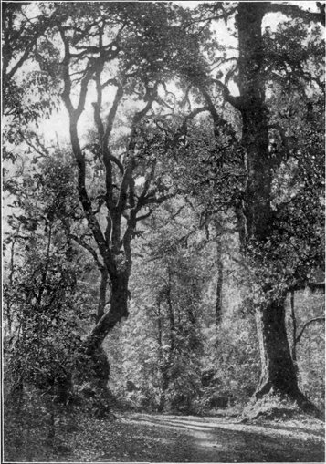

  
[Intangible Textual Heritage](../../index)  [Buddhism](../index.md) 
[Index](index)  [Previous](pos18)  [Next](pos20.md) 

------------------------------------------------------------------------

## CANTO XIV PSALM OF ABOUT THIRTY VERSES

### LXXI Subhā of Jīvaka's Mango-grove. [388](pos19.htm#148-1.md)

SHE too, having made her resolve under former
Buddhas, and heaping up good of age-enduring efficacy in this and that
rebirth, fostering the root of good and perfecting the conditions for
emancipation through the ripening of her knowledge, was in this
Buddha-era reborn at Rājagaha, in the family of a very eminent brahmin.
Her name was Subhā, and truly lovely was her body in all its members. It
was for this reason that she came to be so called. While the Master
sojourned at Rājagaha, she received faith and became a lay-disciple.
Later she grew anxious over the round of life, and saw the bane of the
pleasures of sense, and discerned that safety lay in renunciation. She
entered the Order under the Great Pajāpatī the Gotamid, and exercising
herself in insight, was soon established in the fruition of the Path of
No-return.

Now one day a certain libertine of Rājagaha, in the prime of youth, was
standing in the Jīvaka Mango-grove, and saw her going to siesta; and
feeling enamoured, he barred her way, soliciting her to sensual
pleasures. She declared to him by many instances the bane of sensuous
pleasures and her own choice of renunciation, teaching him the Norm.
Even then he was not cured, but persisted. The Therī, not stopping short
at her own words, and seeing his passion for the beauty of her eyes,
extracted one of them, and handed it to him, saying: 'Come, then! here
is the offending eye of her!' Thereat the man was horrified and appalled
and, his lust all gone, asked her forgiveness. The Therī went to the
Master's presence, and there, at sight of Him, her eye became as it was
before. Thereat she stood vibrating with unceasing joy at the Buddha.
The Master, knowing the state of her mind, taught her, and showed her
exercise for reaching the highest. Repressing her joy, she developed
insight, and attained Arahantship, together with thorough grasp of the
Norm in form and meaning. Thereafter, abiding in the bliss and fruition
of Nibbana, she, reflecting on what she had won, uttered her dialogue
with the libertine in these verses:

<table data-align="center">
<colgroup>
<col style="width: 100%" />
</colgroup>
<tbody>
<tr class="odd">
<td><strong></strong>

In Jīvaka's pleasant woodland walked Subhā 
The Bhikkhunī. A gallant met her there 
And barred the way. To him thus spake Subhā: <a href="pos19.htm#149-1">389</a> (366) 
 
'What have I done to offend thee, that thus in my path thou comest? 
No man, O friend, it beseemeth to touch a Sister in Orders. (367) 
So hath my Master ordained in the precepts we honour and follow; 
So hath the Welcome One taught in the training wherein they have trained me, 
Purified discipline holy. Why standest thou blocking my pathway? (368) 
Me pure, thou impure of heart; me passionless, thou of vile passions; 
Me who as to the whole of me freed am in spirit and blameless, 
Me whence comes it that Thou dost hinder, standing obnoxious?' (369) 
 
'Young art thou, maiden, and faultless–what seekest <em>thou</em> in the holy life? 
Cast off that yellow-hued raiment and come! in the blossoming woodland 
Seek we our pleasure. Filled with the incense of blossoms the trees waft (370) 
Sweetness. See, the spring's at the prime, the season of happiness! 
Come with me then to the flowering woodland, and seek we our pleasure. (371) 
Sweet overhead is the sough of the blossoming crests of the forest 
Swayed by the Wind-gods. But an thou goest alone in the jungle, 
Lost in its depths, how wilt thou find aught to delight or content thee? (372) 
Haunted is the great forest with many a herd of wild creatures, 
Broken its peace by the tramplings of elephants rutting and savage. 
Empty of mankind and fearsome <a href="pos19.htm#151-1">390</a> –is't there thou would'st go uncompanioned? (373) 
 
Thou like a gold-wrought statue, like nymph in celestial garden 
Movest, O peerless creature. Radiant would shine thy loveliness 
Robed in raiment of beauty, diaphanous gear of Benares. (374) 
I would live but to serve thee, an thou would'st abide in the woodland. 
Dearer and sweeter to me than art thou in the world is no creature, 
Thou with the languid and slow-moving eyes of an elf of the forest. (375) 
If thou wilt list to me, come where the joys of the sheltered life <a href="pos19.htm#151-2">391</a> wait thee: 
Dwell in a house of verandas and terraces, handmaidens serving thee. (376) 
Robe thyself in delicate gear of Benares, don garlands, use unguents. 
Ornaments many and divers I give to thee, fashioned with precious stones, 
Gold work and pearls. And thou shalt mount on a couch fair and sumptuous, (377) 
Carvèd in sandalwood, fragrant with essences, spread with new pillows, 
Coverlets fleecy and soft, and decked with immaculate canopies. (378) 
Like to a lotus upborne on the bosom of sprite-haunted water, 
Thou, O chaste anchorite, farest to old age, thy beauty unmated.' (379) 
 
'What now to thee, in this carrion-filled, grave-filling carcass so fragile 
Seen by thee, seemeth to warrant the doctrine thou speakest, infatuate?' (380) 
 
'Eyes hast thou like the gazelle's, like an elf's in the heart of the mountains– 
'Tis those eyes of thee, sight of which feedeth the depth of my passion. (381) 
Shrined in thy dazzling, immaculate face as in calyx of lotus, 
'Tis those eyes of thee, sight of which feedeth the strength of my passion. (382) 
Though thou be far from me, how could I ever forget thee, O maiden, 
Thee of the long-drawn eyelashes, thee of the eyes so miraculous? 
Dearer to me than those orbs is naught, O thou witching-eyed fairy!' (383) 
 
'Lo! thou art wanting to walk where no path is; thou seekest to capture 
Moon from the skies for thy play; thou would'st jump o'er the ridges of Meru, <a href="pos19.htm#152-1">392</a> 
Thou who presumest to lie in wait for a child of the Buddha! (384) 
Nowhere in earth or in heaven lives now any object of lust for me. 
Him I know not. What like is he? Slain, root and branch, through the Noble Path. (385) 
Hurled as live coal from the hand, and rated as deadly as poison-cup, 
Him I see not. What like is he? Slain, root and branch, through the Noble Path. (386) 
Tempt thou some woman who hath not discerned what I say, or whose teacher 
Is but a learner; haply she'll listen; tempt thou not Subhā; 
She understandeth. And now 'tis thyself hast vexation and failure. (387) 
For I have set my mind to be watchful in whatso befalls me– 
Blame or honour, gladness or sorrow–and knowing the principle:– 
'Foul are all composite things,' nowhere the mind of me clings to them. (388) 
 
Yea, the disciple am I of the Welcome One; onward the march of me 
Riding the Car of the Road that is Eightfold. Drawn are the arrows 
Out of my wounds, and purged is my spirit of drugging Intoxicants. 
So I am come to haunts that are Empty. <a href="pos19.htm#153-1">393</a> There lies my pleasure. (389) 
 
Oh! I have seen it–a puppet well painted, with new wooden spindles, 
Cunningly fastened with strings and with pins, and diversely dancing. (390) 
But if the strings and the pins be all drawn out and loosened and scattered, 
So that the puppet be made non-existent and broken in pieces, 
Which of the parts wilt thou choose and appoint for thy heart's rest and solace? (391) 
Such is the manner wherein persist these poor little bodies: 
Take away members and attributes–nothing surviveth in any wise. 
Nothing surviveth! Which dost thou choose for thy heart's rest and solace? (392) 
E'en as a fresco one sees drawn on a wall, painted in ochre, 
[Giveth us naught of the true and the real, save in the seeming ;] <a href="pos19.htm#154-1">394</a> 
Thou herein with vision perverted [canst not distinguish; 
Judgest with] wisdom of average human, fallible, worthless. (393) 
O thou art blind! thou chasest a sham, deluded by puppet shows 
Seen in the midst of the crowd; thou deemest of value and genuine 
Conjurer's trickwork, trees all of gold that we see in our dreaming. (394) 
What is this eye but a little ball lodged in the fork of a hollow tree, 
Bubble of film, anointed with tear-brine, exuding slime-drops, 
Compost wrought in the shape of an eye of manifold aspects?' <a href="pos19.htm#154-2">395</a> (395) 
 
Forthwith the maiden so lovely tore out her eye and gave it him: 
'èHere, then! take thou thine eye!' Nor sinned she, her heart unobstructed. (396) 
Straightway the lust in him ceasèd and he her pardon imploring: 
'O that thou mightest recover thy sight, thou maid pure and holy! 
Never again will I dare to offend thee after this fashion. (397) 
Sore hast thou smitten my sin; blazing flames have I clasped to my bosom; 
Poisonous snake have I handled–but O! be thou heal'd and forgive me!' (398) 
Freed from molesting, the Bhikkhunī went on her way to the Buddha, 
Chief of th' Awakened. There in his presence, seeing those features 
Born of uttermost merit, straightway her sight was restored to her. (399)
</td>
</tr>
</tbody>
</table>

  
*'Sweet overhead is the sough of the blossoming crests of the forest  
Swayed by the wind-gods.*  
To face p. 150.

------------------------------------------------------------------------

> 388 Jīvakā Komārabhacca, physician to King Bimbisāra at the
> court of Rājagaha, is a very prominent layman in the first chronicles
> of the Order, prescribing for its members on different occasions. See
> *Vinaya Texts* (*S.B.E.*), i. 191, ii. 173 ſſ., iii. 102; *Majjh.
> Nik.*, i. 368 ſſ.; *Dīgha Nik.*, i. 49 (*Dialogues*, i. 67), in which
> the Grove is mentioned.

> 389 The metre now changes from *śloka* to that termed
> *vetālīya*, or, at least, to a metre which in later literature became
> formulated under that name. It runs approximately thus ('What have I,'
> etc.):
>
> ˘
>
> ˘
>
>  
>
>  
>
>  
>
>  
>
>  
>
> ˘
>
>  
>
> ˘
>
>  
>
>  
>
>  
>
> ˘
>
>  
>
>  
>
>  
>
>  
>
>  
>
> ˘
>
>  
>
>  
>
>  
>
>  
>
> ˘
>
> ˘
>
>  
>
>  
>
>  
>
>  
>
>  
>
>  
>
>  
>
>  
>
> ˘
>
>  
>
> ˘
>
>  
>
>  
>
>  
>
> ˘
>
>  
>
>  
>
>  
>
>  
>
> ˘
>
>  
>
>  
>
>  
>
> ˘
>
>  
>
>  
>
> \_
>
> \_
>
>  
>
>  
>
> \_
>
>  
>
>  
>
>  
>
>  
>
>  
>
>  
>
> \_
>
>  
>
>  
>
>  
>
>  
>
> \_
>
>  
>
>  
>
>  
>
>  
>
> \_
>
>  
>
> \|\|
>
> \_
>
> \_
>
>  
>
>  
>
> \_
>
>  
>
>  
>
>  
>
> \_
>
>  
>
>  
>
>  
>
>  
>
> \_
>
>  
>
>  
>
>  
>
>  
>
>  
>
> \_
>
>  
>
>  
>
>  
>
>  
>
>  
>
>  
>
>  
>
>  
>
> *K*
>
> *i*
>
> *n*
>
> * *
>
> *t*
>
> *e*
>
> * *
>
> *a*
>
> *p*
>
> *a*
>
> *r*
>
> *ā*
>
> *d*
>
> *h*
>
> *i*
>
> *t*
>
> *a*
>
> *n*
>
> * *
>
> *m*
>
> *a*
>
> *y*
>
> *ā*
>
> * *
>
> *y*
>
> *a*
>
> *n*
>
> * *
>
> *m*
>
> *a*
>
> *ŋ*
>
> * *
>
> *o*
>
> *v*
>
> *a*
>
> *r*
>
> *i*
>
> *y*
>
> *ā*
>
> *n*
>
> *a*
>
> * *
>
> *t*
>
> *i*
>
> *t*
>
> *t*
>
> *h*
>
> *a*
>
> *s*
>
> *i*
>
> *?*
>
> ˘
>
>  
>
>  
>
> ˘
>
>  
>
>  
>
>  
>
> \_
>
>  
>
> ˘
>
>  
>
>  
>
> ˘
>
>  
>
> \_
>
> ˘
>
>  
>
>  
>
>  
>
>  
>
>  
>
> ˘
>
>  
>
> \_
>
>  
>
> \|\|
>
>  
>
> ˘
>
>  
>
> ˘
>
>  
>
> \_
>
>  
>
>  
>
> \_
>
>  
>
>  
>
>  
>
> \_
>
>  
>
>  
>
> ˘
>
>  
>
> \_
>
>  
>
> ˘
>
>  
>
>  
>
> \_
>
>  
>
>  
>
> ˘
>
>  
>
> ˘
>
>  
>
> *N*
>
> *a*
>
> * *
>
> *h*
>
> *i*
>
> * *
>
> *p*
>
> *a*
>
> *b*
>
> *b*
>
> *a*
>
> *j*
>
> *i*
>
> *t*
>
> *ā*
>
> *y*
>
> *a*
>
> *,*
>
> * *
>
> *ā*
>
> *v*
>
> *u*
>
> *s*
>
> *o*
>
> *,*
>
> * *
>
> *p*
>
> *u*
>
> *r*
>
> *i*
>
> *s*
>
> *o*
>
> * *
>
> *s*
>
> *a*
>
> *m*
>
> *p*
>
> *h*
>
> *u*
>
> *s*
>
> *s*
>
> *a*
>
> *n*
>
> *ā*
>
> *y*
>
> *a*
>
> * *
>
> *k*
>
> *a*
>
> *p*
>
> *p*
>
> *a*
>
> *t*
>
> *i*
>
> *.*

> 390 'Although,' remarks the Commentator, 'in that wood
> there was then nothing of the sort. But this he said, wishing to make
> her afraid.'

> 391 Lit., 'Come, dwell in a house.'

> 392 The mythical central mountain of the universe, called
> also Sineru.

> 393 *Suṇṇa*, for the earnest Buddhist, connoting both
> solitude and the ejection of the Ego-delusion. *Cf.* [Ps.
> xxxi.](pos08.htm#XXXI) [46](pos08.htm#46.md).

> 394 I have filled up the somewhat elliptical style of the
> text from the Commentary.

> 395 *Cf.* Balzac's *philosophe*: 'Tiens,' dit-il, en voyant
> les pleurs de sa femme, 'j'ai décomposé les larmes. Elles contiennent
> un peu de phosphate, de chaux, de chlorure de sodium, du mucus et de
> l'eau.' –*La Recherche de l'Absolu.*

------------------------------------------------------------------------

[Next: Canto XV. Psalms of Over Forty Verses](pos20.md)
