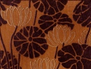
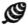

  
[Intangible Textual Heritage](../../index)  [Buddhism](../index.md) 
[Index](index)  [Previous](ptpl01)  [Next](ptpl03.md) 

------------------------------------------------------------------------

[Buy this Book at
Amazon.com](https://www.amazon.com/exec/obidos/ASIN/B0029U2W0U/internetsacredte.md)

------------------------------------------------------------------------

  
*Principal Teachings of The True Sect of Pure Land*, by Yejitsu Okusa,
\[1915\], at Intangible Textual Heritage

------------------------------------------------------------------------

p. iii

### CONTENTS.

|                                     |                                                                      |                                  |
|-------------------------------------|----------------------------------------------------------------------|----------------------------------|
|                                     | ILLUSTRATIONS.                            |                                  |
| 1\.                                 | [The Gateway to the Shrine at Higashi-Ōtani.](ptpl00.htm#img_pl01.md)   |                                  |
| 2\.                                 | [The Eastern Hongwanji Temple at Karasumaru.](ptpl00.htm#img_pl02.md)   |                                  |
|                                     |                                                                      |                                  |
|                                     | I. HISTORY.                               |                                  |
| Chapter. |                                                                      | Page. |
| I.                                  | Shinran Shōnin                                                       | [1](ptpl03.htm#page_1.md)           |
| II\.                                | The Hongwanji                                                        | [25](ptpl03.htm#page_25.md)         |
| III\.                               | The Eastern Hongwanji                                                | [42](ptpl04.htm#page_42.md)         |
|                                     |                                                                      |                                  |
|                                     | II. PRINCIPAL TEACHINGS OF THE TRUE SECT. |                                  |
| I.                                  | The Canonical Books                                                  | [51](ptpl06.htm#page_51.md)         |
| II\.                                | Systematisation                                                      | [56](ptpl06.htm#page_56.md)         |
| III\.                               | Why called the True Sect?                                            | [64](ptpl07.htm#page_64.md)         |
| IV\.                                | Salvation.                                                           | [70](ptpl08.htm#page_70.md)         |
| V.                                  | Faith                                                                | [81](ptpl09.htm#page_81.md)         |
| VI\.                                | Life.                                                                | [86](ptpl11.htm#page_86.md)         |

 

------------------------------------------------------------------------

[Next: I. Shinran Shōnin](ptpl03.md)
