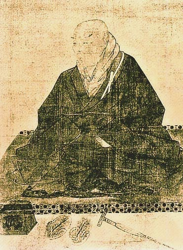

  
[Intangible Textual Heritage](../../index)  [Buddhism](../index) 

------------------------------------------------------------------------

[Buy this Book at
Amazon.com](https://www.amazon.com/exec/obidos/ASIN/1428600353/internetsacredte)

------------------------------------------------------------------------

<table width="75%">
<colgroup>
<col style="width: 50%" />
<col style="width: 50%" />
</colgroup>
<tbody>
<tr class="odd">
<td width="50%" data-valign="TOP"></td>
<td width="50%" data-valign="CENTER"><h1 id="shinran-and-his-work" data-align="CENTER">Shinran and His Work</h1>
<h2 id="by-arthur-lloyd" data-align="CENTER">by Arthur Lloyd</h2>
<h4 id="section" data-align="CENTER">[1910]</h4></td>
</tr>
</tbody>
</table>

------------------------------------------------------------------------

[Contents](#contents)    [Start Reading](sahw00)    [Page
Index](pageidx)    [Text \[Zipped\]](sahw.txt.gz)

------------------------------------------------------------------------

|                                                                                                                           |
|---------------------------------------------------------------------------------------------------------------------------|
|  |

The Reverend Arthur Lloyd spent many years in Japan as a missionary and
scholar. He extensively studied the Pure Land school of Buddhism,
particularly the Shinshu sect founded by Shinran Shonen (b. 1173, d.
1262). This book centers around Lloyd's translation of the 'Shoshinge'
or *Hymn of True Faith*, followed by extended commentary on the text
which illuminates many aspects of Shinshu belief and practice.

Lloyd, with his unique perspective, found numerous similarities between
Christianity and Buddhism at deep levels. Lloyd also wrote [The Creed of
Half Japan](../chj/index), also available at this site.

PRODUCTION NOTES: Short passages or words in
Japanese script in the text are replaced by a single hash sign (\#). The
Japanese text of the Shoshinge on pages 36-46 is presented as JPG page
images.--John Bruno Hare, December 22, 2008.

------------------------------------------------------------------------

 [Title Page](sahw00)  
[Preface](sahw01)  
[Contents](sahw02)  
[Chapter I. Introductory](sahw03)  
[Chapter II. The Shinshu in its relations to S’akyamuni and to Buddhism
in general](sahw04)  
[Chapter III. Shinran, the Founder of Shinshu.](sahw05)  
[Chapter IV. The Shinshu after Shinran's death.](sahw06)  
[Chapter V. The Shōshinge](sahw07)  
[Chapter VI. Objects of Worship](sahw08)  
[Chapter VII. Shintai and Zokutai.](sahw09)  
[Chapter VIII. Amida Nyorai.](sahw10)  
[Chapter IX. Hōzō Biku.](sahw11)  
[Chapter X. Shinnyo Hōshō.](sahw12)  
[Chapter XI. The Salvation of Sentient Beings.](sahw13)  
[Chapter XII. Of Faith in General, (i).](sahw14)  
[Chapter XIII. Of Faith in General, (ii).](sahw15)  
[Chapter XIV. After Justification.](sahw16)  
[Chapter XV. Hō-on.](sahw17)  
[Chapter XVI. Sōzoku.](sahw18)  
[Chapter XVII. Keijin.](sahw19)  
[Chapter XVIII. The Shinshu on Faith-healing.](sahw20)  
[Chapter XIX. The Care of the Dead. (A Shinshu Funeral.)](sahw21)  
[Chapter XX. The Care of the Dead. (ii) Days of Mourning &c.](sahw22)  
[Chapter XXI. Morning and Evening Prayers](sahw23)  
[Chapter XXII. Fasts and Festivals.](sahw24)  
[Chapter XXIII. Fasting.](sahw25)  
[Chapter XXIV. Conclusion](sahw26)  
[Appendix I. Kōmyōji.](sahw27)  
[Appendix II. Manichaean influences in the Shinshu](sahw28)  
[Appendix III. Caulaucau](sahw29)  
[Index of Japanese Terms and Sentences](sahw30)  
