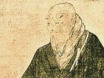

  
[Intangible Textual Heritage](../../index)  [Buddhism](../index.md) 
[Index](index)  [Previous](sahw25)  [Next](sahw27.md) 

------------------------------------------------------------------------

[Buy this Book at
Amazon.com](https://www.amazon.com/exec/obidos/ASIN/1428600353/internetsacredte.md)

------------------------------------------------------------------------

  
*Shinran and His Work*, by Arthur Lloyd, \[1910\], at Intangible Textual
Heritage

------------------------------------------------------------------------

p. 151

### Chapter XXIV.

### *Conclusion*.

(§ 100)

In the last paragraph of *Shinshu Hyakuwa* its author asks why it is
that, in spite of the great and attractive mercies of Amida, Faith
should be so rare and so feeble in this land of Japan.

He finds the answer, partly, in the material tendencies of the present
day, and in the fact that the struggle for existence is now so severe
that men find less and less time to spare for purposes of religion. The
answer is a true one as far as it goes. There is a great deal of
materialism in the world, and undoubtedly the love of many, as well as
their faith, has waxed cold. But a busy man is not of necessity a
materialist, and a Faith which can be focussed as it were, in a
burning-glass, would seem to be just the faith for the busy merchant.

Another partial answer he finds in the comparative absence of good karma
in the present day. There has been much evil in the past, hence, in the
present, there are but few whose karma fits them to hear and receive the
Gospel of Amida. Shinshuism is not the only form of Faith which is
suffering from an evil karma in the present produced by sloth and
indifference (to say the least of it) in the past. In the case of the
Shinshu, I would also suggest that that unfortunate paragraph about
*uso* and *kakehiki* must have something to do with the low estate

p. 152

in the present, and may have more to do, if lest uncorrected, with
Shinshu decadence in the future.

There are three things, says the author, that even a Buddha cannot do.

When once the first step of a firm resolve to obtain Salvation has been
taken, he cannot stop or change the process of Salvation which has thus
begun. That is one thing that limits his power: he cannot run counter to
himself.

Nor can he save a man against his will. He may plant the seed in the
soil, but if the man neglect to water and fertilize it, the seed will
produce nothing.

And he cannot exhaust the world of Sentient Beings. For, supposing all
men now living to be saved, and to come no more into this world of
condemnation, fruitful Nature would still teem with fresh generations
springing out of her exhaustless womb. The world will always have in it
a majority of unsaved persons. [\*](#fn_116.md)

We have, therefore, says. our author, nothing to do but to wait for the
swinging of the pendulum which shall once more make religion a matter of
prime interest in Japan, at the present moment so frankly materialistic.

In the mean time, it will be a distinct gain if it should come to be
realized that East and West have more in common than a few years ago we
of Europe ever dreamed of, even in our wildest moments. It

p. 153

will be a real strength to humanity and to the feeling of brotherhood
amongst men, when we can say that, though the terms in which our Faith
is expressed are different, and though the courses of our spiritual
training have hitherto lain far apart from one another, yet, underlying
it all, there has been an almost identical Faith in the One Father and
the One Saviour, and that the Law (of Buddha) is the School-master which
is leading Japan and China to Christ. [\*](#fn_117.md)

------------------------------------------------------------------------

### Footnotes

[152:\*](sahw26.htm#fr_116.md) The three things
that are impossible are this expressed:

1\. Ketsujōgō wo tenzuru koto atawadzu.

2\. Mu-en no shūjō wo dosuru koto atawadzu.

3\. Shūjōkai wo tsukusu koto atawadzu.

[153:\*](sahw26.htm#fr_117.md) I leave to the
Appendix the discussion of what I may call the sources of Shinshu
Theology.

------------------------------------------------------------------------

[Next: Appendix I. Kōmyōji.](sahw27.md)
