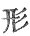
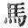
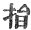
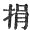
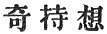
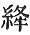
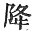
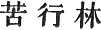

  
[Intangible Textual Heritage](../../index)  [Buddhism](../index.md) 
[Index](index)  [Previous](sbe1907)  [Next](sbe1909.md) 

------------------------------------------------------------------------

p. 59

# KIOUEN II.

### VARGA 6. THE RETURN OF *K*ANDAKA [1](#fn_139.md).

And now the night was in a moment gone, and sight restored to all
created things, (when the royal prince) looked thro’ the wood, and saw
the abode of Po-ka, the *Ri*shi; \[the hermitage of the Bhârgavides, see
Burnouf, Introduction to Ind. Bud. p. 385\]; .
418

The purling streams so exquisitely pure and sparkling, and the wild
.beasts all unalarmed at man, caused the royal prince's heart to exult.
Tired, the horse [2](#fn_140.md) stopped of his
own will, to breathe. . 419

'This, then,' he thought, 'is a good sign and fortunate, and doubtless
indicates divine approval [3](#fn_141.md).' And
now he saw belonging to the *Ri*shi, the various vessels [4](#fn_142) used for (asking.md) charity; . 420

And (other things) arranged by him in order, without the slightest trace
of negligence. Dismounting then he stroked his horse's head, and cried,
'You now have borne me (well)!' . 421

p. 60

With loving eyes he looked at *K*andaka, (eyes) like the pure cool
surface of a placid lake (and said), 'Swift-footed! like a horse in
pace, yea! swift as any light-winged bird, .
422

'Ever have you followed after me when riding, and deeply have I felt my
debt of thanks, but not yet had you been tried in other ways; I only
knew you as a man true-hearted, . 423

'My mind now wonders at your active powers of body; these two I now
begin to see (are yours); a man may have a heart most true and faithful,
but strength of body may not too be his; .
424

'Bodily strength and perfect honesty of heart, I now have proof enough
are yours. (To be content) to leave [1](#fn_143.md) the tinselled world, and with swift foot
to follow me, . 425

'Who would do this but for some profit, if without profit to his
kin [2](#fn_144.md), who would not shun it? but
you, with no private aim, have followed me, not seeking any present
recompense; . 426

'As we nourish and bring up a child, to bind together and bring honour
to a family; so we also reverence and obey a father, to gain (obedience
and attention) from a begotten son; . 427

'In this way all think of their own advantage; but you have come with me
disdaining profit; with many words I cannot hold you here, so let me say
in brief to you, . 428

'We have now ended our relationship; take, then, my horse and ride back
again; for me, during the

p. 61

long night past [1](#fn_145.md), that place I
sought to reach now I have obtained.' .
429

Then taking off his precious neck-chain, he handed it to *K*andaka,
'Take this,' he said, 'I give it you, let it console you in your
sorrow;' . 430

The precious [2](#fn_146.md) jewel in the tire
(sic--JBH) that bound his head, bright-shining, lighting up his person,
taking off and placing in his extended palm, like the sun which lights
up Sumeru, . 431

He said, 'O *K*andaka! take this gem, and going back to where my father
is, take the jewel and lay it reverently [3](#fn_147.md) before him, to signify my heart's
relation to him; . 432

'And then, for me, request the king to stifle every fickle feeling of
affection, and. say that I, to escape from birth and age and death, have
entered on the wild (forest) [4](#fn_148.md) of
painful discipline, . 433

'Not that I may get a heavenly birth, much less because I have no
tenderness of heart, or that I

p. 62

cherish any cause of bitterness, but only that I may escape this weight
of sorrow; . 434

'The accumulated long-night [1](#fn_149.md) weight
of covetous desire (love), I now desire to ease the load (cause a
break), so that it may be overthrown for ever; therefore I seek the way
(cause) of ultimate escape; . 435

'If I should obtain emancipation, then shall I never need to put away my
kindred [2](#fn_150.md), to leave my home, to
sever ties of love. O! grieve not for your son! .
436

'The five desires of sense beget the sorrow [3](#fn_151.md); those held by lust themselves induce
the sorrow; my very ancestors, victorious kings, thinking (their throne)
established and immovable, . 437

'Have handed down to me their kingly wealth; I, thinking only on
religion, put it all away; the royal mothers at the end of life their
cherished treasures leave for their sons, .
438

'Those sons who covet much such worldly profit; but I rejoice to have
acquired religious wealth; if you say that I am young and tender, and
that the time for seeking wisdom is not come, .
439

'You ought to know that to seek true religion, there never is a time not
fit; impermanence and fickleness [4](#fn_152.md),
the hate of death, these ever follow us, .
440

'And therefore I (embrace) the present day, convinced

p. 63

that now is time to seek religion [1](#fn_153.md).
With such entreaties as the above, you must make matters plain on my
behalf; . 441

'But, pray you cause my father not to think longingly after me; let him
destroy all recollection of me [2](#fn_154.md),
and cut out from his soul the ties of love; .
442

'And you, grieve not [3](#fn_155.md) because of
what I say, but recollect to give the king my message.' *K*andaka
hearing respectfully the words of exhortation, blinded and confused
through choking sorrow, . 443

With hands outstretched did worship; and answering the prince, he spoke,
'The orders that you give me, will, I fear, add grief to grief; . 444

'And sorrow thus increased will deepen, as the elephant who struggles
into deeper mire. When the ties of love are rudely snapped, who, that
has any heart, would not grieve! . 445

'The golden ore may still by stamping be broken up, how much more the
feelings choked with sorrow [4](#fn_156.md)! the
prince has grown up in a palace [5](#fn_157.md),
with every care bestowed upon his tender person, . 446

'And now he gives his body to the rough and thorny forest; how will he
be able to bear a life of privation [6](#fn_158.md)? When first you ordered me to equip your
steed, my mind was indeed sorely troubled, .
447

p. 64

'But the heavenly powers urged me on, causing me to hasten the
preparation (of the horse [1](#fn_159).md), but
what is the intention that urges the prince, to resolve thus to leave
his secure palace? . 448

'The people of Kapilavastu, and all the country afflicted with grief;
your father, now an old man, mindful of his son, loving him moreover
tenderly [2](#fn_160.md); .
449

'Surely this determination to leave your home, this is not according to
duty; it is wrong, surely, to disregard father and mother,--we cannot
speak of such a thing with propriety! .
450

'Gotamî, too, who has nourished you so long, fed you with milk when a
helpless child, such love as hers cannot easily be forgotten; it is
impossible surely to turn the back on a benefactor; . 451

'The highly gifted (virtuous) mother of a child, is ever respected by
the most distinguished families [3](#fn_161.md);
to inherit distinction [4](#fn_162.md) and then to
turn round, is not the mark of a distinguished man: . 452

The illustrious child of Ya*s*odharâ, who has inherited a kingdom,
rightly governed, his years now gradually ripening, should not thus go
away from and forsake his home; . 453

But though he has gone away from his royal father, and forsaken his
family and his kin, forbid it

p. 65

he should still drive me away, let me not depart from the feet of my
master; . 454

'My heart is bound to thee, as the heat is (bound up [1](#fn_163).md) in the boiling water; I cannot return
without thee to my country; to return and leave the prince thus, in the
midst of the solitude of the desert [2](#fn_164.md), . 455

'Then should I be like Sumantra [3](#fn_165.md)
(Sumantra), who left and forsook Râma; and now if I return alone to the
palace, what words can I address to the king? .
456

'How can I reply to the reproaches of all the dwellers in the palace
with suitable words? Therefore let the prince rather tell me, how I may
truly [4](#fn_166.md) describe, . 457

'And with what device, the disfigured body, and the merit-seeking
condition of the hermit! I am full of fear and alarm, my tongue can
utter no words; . 458

'Tell me then what words to speak; but who is there in the empire will
believe me? If I say that the moon's rays are scorching, there are men,
perhaps, who may believe me; . 459

'But they will not believe that the prince, in his conduct, will act
without piety; (for) the prince's heart is sincere and refined, always
actuated with pity and love to men. . 460

'To be deeply affected with love, and yet to

p. 66

forsake (the object of love), this surely is opposed to a constant mind.
O then, for pity's sake! return to your home, and thus appease my
foolish longings.' . 461

The prince having listened to *K*andaka, pitying his grief expressed in
so many words, with heart resolved and strong in its determination,
spoke thus to him once more, and said: .
462

'Why thus on my account do you feel the pain of separation? you should
overcome this sorrowful mood, it is for you to comfort yourself; . 463

'All creatures, each in its way, foolishly arguing that all things are
constant, would influence me to-day not to forsake my kin and relatives;
. 464

'But when dead and come to be a ghost, how then, let them say, can I be
kept? My loving mother when she bore me, with deep affection painfully
carried me, . 465

'And then when born she died, not permitted to nourish me. One alive,
the other dead, gone by different roads, where now shall she be found?
. 466

'Like as in a wilderness on some high tree all the birds living with
their mates assemble in the evening and at dawn disperse, so are the
separations of the world; . 467

'The floating clouds rise (like) a high mountain, from the four quarters
they fill the void, in a moment again they are separated and disappear;
so is it with the habitations of men; .
468

'People from the beginning have erred thus, binding themselves in
society and by the ties of love, and then, as after a dream, all is
dispersed; do not then recount the names of my relatives; . 469

'For like the wood which is produced in spring,

p. 67

gradually grows and brings forth its leaves, which again fall in the
autumn-chilly-dews--if the different parts of the same body are thus
divided-- 470

'How much more men who are united in society! and how shall the ties of
relationship escape rending? Cease therefore your grief and
expostulation, obey my commands and return home; . 471

'The thought of your return alone will save me, and perhaps after your
return I also may come back. The men of Kapilavastu, hearing that my
heart is fixed, . 472

'Will dismiss from their minds all thought of me, but you may make known
my words, "when I have escaped from the sad ocean of birth and death,
then afterwards I will come back again; .
473

'"But I am resolved, if I obtain not my quest, my body shall perish in
the mountain wilds."' The white horse hearing the prince, as he uttered
these true and earnest words, . 474

'Bent his knee and licked his foot, whilst he sighed deeply and wept.
Then the prince with his soft and glossy palm, (fondly) stroking the
head of the white, horse, . 475

(Said), 'Do not let sorrow rise (within), I grieve indeed at losing you,
my gallant steed [1](#fn_167.md)--so strong and
active, your merit now has gained its end [2](#fn_168.md); . 476

'You shall enjoy for long a respite from an evil birth [3](#fn_169.md), but for the present take as your
reward [4](#fn_170.md)

p. 68

these precious jewels and this glittering sword, and with them follow
closely after *K*andaka.' . 477

The prince then drawing forth his sword, glancing in the light as the
dragon's eye, (cut off) the knot of hair with its jewelled stud [1](#fn_171.md), and forthwith cast it into space; . 478

Ascending upwards to the firmament, it floated there as the wings of the
phoenix then all the Devas of the Trayastri*m*sa [2](#fn_172.md) heavens seizing the hair, returned with
it to their heavenly abodes; . 479

Desiring always to adore the feet (offer religious service), how much
rather now possessed of the crowning locks, with unfeigned piety do they
increase their adoration, and shall do till the true law has died away.
. 480

Then the royal prince thought thus, 'My adornments now are gone for
ever, there only now remain these silken garments, which are not in
keeping with a hermit's life.' . 481

Then the Deva of the Pure abode, knowing the heart-ponderings of the
prince, transformed himself into a hunter's likeness, holding his bow,
his arrows in his girdle, . 482

His body girded with a Kashâya [3](#fn_173.md)-colour’d robe, thus he advanced in front
of the prince. The prince

p. 69

considering this garment of his, the colour of the ground, a fitting
pure attire, . 483

Becoming to the utmost the person of a *Ri*shi, not fit for [1](#fn_174.md) a hunter's dress, forthwith called to
the hunter, as he stood before him, in accents soft, and thus addressed
him: . 484

'That dress of thine belikes me much, as if it were not foul [2](#fn_175.md), and this my dress I'll give thee in
exchange, so please thee.' . 485

The hunter then addressed the prince, Although I ill can spare (am not
unattached to) this garment, which I use as a disguise among the deer,
that alluring them within reach I may kill them, . 486

'Notwithstanding, as it so pleases you, I am now willing to bestow it in
exchange for yours.' The hunter having received the sumptuous dress,
took again his heavenly body. . 487

The prince and *K*andaka, the coachman, seeing this, thought
deeply [3](#fn_176.md) thus, 'This garment is of
no common character, it is not what a worldly man has worn;' . 488

And in (the prince's) heart great joy arose, as he regarded the coat
with double reverence, and forthwith giving all the other things [4](#fn_177.md) to *K*andaka, he himself was clad in it,
of Kashâya colour; . 489

p. 70

Then like the dark and lowering cloud [1](#fn_178.md), that surrounds the disc of the sun or
moon, he for a moment gazed, scanning his steps (way), then entered on
the hermit's grot; .490

*K*andaka following him with (wistful) eyes, his body disappeared, nor
was it seen again. 'My lord and master now has left his father's house,
his kinsfolk and myself (he cried), . 491

'He now has clothed himself in hermit's garb [2](#fn_179.md), and entered the painful [3](#fn_180.md) forest;' raising his hands he called on
Heaven, o’erpowered with grief he could not move; . 492

Till holding by the white steed's neck, he tottered forward on the
homeward road, turning again and often looking back, his steps (body)
going on, his heart back-hastening, . 493

Now lost in thought and self-forgetful, now looking down to earth, then
raising up his drooping (eye) to heaven, falling at times and then
rising again, thus weeping as he went, he pursued his way homewards.
. 494

------------------------------------------------------------------------

### Footnotes

[59:1](sbe1908.htm#fr_139.md) There was a tower
erected on the spot where Bodhisattva dismissed his coachman. See
Fah-hien, p. 92. The distance given by A*s*vaghosha, viz. three
yo*g*anas, or about twenty miles, is much more probable than the eight
hundred lis, given in later accounts as the length of Bodhisattva's
journey. Compare Fah-hien p. 92, note 2.

The name '*K*anna' may perhaps be more properly restored to '*K*andaka.'

[59:2](sbe1908.htm#fr_140.md) The text here seems
to require the alteration of 
 into  .

[59:3](sbe1908.htm#fr_141.md) Mi-tsang-li,
not-yet-advantage; or, unheard of, or miraculous, profit.

[59:4](sbe1908.htm#fr_142.md) 'Ying' is often used
for 'a proper measure vessel,' i.e. an alms dish.

[60:1](sbe1908.htm#fr_143.md) To reject and leave.
  for  .

[60:2](sbe1908.htm#fr_144.md) It may also be, 'to
himself and kin.'

[61:1](sbe1908.htm#fr_145.md) The long night is
the dark passage of continued transmigration, or change; the sense is,
that Bodhisattva having sought for the condition of being, or life, he
now has reached through a succession of previous births, the
relationship or connection with his charioteer as master and man, is at
an end.

[61:2](sbe1908.htm#fr_146.md) The head-jewel, or
kû*d*â-mâ*n*i. This crest-jewel is figured in various ways in Buddhist
art; as a rule it may be taken to indicate 'the highest' (the head), and
in this form it is placed on the head of the figures of Buddha (in
Ceylon); and is found at Sanchi and Amarâvati as an object of reverence;
it symbolises the supreme authority of Buddha, Dharma, Saṅgha.

[61:3](sbe1908.htm#fr_147.md) Or, holding the
jewel, worship reverently at the king's feet.

[61:4](sbe1908.htm#fr_148.md) The 'forest of
mortification,' i.e. the place where mortification was to be endured.
For an account of Bodhisattva's penance (six years' penance
\[Sha*d*varshika-vrata\]), see Râjendralâla Mitra's Buddha Gayâ, p. 26.

[62:1](sbe1908.htm#fr_149.md) The 'long night' of
previous life.

[62:2](sbe1908.htm#fr_150.md) As, for instance, in
the Vessantara *G*âtaka (birth), in which Bodhisattva gave up home,
children, and wife, in pursuance of religious perfection.

[62:3](sbe1908.htm#fr_151.md) The five desires are
the root of sorrow.

[62:4](sbe1908.htm#fr_152.md) This line may also
be rendered, impermanence, no fixed condition, this!'

[63:1](sbe1908.htm#fr_153) Convinced (resolved.md)
that this is the time to seek the practice of the law, i.e. to engage in
the work of religion.

[63:2](sbe1908.htm#fr_154.md) Let him destroy all
recollection of me as a form, or, a living perm: this does not forbid
him to recollect the office and dignity of Bodhisattva.

[63:3](sbe1908.htm#fr_155.md) Or, let not slip my
words.

[63:4](sbe1908.htm#fr_156.md) How much rather, may
the heart be broken, choked with sorrow!

[63:5](sbe1908.htm#fr_157.md) Concealed or kept
securely in his palace.

[63:6](sbe1908.htm#fr_158.md) Fu-hing; the
practice of austerities, or mortification.

[64:1](sbe1908.htm#fr_159.md) To hasten on the
decoration, i.e. the harnessing, of the horse.

[64:2](sbe1908.htm#fr_160.md) Or, thinking his son
beloved and in security.

[64:3](sbe1908.htm#fr_161.md) Illustrious families
or tribes are strong, or able, to wait upon or respect. There seems to
be a play here on two words: first, shing, illustrious or distinguished,
alluding to the *S*âkyas as a race of *G*inas or conquerors; secondly,
neng, able, alluding to the origin of the word *S*âkya, i.e. able.

[64:4](sbe1908.htm#fr_162.md) To obtain
'distinction;' still referring to the word shing; also in the next
lines. Consult also [p. 28](sbe1904.htm#page_28.md), note 2 supra.

[65:1](sbe1908.htm#fr_163.md) Or, my heart is
bound to thee, or cherishes thee, as the fire embraces the vessel set
over it.

[65:2](sbe1908.htm#fr_164.md) I have here inverted
the order of the lines, to bring out the sense.

[65:3](sbe1908.htm#fr_165.md) Sumantra, the
minister and charioteer of Da*s*aratha (Râmâya*n*a II, 14, 30).

[65:4](sbe1908.htm#fr_166.md) The order of these
lines is again inverted, as they are complicated in the original. The
word 'hu,' which I have translated 'truly,' may mean 'dumbly,' or,
'unfeelingly.

[67:1](sbe1908.htm#fr_167.md) Or, my gentle horse!

[67:2](sbe1908.htm#fr_168.md) This merit, or,
meritorious deed, is now completed.

[67:3](sbe1908.htm#fr_169.md) The idea is, that
the horse, in consequence of the merit he has acquired by bearing the
prince from his home, shall enjoy henceforward a higher state of
existence.

[67:4](sbe1908.htm#fr_170.md) 'A superior reward
now, for the present,' or, 'a better reward than that I now bestow,'
viz. the jewels &c.

[68:1](sbe1908.htm#fr_171.md) That is, the
'*k*û*d*â ma*n*i,' or hair ornament. This ornament is represented at
Sanchi and Bharhut (plates xxx and xvi respectively \['Tree and Serpent
Worship' and 'The Stûpa of Bharhut'). In the former plate the figure on
the upper floor with the women is probably Mâra seeing Bodhisattva
fulfilling his purpose).

[68:2](sbe1908.htm#fr_172.md) That is, the heaven
of the thirty-three gods supposed to be on the top of Sumeru.

[68:3](sbe1908.htm#fr_173.md) Kashâya, the dark
colour of the ground, adopted as the colour for their robes by the
Buddhists.

[69:1](sbe1908.htm#fr_174.md) This may also be
translated, 'a suitable colour for one who is the opposite of, i.e.
opposed to the occupation of, a hunter.'

[69:2](sbe1908.htm#fr_175.md) That is, as if it
were pure; there is a play on the expression 'not foul' or 'impure,'
meaning that the dress was itself of a dark or impure colour, and that
the occupation of the hunter made it more so.

[69:3](sbe1908.htm#fr_176.md) Thought 'deeply;'
the expression  means
'rare,' or, 'seldom-felt thought.'

[69:4](sbe1908.htm#fr_177.md) That is, as I
understand it, giving the remaining articles of his dress to *K*andaka.

[70:1](sbe1908.htm#fr_178.md) I have supposed that
  is for  . The robe is represented as
the cloud surrounding the bright person of Bodhisattva.

[70:2](sbe1908.htm#fr_179.md) He now has put on a
dark-colour’d robe.

[70:3](sbe1908.htm#fr_180.md) The painful forest;
that is, the forest or wood where painful mortification is practised.
 

------------------------------------------------------------------------

[Next: Varga 7. Entering the Place (Wood) of Austerities](sbe1909.md)
