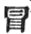
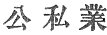

  
[Intangible Textual Heritage](../../index)  [Buddhism](../index.md) 
[Index](index)  [Previous](sbe1911)  [Next](sbe1913.md) 

------------------------------------------------------------------------

p. 111

# KIOUEN III.

### VARGA 10. BIMBASÂRA RÂ*G*A INVITES THE PRINCE.

The royal prince departing from the court-master (i.e. the Purohita) and
the great minister, Saddharma [1](#fn_299.md),
keeping along [2](#fn_300.md) the stream, then
crossing the Ganges, he took the road towards the Vulture Peak [3](#fn_301.md), . 777

p. 112

Hidden among the five mountains [1](#fn_302.md),
standing alone a lovely peak as a roof amid (the others). The trees and
shrubs and flowers in bloom, the flowing fountains, and the cooling
rills, . 778

(All these he gazed upon)--then passing on, he entered the city of the
five peaks, calm and peaceful, as one come down from heaven [2](#fn_303.md). The country folk, seeing the royal
prince, his comeliness and his excessive grace, .
779

Though young in years, yet glorious in his person, incomparable as the
appearance of a great master, seeing him thus, strange thoughts affected
them, as if they gazed upon the banner (curtain) of I*s*vara [3](#fn_304.md). . 780

They stayed the foot, who passed athwart the path; those hastened on,
who were behind.; those going before, turned back their heads and gazed
with earnest, wistful [4](#fn_305.md) look. . 781

The marks and distinguishing points of his person [5](#fn_306.md), on these they fixed their eyes without
fatigue, and then approached with reverent homage, joining both their
hands in salutation: . 782

p. 113

With all there was a sense of wondrous joy, as in their several ways
they offered what they had, looking at his noble and illustrious
features; bending down their bodies [1](#fn_307.md) modestly, .
783

Correcting every careless or unseemly gesture, thus they showed their
reverence to him silently [2](#fn_308.md); those
who with anxious heart, seeking release, were moved by love, with
feelings composed bowed down the more [3](#fn_309.md). . 784

Great men and women, in their several engagements [4](#fn_310.md), at the same time arrested on their way,
paid to his person and his presence homage: and following him as they
gazed, they went not back. . 785

For the white circle between his eyebrows [5](#fn_311.md) adorning his wide and violet
colour’d [6](#fn_312.md) eyes, his noble body
bright as gold, his pure and web-joined fingers, . 786

All these, though he were but a hermit, were marks of one who was a holy
king; and now the men and women of Râ*g*ag*ri*ha, the old and young
alike, were moved, . 787

(And cried), 'This man so noble as a recluse, what common joy is this
for us [7](#fn_313.md)!' At this time Bimbasâra
Râ*g*a, placed upon a high tower of observation, . 788

Seeing all those men and women, in different ways

p. 114

exhibiting one mark of surprise [1](#fn_314.md),
calling before him some man outside, enquired at once the cause of it;
. 789

This one bending his knee below the tower, told fully what he had seen
and heard, 'That one of the *S*âkya race, renowned of old, a prince most
excellent and wonderful, . 790

'Divinely wise, beyond the way of this world, a fitting king to rule the
eight regions, now without home, is here, and all men are paying homage
to him.' . 791

The king on hearing this was deeply moved at heart [2](#fn_315.md), and though his body was restrained, his
soul had gone [3](#fn_316.md). Calling his
ministers speedily before him, and all his nobles and attendants, . 792

He bade them follow secretly the (prince's) steps, to observe what
charity was given [4](#fn_317.md). (So in
obedience to the command) they followed and watched him steadfastly, as
with even gait and unmoved presence . 793

He entered on the town and begged his food, according to the rule of all
great hermits, with joyful mien and undisturbed mind, not anxious
whether much or little alms were given; .
794

Whatever he received, costly or poor, he placed within his bowl, then
turned back to the wood, and having eaten it and drank of the flowing
stream, he joyous sat upon the immaculate mountain [5](#fn_318.md). . 795

p. 115

(There he beheld) the green trees fringing with their shade the crags,
the scented flowers growing between the intervals, whilst the peacocks
and the other birds, joyously flying, mingled their notes; . 796

His sacred garments bright and lustrous, (shone) as the sun-lit mulberry
leaves; the messengers beholding his fixed composure, one by one
(returning), reported what they had seen; .
797

The king hearing it, was moved at heart, and forthwith ordered his royal
equipment to be brought, his god-like crown and his flower-bespangled
robes; then, as the lion-king, he strided forth, . 798

And choosing certain aged persons of consideration, learned men, able
calmly and wisely to discriminate, he (with them) led the way followed
by a hundred thousand people, who like a cloud ascended with the king
the royal mountain. . 799

And now beholding the dignity of Bodhisattva, every outward gesture
(spring of action) under government, sitting with ease upon the mountain
crag [1](#fn_319.md), as the moon shining limpid
in the pure heavens, . 800

So (was) his matchless beauty and purity of grace; then as the
converting presence of religion [2](#fn_320.md)
dwelling within the heart makes it reverential [3](#fn_321), so (beholding him.md) he reverently
approached, . 801

Even as divine *S*âkara comes to the presence of

p. 116

\[paragraph continues\] Mo-hi-su-ma [1](#fn_322.md), so with every outward form of courtesy
and reverence [2](#fn_323.md) (the king
approached) and asked him respectfully of his welfare. . 802

Bodhisattva, answering as he was moved [3](#fn_324.md), in his turn made similar enquiries.
Then the king, the questioning over, sat down with dignity upon a
clean-faced rock. . 803

And so he steadfastly beheld the divine appearance (of the prince), the
sweetness and complacency of his features [4](#fn_325.md) revealing [5](#fn_326.md) what his station was and high estate,
his family renown, received by inheritance, .
804

The king who for a time restrained his feelings, now wishful to get rid
of doubts, (enquired) (why one) descended from the royal family of the
sun-brightness having attended to religious sacrifices thro’ ten
thousand generations, . 805

Whereof the virtue had descended as his full inheritance, increasing and
accumulating until now [6](#fn_327), (why he.md)
so excellent in wisdom, so young in years, had now become a recluse,
. 806

Rejecting the position of a *K*akravartin's [7](#fn_328.md) son, begging his food, despising family
fame, his beauteous

p. 117

form, fit for perfumes and anointings, why clothed with coarse Kasâya
garments; . 807

The hand which ought to grasp the reins of empire, instead thereof,
taking its little stint of food; if indeed (the king continued) you were
not of royal descent, and would receive as an offering the transfer of
this land, . 808

Then would I divide with you my empire [1](#fn_329.md); saying this, he scarcely hoped to
excite his feelings, who had left his home and family, to be a hermit.
Then forthwith the king proceeded thus: .
809

'Give just weight I pray you to my truthful words, desire for power is
kin to nobleness, and so is just pride of fame or family or wealth or
personal appearance; . 810

'No longer having any wish to subdue the proud, or to bend (others) down
and so get thanks from men, it were better, then, to give to the strong
and warlike martial arms to wear, for them to follow war and by their
power to get supremacy; . 811

'But when by one's own power a kingdom falls to hand, who would not then
accept the reins of empire? The wise man knows the time to take
religion, wealth, and worldly pleasure. .
812

'But if he obtains not [2](#fn_330.md) the three
(or, threefold profit), then in the end he abates his earnest efforts,
and reverencing religion, he lets go material wealth. Wealth is the one
desire [3](#fn_331.md) of worldly men; . 813

p. 118

'To be rich and lose all desire for religion, this is to gain but
outside wealth. But to be poor and even thus despise religion, what
pleasure can indulgence give in such a case! .
814

'But when possessed of all the three, and when enjoyed with reason and
propriety, then religion, wealth, and pleasure make what is rightly
called a great master; . 815

'Permit not, then, your perfectly-endowed body to lay aside (sacrifice)
its glory, without reward (merit); Mandha(ri) the *K*akravartin, as a
monarch, ruled the four empires of the world, .
816

'And shared with *S*akra his royal throne, but was unequal to the task
of ruling heaven. But you, with your redoubtable strength, may well
grasp both heavenly and human power; . 817

'I do not rely upon my kingly power [1](#fn_332.md), in my desire to keep you here by force,
but seeing you change your comeliness of person, and wearing the
hermit's garb, . 818

'Whilst it makes me reverence you for your virtue, moves me with pity
and regret for you as a man; you now go begging your food, and I offer
you (desire to offer) the whole land as yours; .
819

'Whilst you are young and lusty enjoy yourself [2](#fn_333.md). During middle life acquire wealth, and
when old and all your abilities ripened, then is the time for following
the rules of religion; . 820

'When young to encourage religious fervour, is to destroy the sources of
desire; but when old and

p. 119

the breath (of desire) is less eager, then is the time to seek religious
solitude; . 821

'When old we should avoid, as a shame, desire of wealth, but get honour
in the world by a religious life; but when young, and the heart light
and elastic, then is the time to partake of pleasure, . 822

'In boon companionship to indulge in gaiety, and partake to the full of
mutual intercourse; but as-years creep on, giving up indulgence, to
observe the ordinances of religion, . 823

'To mortify the five desires, and go on increasing a joyful and
religious heart, is not this the law of the eminent kings of old, who as
a great company paid worship to heaven, .
824

'And borne on the dragon's back, received the joys of celestial abodes?
All these divine and victorious monarchs, glorious in person, richly
adorned, . 825

'Thus having as a company performed their religious offering, in the end
received the reward of their conduct in heaven.' Thus Bimbasâra Râ*g*a
(used) every kind of winning expedient in argument; . 826

The royal prince unmoved and fixed remained firm as Mount Sumeru.

------------------------------------------------------------------------

### Footnotes

[111:1](sbe1912.htm#fr_299.md) Saddharma may be
the name of the minister, or it may be rendered 'the great minister of
the true law,' i.e. of religion.

[111:2](sbe1912.htm#fr_300.md) For the symbol
  I have substituted   'to go towards.' The whole
line may be translated 'following the turbulent (streams) he crossed the
Ganges,' in this case  
would be for  . But the
sentence is obscure, as 'lang tsai' may be a proper name.

[111:3](sbe1912.htm#fr_301.md) The distance from
the place of the interview with the ministers to the Vulture Peak would
be in a straight line about 150 miles. In the Southern books
(Nidâna-kathâ; Buddhist Birth Stories, by Mr. Rhys Davids, pp. 85 and 87
n.) it is said that from Kapilavastu to the River Anomâ, near which the
interview took place, is thirty yo*g*anas; this is greatly in excess of
the real distance, which is about thirty-three miles, or five yo*g*anas.
Then again from the Anomâ River, or the village of Maneya (Mhaniya),
where the Bodhisattva halted (see Romantic Legend of Buddha, p. 140, and
compare vol. xii, plate viii, Archæological Survey of India), to
Râ*g*ag*ri*ha by way of Vai*s*âlî would not be more than 180 miles, so
that the whole distance from Kapilavastu (assuming Bhuila to represent
this old town) would be about 215 miles, or about thirty yo*g*anas.
Hence we assume that the thirty yo*g*anas of the Southern account is
intended to represent the entire distance from Kapilavastu, and not from
the River Anomâ. Mr. Rhys Davids supposes the distance from Kapilavastu
to Râ*g*ag*ri*ha (viâ Vai*s*alî) to be sixty yo*g*anas (loc. cit. Birth
Stories). In the Southern account the journey from the Anomâ to
Râ*g*ag*ri*ha is described as having been accomplished in one day.

[112:1](sbe1912.htm#fr_302.md) The five mountains,
viz., which surrounded Râ*g*ag*ri*ha, see Fah-hian, p. 112 n. The text
seems to imply that the Vulture Peak towered above the others, but its
base was hidden among the five.

[112:2](sbe1912.htm#fr_303.md) As a Deva, outside
(heaven).

[112:3](sbe1912.htm#fr_304.md) The banner of
I*s*vara (Indra) is frequently represented in Buddhist sculptures. There
is a pleasing figure of it in Mrs. Speir's Ancient India, p. 230; see
also Tree and Serpent Worship, plate xxxviii and elsewhere.

[112:4](sbe1912.htm#fr_305.md) Unsatisfied look,
that is, constant or fixed gaze.

[112:5](sbe1912.htm#fr_306.md) The marks and
distinguishing points are the signs to be found on the person of one
destined to be a Buddha. In the text the expression 'on the four limbs'
means 'on the body.'

[113:1](sbe1912.htm#fr_307.md) Their different
bodies, or forms.

[113:2](sbe1912.htm#fr_308.md) Silently they added
their respectful homage.

[113:3](sbe1912.htm#fr_309.md) These lines seem to
refer to the ease of mind given to the care-worn by the presence of
Bodhisattva.

[113:4](sbe1912.htm#fr_310.md) Whether engaged on
public or private affairs; so at least the text seems to mean,  .

[113:5](sbe1912.htm#fr_311.md) That is, the urna,
or circle of hair, supposed to be on the forehead of every great man.

[113:6](sbe1912.htm#fr_312.md) The colour is
indefinite blue-like; compare the Greek κύανος.

[113:7](sbe1912.htm#fr_313.md) That is, 'what an
occasion for uncommon joy is this!'

[114:1](sbe1912.htm#fr_314.md) Scared in different
ways, assuming one attitude, or unvarying attitude; the line simply
means they all showed the same indication of astonishment.

[114:2](sbe1912.htm#fr_315.md) Rejoiced with fear,
or with astonishment.

[114:3](sbe1912.htm#fr_316.md) His body held (to
the place), his soul (shin) had already hastened, i.e. to the spot where
Bodhisattva was.

[114:4](sbe1912.htm#fr_317.md) Or, what religious
offering should be made.

[114:5](sbe1912.htm#fr_318.md) The White Mountain,
meaning probably the Royal Mountain.

[115:1](sbe1912.htm#fr_319.md) On the lofty abode
of the mountain (peak).

[115:2](sbe1912.htm#fr_320.md) This expression is
singular, it will hear no other translation than this, 'the converting
body (or, presence) of the law, i.e. religion.'

[115:3](sbe1912.htm#fr_321.md) Or, causes
reverence (on the part of the beholder).

[116:1](sbe1912.htm#fr_322.md) Probably the symbol
ma is here used for va, in which case the name would be restored to
Mâhe*s*vara.

[116:2](sbe1912.htm#fr_323.md) It is difficult to
render such passages as this literally, but it might be translated thus,
'With collected air and every mark of decorum.'

[116:3](sbe1912.htm#fr_324.md) That is, according
to the circumstances of the enquiry.

[116:4](sbe1912.htm#fr_325.md) The sweet
expression blended with a joyfulness of countenance.

[116:5](sbe1912.htm#fr_326.md) Or it may be
rendered, 'Correctly hearing his name and high degree,' as though one of
the king's attendants had whispered the name and family of Bodhisattva
in his ear.

[116:6](sbe1912.htm#fr_327.md) Largely possessed
(or, collected) in his own person.

[116:7](sbe1912.htm#fr_328.md) Son of a holy king.

[117:1](sbe1912.htm#fr_329.md) The absence of
covetousness in Bimbasâra has passed into a proverb or a typical
instance in Buddhist literature. (Compare A*s*vaghosha's Sermons,
passim.)

[117:2](sbe1912.htm#fr_330.md) If he desires not
to possess the three, that is, wealth, pleasure, religion.

[117:3](sbe1912.htm#fr_331.md) Wealth affects
(makes) all men of the world.

[118:1](sbe1912.htm#fr_332.md) That is, I do not
command you as a king, but desire you to share my kingly power.

[118:2](sbe1912.htm#fr_333.md) Receive the
pleasure of the five enjoyments (of sense), i.e. the indulgence of the
five senses.

------------------------------------------------------------------------

[Next: Varga 11. The Reply To Bimbasâra Râ*g*a](sbe1913.md)
