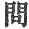
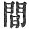
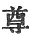

  
[Intangible Textual Heritage](../../index)  [Buddhism](../index) 
[Index](index)  [Previous](sbe1913)  [Next](sbe1915) 

------------------------------------------------------------------------

### VARGA 12. VISIT TO ARÂ*D*A UDRARÂMA [1](#fn_349).

The child of the glorious sun of the Ikshvâku race, going to that quiet
peaceful grove, reverently stood before the Muni, the great *Ri*shi
Arâ*d*a Râma, . 919

The dark-clad (?) followers of the Kalam (Saṅghârâma) seeing afar off
Bodhisattva approaching, with loud voice raised a joyful chant, and with
suppressed breath muttered 'Welcome,' .
920

As with clasped hands they reverenced him. Approaching one another, they
made mutual enquiries; and this being done, with the usual apologies,
according to their precedence (in age) [2](#fn_350) they sat down; .
921

The Brahma*k*ârins observing the prince, (beheld) his personal beauty
and carefully considered his

p. 132

appearance; respectfully [1](#fn_351) they
satisfied themselves of his high qualities, like those who, thirsty,
drink the 'pure dew.' . 922

(Then) with raised hands they addressed the prince, 'Have you [2](#fn_352) (or, may we know whether you have) been
long an ascetic, divided from your family and broken from the bonds of
love, like the elephant who has cast off restraint? . 923

'Full of wisdom (your appearance), completely enlightened, (you seem)
well able to escape the poisonous fruit (of this world) [3](#fn_353). In old time the monarch Ming Shing
 [4](#fn_354) (brightly victorious) gave up his
kingly estate to his son, . 924

'As a man who has carried a flowery wreath, when withered casts it away:
but such is not your case, full of youthful vigour, and yet not
enamoured with the condition of a holy king; .
925

'We see that your will is strong and fixed, capable of becoming a vessel
of the true law, able to embark in the boat of wisdom, and to cross over
the sea of life and death: . 926

'The common class [5](#fn_355), enticed to come
to learn, their talents first are tested, then they are taught; but as I
understand your case, your mind is already fixed and your will firm:
. 927

p. 133

'And now you have undertaken the purpose of learning, (I am persuaded)
you will not in the end shrink from it.' The prince hearing this
exhortation, with gladness made reply: .
928

'You have with equal intention, illustrious [1](#fn_356)! cautioned me with impartial mind; with
humble heart I accept the advice, and pray that it may be so with me,
(as you anticipate); . 929

'That I may in my night journey obtain a torch, to guide me safely thro’
treacherous places; a handy boat to cross over the sea;--may it be so
even now with me! . 930

'But as I am somewhat in doubt and anxious to learn, I will venture to
make known my doubts, and ask, with respect to old age, disease, and
death, how are these things to be escaped?' .
931

At this time O-lo-lam (Arâ*d*a Kâlâma) hearing the question asked by the
prince, briefly from the various Sûtras and *S*âstras, quoted passages
in explanation of a way of deliverance. .
932

'But thou (he said) illustrious youth! so highly gifted, and eminent
among the wise! hear what I have to say, as I discourse upon the mode of
ending birth and death; . 933

'Nature, and change, birth, old age, and death, these five (attributes)
belong to all [2](#fn_357); "nature" is (in
itself) [3](#fn_358) pure and without fault;
the involution of this with the five elements [4](#fn_359), . 934

p. 134

'Causes an awakening and power of perception, which, according to its
exercise [1](#fn_360), is the cause of
"change;" form, sound, order, taste, touch, these are called the five
objects of sense (dhâtu); . 935

'As the hand and foot are called the "two ways" (methods of moving?) so
these are called "the roots" of action (the five skandhas); the eye, the
ear, the nose, the tongue, the body, these are named the "roots"
(instruments) of understanding. . 936

'The root of "mind" (manas) [2](#fn_361) is
twofold, being both material, and also intelligent; "nature" by its
involutions is "the cause," the knower of the cause is "I" (the soul);
. 937

'Kapila the *Ri*shi and his numerous followers, on this deep principle
of "soul [3](#fn_362)," practising wisdom
(Buddhi), found deliverance. . 938

'Kapila and now Vâ*k*aspati [4](#fn_363), by
the power of "Buddhi" perceiving the character of birth, old age, and
death, declare that on this is founded true philosophy [5](#fn_364); . 939

'Whilst all opposed to this, they say, is false. "Ignorance" and
"passion," causing constant "transmigration," .
940

p. 135

'Abiding in the midst of these (they say) is the lot of "all that
lives." Doubting the truth of "soul" is called "excessive doubt," and
without distinguishing aright, there can be no method of escape. . 941

'Deep speculation as to the limits of perception is but to involve the
"soul;" thus unbelief leads to confusion, and ends in differences of
thought and conduct. . 942

'Again, the various speculations on "soul" (such as) "I say," "I know
and perceive," "I come" and "I go" or "I remain fixed," these are called
the intricacies (windings) of "soul" [1](#fn_365)' . 943

'And then the fancies raised in different natures, some saying "this is
so," others denying it, and this condition of uncertainty is called the
state of "darkness [2](#fn_366)." . 944

'Then there are those who say that outward things (resembling forms) are
one with "soul," who say that the "objective" is the same as "mind," who
confuse "intelligence" with "instruments," who say that "number" is the
"soul." . 945

'Thus not distinguishing aright, these are called "excessive quibbles,"
"marks of folly," "nature changes," and so on. .
946

'To worship and recite religious books, to slaughter living things in
sacrifice, to render pure by fire and water, and thus awake the thought
of final rescue, . 947

'All these ways of thinking are called "without right expedient," the
result of ignorance and doubt, by means of word or thought or deed;
. 948

p. 136

'Involving outward relationships, this is called "depending on means;"
making the material world the ground of "soul," this is called
"depending on the senses." . 949

'By these eight sorts of speculation are we involved in birth and death.
The foolish masters of the world make their classifications in these
five ways, (viz.) . 950

'Darkness, folly, and great folly, angry passion, with timid fear.
Indolent coldness is called "darkness;" birth and death are called
"folly;" . 951

'Lustful desire is "great folly;" because of great men subjected to
error [1](#fn_367), cherishing angry feelings,
"passion" results; trepidation of the heart is called "fear." . 952

'Thus these foolish men dilate upon the five desires; but the root of
the great sorrow of birth and death, the life destined to be spent in
the five ways, . 953

'The cause of the whirl of life, I clearly perceive, is to be placed in
the existence of "I;" because of the influence of this cause, result the
consequences of repeated birth and death; .
954

'This cause is without any nature of its own, and its fruits have no
nature; rightly considering what has been said, there are four matters
which have to do with escape, . 955

'Kindling wisdom--opposed to dark ignorance,--making manifest--opposed
to concealment and obscurity,--if these four matters be understood, then
we may escape birth, old age, and death. .
956

p. 137

'Birth, old age, and death being over, then we attain a final place; the
Brahmans [1](#fn_368) all depending on this
principle, . 957

'Practising themselves in a pure life, have also largely dilated on it,
for the good of the world.' The prince hearing these words again
enquired of Ârâ*d*a: . 958

'Tell me what are the expedients you name, and what is the final place
to which they lead, and what is the character of that pure (Brahman)
life; and again what are the stated periods .
959

'During which such life must be practised, and during which such life is
lawful; all these are principles to be enquired into; and on them I pray
you discourse for my sake.' . 960

Then that Ârâ*d*a, according to the Sûtras and *S*âstras, spoke,
'Yourself using wisdom is the expedient; but I will further dilate on
this a little; . 961

'First by removing from the crowd and leading a hermit's life, depending
entirely on alms for food, extensively practising rules of decorum,
religiously adhering to right rules of conduct, .
962

'Desiring little and knowing when to abstain, receiving whatever is
given (in food), whether pleasant or otherwise, delighting to practise a
quiet (ascetic) life, diligently studying all the Sûtras and *S*âstras,
. 963

'Observing the character of covetous longing and fear, without remnant
of desire to live in purity, to govern well the organs of life, the mind
quieted and silently at rest, . 964

'Removing desire, and hating vice, all the sorrows

p. 138

of life (the world of desire) put away, then there is happiness; and we
obtain the enjoyment of the first [1](#fn_369)
dhyâna. . 965

'Having obtained this first dhyâna, then with the illumination thus
obtained, by inward meditation is born reliance on thought alone, and
the entanglements of folly are put away; .
966

'The mind depending on this, then after death, born in the Brahma
heavens, the enlightened are able to know themselves; by the use of
means is produced further inward illumination; .
967

'Diligently persevering, seeking higher advance, accomplishing the
second dhyâna, tasting of that great joy, we are born in the
Kwong-yin [2](#fn_370) heaven (Abhâsvara);
. 968

'Then by the use of means putting away this delight, practising the
third dhyâna, resting in such delight and wishing no further excellence,
there is a birth in the *S*ubhak*ri*tsna (hin-tsing) heaven; . 969

'Leaving the thought of such delight, straightway we reach the fourth
dhyâna, all joys and sorrows done away, the thought of escape produced,
. 970

'We dwell in this fourth dhyâna, and are born in the V*ri*hat-phala
heaven; because of its long enduring years, it is thus called
V*ri*hat-phala (extensive-fruit); . 971

'Whilst in that state of abstraction rising (higher), perceiving there
is a place beyond any bodily condition, adding still and persevering
further in practising wisdom, rejecting this fourth dhyâna, . 972

p. 139

'Firmly resolved to persevere in the search, still contriving to put
away every desire after form, gradually from every pore of the body
there is perceived a feeling of empty release, .
973

'And in the end this extends to every solid part, so that the whole is
perfected in an apprehension of emptiness. In brief, perceiving no
limits to. this emptiness, there is opened to the view boundless
knowledge. . 974

'Endowed with inward rest and peace, the idea of "I" departs, and the
object of "I:" clearly discriminating the non-existence of matter
(bhava), this is the condition of immaterial life. . 975

'As the Mu*ñg*a (grass) when freed from its horny case, or as the wild
bird which escapes from its prison trap, so, getting away from all
material limitations, we thus find perfect release. . 976

Thus ascending above the Brahmans (Brahmalokas?), deprived of every
vestige of bodily existence, we still endure [1](#fn_371). Endued with wisdom [2](#fn_372)! let it be known this is real and true
deliverance. . 977

You ask what are the expedients for obtaining this escape; even as I
have before detailed, those who have deep faith will learn. . 978

'The *Ri*shis *G*aigîshavya, *G*anaka, V*ri*ddha Parâ*s*ara [3](#fn_373), and other searchers after truth, . 979

'All by the way I have explained, have reached true deliverance.' The
prince hearing these words, deeply pondering on the outline of these
principles, . 980

And reaching back to the influences produced by

p. 140

our former lives, again asked with further words: 'I have heard your
very excellent system of wisdom, the principles very subtle and
deep-reaching, . 981

'From which I learn that because of not "letting go" (by knowledge as a
cause), we do not reach the end of the religious life; but by
understanding nature in its involutions, then, you say, we obtain
deliverance; . 982

'I perceive this law of birth has also concealed in it another law as a
germ; you say that the "I" (i.e. "the soul," of Kapila) being rendered
pure [1](#fn_374), forthwith there is true
deliverance; . 983

'But if we encounter a union of cause and effect, then there is a return
to the trammels of birth; just as the germ in the seed, when earth,
fire, water, and wind . 984

'Seem to have destroyed in it the principle of life, meeting with
favourable concomitant circumstances will yet revive, without any
evident cause, but because of desire; so those who have gained this
supposed release, (likewise) . 985

'Keeping the idea of "I" and "living things," have in fact gained no
final deliverance; in every condition, letting go the "three
classes [2](#fn_375)" and again reaching the
three [3](#fn_376) "excellent qualities," . 986

'Because of the eternal existence of soul, by the subtle influences of
that, (influences resulting from the past,) the heart lets go the idea
of expedients, . 987

'And obtains an almost endless duration of years. This, you say, is true
release; you say "letting go the ground on which the idea of soul
rests," that this frees us from "limited [4](#fn_377) existence," .
988

p. 141

'And that the mass of people have not yet removed the idea of soul, (and
are therefore still in bondage). But what is this letting go
"gu*n*as [1](#fn_378)" (cords fettering the
soul); if one is fettered by these "gu*n*as," how can there be release?
. 989

'For gu*n*î (the object) and "gu*n*a" (the quality) in idea are
different, but in substance one; if you say that you can remove the
properties of a thing (and leave the thing) by arguing it to the end,
this is not so. . 990

'If you remove heat from fire, then there is no such thing as fire, or
if you remove surface (front) from body, what body can remain? . 991

'Thus "gu*n*a" is as it were surface, remove this and there can be no
"gu*n*î." So that this deliverance, spoken of before, must leave a body
yet in bonds. . 992

'Again, you say that by "clear knowledge" you get rid of body; there is
then such a thing as knowledge or the contrary; if you affirm the
existence of clear knowledge, then there should be some one who
possesses it (i.e. possesses this knowledge); .
993

'If there be a possessor, how can there be deliverance (from this
personal "I")? If you say there is no "knower," then who is it that is
spoken of as "knowing?" . 994

'If there is knowledge and no person, then the subject of knowledge may
be a stone or a log; moreover, to have clear knowledge of these minute
causes of contamination and reject them thoroughly, . 995

'These being so rejected, there must be an end, then, of the "doer."
What Arâ*d*a has declared cannot satisfy my heart. . 996

p. 142

'This clear knowledge is not "universal wisdom," I must go on and seek a
better explanation.' Going on then to the place of Udra [1](#fn_379) *Ri*shi, he also expatiated on this
question of 'I.' . 997

(But) although he refined the matter to the utmost, laying down a term
of 'thought' and 'no thought' taking the position of removing 'thought'
and 'no thought,' yet even so he came not out of the mire; . 998

For supposing creatures attained that state, still (he said) there is a
possibility of returning to the coil, whilst Bodhisattva sought a method
of getting out of it. So once more leaving Udra *Ri*shi, . 999

He went on in search of a better system, and came at last to Mount
Kia-*k*e [2](#fn_380) \[the forest of
mortification\], where was a town called Pain-suffering forest
(Uravilva?). Here the five Bhikshus had gone before. . 1000

When then he beheld these five, virtuously keeping in check their senses
(passion-members), holding to the rules of moral conduct, practising
mortification, dwelling in that grove of mortification [3](#fn_381); . 1001

Occupying a spot beside the Naira*ñg*ana river, perfectly composed and
filled with contentment, Bodhisattva forthwith by them (selecting) one
spot, quietly gave himself to thought. .
1002

The five Bhikshus knowing him with earnest heart to be seeking escape,
offered him their services with devotion, as if reverencing Î*s*vara
Deva. . 1003

p. 143

Having finished their attentions and dutiful services, then going on he
took his seat not far off, as one about to enter on a course of
religious practice, composing all his members as he desired. . 1004

Bodhisattva diligently applied himself to 'means,' as one about to cross
over old age, disease, and death. With full purpose of heart (he set
himself) to endure mortification, to restrain every bodily passion, and
give up thought about sustenance, . 1005

With purity of heart to observe the fast-rules, which no worldly man
(active man) can bear; silent and still, lost in thoughtful meditation;
and so for six years he continued, . 1006

Each day eating one hemp grain, his bodily form shrunken and attenuated,
seeking how to cross (the sea) of birth and death, exercising himself
still deeper and advancing further; . 1007

Making his way perfect by the disentanglements of true wisdom, not
eating, and yet not (looking to that as) a cause (of emancipation), his
four members although exceedingly weak, his heart of wisdom increasing
yet more and more in light; . 1008

His spirit free, his body light and refined, his name spreading far and
wide, as 'highly gifted,' even as the moon when first produced, or as
the Kumuda flower spreading out its sweetness; .
1009

Everywhere thro’ the country his excellent fame extended; the daughters
of the lord of the place both coming to see him, his mortified body like
a withered branch, just completing the period of six years, . 1010

Fearing the sorrow of birth and death, seeking earnestly the method
(cause) of true wisdom, he

p. 144

came to the conviction that these were not the means to extinguish
desire and produce ecstatic contemplation; .
1011

Nor yet (the means by which) in former time, seated underneath the
*G*ambu tree [1](#fn_382), he arrived at that
miraculous condition, that surely was the proper way, (he thought),
. 1012

The way opposed to this of 'withered body.' I should therefore rather
seek strength of body, by drink and food refresh my members, and with
contentment cause my mind to rest. . 1013

My mind at rest, I shall enjoy silent composure; composure is the trap
for getting ecstasy (dhyâna); whilst in ecstasy perceiving the true law
(right law, i.e. truth), then the force of truth (the law) obtained,
disentanglement will follow. . 1014

And thus composed, enjoying perfect quiet, old age and death are put
away; and then defilement is escaped by this first means; thus then by
equal steps the excellent law results from life restored by food and
drink. . 1015

Having carefully considered this principle, bathing in the Naira*ñg*ana
river, he desired afterwards to leave the water (pool), but owing to
extreme exhaustion was unable to rise; .
1016

Then a heavenly spirit holding out (pressing down) a branch, taking this
in his hand he (raised himself and) came forth. At this time on the
opposite side of the grove there was a certain chief herdsman, . 1017

Whose eldest daughter was called Nandâ. One of the *S*uddhavâsa Devas
addressing her said, 'Bodhisattva

p. 145

dwells in the grove, go you then, and present to him a religious
offering.' . 1018

Nandâ Balada (or Bala*g*a or Baladhya) with joy came to the spot, above
her hands (i.e. on her wrists) white chalcedony bracelets, her clothing
of a grey (bluish) colour (dye); . 1019

The grey and the white together contrasted in the light, as the colours
of the rounded river bubble; with simple heart and quicken’d step she
came, and, bowing down at Bodhisattva's feet, .
1020

She reverently offered him perfumed rice milk, begging him of his
condescension to accept it [1](#fn_383).
Bodhisattva taking it, partook of it (at once), whilst she received,
even then, the fruits of her religious act. .
1021

Having eaten it, all his members refreshed, he became capable of
receiving Bodhi; his body and limbs glistening with (renewed strength),
and his energies swelling higher still [2](#fn_384), . 1022

As the hundred streams swell the sea, or the first quarter’d moon daily
increases in brightness. The five Bhikshus having witnessed this,
perturbed, were filled with suspicious reflection; . 1023

They supposed (said) that his religious zeal (heart) was flagging, and
that he was leaving and looking for a better abode, as though he had
obtained deliverance, the five elements entirely removed [3](#fn_385). . 1024

p. 146

Bodhisattva wandered on alone, directing his course to that
'fortunate [1](#fn_386)' tree, beneath whose
shade he might accomplish his search after complete enlightenment [2](#fn_387). . 1025

(Over) the ground wide and level, producing soft and pliant grass,
easily he advanced with lion step, pace by pace, (whilst) the earth
shook withal; . 1026

And as it shook, Kâla nâga aroused, was filled with joy, as his eyes
were opened to the light. Forthwith he exclaimed: 'When formerly I saw
the Buddhas of old, there was the sign of an earthquake as now; . 1027

'The virtues of a Muni are so great in majesty, that the great earth
cannot endure [3](#fn_388) them; as step by
step his foot treads upon the ground, so is there heard the sound of the
rumbling earth-shaking; . 1028

'A brilliant light now illumes the world, as the shining of the rising
sun; five hundred bluish tinted birds (I see), wheeling round to the
right, flying through space; . 1029

'A gentle, soft, and cooling breeze blows around in an agreeable way;
all these auspicious (miraculous) signs are the same as those of former
Buddhas; . 1030

'Wherefore I know that this Bodhisattva will certainly arrive at perfect
wisdom. And now, behold! from yonder man, a grass cutter, he obtains
some pure and pliant grass, . 1031

'Which spreading out beneath the tree, with upright body, there he takes
his seat; his feet placed

p. 147

under him, not carelessly arranged (moving to and fro), but like the
firmly fixed and compact body of a Nâga; .
1032

'Nor shall he rise again from off his seat till he has completed his
undertaking.' And so he (the Nâga) uttered these words by way of
confirmation. The heavenly Nâgas, filled with joy, . 1033

(Caused a) cool refreshing breeze to rise; the trees and grass were yet
unmoved by it, and all the beasts, quiet and silent, (looked on in
wonderment.) . 1034

These are the signs that Bodhisattva will certainly attain
enlightenment. . 1035

------------------------------------------------------------------------

### Footnotes

[131:1](sbe1914.htm#fr_349) The compound in the
original probably represents Ârâ*d*a Kâlâma and Udra(ka) Râmaputra.

[131:2](sbe1914.htm#fr_350) Tsi’ang tsu may
mean 'after invitation.'

[132:1](sbe1914.htm#fr_351) 'High qualities,'
powers of his mind; probably the same as the tai*g*asa of the *G*ainas
(see Colebrooke, Essays, p. 282). This line may be literally.
translated, 'bathing themselves in a respectful admiration of his high
qualities.'

[132:2](sbe1914.htm#fr_352) The symbol '*k*i'
may possibly mean 'friend,' in which case the line would be, 'O friend!
have you long been a homeless one?'

[132:3](sbe1914.htm#fr_353) Or the poisonous
fruit of that which is low or base.

[132:4](sbe1914.htm#fr_354) I have taken 'Ming
Shing' as a proper name, but it may be also translated 'illustrious
conquering (kings).'

[132:5](sbe1914.htm#fr_355) 'Fan fu,' the
common class of philosophers, or students. The vulgar herd.

[133:1](sbe1914.htm#fr_356) Or, 'illustriously
admonished me without preference or dislike;' or 'against preference or
dislike.'

[133:2](sbe1914.htm#fr_357) The discourse
following is very obscure, being founded on the philosophical
speculations of Kapila and others.

[133:3](sbe1914.htm#fr_358) Or, Nature is that
which is pure and unsullied (tabula rasa).

[133:4](sbe1914.htm#fr_359) The five 'great'
(Mahat).

[134:1](sbe1914.htm#fr_360) That is, as the
power of perception is exercised, 'change' is experienced.

[134:2](sbe1914.htm#fr_361) Refer to
Colebrooke, on the Sâṅkhya philosophy.

[134:3](sbe1914.htm#fr_362) Much of this
discourse might be illustrated from the Chinese version of the seventy
golden *S*astra' (Sâṅkhya Kârikâ) of Kapila; but the subject would
require distinct treatment.

[134:4](sbe1914.htm#fr_363) This verse is
obscure, and the translation doubtful. Literally rendered it runs as
follows: 'That Kapila (or, that which Kapila said) now (is affirmed
respecting) Pra*g*âpatî \[po-*k*e-po-ti; this may be restored to
Vâkpati, or to Pra*g*âpatî; the latter however (as I am told) is the
reading found in the Sanskrit original\] (by the power of) Buddhi,
knowing birth,' &c.

[134:5](sbe1914.htm#fr_364) This, they say, is
called 'to see.'

[135:1](sbe1914.htm#fr_365) The 'soul' is the
'I' (aha*m*kâra) of the Sâṅkhya system, concerning which see Colebrooke
(Essays), p. 153.

[135:2](sbe1914.htm#fr_366) Tamas.

[136:1](sbe1914.htm#fr_367) Literally 'great
men producing error,' or it may be 'because of the birth-error
(delusion) of great men.'

[137:1](sbe1914.htm#fr_368) The Brahmans in the
world.

[138:1](sbe1914.htm#fr_369) The dhyânas are the
conditions of ecstasy, enjoyed by the inhabitants of the Brahmaloka
heavens.

[138:2](sbe1914.htm#fr_370) We have here an
account of the different heavens of the Brahmalokas, concerning which
consult Burnouf, 'Introduction to Indian Buddhism.'

[139:1](sbe1914.htm#fr_371) Literally,
'endurance not exhausted.'

[139:2](sbe1914.htm#fr_372) That is, 'O thou!
endued with wisdom,' or, generally, 'those endued with wisdom.'

[139:3](sbe1914.htm#fr_373) These proper names
were supplied from the Sanskrit text.

[140:1](sbe1914.htm#fr_374) See Colebrooke,
l.c. p. 150.

[140:2](sbe1914.htm#fr_375) Three sorts of
pain.

[140:3](sbe1914.htm#fr_376) Perception,
inference, affirmation.

[140:4](sbe1914.htm#fr_377) Bhava.

[141:1](sbe1914.htm#fr_378) Colebrooke, p. 157.

[142:1](sbe1914.htm#fr_379) Yuh-to.

[142:2](sbe1914.htm#fr_380) Gayâ, or
Gayâ*s*îrsha.

[142:3](sbe1914.htm#fr_381) Or is the word
fu-hing = the name of a plant, such as the uruvu (betel)?

[144:1](sbe1914.htm#fr_382) See above, [p.
48](sbe1907.htm#page_48), ver. 335.

[145:1](sbe1914.htm#fr_383) See Tree and
Serpent Worship, plate I.

[145:2](sbe1914.htm#fr_384) This is a free
translation; the text is probably defective,   being a mistake for   or for  .

[145:3](sbe1914.htm#fr_385) 'The five
elements,' in the original 'the five great;' the sense seems to be that
the Bodhisattva was acting as though he had attained his aim, and
overcome the powers of sense. At the same p.
146 time it is possible that 'the five great' may allude to the
five Bhikshus. But in any case it is better to hold to the literal
sense.

[146:1](sbe1914.htm#fr_386) The 'fortunate
tree,' the tree 'of good omen,' the Bodhi tree.

[146:2](sbe1914.htm#fr_387) Samyak-Sambodhi.

[146:3](sbe1914.htm#fr_388) Cannot excel or
surpass them.

------------------------------------------------------------------------

[Next: Varga 13. Defeats Mâra](sbe1915)
