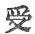
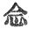

  
[Intangible Textual Heritage](../../index)  [Buddhism](../index) 
[Index](index)  [Previous](sbe1915)  [Next](sbe1917) 

------------------------------------------------------------------------

### VARGA 14. O-WEI-SAN-POU-TI (ABHISAMBODHI) [1](#fn_402).

Bodhisattva having subdued Mâra, his firmly fixed mind at rest,
thoroughly exhausting the first principle of truth [2](#fn_403), he entered into deep and subtle
contemplation, . 1111

Self-contained. Every kind of Sâmadhi in order passed before his eyes.
During the first watch he entered on 'right perception [3](#fn_404),' and in recollection all former births
passed before his eyes; . 1112

Born in such a place, of such a name, and downwards to his present
birth, so through hundreds, thousands, myriads, all his births and
deaths he knew; . 1113

Countless in number were they, of every kind and sort; then knowing,
too, his family relationships, great pity rose within his heart. . 1114

This sense of deep compassion passed, he once again considered 'all that
lives,' and how they moved within the six [4](#fn_405) portions of life's revolution, no final
term to birth and death; . 1115

p. 157

Hollow all, and false and transient (unfixed) as the plantain tree, or
as a dream, or phantasy. Then in the middle watch of night, he reached
to knowledge (eyes) of the pure Devas [1](#fn_406), . 1116

And beheld before him every creature, as one sees images upon a mirror;
all creatures born and born again to die, noble and mean, the poor and
rich, . 1117

Reaping the fruit of right or evil doing, and sharing happiness or
misery in consequence. First he considered and distinguished evil-doers
(works), that such must ever reap an evil birth; . 1118

Then he considered those who practise righteous deeds, that these must
gain a place with men or gods; but those again born in the nether hells,
(he saw) participating in every kind of misery; .
1119

Swallowing (drinking) molten brass (metal), the iron skewers piercing
their bodies, confined within the boiling caldron, driven and made to
enter the fiery oven (dwelling), . 1120

Food for hungry, long-toothed dogs, or preyed upon by brain-devouring
birds; dismayed by fire, then (they wander through) thick woods, with
leaves like razors gashing their limbs, .
1121

While knives divide their (writhing) bodies, or hatchets lop their
members, bit by bit; drinking the bitterest poisons, their fate yet
holds them back from death. . 1122

Thus those who found their joy in evil deeds, he saw receiving now their
direst sorrow; a momentary taste of pleasure here, a dreary length of
suffering there; . 1123

A laugh or joke because of others' pain, a crying

p. 158

out and weeping now at punishment received. Surely if living creatures
saw the consequence of all their evils deeds, self-visited, . 1124

With hatred would they turn and leave them, fearing the ruin
following--the blood and death. He saw, moreover, all the fruits of
birth as beasts, each deed entailing its own return, . 1125

(And) when death ensues born in some other form (beast shape), different
in kind according to the deeds. Some doomed to die for the sake of skin
or flesh [1](#fn_407), some for their horns or
hair or bones or wings, . 1126

Others torn or killed in mutual conflict, friend or relative before,
contending thus; (some) burthened with loads or dragging heavy weights,
(others) pierced and urged on by pricking goads, . 1127

Blood flowing down their tortured forms, parched and hungry--no relief
afforded; then, turning round, (he saw) one with the other struggling,
possessed of no independent strength; .
1128

Flying through air or sunk in deep water, yet no place as a refuge left
from death. He saw, moreover, those, misers and covetous, born now as
hungry ghosts, . 1129

Vast bodies like the towering mountain, with mouths as small as any
needle-tube, hungry and thirsty, nought but fire and poison’d flame to
enwrap their burning forms within. . 1130

Covetous, they would not give to those who sought, or duped the man who
gave in charity, now born among the famished ghosts, they seek for food,
but cannot find withal. . 1131

The refuse of the unclean man they fain would

p. 159

eat, but this is changed and lost (before it can be eaten); oh! if a man
believes that covetousness is thus repaid, as in their case, . 1132

Would he not give his very flesh in charity even as *S*ivi râ*g*a did!
Then, once more (he saw), those reborn as men, with bodies like some
foul sewer, . 1133

Ever moving ’midst the direst sufferings, born from the womb to fear and
trembling, with body tender, touching anything its feelings painful, as
if cut with knives; . 1134

Whilst born in this condition, no moment free from chance of death,
labour, and sorrow, yet seeking birth again, and being born again,
enduring pain. . 1135

Then (he saw those who) by a higher merit were enjoying heaven; a thirst
for love ever consuming them, their merit ended with the end of life,
the five signs [1](#fn_408) warning them of
death (their beauty fades), . 1136

Just as the blossom that decays, withering away, is robbed of all its
shining tints; not all their associates, living still, though grieving,
can avail to save the rest; . 1137

The palaces and joyous precincts empty now, the Devîs all alone and
desolate, sitting or asleep upon the dusty earth, weep bitterly in
recollection of their loves; . 1138

Those who are born, sad in decay; those who are dead, belovéd, cause of
grief; thus ever struggling on, preparing future pain, covetous they
seek the joys of heaven, . 1139

p. 160

Obtaining which, these sorrows come apace; despicable joys! oh, who
would covet them! using such mighty efforts (means) to obtain, and yet
unable thence to banish pain. . 1140

Alas, alas! these Devas, too, alike deceived--no difference is there!
thro’ lapse of ages bearing suffering, striving to crush desire and
lust, . 1141

Now certainly expecting long reprieve, and yet once more destined to
fall! in hell enduring every kind of pain, as beasts tearing and killing
one the other, . 1142

As Pretas parched with direst thirst, as men worn out, seeking
enjoyment; although, they say, when born in heaven, 'then we shall
escape these greater ills,' . 1143

Deceived, alas! no single place exempt, in every birth incessant pain!
Alas! the sea of birth and death revolving thus--an ever-whirling
wheel--1144

All flesh immersed within its waves cast here and there without
reliance! thus with his pure Deva eyes he thoughtfully considered the
five domains of life. . 1145

He saw that all was empty and vain alike! with no dependence! like the
plantain or the bubble. Then, on the third eventful watch, he entered on
the deep, true [1](#fn_409) apprehension [2](#fn_410); . 1146

He meditated on the entire world of creatures, whirling in life's
tangle, born [3](#fn_411) to sorrow; the crowds
who live, grow old, and die, innumerable for multitude, . 1147

p. 161

Covetous, lustful, ignorant, darkly-fettered, with no way known for
final rescue. Rightly considering, inwardly he reflected from what
source birth and death proceed; . 1148

He was assured that age and death must come from birth as from a source.
For since a man has born with him a body, that body must inherit pain
(disease). . 1149

Then looking further whence comes birth, he saw it came from life-deeds
done elsewhere; then with his Deva-eyes scanning these deeds, he saw
they were not framed by I*s*vara; . 1150

They were not self-caused, they were not personal existences, nor were
they either uncaused; then, as one who breaks the first bamboo joint
finds all the rest easy to separate, .
1151

Having discerned the cause of birth and death, he gradually came to see
the truth; deeds come from upâdâna (cleaving), like as fire which
catches hold of grass; . 1152

Upâdâna (tsu) comes from t*ri*sh*n*â (’ngai), just as a little fire
enflames the mountains; t*ri*sh*n*â comes from vedanâ (shau), (the
perception of pain and pleasure, the desire for rest); . 1153

As the starving or the thirsty man seeks food and drink, so 'sensation'
(perception) brings 'desire' for life; then contact (spar*s*a) is the
cause of all sensation, producing the three kinds of pain or pleasure,
. 1154

Even as by art of man the rubbing wood produces fire for any use or
purpose; spar*s*a (contact) is born from the six entrances
(âyatanas) [1](#fn_412),

p. 162

(a man is blind because he cannot see the light) [1](#fn_413); . 1155

The six entrances are caused by name and thing, just as the germ grows
to the stem and leaf; name and thing are born from knowledge
(vi*gñ*ana), as the seed which germinates and brings forth leaves. . 1156

Knowledge, in turn, proceeds from name and thing, the two are
intervolved leaving no remnant; by some concurrent cause knowledge
engenders name and thing, whilst by some other cause concurrent, name
and thing engender knowledge; . 1157

Just as a man and ship advance together, the water and the land mutually
involved [2](#fn_414); thus knowledge brings
forth name and thing; name and thing produce the roots (âyatanas); . 1158

The roots engender contact; contact again brings forth sensation;
sensation brings forth longing desire; longing desire produces upâdâna;
. 1159

Upâdâna is the cause of deeds; and these again engender birth; birth
again produces age and death; so does this one incessant round . 1160

Cause the existence of all living things. Rightly illumined, thoroughly
perceiving this, firmly established, thus was he enlightened; destroy
birth, old age and death will cease; .
1161

Destroy bhava then will birth cease; destroy 'cleaving' (upâdâna) then
will bhava end; destroy t*ri*sh*n*â (desire) then will cleaving end;
destroy sensation then will t*ri*sh*n*â end; .
1162

p. 163

Destroy contact then will end sensation; destroy the six entrances, then
will contact cease; the six entrances all destroyed, from this,
moreover, names and things will cease; .
1163

Knowledge destroyed, names and things [1](#fn_415) will cease; sa*m*skâra (names and,
things) destroyed, then knowledge perishes; ignorance destroyed, then
the sa*m*skâra [2](#fn_416) will die; the great
*Ri*shi was thus perfected in wisdom (sambodhi). . 1164

Thus perfected, Buddha then devised for the world's benefit the
eightfold path, right sight, and so on, the only true path for the world
to tread. . 1165

Thus did he complete the end (destruction) of 'self,' as fire goes out
for want of grass; thus he had done what he would have men do; he first
had found the way of perfect knowledge; .
1166

He finished thus the first great lesson (paramârtha); entering the great
*Ri*shi's house [3](#fn_417), the darkness
disappeared; light coming on, perfectly silent, all at rest, . 1167

He reached at last the exhaustless source of truth (dharma); lustrous
with all wisdom the great *Ri*shi sat, perfect in gifts, whilst one
convulsive throe shook the wide earth. .
1168

And now the world was calm again and bright, when Devas, Nâgas, spirits,
all assembled, amidst the void raise heavenly music, and make their
offerings as the law [4](#fn_418) directs;
. 1169

A gentle cooling breeze sprang up around, and

p. 164

from the sky a fragrant rain distilled; exquisite flowers, not
seasonable [1](#fn_419), bloomed; sweet fruits
before their time were ripened; . 1170

Great Mandâras [2](#fn_420), and every sort of
heavenly precious flower, from space in rich confusion fell, as
tribute [3](#fn_421) to the illustrious monk.
. 1171

Creatures of every different kind were moved one towards the other
lovingly; fear and terror altogether put away, none entertained a
hateful thought; . 1172

And all things living in the world with faultless men [4](#fn_422) consorted freely; the Devas giving up
their heavenly joys, sought rather to alleviate the sinner's sufferings;
. 1173

Pain and distress grew less and less, the moon of wisdom waxed apace;
whilst all the *Ri*shis of the Ikshvâku clan who had received a heavenly
birth, 1174.

Beholding Buddha thus benefitting men, were filled with joy and
satisfaction; and whilst throughout the heavenly mansions religious
offerings fell as raining flowers, . 1175

The Devas and the Nâga spirits [5](#fn_423),
with one voice, praised the Buddha's virtues; men seeing the religious
offerings, hearing, too, the joyous hymn of praise, . 1176

Were all rejoiced in turn; they leapt for unrestrained

p. 165

joy; Mâra, the Devarâ*g*a, only, felt in his heart great anguish. . 1177

Buddha for those seven days, in contemplation lost, his heart at peace,
beheld and pondered on the Bodhi tree, with gaze unmoved and never
wearying: . 1178

'Now resting here, in this condition, I have obtained,' he said, 'my
ever-shifting [1](#fn_424)heart's desire, and
now at rest I stand, escaped from self [2](#fn_425).' The eyes of Buddha [3](#fn_426) then considered 'all that lives,' . 1179

And forthwith rose there in him deep compassion; much he desired to
bring about their welfare (purity), but how to gain for them that most
excellent deliverance, . 1180

From covetous desire, hatred, ignorance, and false. teaching (this was
the question); how to suppress this sinful heart by right direction; not
by anxious use . of outward means, but by resting quietly in thoughtful
silence. . 1181

Now looking back and thinking of his mighty vow, there rose once more
within his mind a wish to preach the law; and looking carefully
throughout the world, he saw how pain and sorrow ripened and increased
everywhere. . 1182

Then Brahma-deva knowing his thoughts, and considering [4](#fn_427) it right to request him to advance
religion for the wider spread of the Brahma-glory, in the deliverance of
all flesh from sorrow, . 1183

p. 166

Coming, beheld upon the person of the reverend monk all the
distinguishing marks of a great preacher, visible in an excellent
degree; fixed and unmoved (he sat) in the possession of truth and
wisdom, . 1184

Free from all evil impediments, with a heart cleansed from all
insincerity or falsehood. Then with reverent and a joyful heart, (great
Brahma stood and) with hands joined, thus made known his request: . 1185

'What happiness in all the world so great as when a loving master meets
the unwise [1](#fn_428); the world with all its
occupants, filled with impurity and dire confusion [2](#fn_429), . 1186

'With heavy grief oppressed, or, in some cases, lighter sorrows, (waits
deliverance); the lord of men, having escaped by crossing the wide and
mournful sea of birth and death, . 1187

'We now entreat to rescue others--those struggling creatures all
engulphed therein; as the just worldly man, when he gets profit, gives
some rebate withal [3](#fn_430), . 1188

'So the lord of men enjoying such religious gain, should [4](#fn_431) also give somewhat to living things. The
world indeed is bent on large personal gain, and hard it is to share
one's own with others; . 1189

'O! let your loving heart be moved with pity towards the world
burthened [5](#fn_432) with vexing cares.'

p. 167

\[paragraph continues\] Thus having spoken
by way of exhortation, with reverent mien he turned back to the Brahma
heaven. . 1190

Buddha regarding the invitation of Brahma-deva rejoiced at heart, and
his design was strengthened; greatly was his heart of pity nourished,
and purposed was his mind to preach. .
1191

Thinking he ought to beg some food, each of the four kings offered him a
Pâtra; Tathâgata [1](#fn_433), in fealty to
religion, received the four and joined them all in one. . 1192

And now some merchant men were passing by, to whom 'a virtuous
friend [2](#fn_434),' a heavenly spirit, said:
'The great *Ri*shi, the venerable monk, is dwelling in this mountain
grove, . 1193

'(Affording) in the world a noble field for merit [3](#fn_435); go then and offer him a sacrifice!'
Hearing the summons, joyfully they went, and offered the first meal
religiously. . 1194

Having partaken of it, then he deeply pondered, who first should hear
the law [4](#fn_436); he thought at once of
Arâ*d*a Kâlâma and Udraka Râmaputra, .
1195

p. 168

As being fit to accept the righteous law; but now they both were dead.
Then next he thought of the five men, that they were fit to hear the
first sermon. . 1196

Bent then on this design to preach Nirvâ*n*a [1](#fn_437), as the sun's glory bursts thro’ the
darkness, so went he on towards Benares, the place where dwelt the
ancient *Ri*shis; . 1197

With eyes as gentle as the ox king's, his pace as firm and even as the
lion's, because he would convert the world he went on towards the
Kâ*s*i [2](#fn_438) city; . 1198

Step by step, like the king of beasts, did he advance watchfully through
the grove of wisdom (Uruvilva wood). .
1199

------------------------------------------------------------------------

### Footnotes

[156:1](sbe1916.htm#fr_402) The condition that
looks wisdom face to face.

[156:2](sbe1916.htm#fr_403) 'Eternally
exhausting the highest truth' (paramartha).

[156:3](sbe1916.htm#fr_404) The word for
'perception' is vedanâ (sheu).

[156:4](sbe1916.htm#fr_405) The six modes of
birth (transmigration).

[157:1](sbe1916.htm#fr_406) Deva sight.

[158:1](sbe1916.htm#fr_407) That is, some born
as beasts, whose hides are of value, and for which they are killed.

[159:1](sbe1916.htm#fr_408) The five signs are
the indications of a Deva's life in heaven coming to an end.

[160:1](sbe1916.htm#fr_409)   for  .

[160:2](sbe1916.htm#fr_410) That is, the deep
apprehension of truth.

[160:3](sbe1916.htm#fr_411) Sorrow
self-natured.

[161:1](sbe1916.htm#fr_412) The six organs of
sense.

[162:1](sbe1916.htm#fr_413) This clause is
obscure, it may mean, 'blind to darkness therefore he sees.'

[162:2](sbe1916.htm#fr_414) It is difficult to
catch the meaning here; literally translated the passage runs thus:
'Water and dry land cause mutual involution.'

[163:1](sbe1916.htm#fr_415) Here evidently
equivalent to sa*m*skâra.

[163:2](sbe1916.htm#fr_416) Sa*m*skâra, i.e.
the five skandhas, or constituents of individual life.

[163:3](sbe1916.htm#fr_417) I. e. attained
Nirvâ*n*a.

[163:4](sbe1916.htm#fr_418) 'As the law
directs;' that is, 'religious offerings' (dharma dâna).

[164:1](sbe1916.htm#fr_419) 'Not seasonable;'
that is, out of season; or, before their season.

[164:2](sbe1916.htm#fr_420) The Mahâ Mandâra,
or Mandârava; one of the five trees of the paradise of Indra (Wilson);
the Erythrina fulgens. See Burnout, Lotus, p. 306.

[164:3](sbe1916.htm#fr_421) As a religious
offering to the Muni-lord.

[164:4](sbe1916.htm#fr_422) Wou lau *g*in,
leakless men. It means that all things living consorted freely with the
good.

[164:5](sbe1916.htm#fr_423) The Devas, Nâgas,
and heavenly spirits (kwei shin).

[165:1](sbe1916.htm#fr_424) My heart which has
experienced constant and differing birth-changes.

[165:2](sbe1916.htm#fr_425) Wou-ngo, in a
condition without personal (ngo) limitations. The sense seems to be,
that, by casting away the limitations of the finite, he had apprehended
the idea of the infinite.

[165:3](sbe1916.htm#fr_426) The eye of Buddha;
the last of the pa*ñk*a*k*akkhus, for which see Childers, Pâli Dict. sub
voce.

[165:4](sbe1916.htm#fr_427) The sense may be,
'thinking that he ought to be requested to preach.'

[166:1](sbe1916.htm#fr_428) In the sense of
'the uninstructed.'

[166:2](sbe1916.htm#fr_429) With
sense-pollution and distracted heart, oppressed with heavy grief, or,
may be, with lighter and less grievous sorrow.

[166:3](sbe1916.htm#fr_430) These lines are
obscure; the sense, however, is plainly that given in the text.

[166:4](sbe1916.htm#fr_431) In the way of
request, 'would that the lord of men,' &c.

[166:5](sbe1916.htm#fr_432) Oppressed amidst
oppressions (calamities).

[167:1](sbe1916.htm#fr_433) Here the Buddha is
called Tathâgata. It is a point to be observed that this title is only
used after the Bodhisattva's enlightenment.

[167:2](sbe1916.htm#fr_434) There is a great
deal said in Buddhist books about this expression 'virtuous,' or, 'good
friend.' In general it means Bodhi or wisdom. It is used also in Zend
literature to denote the sun (mithra); see Haug (Parsis), p. 209.

[167:3](sbe1916.htm#fr_435) That is, giving the
world a noble opportunity of obtaining religious merit. The expression
'field for merit' is a common one, as we say, 'field for work,' 'field
for usefulness,' and so on.

[167:4](sbe1916.htm#fr_436) Who ought to be
first instructed in religion; or, who should hear the first religious
instruction (sermon). The first sermon is that which is sometimes called
'the foundation of the kingdom of righteousness.' It is given further
on.

[168:1](sbe1916.htm#fr_437) To preach the law
of perfect quietude (quiet extinction; that is, quietness or rest,
resulting from the extinction of sorrow).

[168:2](sbe1916.htm#fr_438) That is, Benares.

------------------------------------------------------------------------

[Next: Varga 15. Turning The Law-Wheel](sbe1917)
