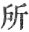

  
[Intangible Textual Heritage](../../index)  [Buddhism](../index.md) 
[Index](index)  [Previous](sbe1918)  [Next](sbe1920.md) 

------------------------------------------------------------------------

### VARGA 17. THE GREAT DISCIPLE BECOMES A HERMIT.

At this time Bimbisâra Râ*g*a, bowing his head, requested the honoured
of the world to change his

p. 193

place of abode for the bamboo grove [1](#fn_489.md); graciously accepting it, Buddha
remained silent. . 1380

Then the king, having perceived the truth, offered his adoration and
returned to his palace. The world-honoured, with the great congregation,
proceeded on foot, to rest for awhile in the bamboo garden [2](#fn_490.md). . 1381

(There he dwelt) to convert all that breathed [3](#fn_491.md), to kindle once for all [4](#fn_492.md) the lamp of wisdom, to establish Brahma
and the Devas, and to confirm the lives [5](#fn_493.md) of saints and sages. . 1382

At this time A*s*va*g*it and Vâshpa [6](#fn_494.md), with heart composed and every member
(sense) subdued, the time having come for begging food, entered into the
town of Râ*g*ag*ri*ha: . 1383

Unrivalled in the world were they for grace of person, and in dignity of
carriage excelling all. The lords and ladies of the city seeing them,
were filled with joy; . 1384

Those who were walking stood still, those before waited, those behind
hastened on. Now the *Ri*shi: Kapila amongst all his numerous disciples
. 1385

p. 194

Had one of wide-spread fame, whose name was *S*âriputra; he, beholding
the wonderful grace of the Bhikshus, their composed mien and subdued
senses, . 1386

Their dignified walk and carriage, raising his hands, enquiring, said:
'Young in years, but pure and graceful in appearance, such as I before
have never seen, . 1387

'What law most excellent (have you obeyed)? and who your master that has
taught you? and what the doctrine you have learned? Tell me, I pray you,
and relieve my doubts.' . 1388

Then of the Bhikshus, one [1](#fn_495.md),
rejoicing at his question, with pleasing air and gracious words,
replied: 'The omniscient, born of the Ikshvâku family, . 1389

'The very first ’midst gods and men, this one is my great master. I am
indeed but young, the sun of. wisdom has but just arisen, . 1390

'How can I then explain the master's doctrine? Its meaning is deep and
very hard to understand, but now, according to my poor capability
(wisdom), I will recount in brief the master's doctrine: . 1391

'"Whatever things exist all spring from cause, the principles (cause) of
birth and death (may be) destroyed, the way is by the means he has
declared [2](#fn_496.md)."' . 1392

p. 195

Then the twice-born Upata (Upatishya), embracing heartily what he had
heard, put from him all sense-pollution, and obtained the pure eyes of
the law. . 1393

The former explanations he had trusted, respecting cause and what was
not the cause, that there was nothing that was made, but was made by
Î*s*vara, . 1394

All this, now that he had heard the rule of true causation,
understanding (penetrating) the wisdom of the no-self, adding thereto
the knowledge of the minute (dust) troubles [1](#fn_497.md), which can never be overcome in their
completeness (completely destroyed), .
1395

But by the teaching of Tathâgata, all this he now for ever put away;
leaving no room for thought of self, the thought of self will
disappear [2](#fn_498.md). . 1396

'Who, when the brightness of the sun gives light, would call for the
dimness of the lamp? for, like the severing of the lotus, the stem once
cut, the pods (?) will also die; . 1397

'So Buddha's teaching cutting off the stem of sorrow, no seeds are left
to grow or lead to further increase.' Then bowing at the Bhikshu's feet,
with grateful mien, he wended homewards. .
1398

The Bhikshus after having begged their food, likewise went back to the
bamboo grove. Sâriputra

p. 196

on his arrival home, (rested) with joyful face and full of peace. . 1399

His friend the honoured Mugalin (Maudgalyâyana), equally renowned for
learning, seeing *S*âriputra in the distance [1](#fn_499.md), his pleasing air and lightsome step,
. 1400

Spoke thus: 'As I now see thee, there is an unusual look I notice, your
former nature seems quite changed, the signs of happiness I now observe,
. 1401

'All indicate the possession of eternal truth, these marks are not
uncaused.' Answering he said: The words of the Tathâgata are such as
never yet were spoken;' . 1402

And then, requested, he declared (what he had heard). Hearing the words
and understanding them, he too put off the world's defilement, and
gained the eyes of true religion, . 1403

The reward of a long-planted virtuous cause; and, as one sees by a lamp
that comes to hand, so he obtained an unmoved faith in Buddha; and now
they both set out for Buddha's presence, .
1404

With a large crowd of followers, two hundred men and fifty. Buddha
seeing the two worthies [2](#fn_500.md) coming,
spoke thus to his disciples: . 1405

'These two men who come shall be my two most eminent followers, one
unsurpassed for wisdom, the other for powers miraculous;' . 1406

And then with Brahma's voice [3](#fn_501.md),
profound and

p. 197

sweet, he forthwith bade them 'Welcome!' Here is the pure and peaceful
law (he said); here the end of all discipleship! . 1407

Their hands grasping the triple-staff [1](#fn_502.md), their twisted hair holding the
water-vessel [2](#fn_503.md), hearing the words of
Buddha's welcome, they forthwith changed into complete
*S*rama*n*as [3](#fn_504.md); . 1408

The leaders two and all their followers, assuming the complete
appearance of Bhikshus, with prostrate forms fell down at Buddha's feet,
then rising, sat beside him [4](#fn_505.md): . 1409

And with obedient heart listening to the word, they all became Rahats.
At this time there was a twice-(born) sage [5](#fn_506), Kâ*s*yapa Shi-ming-teng (Eggidatta.md)
(Agnidatta), . 1410

Celebrated and perfect in person, rich in possessions, and his wife most
virtuous. But all this he

p. 198

had left and become a hermit, seeking the way of salvation. . 1411

And now in the way by the To-tseu [1](#fn_507.md)
tower he suddenly encountered *S*âkya Muni, remarkable for his dignified
and illustrious appearance, as the embroidered flag of a Deva (temple);
. 1412

Respectfully and reverently approaching, with head bowed down, he
worshipped his feet, whilst he said: 'Truly, honoured one, you are my
teacher, and I am your follower, . 1413

'Much and long time have I been harassed with doubts, oh! would that you
would light the lamp [2](#fn_508.md) (of
knowledge).' Buddha knowing that this twice-(born) sage was heartily
desirous of finding the best mode of escape [3](#fn_509.md), . 1414

With soft and pliant voice, he bade him come and welcome. Hearing his
bidding and his heart complying, losing all listlessness of body or
spirit, . 1415

His soul embraced the terms of this most excellent salvation [4](#fn_510.md). Quiet and calm, putting away
defilement, the great merciful, as he alone knew how, briefly explained
the mode of this deliverance, . 1416

Exhibiting the secrets of his law, ending with}

p. 199

the four indestructible acquirements [1](#fn_511.md). The great sage, everywhere celebrated,
was called Mahâ Kâ*s*yapa, . 1417

His original faith was that 'body and soul are different,' but he had
also held that they are the same, that there was both 'I' and a
place [2](#fn_512.md) for I; but now he for ever
cast away his former faith, . 1418

And considered only (the truth) that 'sorrow' is ever accumulating; so
(he argued) by removing sorrow there will be 'no remains' (i.e. no
subject for suffering); obedience to the precepts and the practice of
discipline, though not themselves the cause, yet he considered these the
necessary mode by which to find deliverance. .
1419

With equal and impartial mind, he considered the nature of sorrow, for
evermore freed from a cleaving heart. Whether we think 'this is,' or
'this is not' (he thought), both tend to produce a listless (idle) mode
of life; . 1420

But when with equal mind we see the truth, then certainty is produced
and no more doubt. If we rely for support on wealth or form, then wild
confusion and concupiscence result, . 1421

Inconstant and impure. But lust and covetous desire removed, the heart
of love and equal thoughts produced, there can be then no enemies or
friends (variance), . 1422

But the heart is pitiful and kindly disposed to all, and thus is
destroyed the power of anger and of hate. Trusting to outward things and
their relationships, then crowding thoughts of every kind are gendered;
. 1423

p. 200

Reflecting well, and crushing out confusing thought, then lust for
pleasure is destroyed. Though born in the Arûpa world (he saw) that
there would be a remnant of life still left; .
1424

Unacquainted with the four right truths, he had felt an eager longing
for this deliverance, for the quiet resulting from the absence of all
thought. And now putting away for ever covetous desire for such a
formless state of being, . 1425

His restless heart was agitated still, as the stream is excited by the
rude wind. Then entering on deep reflection in quiet he subdued his
troubled mind, . 1426

And realised the truth of there being no 'self,' and that therefore
birth and death are no realities; but beyond this point he rose not, his
thought of 'self' destroyed, all else was lost. .
1427

But now the lamp of wisdom lit, the gloom of every doubt dispersed, he
saw an end to that which seemed without an end; ignorance finally
dispelled, . 1428

He considered the ten points of excellence; the ten seeds of sorrow
destroyed, he came once more to life, and what he ought to do, he did.
And now regarding with reverence the face of his lord, . 1429

He put away the three [1](#fn_513.md) and gained
the three [2](#fn_514.md); so were there three
disciples [3](#fn_515.md) in addition to the

p. 201

three [1](#fn_516.md); and as the three stars
range around the Trayastri*m*sas heaven, .
1430

Waiting upon the three and five [2](#fn_517.md),
so the three wait on Buddha. . 1431

------------------------------------------------------------------------

### Footnotes

[193:1](sbe1919.htm#fr_489.md) This garden, called
the Kara*nd*a Ve*n*uvana, was a favourite residence of Buddha. For an
account of it, see Spence Hardy, Manual of Buddhism, p. 194. It was
situated between the old city of Râ*g*ag*ri*ha and the new city, about
three hundred yards to the north of the former (see Fă-lien, chap. xxx,
Beal's translation, p. 117 and note 2).

[193:2](sbe1919.htm#fr_490.md) I have translated
Ku’an 'to rest awhile,' it might be supposed to refer to the rest of the
rainy season. But it is doubtful whether this ordinance was instituted
so early.

[193:3](sbe1919.htm#fr_491.md) All living things.

[193:4](sbe1919.htm#fr_492.md) To establish and
settle the brightness of the lamp of wisdom.

[193:5](sbe1919.htm#fr_493.md) To establish the
settlement of sages and saints.

[193:6](sbe1919.htm#fr_494.md) He is sometimes
called Da*s*abala Kâ*s*yapa (Eitel, Handbook, p. 158 b).

[194:1](sbe1919.htm#fr_495.md) In the Pâli account
of this incident A*s*va*g*it alone is represented as begging his food;
but here A*s*va*g*it and Vâshpa are joined according to the later rule
(as it would seem) which forbad one mendicant to proceed alone through a
town. (Compare Sacred Books of the East, vol. xiii, p. 344.)

[194:2](sbe1919.htm#fr_496.md) For the Southern
version of this famous stanza, see Sacred Books of the East, vol. xiii,
p. 146; also Manual of Buddhism, p. 195 p.
196. For a similar account from the Chinese, see Wong Puh, § 77.

[195:1](sbe1919.htm#fr_497.md) The 'dust troubles'
are the troubles caused by objects of sense, as numerous as motes in a
sunbeam.

[195:2](sbe1919.htm#fr_498.md) 'Look upon the
world as void, O Mogharâ*g*an, being always thoughtful; having destroyed
the view of oneself-(as really existing), so one may overcome death; the
king of death will not see him who thus regards the world,' Sutta
Nipâta, Fausböll, p. 208.

[196:1](sbe1919.htm#fr_499.md) 'Then the
paribbâ*g*aka Sâriputta went to the place where the paribbâ*g*aka
Moggallâna was,' Sacred Books of the East, vol. xiii, p. 147.

[196:2](sbe1919.htm#fr_500.md) The two 'bhadras,'
i.e. 'sages,' or 'virtuous ones.'

[196:3](sbe1919.htm#fr_501.md) Or, with
'Brahma-voice' (Brahmaghosha), for which, see Childers sub voce.

[197:1](sbe1919.htm#fr_502.md) This triple
(three-wonderful) staff is, I suppose, a mark of a Brahman student.

[197:2](sbe1919.htm#fr_503.md) Twisted hair
holding the pitcher; this may also refer to some custom among the
Brahmans. Or the line may be rendered, 'their hair twisted and holding
their pitchers.'

[197:3](sbe1919.htm#fr_504.md) This sudden
transformation from the garb and appearance of laymen into shorn and
vested Bhikshus, is one often recounted in Buddhist stories.

[197:4](sbe1919.htm#fr_505.md) Or, sat on one side
(ekamantam).

[197:5](sbe1919.htm#fr_506.md) This expression,
which might also be rendered 'two religious leaders' (’rh sse), may
also, by supplying the word 'sing,' be translated a 'twice-born sage,'
i.e. a Brahman; and this appears more apposite with what follows, and
therefore I have adopted it. The Brahman alluded to would then be called
Kâ*s*yapa Agnidatta. The story of Eggidatta is given by Bigandet
(Legend, p. 180, first edition), but there is nothing said about his
name Kâ*s*yapa. Eitel (Handbook, sub voce Mahâkâ*s*yapa) gives an
explanation of the name Kâ*s*yapa,' he who swallowed light;' but the
literal translation of the words in our text is, 'Kâ*s*yapa giving in
charity a bright lamp.'

[198:1](sbe1919.htm#fr_507.md) This 'many
children' tower is perhaps the one at Vai*s*âlî alluded to by Fă-hien,
chap. xxv.

[198:2](sbe1919.htm#fr_508.md) Here the phrase
'teng ming,' light of the lamp, seems to be a play on the name 'ming
teng,' bright lamp. The method and way in which a disciple
(saddhivihârika) chooses a master (upa*ggh*âya) is explained, Sacred
Books of the East, vol. xiii, p. 154.

[198:3](sbe1919.htm#fr_509) Literally, '(had.md) a
heart rejoicing in the most complete method of salvation (moksha).'

[198:4](sbe1919.htm#fr_510.md) Or, 'the mode of
salvation explained by the most excellent (Buddha).'

[199:1](sbe1919.htm#fr_511.md)
*K*atu*h*-samyak-pradhâna?

[199:2](sbe1919.htm#fr_512.md)   'the place of.'

[200:1](sbe1919.htm#fr_513.md) The three poisons,
lust, hatred, ignorance.

[200:2](sbe1919.htm#fr_514.md) The three treasures
(triratna), Buddha, the law, the community.

[200:3](sbe1919.htm#fr_515.md) The three
disciples, as it seems, were *S*âriputra, Maudgalyâyana, and Agnidatta
(Kâ*s*yapa).

[201:1](sbe1919.htm#fr_516.md) In addition to the
three brothers (the Kâ*s*yapas).

[201:2](sbe1919.htm#fr_517.md) The allusion here
is obscure; there may be a misprint in the text.

------------------------------------------------------------------------

[Next: Varga 18. Conversion of the 'Supporter of the Orphans and
Destitute'](sbe1920.md)
