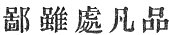

  
[Intangible Textual Heritage](../../index)  [Buddhism](../index.md) 
[Index](index)  [Previous](sbe1921)  [Next](sbe1923.md) 

------------------------------------------------------------------------

### VARGA 20. RECEIVING THE *G*ETAVANA VIHÂRA.

The lord of the world, having converted [2](#fn_609.md) the people of Kapilavastu according to
(their several) circumstances [3](#fn_610.md), his
work being done, he went with the great body of his followers, . 1611

And directed his way to the country of Ko*s*ala, where dwelt king
Prasena*g*it (Po-se-nih). The *G*etavana was now fully adorned, and its
halls and courts carefully prepared; .
1612

The fountains and streams flowed through the garden which glittered with
flowers and fruit; rare birds sat by the pools (water side), and on the
land

p. 231

they sang in sweet concord, according to their kind; . 1613

Beautiful in every way as the palace of Mount Kilas (Kailâsa) [1](#fn_611), (such was the *G*etavana..md) Then the
noble friend of the orphans, surrounded by his attendants, who met him
on the way, . 1614

Scattering flowers and burning incense, invited the lord to enter the
*G*etavana. In his hand he carried a golden dragon-pitcher [2](#fn_612.md), and bending low upon his knees he
poured the flowing water . 1615

As a sign of the gift of the *G*etavana Vihâra for the use of the
priesthood throughout the world [3](#fn_613.md).
The lord then received it, with the prayer [4](#fn_614.md) that 'overruling all evil influences it
might give the kingdom permanent rest, .
1616

'And that the happiness of Anâthapi*nd*ada might flow out in countless
streams.' Then the king Prasena*g*it hearing that the lord had come,
. 1617

With his royal equipage went to the *G*etavana to worship at the lord's
feet [5](#fn_615). (Having arrived.md) and

p. 232

taken a seat on one side, with clasped hands he spake to Buddha thus:
. 1618

'O that my unworthy and obscure kingdom should thus suddenly have met
such fortune! For how can misfortunes or frequent calamities possibly
affect it, (in the presence of) so great a man? .
1619

'And now that I have seen your sacred features, I may perhaps partake of
the converting streams of your teaching. A town although it is composed
of many sections [1](#fn_616.md), yet both ignoble
and holy persons may enter the surpassing [2](#fn_617.md) stream; .
1620

'And so the wind which fans the perfumed grove causes the scents to
unite and form one pleasant breeze; and as the birds which collect on
Mount Sumeru (are many), and the various shades that blend in shining
gold, . 1621

'So an assembly may consist of persons of different capacities,
individually insignificant, but a glorious body. The desert master by
nourishing the *Ri*shi, procured a birth as the san-tsuh (three leg or
foot) star [3](#fn_618.md); . 1622

'Worldly profit is fleeting and perishable, religious (holy) profit is
eternal and inexhaustible; a man though a king is full of trouble, a
common man, who is holy, has everlasting rest.' .
1623

p. 233

Buddha knowing the state of the king's heart,--that he rejoiced in
religion as *S*akrarâ*g*a [1](#fn_619.md),--considered the two obstacles that
weighted him, viz. too great love of money, and of external
pleasures [2](#fn_620.md); 1 . 624

Then seizing the opportunity, and knowing the tendencies of his heart,
he began, for the king's sake, to preach: 'Even those who, by evil
karman [3](#fn_621.md), have been born in low
degree, when they see a person of virtuous character, feel reverence for
him; . 1625

'How much rather ought an independent [4](#fn_622.md) king, who by his previous conditions of
life has acquired much merit, when he encounters Buddha, to conceive
even more reverence. Nor is it difficult to understand, . 1626

'That a country should enjoy more rest and peace, by the presence of
Buddha, than if he were not to dwell therein [5](#fn_623.md). And now, as I briefly declare my law,
let the Mahârâ*g*a listen and weigh my words, .
1627

'And hold fast that which I deliver! See now the end of my perfected
merit [6](#fn_624.md)', my life is done,

p. 234

there is for me no further body or spirit, but freedom from all ties of
kith or kin! . 1628

'The good or evil deeds we do from first to last (beginning to end)
follow us as shadows; most exalted then the deeds (karman) of the king
of the law [1](#fn_625.md). The prince [2](#fn_626) (son.md) who cherishes his people, . 1629

'In the present life gains renown, and hereafter ascends to heaven; but
by disobedience and neglect of duty, present distress is felt and future
misery! . 1630

'As in old times Lui-’ma (lean horse) [3](#fn_627.md)y râ*g*a, by obeying the precepts, was
born in heaven, whilst Kin-pu (gold step) râ*g*a, doing wickedly, at the
end of life was born in misery. . 1631

Now then, for the sake of the great king, I will briefly relate the good
and evil law (the law of good and evil). The great requirement [4](#fn_628.md) is a loving heart! to regard the people
as we do an only son, . 1632

'Not to oppress, not to destroy; to keep in due check every member of
the body, to forsake unrighteous doctrine and walk in the straight path;
not to exalt oneself by treading down others (or inferiors), . 1633

'But to comfort and befriend those in suffering;

p. 235

not to exercise oneself in false theories [1](#fn_629) (treatises.md), nor to ponder much on
kingly dignity (strength), nor to listen to the smooth words of false
teachers; . 1634

'Not to vex oneself by austerities, not to exceed (or transgress) the
right rules of kingly conduct, but to meditate on Buddha and weigh his
righteous law, and to put down and adjust all that is contrary to
religion; . 1635

'To exhibit true superiority by virtuous conduct and the highest
exercise of reason, to meditate deeply on the vanity of earthly things,
to realise the fickleness of life by constant recollection; . 1636

'To exalt the mind to the highest point of reflection, to seek sincere
faith (truth) with firm purpose; to retain an inward sense of happiness
resulting from oneself [2](#fn_630.md), (and to
look forward to) increased happiness hereafter; .
1637

'To lay up a good name for distant ages, this will secure the favour of
Tathâgata [3](#fn_631.md), as men now loving sweet
fruit will hereafter be praised by their descendants [4](#fn_632.md). . 1638

'There is a way of darkness out of light [5](#fn_633.md), there is a way of light out of
darkness; there is darkness which follows after the gloom (signs of
gloom),

p. 236

there is a light which causes the brightening of light. . 1639

'The wise man leaving first principles [1](#fn_634.md), should go on to get more light [2](#fn_635.md); evil words will be repeated far and
wide by the multitude, but there are few to follow good direction; . 1640

'It is impossible however to avoid result of works [3](#fn_636.md), the doer cannot escape; if there had
been no first works, there had been in the end no result of doing, . 1641

'--No reward for good, no hereafter joy--; but because works are done,
there is no escape. Let us then practise good works; . 1642

'(Let us) inspect our thoughts that we do no evil, because as we sow so
we reap [4](#fn_637.md). As when enclosed in a
four-stone \[stone or rock-encircled\] mountain, there is no escape or
place of refuge for any one, . 1643

'So within this mountain-wall of old age, birth, disease, and death,
there is no escape for the world [5](#fn_638.md).
Only by considering and practising the true law can we escape from this
sorrow-piled mountain. . 1644

'There is, indeed, no constancy in the world, the end of the pleasures
of sense is as the lightning flash, whilst old age and death are as the
piercing bolts; what profit, then, in doing (practising) iniquity [6](#fn_639.md)! . 1645

p. 237

'All the ancient conquering kings, who were as gods [1](#fn_640.md) on earth, thought by their strength to
overcome decay [2](#fn_641.md); but after a brief
life they too disappeared [3](#fn_642.md). . 1646

'The Kalpa-fire will melt Mount Sumeru, the water of the ocean will be
dried up, how much less can our human frame, which is as a bubble,
expect to endure for long upon the earth! .
1647

'The fierce wind scatters the thick mists, the sun's rays encircle
(hide) Mount Sumeru, the fierce fire licks up the place of moisture, so
things are ever born once more to be destroyed! .
1648

'The body is a thing (vessel) of unreality, kept through the suffering
of the long night [4](#fn_643.md), pampered by
wealth, living idly and in carelessness, .
1649

'Death suddenly comes and it is carried away as rotten wood in the
stream! The wise man expecting these changes with diligence strives
against sloth; . 1650

'The dread of birth and death acts as a spur to keep him from lagging on
the road; he frees himself from engagements, he is not occupied with
self-pleasing, he is not entangled by any of the cares of life, . 1651

'He holds to no business, seeks no friendships, engages in no learned
career, nor yet wholly separates himself from it; for his learning is
the wisdom

p. 238

of not-perceiving [1](#fn_644.md) wisdom, but yet
perceiving that which tells him of his own impermanence; . 1652

'Having a body, yet keeping aloof from defilement, he learns to regard
defilement as the greatest evil. (He knows) that tho’ born in the Arûpa
world, there is yet no escape from the changes of time; . 1653

'His learning, then, is to acquire the changeless body; for where no
change is, there is peace. Thus the possession of this changeful body is
the foundation of all sorrow. . 1654

'Therefore, again, all who are wise make this their aim--to seek a
bodiless condition; all the various orders of sentient creatures, from
the indulgence of lust, derive pain; .
1655

'Therefore all those in this condition ought to conceive a heart,
loathing lust; putting away and loathing this condition, then they shall
receive no more pain; . 1656

'Though born in a state with or without an external form, the certainty
of future change is the root of sorrow; for so long as there is no
perfect cessation of personal being, there can be, certainly, no absence
of personal desire; . 1657

'Beholding, in this way, the character of the three worlds, their
inconstancy and unreality, the presence of ever-consuming pain, how can
the wise man seek enjoyment therein? .
1658

'When a tree is burning with fierce flames how

p. 239

can the birds congregate therein? The wise man, who is regarded as an
enlightened sage, without this knowledge is ignorant; . 1659

'Having this knowledge, then true wisdom dawns; without it, there is no
enlightenment. To get this wisdom is the one aim, to neglect it is the
mistake of life. 1660.

'All the teaching of the schools should be centred here; without it is
no true reason. To recount this excellent system is not for those who
dwell in family connection; . 1661

'Nor is it, on that account, not to be said [1](#fn_645.md), for religion concerns a man
individually \[is a private affair\]. Burned up with sorrow, by entering
the cool stream, all may obtain relief and ease; . 1662

'The light of a lamp in a dark room lights up equally objects of all
colours, so is it with those who devote themselves to religion,--there
is no distinction between the professed disciple and the unlearned
(common). . 1663

'Sometimes the mountain-dweller (i.e. the religious hermit) falls into
ruin, sometimes the humble householder mounts up to be a *Ri*shi; the
want of faith (doubt) is the engulfing sea, the presence of disorderly
belief is the rolling flood, . 1664

'The tide of lust carries away the world; involved in its eddies there
is no escape; wisdom is the handy boat, reflection is the hold-fast.
. 1665

'The drum-call of religion (expedients), the barrier (dam) of thought,
these alone can rescue from

p. 240

the sea of ignorance.' At this time the king sincerely attentive to the
words of the All-wise [1](#fn_646.md), . 1666

Conceived a distaste for the world's glitter and was dissatisfied with
the pleasures of royalty, even as one avoids a drunken elephant, or
returns to right reason after a debauch. .
1667

Then all the heretical teachers, seeing that the king was well affected
to Buddha, besought the king (mahârâ*g*a), with one voice, to call on
Buddha to exhibit [2](#fn_647.md) his miraculous
gifts. . 1668

Then the king addressed the lord of the world: 'I pray you, grant their
request!' Then Buddha silently acquiesced [3](#fn_648.md). And now all the different professors of
religion, . 1669

The doctors who boasted of their spiritual power, came together in a
body to where Buddha was; then he manifested before them his power of
miracle; ascending up into the air, he remained seated, . 1670

Diffusing his glory as the light of the sun he shed abroad the
brightness of his presence. The heretical teachers were all abashed, the
people all were filled with faith. . 1671

Then for the sake of preaching to his mother, he forthwith ascended to
the heaven of the thirty-three gods; and for three months dwelt in
heavenly mansions [4](#fn_649.md). There he
converted the occupants (Devas) of that abode, .
1672

p. 241

And having concluded his pious mission to his mother, the time of his
sojourn in heaven finished, he forthwith returned, the angels
accompanying him on wing [1](#fn_650.md); he
travelled down a seven-gemmed ladder, .
1673

And again arrived at *G*ambudvîpa. Stepping down he alighted on the spot
where all the Buddhas return [2](#fn_651.md),
countless hosts of angels accompanied him, conveying with them their
palace abodes (as a gift); . 1674

The people of *G*ambudvîpa with closed hands looking up with reverence,
beheld him. . 1675

------------------------------------------------------------------------

### Footnotes

[230:2](sbe1922.htm#fr_609.md) The expression in
the original is 'having opened for conversion.'

[230:3](sbe1922.htm#fr_610.md) It is not
necessarily 'according to their circumstances,' but it may also be
rendered 'according to circumstances,' or 'as the occasion required.'

[231:1](sbe1922.htm#fr_611.md) Mount Kailâsa, the
fabulous residence of Kuvera; the paradise of Siva.

[231:2](sbe1922.htm#fr_612.md) In the Barahut
sculpture there is a figure carrying a pitcher in the act of pouring out
the water; but the figure is not kneeling.

[231:3](sbe1922.htm#fr_613.md) 'The four
quarters,' that is, 'the world.'

[231:4](sbe1922.htm#fr_614.md) 'The prayer,' the
'devout incantation;' it has often been questioned whether 'prayer' is
possible with Buddhists; the expression in the Chinese is the same as
that used for prayer in other books; but it may of course denote sincere
or earnest desire, coming from the heart.

[231:5](sbe1922.htm#fr_615.md) There are various
representations of Prasena*g*it going to the *G*etavana in the Barahut
sculptures. In plate xiii (Cunningham's Barahut) the Vihâra is
represented, the wheel denoting the sermon which Buddha preached; the
waving of garments and whistling with fingers denoting the joy of the
hearers.

[232:1](sbe1922.htm#fr_616.md) I cannot be sure of
this translation; yet I can suggest no other. The line is  .

[232:2](sbe1922.htm#fr_617.md) 'The victorious
stream;' this may refer to the Rapti, on the banks of which *S*râvastî
was situated. The object of the allusion is that as both rich and poor,
noble and ignoble may enter the stream of the river, so all may seek the
benefit of the stream of religious doctrine.

[232:3](sbe1922.htm#fr_618.md) I am unable to
explain the reference here; nor do I know what the 'three-footed star'
can be.

[233:1](sbe1922.htm#fr_619.md) General Cunningham
(Barahut Stûpa, plate xiii) has remarked that the Preaching Hall visited
by Prasena*g*it resembles in detail the Palace of *S*akrarâ*g*a; the
reference in the text seems to allude to this.

[233:2](sbe1922.htm#fr_620.md) Reference is often
made in Buddhist books to the self-indulgence of king Prasena*g*it.
Compare section xxix of the Chinese Dhammapada.

[233:3](sbe1922.htm#fr_621.md) That is, in
consequence of evil deeds.

[233:4](sbe1922.htm#fr_622.md) This expression
'tsze tsai,' which I render 'independent,' means 'self-sufficient,' or
'self-existing;' the reference is probably to a lord paramount
(samrâ*g*).

[233:5](sbe1922.htm#fr_623.md) This exordium
appears intended to take down the pride of the king.

[233:6](sbe1922.htm#fr_624.md) Buddha points to
himself as having gained the end of all his p.
234 previous meritorious conduct, in the attainment of his
present condition.

[234:1](sbe1922.htm#fr_625.md) Dharmarâ*g*a, an
epithet of every Buddha (Eitel).

[234:2](sbe1922.htm#fr_626.md) The symbol here
stands for 'son;' it may mean 'prince' in the sense of 'son of the king
of the law' (fă wang tseu), which is a common one in Buddhist books, and
is often rendered by 'Kumâra bhûta.'

[234:3](sbe1922.htm#fr_627.md) Lui-’ma may be a
phonetic equivalent of the name of the king, or a translation of the
name, viz. K*ris*âsva. So also in the next line Hira*n*yaka*s*ipu may be
meant.

[234:4](sbe1922.htm#fr_628.md) The 'great
deficiency,' or 'the great need.'

[235:1](sbe1922.htm#fr_629.md) In false theories
and 'vidyâs' (ming).

[235:2](sbe1922.htm#fr_630.md) Self-dependent
happiness.

[235:3](sbe1922.htm#fr_631.md) Whether the phrase
'*g*u-lai' ought to be here translated Tathâgata, or whether it refers
simply to 'future generations,' is a question.

[235:4](sbe1922.htm#fr_632.md) This again is an
uncertain translation, although the meaning is plain, that those who
here love 'sweet fruit,' will not set their children's teeth on edge
hereafter.

[235:5](sbe1922.htm#fr_633.md) In this and the
following lines the reference is apparently to the possibility of
growing worse or better by our deeds.

[236:1](sbe1922.htm#fr_634.md) San p’hin, the
'three sections.'

[236:2](sbe1922.htm#fr_635.md) Ought to learn from
first to last, illumination.' Does it refer to books or vidyâs (ming) of
instruction?

[236:3](sbe1922.htm#fr_636.md) There is not such a
thing as 'not making fruit,' or the fruit of 'not making;' but the
former is the more likely. 'Fruit,' of course, refers to the result of
works.

[236:4](sbe1922.htm#fr_637.md) 'Because as we
ourselves do, we ourselves receive.'

[236:5](sbe1922.htm#fr_638.md) For all living
creatures.

[236:6](sbe1922.htm#fr_639.md) 'Why then ought we
to do iniquity!' (fi fă.)

[237:1](sbe1922.htm#fr_640.md) Who were as
Î*s*varadeva.

[237:2](sbe1922.htm#fr_641.md) Literally, 'to
conquer emptiness;' it may mean to 'surpass the sky '--to climb to
heaven.

[237:3](sbe1922.htm#fr_642.md) They were ground to
dust and disappeared.

[237:4](sbe1922.htm#fr_643.md) The suffering of
the 'long night' (the period of constant transmigration) keeps and
guards it.

[238:1](sbe1922.htm#fr_644.md) 'The wisdom of not
perceiving;' the symbol 'sheu' corresponds with 'vedanâ,' perception, or
sensation. The meaning therefore is that true wisdom depends not on the
power of sense; but yet he perceives by his senses that he (his body) is
impermanent.

[239:1](sbe1922.htm#fr_645.md) This and the
preceding line are obscure. The sense of the whole passage seems to
point to the adaptation of religion for the life of all persons, laïc or
cleric.

[240:1](sbe1922.htm#fr_646.md) The words of him
who knew all things.

[240:2](sbe1922.htm#fr_647.md) To substantiate his
claim by exhibiting miraculous power.

[240:3](sbe1922.htm#fr_648.md) By his silence
showed his acquiescence.

[240:4](sbe1922.htm#fr_649.md) There is an account
of Buddha's ascent to this heaven in the Manual of Buddhism, pp. 298
seq. Also in Fă-hien, cap. xvii. There are pictures (sculptures) of the
scene of his descent in Tree and Serpent Worship, plate xvii, and in the
account of the Stûpa of Barahut.

[241:1](sbe1922.htm#fr_650.md) It would be
curious, if this translation were absolutely certain, to find that
A*s*vaghosha had heard of angels with 'wings.' In the sculptures the
Devas are represented as ordinary mortals. The Chinese may, however,
simply mean 'accompanying him, as if on wing,' i.e. following him
through the air.

[241:2](sbe1922.htm#fr_651.md) That is, at Sankisa
(Sâṅkâ*s*ya), \[see the Archæological Survey of India, 1862-1863.\]

------------------------------------------------------------------------

[Next: Varga 21. Escaping the Drunken Elephant and Devadatta](sbe1923.md)
