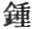
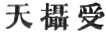

  
[Intangible Textual Heritage](../../index)  [Buddhism](../index.md) 
[Index](index)  [Previous](sbe1929)  [Next](sbe1931.md) 

------------------------------------------------------------------------

### VARGA 28. DIVISION OF THE *S*ARÎRAS.

Thus those Mallas offered religious reverence to the relics, and used
the most costly flowers and scents for their supreme act of worship.
. 2218

Then the kings of the seven countries [3](#fn_887.md), having heard that Buddha was dead, sent
messengers to

p. 326

the Mallas asking to share the sacred relics (of Buddha). . 2219

Then the Mallas reverencing the body of Tathâgata, trusting to their
martial renown, conceived a haughty mind: .
2220

'They would rather part with life itself (they said), than with the
relics of the Buddha;' so those messengers returned from the futile
embassage. Then the seven kings, highly indignant, . 2221

With an army, numerous as the rain. clouds, advanced on Ku*s*inagara;
the people who went from the city filled with terror soon returned . 2222

And told the Mallas all, that the soldiers and the cavalry of the
neighbouring countries were coming, with elephants and chariots, to
surround the Ku*s*inagara city. . 2223

The gardens, lying without the town, the fountains, lakes, flower and
fruit trees were now destroyed by the advancing host, and all the
pleasant resting-places lay in ruins. .
2224

The Mallas, mounting on the city towers, beheld the great supports of
life [1](#fn_888.md) destroyed; they then prepared
their warlike engines to crush the foe without; .
2225

Balistas [2](#fn_889.md) and catapults and 'flying
torches [3](#fn_890.md)' to

p. 327

hurl against the advancing host. Then the seven kings entrenched
themselves around the city, each army host filled with increasing
courage; . 2226

Their wings of battle shining in array as the sun's seven beams of glory
shine; the heavy drums [1](#fn_891.md) rolling as
the thunder, the warlike breath (rising) as the full cloud mist. . 2227

The Mallas, greatly incensed, opening the gates command the fray to
begin; the aged men and women whose hearts had trust in Buddha's law,
. 2228

With deep concern breathed forth their vow, 'Oh! may the victory be a
bloodless one [2](#fn_892.md)!' Those who had
friends used mutual exhortations not to encourage in themselves a desire
for strife. . 2229

And now the warriors, clad in armour, grasping their spears and
brandishing their swords ’midst the confused noise and heavy drums [1](#fn_891) (advanced.md). But ere the contest had
begun, . 2230

There was a certain Brahman whose name was Dro*n*a (tuh-lau-na),
celebrated for penetration, honour'd for modesty and lowliness, . 2231

Whose loving heart took pleasure in religion. This one addressed those
kings and said: 'Regarding the unequalled strength of yonder city, one
man alone would be enough (for its defence); .
2232

How much less when with determined heart (they are united), In the
beginning [3](#fn_893.md) mutual strife produced
destruction, how now can it result in glory or renown? . 2233

p. 328

'The clash of swords and bloody onset done, ’tis certain one must
perish! and therefore whilst you aim to vanquish those, both sides will
suffer in the fray. . 2234

'Then there are many chances, too, of battle, ’tis hard to measure
strength by appearances; the strong, indeed, may overcome the weak, the
weak may also overcome the strong; . 2235

'The powerful champion may despise the snake, but how will he escape a
wounded body? there are men whose natures bland and soft, seem suited
for the company of women or of children, .
2236

'But when enlisted in the ranks, make perfect soldiers. As fire when it
is fed with oil, though reckoned weak, is not extinguished easily; so
when you say that they (your enemies) are weak, .
2237

'Beware of leaning overmuch on strength of body; nought can compare with
strength of right (religion). There was in ancient times a *G*ina [1](#fn_894.md) king, whose name was Kârandhama
(Avikshit), . 2238

'His graceful (upright) presence caused such love (in others) that he
could overcome all animosity; but though he ruled the world and was high
renowned, and rich and prosperous, . 2239

'Yet in the end he went back [2](#fn_895.md) and
all was lost! So when the ox has drunk enough, he too returns. Use then
the principles of righteousness, use the expedients of good will and
love. . 2240

'Conquer your foe by force, you increase his

p. 329

enmity; conquer by love, and you will reap no after-sorrow. The present
strife is but a thirst for blood, this thing cannot be endured! . 2241

'If you desire to honour Buddha, follow the example of his patience and
long-suffering [1](#fn_896.md)!' Thus this Brahman
with confidence declared the truth; . 2242

'Imbued with highest principles of peace, he spake with boldness and
unflinchingly. And now the kings addressed the Brahman thus: . 2243

'You have chosen a fitting time for giving increase to the seed of
wisdom, the essence of true friendship is (leads to) the utterance of
truth. The greatest force (of reason) lies in righteous judgment. . 2244

'But now in turn hear what we say: The rules of kings are framed to
avoid the use of force when hatred has arisen from low desires (question
of the five pleasures); . 2245

'Or else to avoid the sudden use of violence in trifling questions
(where some trifling matter is at stake). But we for the sake of law
(religion) are about to fight. What wonder is it! . 2246

'Swollen pride is a principle to be opposed, for it leads to the
overthrow of society; no wonder then that Buddha preached against it,
teaching men to practise lowliness and humility. . 2247

'Then why should we be forbidden to pay our reverence to his
body-relics? In ancient days a

p. 330

lord of the great earth, Pih-shih-tsung [1](#fn_897.md) Nanda \[or two lords, viz.
Pih-shih-tsung and Nanda\], . 2248

'For the sake of a beautiful woman fought and destroyed each other; how
much more now, for the sake of religious reverence to our master, freed
from passion, gone to Nirvâ*n*a, . 2249

'Without regard to self, or careful of our lives, should we contend and
assert our rights! A former king Kaurava (or belonging to the Kauravas)
fought with a Pâ*nd*ava (king), . 2250

'And the more they increased in strength the more they struggled, all
for some temporary gain; how much more for our not-coveting [2](#fn_898) master (should we contend.md), coveting to
get his living (relics)? . 2251

'The son of Râma, too, the *Ri*shi (or Râma*ri*shiputra), angry with
king Da*s*aratha, destroyed his country, slew the people, because of the
rage he felt; . 2252

'How much less for our master, freed from anger, should we be niggard of
our lives! Râma, for Sîta's sake, killed all the demon-spirits; . 2253

'How much more for our lord, heaven [3](#fn_899.md)-received, should we not sacrifice our
lives! The two demons A-lai (Alaka) and Po-ku were ever drawn into
contention; . 2254

'In the first place, because of their folly and ignorance, causing wide
ruin among men; how

p. 331

much less for our all-wise master should we begrudge our lives! . 2255

'Wherefore if from these examples we find others ready to die for no
real principle, how shall we for our teacher of gods (Devas) and men,
reverenced by the universe, . 2256

'Spare our bodies or begrudge our lives, and not be earnest in desire to
make our offerings! Now then, if you desire to stay the strife, go, and
for us demand within the city . 2257

'That they open wide (distribute) the relics, and so cause our prayer to
be fulfilled. But because your words are right ones, we hold our anger
for a while; . 2258

'Even as the great, angry snake, by the power of charms is quieted.' And
now the Brahman [1](#fn_900.md), having received
the king's instruction, . 2259

Entering the city, went to the Mallas, and saluting them, spoke these
true words: 'Without the city those who are kings among men [2](#fn_901.md) grasp with their hands their martial
weapons, . 2260

'And with their bodies clad in weighty armour wait eagerly (to fight);
glorious as the sun's rays; bristling with rage as the roused lion.
These united are, to overthrow this city. .
2261

'But whilst they wage this religious war, they fear lest they may act
irreligiously, and so they have sent me here to say what they require.
. 2262

'"We [3](#fn_902.md) have come, not for the sake
of territory,

p. 332

much less for money's sake, nor on account of any insolent feeling, nor
yet from any thought of hatred; . 2263

'"But because we venerate the great *Ri*shi, we have come on this
account. You, noble sirs! know well our mind! Why should there be such
sorrowful contention! . 2264

'"You honour what we honour, both alike, then we are brothers as
concerns religion. We both with equal heart revere the bequeathed
spiritual relics of the lord. . 2265

'"To be miserly in (hoarding) wealth, this is an unreasonable fault; how
much more to grudge religion, of which there is so little knowledge in
the world! . 2266

'"The exclusive and the selfishly-inclined, should practise laws of
hospitality (civility) [1](#fn_903.md); but if ye
have not rules of honour [2](#fn_904.md) such as
these, then shut your gates and guard yourselves." . 2267

'This is the tenor of the words, be they good or bad, spoken by them.
But now for myself and my own feelings, let me add these true and
sincere words. . 2268

'Let there be no contention either way; reason ought to minister for
peace, the lord when dwelling in the world ever employed the force of
patience. . 2269

'Not to obey his holy teaching, and yet to offer gifts to him, is
contradiction. Men of the world

p. 333

for some indulgence, some wealth or land, contend and fight, . 2270

'But those who believe the righteous law, should obediently conform
their lives to it; to believe and yet to harbour enmity, this is to
oppose "religious principle" to "conduct." .
2271

'Buddha himself at rest, and full of love, desired to bestow the rest he
enjoyed, on all. To adore with worship the great merciful, and yet to
gender wide destruction, . 2272

'(How is this possible?) Divide the relics, then, that all may worship
them alike; obeying thus the law, the fame thereof wide-spread, then
righteous principles will be diffused; .
2273

'But if others walk not righteously, we ought by righteous dealing to
appease them, in this way showing the advantage (pleasure) of religion,
we cause religion everywhere to take deep hold and abide. . 2274

'Buddha has told us that of all charity "religious charity" is the
highest; men easily bestow their wealth in charity, but hard is the
charity that works for righteousness.' .
2275

The Mallas hearing the Brahman's words with inward shame gazed at one
another; and answered the Brahma*k*ârin thus: 'We thank you much for
purposing to come to us, . 2276

'And for your friendly and religious counsel--speaking so well, and
reasonably. Yours are words which a Brahman ought to use, in keeping
with his holy character [1](#fn_905.md); . 2277

'Words full of reconciliation, pointing out the

p. 334

proper road; like one recovering a wandering horse brings him back by
the path which he had lost. . 2278

'We then ought to adopt the plan of reconciliation such as you have
shown us; to hear the truth and not obey it brings afterwards regretful
sorrow.' . 2279

Then they opened out the master's relics and in eight parts equally
divided them. Themselves paid reverence to one part, the other seven
they handed to the Brahman; . 2280

The seven kings having accepted these, rejoiced and placed them on their
heads [1](#fn_906.md); and thus with them returned
to their own country, and erected Dâgobas for worship over them. . 2281

The Brahma*k*ârin then besought the Mallas to bestow on him the
relic-pitcher as his portion, and from the seven kings he requested a
fragment of their relics, as an eighth share. .
2282

Taking this, he returned and raised a *K*aitya, which still is named
'the Golden Pitcher Dâgoba.' Then the men of Ku*s*inagara collecting all
the ashes of the burning, . 2283

Raised over them a *K*aitya, and called it 'the Ashes Dâgoba.' The eight
Stûpas of the eight kings, 'the Golden Pitcher' and 'the Ashes
Stûpa [2](#fn_907.md),' .
2284

Thus throughout *G*ambudvîpa there first were raised ten Dâgobas. Then
all the lords and ladies

p. 335

of the country holding gem-embroidered canopies, . 2285

Paid their offerings at the various shrines, adorning them as any golden
mountain [1](#fn_908.md). And so with music and
with dancing through the day and night they made merry, and sang. . 2286

And now the Arhats numbering five hundred, having for ever lost their
master's presence, reflecting there was now no ground of certainty,
returned to G*ri*dhrakû*t*a mount; . 2287

Assembling in king *S*akra's cavern [2](#fn_909.md), they collected there the Sûtra
Pi*t*aka; all the assembly agreeing that the venerable Ânanda . 2288

Should say (recite), for the sake of the congregation, the sermons of
Tathâgata from first to last, 'Great and small, whatever you have heard
from the mouth of the deceased Muni.' .
2289

Then Amanda in the great assembly ascending the lion throne, declared in
order what the lord had preached, uttering the words 'Thus have I
heard.' . 2290

The whole assembly, bathed in tears, were deeply moved as he pronounced
the words 'I heard;' and so he announced the law as to the time, as to
the place, as to the person; . 2291

As he spoke, so was it written down from first to last, the complete
Sûtra Pi*t*aka [3](#fn_910.md). By diligent

p. 336

attention in the use of means, practising (the way of) wisdom, (all
these) (Arhats) obtained Nirvâ*n*a; . 2292

Those now able so to do, or hereafter able, shall attain Nirvâ*n*a, in
the same way. King A*s*oka [1](#fn_911.md) born in
the world when strong, caused much sorrow; .
2293

When feeble [2](#fn_912.md), then he banished
sorrow; as the A*s*oka-flower tree, ruling over *G*ambudvîpa, his heart
for ever put an end to sorrow, . 2294

When brought to entire faith in the true law; therefore he was called
'the King who frees from sorrow.' A descendant of the Mayûra family,
receiving from heaven a righteous disposition, .
2295

He ruled equally over the world; he raised everywhere towers and
shrines, his private name the 'violent A*s*oka,' now called the
'righteous A*s*oka.' . 2296

Opening the Dâgobas raised by those seven kings to take the *S*arîras
thence, he spread them everywhere, and raised in one day eighty-four
thousand towers [3](#fn_913.md); . 2297

Only with regard to the eighth pagoda in Râmagrama, which the Nâga
spirit protected [4](#fn_914.md), the king was
unable to obtain those relics; . 2298

p. 337

But though he obtained them not, knowing they were spiritually
bequeathed relics of Buddha which the Nâga worshipped and adored, his
faith was in creased and his reverent disposition. . 2299

Although the king was ruler of the world, yet was he able to obtain the
first holy fruit [1](#fn_915.md); and thus induced
the entire empire to honour and revere the shrines of Tathâgata. . 2300

In the past and present, thus there has been deliverance for all.
Tathâgata, when in the world; and now his relics--after his Nirvâ*n*a;
. 2301

Those who worship and revere these, gain equal merit; so also those who
raise themselves by wisdom, and reverence the virtues of the Tathâgata,
. 2302

Cherishing religion, fostering a spirit of alms-giving, they gain great
merit also. The noble and superlative law of Buddha ought to receive the
adoration of the world. . 2303

Gone to that undying place (Amrita), those who believe (his law) shall
follow him there; therefore let all the Devas and men, without
exception, worship and adore . 2304

The one great loving and compassionate, who mastered thoroughly the
highest truth, in order to deliver all that lives. Who that hears of
him, but yearns with love! . 2305

The pains of birth, old age, disease, and death, the endless sorrows of
the world, the countless miseries of 'hereafter,' dreaded by all the
Devas, . 2306

He has removed all these accumulated sorrows;

p. 338

say, who would not revere him? to escape the joys of after life, this is
the world's chief joy! . 2307

To add the pain of other births, this is the world's worst sorrow!
Buddha, escaped from pain of birth, shall have no joy of the
'hereafter [1](#fn_916.md)!' . 2308

And having shown the way to all the world, who would not reverence and
adore him? To sing the praises of the lordly monk, and (declare) his
acts from first to last, . 2309

Without self-seeking or self-honour, without desire for personal renown,
but following what the scriptures say, to benefit the world, (has been
my aim.) . 2310

------------------------------------------------------------------------

### Footnotes

[325:3](sbe1930.htm#fr_888.md) The seven 'kings'
were, the king of Magadha, the Li*kkh*avis of Vai*s*âlî, the *S*âkyas of
Kapilavastu, the Bulis of Allakappa, the Koliyas of Râmagrâma, the
Brahman of Ve*th*adipa, and the Mallas of Pâvâ; Sacred Books of the
East, vol. xi, pp. 131, 132.

[326:1](sbe1930.htm#fr_889.md) The supports of
life, as I take it, are the fields and fountains.

[326:2](sbe1930.htm#fr_890.md) It may be rendered
'bow catapults' and 'balista-stone-carriages,' or bows, catapults,
balistas, and stone carriages (carrying machines?).

[326:3](sbe1930.htm#fr_891.md) These flying
torches and other instruments were used by the Northern nations from
remote antiquity. There is no indication of them, however, in the plate
(xxxviii) in Tree and Serpent Worship, which, I take it, represents this
scene. A*s*vaghosha was familiar with Kanishka and his military
appliances, and these doubtless included the instruments here referred
to.

[327:1](sbe1930.htm#fr_894.md) Is   for  ? If so, it would be cymbals
and drums.

[327:2](sbe1930.htm#fr_893.md) May they subdue
those without loss or hurt to themselves.

[327:3](sbe1930.htm#fr_895.md) Or, from the
beginning.

[328:1](sbe1930.htm#fr_896.md) A *G*ina king, or a
conquering king. Kârandhama was a name of Avikshit.

[328:2](sbe1930.htm#fr_897.md) Whether it means he
went back 'to death,' or he lost his possessions by warfare, is not
plain from the text. The phrase 'all was lost,' may also be rendered,
'he gave up all.'

[329:1](sbe1930.htm#fr_898.md)

'Hear, reverend sirs, one single word from me.  
Forbearance was our Buddha wont to teach.'  
             Sacred Books of the East, vol. xi, p. 133

But it is not plain how Dro*n*a could address the Mallas as 'reverend
sirs,' unless indeed the brethren were going to fight, which is beyond
probability.

[330:1](sbe1930.htm#fr_899.md) The character
'tsung' in this name is uncertain, I have not therefore attempted to
restore it.

[330:2](sbe1930.htm#fr_900.md) Not-covetous; here
there is a double-entendre, contrasting the absence of covetousness in
Buddha with the presence of it in the Pâ*nd*avas and Kauravas.

[330:3](sbe1930.htm#fr_901.md)   heaven-taken-up-received.

[331:1](sbe1930.htm#fr_902.md) There is nothing
like this in the Southern account.

[331:2](sbe1930.htm#fr_903.md) 'Kings among men,'
άνακτες ἀνδρῶν.

[331:3](sbe1930.htm#fr_904.md) This is the only
way to take the translation, although the pronoun ’ngo standing alone
would signify 'I' have come; but p. 332
perhaps the singular implies that Dro*n*a used the words of the chief of
the kings.

[332:1](sbe1930.htm#fr_905.md) Should practise
'waiting for guest laws,' civil conduct. I have given here the sense of
the passage.

[332:2](sbe1930.htm#fr_906.md) Kshatriya rules,
rules or laws of chivalry.

[333:1](sbe1930.htm#fr_907.md)   merit, or religious merit.

[334:1](sbe1930.htm#fr_908.md) Placing relics on
the head was a token of reverence. Compare plate xxxviii (Tree and
Serpent Worship).

[334:2](sbe1930.htm#fr_909.md) In reference to
these *K*aityas or towers, compare the account given in the Pâli (Sacred
Books of the East, vol. xi, p. 135), and also Fă-hien, cap. xxiii.

[335:1](sbe1930.htm#fr_910.md) Or, as the Golden
Mountain, i.e. Sumeru.

[335:2](sbe1930.htm#fr_911.md) Indra
*s*ilag*ri*ha.

[335:3](sbe1930.htm#fr_912.md) Here we have a
short account of the first Buddhist Council, called the Council of the
500. It forms no part of the Mahâ-parinibbâna-Sutta, although it is
found in the Vinaya Pi*t*aka. Compare Oldenberg, Vinaya Pi*t*akam,
Introduction.

[336:1](sbe1930.htm#fr_913.md) This episode about
A*s*oka is a curious one. It would seem from it that A*s*vaghosha knew
only of one king of that name, called first 'the fierce,' afterwards
'the righteous.'

[336:2](sbe1930.htm#fr_914.md) There are one or
two Avadânas to be met with in Chinese Buddhist literature, relating to
A*s*oka's sickness, and how he then desired to redeem his character by
making offerings to Buddha. But the accounts are too uncertain to be
admitted as conclusive evidence in the question of his conversion.

[336:3](sbe1930.htm#fr_915.md) This is a story
everywhere received in Northern books. These eighty-four thousand towers
are supposed to represent the number of sections, or perhaps letters, in
the Pi*t*akas.

[336:4](sbe1930.htm#fr_916.md) See Fă-hien's
account, cap. xxiii.

[337:1](sbe1930.htm#fr_917.md) 'That is, the first
step in the Buddhist profession of sanctity (Srotâpanna).

[338:1](sbe1930.htm#fr_918.md) The joy of the
'hereafter,' is the joy, as men count it, of future sentient happiness.
This, according to the text, it is the happiness of Buddha to have
escaped.

------------------------------------------------------------------------

[Next: Contents of Notes](sbe1931.md)
