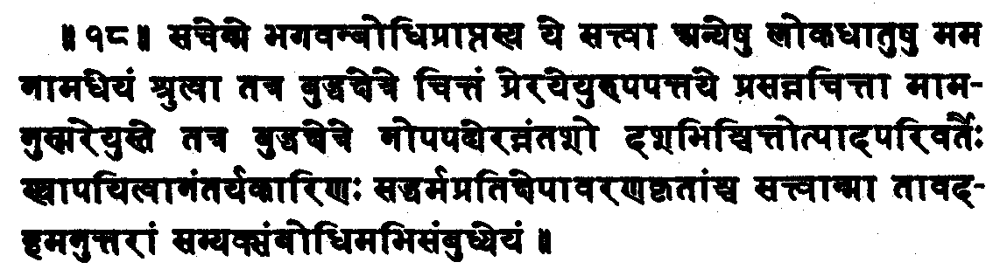
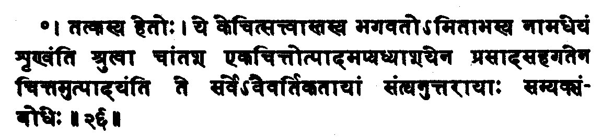
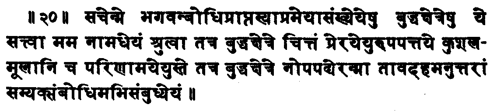
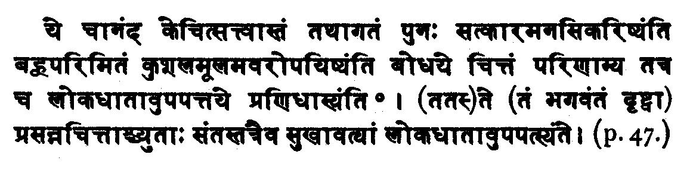
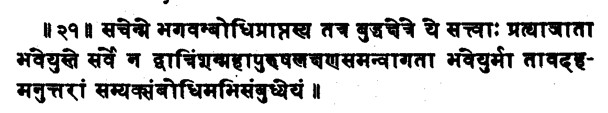
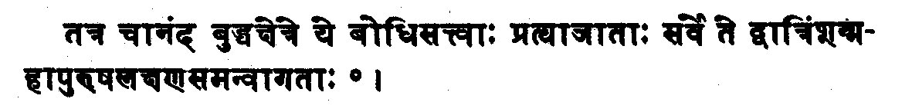

[Intangible Textual Heritage](../../index)  [Buddhism](../index) 
[Index](index)  [Previous](sbe4924)  [Next](sbe4927)

------------------------------------------------------------------------

{p. 73}

## NOTE

### BY THE REV. BUNYIU NANJIO, M.A.,

ON THE TWO PRA*N*IDHÂNAS,  
THE 18TH AND 21ST, MISSING IN THE TEXT.

   IN the Chinese translations of the Larger Sukhâvatî-vyûha, made by
Sanghavarman, A. D. 252, and Bodhiru*k*i, A. D. 693-713, there are
altogether 48 Pra*n*idhânas, not 46, as in the Sanskrit text. The 18th
and the 21St in the translations are evidently wanting in the Sanskrit
text, and the latter part of the 19th Pra*n*idhâna in that text is the
latter part of the lost 18th, according to the translations. This 18th
Pra*n*idhâna, however, is so important that it is called by Gen-ku, the
teacher of Shin-ran, the founder of the Shin-shiu sect, 'the king of the
Pra*n*idhânas.'

   Sanghavarman's translation of the 18th, 20th, and 21st is as
follows;--

   18. 'When I have obtained Buddhahood, if those beings who are in the
ten quarters should believe in me with serene thoughts, and should wish
to be born in my country, and should have say ten times thought of me
(or repeated my name),--if they should not be born there, may I not
obtain the perfect knowledge;--barring only those beings who have
committed the five deadly sins, and who have spoken evil of the good
Law.'

   The 18th Pra*n*idhâna in the Sanskrit text agrees with the 19th in
both Chinese translations; but the 20th in these translations is
somewhat shorter than the 19th in the Sanskrit text. The shorter
translation is as follows:--

{p. 74}

   20. 'When I have obtained Buddhahood, if those beings who are in the
ten quarters, after they have heard my name, should direct their
thoughts towards my country and should plant the roots of merit (or
prepare their stock of merit), and should bring them to maturity with
their serene thoughts, and wish to be born in my country,--if they
should not accomplish (their desire), may I not obtain the perfect
knowledge.

   21. 'When I have obtained Buddhahood, if gods and men in my country
should not all be endowed perfectly with the thirty-two marks of the
great man, may I not obtain the perfect knowledge.'

------------

   I have tried to restore the Sanskrit text for the above three
Pra*n*idhânas, in accordance with the Chinese translations.

   The 18th may be formed chiefly out of the 19th in the text, something
as follows;--

   Note.--The fulfilment of this Pra*n*idhâna is given in the text (p.
47. ll. 1-4). as the reason of the fulfilment of the I7th:--

   In the Chinese translations, the exception of two kinds of beings is
repeated at the end of this fulfilment.

------------

{p. 75}

   The 20th (i.e. 19th in the text) may then be shortened like this:--

   The fulfilment of this Pra*n*idhâna may be the 27th chapter in the
text, with the exception of some portion on the appearance of Amitâbha
before a dying man, which belongs to the 19th (i.e. 18th in the text)
Pra*n*idhâna.

------------

   The 21st may be like this:--

   This Pra*n*idhâna is found in the Tibetan translation.

   The fulfilment of this Pra*n*idhâna is to be found in chap. 35 (p.
56) as follows:--

------------------------------------------------------------------------

[Next: The Smaller Sukhâvatî-vyûha](sbe4927)
