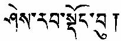

[Intangible Textual Heritage](../../index) [Buddhism](../index.md)

------------------------------------------------------------------------

# She-rab Dong-bu

### (The Tree of Wisdom)

## by Nagarjuna

### edited and translated by W. L. Campbell

###### \[Calcutta, 1919\]

###### {reduced to HTML by Christopher M. Weimer, June 2002}

------------------------------------------------------------------------

<table data-align="center" data-cellpadding="10">
<colgroup>
<col style="width: 100%" />
</colgroup>
<tbody>
<tr class="odd">
<td><a href="note">note to this edition</a> 
<a href="title">Title Page</a> 
<a href="pref">Preface</a> 
<a href="srdb">She-rab Dong-Bu</a></td>
</tr>
</tbody>
</table>
