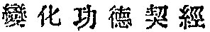
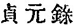
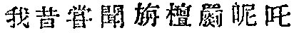

  
[Intangible Textual Heritage](../../index)  [Buddhism](../index.md) 
[Index](index)  [Previous](taf05)  [Next](taf07.md) 

------------------------------------------------------------------------

### DATE.

Let us first decide the date, which varies according to different
authorities from three hundred to six hundred years after the
Parinirvâna of Buddha.

I. The *li tai san pao chi* (*fas*. 1), [2](#fn_4.md) quoting the Record of the Sarvâstivâdin
school, says: "Açvaghosha Bodhisattva was born a Brahman in Eastern
India some three hundred years after the Nirvâna. After he abandoned his
worldly life, he refuted all the doctrines held by the tîrthakas
(heathen), [3](#fn_5.md) and writing

p. 3

the *Mahâ-alamkâra-çâstra* [1](#fn_6.md) in several
hundred verses ([*gâthâ*](errata.htm#0).md) greatly propagated the
teachings of Buddha.

2\. Hui-yuen [2](#fn_7.md) states in his commentary
(*fas*. 1) on the *Mahâ-prajñâ-pâramitâ-çâstra*, [3](#fn_8.md) the on the authority of Kumârajîva   (A. D. 339-413), that
Açvaghosha flourished about three hundred and seventy years after the
Nirvâna.

3\. In the *Life of Vasubandhu*, [4](#fn_9.md)
Açvaghosha is mentioned as a contemporary of Kâtyâyana who is said in
the same book to have been living in the fifth century after the
Nirvâna.

4\. The writer [5](#fn_10.md) of the preface to the
second Chinese translation of the *Mahâyâna-çraddhotpâda-çâstra* [6](#fn_11.md) says that this Çâstra "is the deepest of
the Mahâyâna texts. Five hundred years after the Nirvâna, Açvaghosha
appeared in the world. He was numbered

p. 4

among the four suns \[of Buddhists\], and his teachings stood most
prominently \[among the doctrines prevailing\] in the five countries of
India."

5\. Sang-ying [1](#fn_12.md) states in his preface
to the Chinese translation of the *Mahâ-prajñâ-pâramitâ-çâstra* that
Açvaghosha appeared towards the end of the period of Orthodoxy, i.e.,
five hundred years after the Nirvâna.

6\. The *Fu tsou t‘ung chi* [2](#fn_13.md) (Vol.
V.) says that it was the fulfilment of the Tathâgata's prophecy that six
hundred years after the Nirvâna the Dharma was transmitted to
Açvaghosha.

7\. This six hundred year prophecy is adopted as if it were an
unquestionable fact, by Fa-tsang, [3](#fn_14.md) a
learned commentator of the *Çraddhotpâdaçâstra* (*Discourse on the
Awakening of Faith*).

8\. Chih-k‘ai   who was
the copyist for Paramârtha when he translated the *Çraddhotpâdaçâstra*,
also adheres to the six hundred year tradition in his preface to the
book just mentioned, saying that some six hundred years after the
Nirvâna of the Tathâgata, many devilish heretical leaders clamorously
protested their false doctrines against the good law of Buddha,

p. 5

when a Çrâmana of very high virtue, called Açvaghosha, thoroughly versed
in the philosophy of the Mahâyâna Buddhism and highly compassionate for
those ignorant people, wrote this Discourse (the (*Çraddhotpâdaçâstra*),
in order that he might increase the brilliancy of the Triratna, etc.,
etc.

9\. The six hundred year tradition is very popular among Chinese and
Japanese Buddhists. The [*Fo*](errata.htm#1.md) *tsu li tai tung
tsai* [1](#fn_15) (*fas*. 5.md) also follows it.

10\. The prophecy above referred to (see No. 8), which is doubtless a
later invention, appears in the *Mahâmâyâ sûtra* [2](#fn_16) (*fas*. 2.md) as follows:

"After the death of Buddha, Mahâmâyâ asked Ânanda if Buddha had ever
told him in his life anything concerning the future of Buddhism.
Responding to this, Ânanda said: 'I heard one time Buddha say this with
regard to the future decline of Buddhism: "After the Nirvâna Mahâkâçyapa
with Ânanda will compile the Dharma-piṭaka, and when it is settled
Mahâkâçyapa will enter into a Nirodha-samâpatti in the Lang chi shan
\[i.e., Mount of Wolf's Track, Kukkurapadagiri\], and Ânanda too
obtaining the fruit

p. 6

of enlightenment will in turn enter into Parinirvâna, when the right
doctrine will be transmitted to Upagupta who will in an excellent manner
teach the essence of the Dharma. . . . When five hundred years are
passed \[after Buddha's death\] a Bhikshu named Pao-tien \[Ratnadeva?\]
will in an excellent manner teach the essence of the Dharma, converting
twenty thousand people and causing all sentient beings in the eight
creations to awaken the Anuttarasamyaksambodhicitta
\[most-perfect-knowledge-mind\]. The right doctrine will then go to
decline. When six hundred years \[after Buddha's death\] are expired,
ninety different schools of the tîrthakas will arise and proclaiming
false doctrines, each will struggle against the other to destroy the law
of Buddha. Then a Bhikshu, Açvaghosha by name, will in an excellent
manner teach the essence of the Dharma and defeat all the followers of
the tîrthakas. When seven hundred years \[after Buddha's death\] are
expired, a Bhikshu, Nâgârjuna by name, will in an excellent manner teach
the essence of the Dharma, destroying the banner of false philosophy and
lighting the torch of the right doctrine."'"

II\. Referring to the statement of the above mentioned Sûtra, Nâgârjuna,
a famous Buddhist philosopher who wrote a commentary on Açvaghosha's
work, called *Çraddhotpâdaçâstra*, claims that there were six
Açvaghoshas at different times, to fulfil the prophecy of Buddha and
that the author of the book on which

p. 7

he writes a commentary [1](#fn_17.md) was one who
appeared on earth according to the prophecy in the Mahâmâyâ sûtra.
Nâgârjuna even states that he was a disciple of Açvaghosha, but the work
itself is regarded as spurious,

p. 8

on account of some obvious contradictions, though the followers of the
Mantra sect (*Shingonshyu*) insist on its genuineness, because they are
anxious to have an ancient authority for their own mystic doctrines,
which are here supported.

p. 9

Deeply absorbed in metaphysical speculation, the inhabitants of India
paid very little attention to history, and whenever we endeavor to
ascertain the date of important historical figures we are sure to find
our way to certainty barred. So we cannot decide which of the
conflicting traditions above enumerated is to be considered as
authentic. When taken independently of other historical events which are
connected with them and whose dates have been already fixed, they have
no value whatever. Besides it should be observed, the chronology of
Buddha, to which every one of the traditions makes reference, is as yet
unsettled and must have been still more so at the time when those
traditions were current in India as well as in China. If they differed
as to the date of Buddha, they might have maintained the same date for
Açvaghosha; no one can tell. We have to seek a light from another
source.

Another group of traditions centering around Açvaghosha is his connexion
with a most powerful king of Yüeh chih 
, who established his extensive kingdom in
Northwestern India. Who was this king? In the   *Tsa pao tsang ching* 

p. 10

\[paragraph continues\] (*Samyuktaratna-pitaka-sûtra*?) [1](#fn_18.md), *fas*. 7, we read: "A king of Tukhâra,
Candana Kanishṭha [2](#fn_19.md) (or Kanîta?
Chinese  
*chan-lan-chi-ni-ch‘a*) had a close friendship with three wise men: the
first one was a Bodhisattva, called Açvaghosha; the second, a minister
of state called Mo-cha-lo (Maṭhara or Madara?); the third, an
experienced physician called Chê-lo-chia (Caraka). With these three the
king was on most intimate terms and treated them with the utmost
cordiality, permitting them to approach his person. Açvaghosha said
\[one day\] to him that if he \[the king\] would follow his advice, he
would obtain in his coming life everything that was good, eternally put
an end to all his misfortunes and forever be free from evil." . .
. [3](#fn_20.md)

p. 11

Açvaghosha's relation with King Candana Kanishṭha (or Kanîta? Chinese
Chi-ni-ch‘a) is told also in the *Fu fa tsang yin yüan ch‘uan*, [1](#fn_21.md) *fas*. 5:

"\[At that time\]. the king of Tukhâra was very powerful. He was called
Candana Kanishṭha \[or Kanîta? Chinese Chi-ni-ch‘a\]. Being very
ambitious and bold, and far superior in courage to all his
contemporaries, every country he invaded was sure to be trampled down
under his feet. So when he advanced his four armies towards Pâṭaliputra
\[Hua shih ch‘êng in Chinese\], the latter was doomed to defeat in spite
of some desperate engagements. The king demanded an indemnity of
900,000,000 gold pieces, for which the defeated king offered Açvaghosha,
the Buddha-bowl and a compassionate fowl, each being considered worth
300,900,000 gold pieces. The Bodhisattva Açvaghosha had intellectual
powers inferior to none; the Buddha-bowl having been carried by the
Tathâgata himself is full of merits; the fowl being of compassionate
nature, would not drink any water with worms in it,--thus all these
having merits enough to keep off all enemies, they are on that account
worth

p. 12

\[paragraph continues\] 900,000,000 gold pieces. [1](#fn_22.md) The king \[of Tukhâra\] was greatly
pleased at receiving them, and immediately withdrawing his army from the
land went back to his own kingdom."

We have the same legend stated in a brief biography [2](#fn_23.md) of Açvaghosha as follows:

"After that a king of the smaller Yüeh chih country \[i.e., Tukhâra\] in
North India invaded the Middle country \[i.e., Magadha\]. When the
besieging had continued for some time, the king of Central India sent a
message \[to the invader\] saying: 'If there be anything you want, I
will supply it; do not disturb the peace of my people by thus long
staying here,' to which this reply was given: 'If you really ask a
surrender, send me 300,000,000 gold pieces; I will release you.' The
\[besieged\] king said: 'Even this entire kingdom cannot produce
100,000,000 gold pieces, how can I supply you with 300,000,000?' The
answer was: 'There are in your country two great treasures: (1) the
Buddha-bowl, [3](#fn_24) (2.md) a Bhikshu of

p. 13

wonderful talent (i.e., Açvaghosha). Give them to me, they are worth
300,000,000 gold pieces.' The \[besieged\] king said: 'Those two
treasures are what I most revere, I cannot give them up.' Thereupon the
Bhikshu said to the king in explanation of the Dharma:

"'All sentient beings are everywhere the same, while Buddhism, deep and
comprehensive, aims at universal salvation, and the highest virtue of a
great man consists in delivering \[all\] beings. As our temporal
administration is very liable to meet obstructions, even your rule does
not extend itself outside of this one kingdom. If you, on the other
hand, propose a wide propagation of Buddhism, you would naturally be a
Dharmarâja over the four oceans. The duty of a Bhikshu is to save
\[all\] the people and not to give preference to one or the other.
Merits lie in our heart; truth makes no distinction. Pray, be
farsighted, and do not think only of the present.'

"The king who was from the first a great admirer of him, respectfully
followed his advice and delivered him to the king of Yüeh chih who
returned with him to his own kingdom."

Comparing all these traditions, we are naturally led to the conclusion
that Açvaghosha, who was numbered as one of the four suns [1](#fn_25.md) of Buddhism, must have

p. 14

had a very powerful influence over the spiritual India of the time, that
the king who wished to have him as a spiritual adviser must have been a
very devoted Buddhist so as to accept a Bhikshu instead of an enormous
sum of money, and that such a devoted Buddhist king, ruling over the
vast domain which extended from the bank of the Indus towards the lower
Ganges, must have been living sometime between the third and sixth
century after the Nirvâna, whatever the authentic date of Buddha might
be. The next conclusion we can advance therefore will be the
identification of this king who is called Candana Kanishṭha or Kanîta in
the above stories, with Kanishka, [1](#fn_26.md)
the originator of the third Buddhist convocation in Kashmir.

As to the difference of the name, we have to say this. While
Hsüen-tsang's transliteration for Kanishka is Chia-ni-shê-chia   which is quite an approximate
reproduction of the original sounds, the Chinese method of
transliteration before his time by the so-called "old translators" was
rather irregular, loose and therefore often misleading. Add to this the
liability to error on the part of local dialects, and we do not
improperly identify Chi-ni-ch‘a, with Kanishka, while the former may be
Sanskritised Kanishṭa or Kanîta. [2](#fn_27.md)

p. 15

In further support of this view, we quote from the *Journal of the
Buddhist Text Society*, Vol. I., Part 3, an article on King Kanishka,
taken from a Tibetan source, which bears a more historical appearance
than the legends above referred to. The abstract is:

"Kanishka, king of Palhâva and Delhi, [1](#fn_28.md) was born four hundred years after the
Nirvâna. When he learned that Simha, king of Kashmir, abandoned the
worldly life to become a Buddhist priest under the name of Sudarçana and
obtained Arhatship, he went to Kashmir and heard a sermon delivered by
Sudarçana. [2](#fn_29.md) At that time a Mahâyâna
priest who held a most prominent

p. 16

position in northern countries was called Açvaghosha. His influence in
the spiritual world was as incomparable as the temporal power of
Kanishka who conquered Kashmir and Jâlamdhara. The king sent a message
to Açvaghosha to come to his kingdom, who, however, owing to his old
age, could not accept the invitation, but sent him a leading disciple of
his called Jñânayaça, accompanied with a letter treating the essential
points of Buddhism." [1](#fn_30.md)

Though the Tibetan tradition considerably differs in many respects from
the Chinese accounts above mentioned, they both agree in this point that
Açvaghosha and Kanishka had some intercourse, or that at least they were
contemporaneous and known to each other. So we may take it as an
established fact that Açvaghosha, the author of the   *Mahâyâna-çraddhotpâda-çâstra*
(*Discourse on the Awakening of Faith in the Mahâyâna*), was living at
the time of Kanishka. [2](#fn_31.md)

I do not think there is any need here to enumerate all different
opinions about the time of Kanishka, which has been already
approximately fixed by the untiring investigation of European scholars,
such as Princep, Lassen, Cunningham, Wilson, Fergusson,

p. 17

\[paragraph continues\] Max Müller, and others. [1](#fn_32.md) So long as our present aim is to assign
the time of Açvaghosha more definitely than stating vaguely some three
or five hundred years after the Nirvâna of Buddha, suffice it to say
that he lived at the time extending from the latter half of the first
century before Christ to about 50 or 80 A. D. If we fix the date of
Buddha's death in the fifth century before Christ, Açvaghosha must be
said to have lived during the six hundredth year after the Nirvâna. At
the very most his time cannot be placed later than the first century of
the Christian era.

I have spared no pains, even at the risk of tediousness, in gathering
all the information obtainable from Chinese sources relative to the date
of Açvaghosha, because this date is of paramount importance when we
enter into the discussion of the development of the Mahâyâna Buddhism,
which is commonly and erroneously considered to be the sole work of
Nâgârjuna.

------------------------------------------------------------------------

### Footnotes

[2:2](taf06.htm#fr_4.md)   *Records of the Triratna Under
Successive Dynasties*, compiled by 
 Chang-fang, A. D. 597; 15 *fasciculi*.

[2:3](taf06.htm#fr_5.md) Tîrthaka, which literally
means "ascetics," was first applied to a definite sect, viz., the naked
ascetics of the Jains, but was later on extended to all dissenters and
has therefore been translated ''heretics or heathen." The Chinese
translation of the term literally means "\[followers of\] a doctrine
other than Buddhism."

[3:1](taf06.htm#fr_6.md) Translated into Chinese by
Kumârajîva, circa A. D. 405. 15 *fas*.

[3:2](taf06.htm#fr_7.md)   A. D. 333-416. The leader of
the Pai lien she (White Lotus Society), first Sukhâvatî sect movement in
China.

[3:3](taf06.htm#fr_8.md) *Treatise on the Great
Wisdom-Perfection*, by Nâgârjuna. A Chinese translation by Kumârajîva,
A. D. 402-405. 100 *fas*.

[3:4](taf06.htm#fr_9.md) The original Sanskrit
author is unknown. The present Chinese translation is by Paramârtha who
came to China from Western India A. D. 546.

[3:5](taf06.htm#fr_10.md) The writer's name is not
mentioned there, nor the date; but judging from the knowledge he shows
in treating the subject, as we shall see later, he must have been living
either at the time of this second translation or immediately after it.

[3:6](taf06.htm#fr_11.md) *Discourse on the
Awakening of Faith in the Mahâyâna*, the principal work of Açvaghosha.

[4:1](taf06.htm#fr_12.md)   A. D. 362-439. One of the four
famous disciples of Kumârajîva.

[4:2](taf06.htm#fr_13.md)   A history of Buddhism,
compiled by Chih-p‘an  , a
Chinese priest, during the latter half of the thirteenth century. 54
*fas*.

[4:3](taf06.htm#fr_14.md) 643-712. A most prominent
leader of the Avatamsaka sect in China.

[5:1](taf06.htm#fr_15.md)   A History of Buddha and the
Patriarchs Through Successive Dynasties, by Nien chang   A. D. 1333. 36 *fas*.

[5:2](taf06.htm#fr_16.md) The Sûtra is also called
the *Sûtra on Buddha's Ascent to the Trayastrimsa Heaven, to Teach the
Dharma to His Mother* 2 *fas*. A second Chinese translation by Shih
T‘an-ching   of the Ch‘i
dynasty   (A. D. 479-502).
His nationality and life both are unknown.

[7:1](taf06.htm#fr_17.md) The Sanskritised title is
the *Mahâyâna-çâstra-vyâkhyâ*, trans. into Chinese by Pa-ti-mo-to  , an Indian priest, A. D.
401-402. 10 *fas*. The statements in full run as follows:

"In all there were six Açvaghoshas, owing to different predictions in
the sûtras; each of them appeared to fulfil his mission according to the
necessity of the time, and there is no contradiction in them."

The author then proceeds to make particular references to those sûtras:

"When we examine all different predictions in the sûtras taught by
Buddha through his whole life, we find six different \[personages all
called Açvaghosha\]. What are those six? (1) According to the   *Tai ch‘êng pên fa ch‘i ching*
(*Mahâyânâpûrvadharmasûtra*?) we have the following: When the peerless,
great, enlightened, honored one was speaking about his intention of
entering into Nirvâna, Açvaghosha rising from the seat knelt down,
saluted Buddha's feet, and respectively joining his hands together
turned towards Buddha, the world-honored one, and said this in verse:
'The peerless one whose heart is filled with great love and whose
immeasurable virtues have been accumulated through æons which are like a
boundless ocean, the Buddha, only on account of love and compassion for
all sentient beings, now speaks about his entering into Nirvâna, and I
and all the other members of the Saṁgha feel an unspeakable despair,
utterly confused in mind and spirit. If even the world-honored one, full
of great love, is going to another world, leaving his own children
behind him, why then could not I who am not yet full of love and
compassion go to another world following Buddha's steps? Who can blame
me?' When finished uttering these words, Açvaghosha gazed at the pupil
of Buddha's eye and gradually passed out of life. (2) The   *Pien ‘hua kung tê ch‘i ching*
(*Vikriyâpunyasûtra*?) says: Then the Bhagavat said to Açvaghosha:
'Three hundred years after my Nirvâna thou shalt obtain an inspiration
from me and with various methods (*upâya*) p. 8
benefit and make happy all beings in coming generations. When thou dost
not have any inspiration from me, thou canst not do this by thyself,'
(3) The   *Mahâmâyâsûtra*
says as follows: 'When six hundred years are passed after the
disappearance of the Tathâgata, ninety-six different schools of the
tîrthakas will arise, and professing false doctrines, each will struggle
against the other to destroy the law of Buddha. A Bhikshu called
Açvaghosha, however, will in an excellent manner proclaim the essence of
the Dharma and defeat all followers of the tîrthakas. (4) In the   *Ch‘ang tê san mei ch‘i ching*
(*Sûtra on the Samâdhi of Eternal Merit*) we read: In the eight
hundredth year after the Nirvâna there will be a wise man, Açvaghosha by
name. Among the followers of the tîrthakas as well as those of Buddhism,
he will refute all those who cherish heretical views and will establish
the Dharma taught by Buddha. (5) In the 
 *Mo ni ch‘ing ch‘i ching* (*Manivimâlasûtra*?) is
said thus: About one hundred years after the Nirvâna of Buddha,
Açvaghosha Mahâsattva will appear on earth protect the right doctrine
and safely hoist the banner of Buddhism. (6) In the  . *Shêng ting wang ch‘i ching*
(*Crimûrdharâjasûtra*?) is said thus: On the seventeenth day after the
enlightenment of Buddha there was a tîrthaka called   Chia-lo-no-chiu-shih-to
(Kâlanakshiṭa?), who transforming himself into the figure of a great
nâgarâja (i.e., snake-king) with 86,000 heads and 86,000 tongues,
simultaneously proposed 86,000 contradicting questions and asked the
Tathâgata \[for the solution\]. He then gave him a triple answer
explaining all those paradoxes. The nâgarâja then proposed tenfold
questions, again asking the Tathâgata \[for their solution\], to which
he gave a hundredfold answers and explained their paradoxes. When this
dialogue came to an end, Buddha said to the nâgarâja: 'Very good, very
good, O Açvaghosha Çrâmana! in order to guard the castle of the Dharma,
thou hast assumed this form of destruction, establishing p. 9 the doctrine of Buddha. Be patient, be patient,
always discipline thyself in this way, always behave thyself in this
way, do not go round in a small circle, but make a universal tour.' The
nâgarâja then abandoning his assumed beast-form revealed his own real
character and approaching the peerless, honored one and saluting him
said rejoicingly in verse, etc., etc. This is the sixth Açvaghosha."

[10:1](taf06.htm#fr_18.md) *Sutra on the Casket of
Miscellaneous jewels*. The original Sanskrit author is unknown.
Translated into Chinese by Chi-chia-yeh (
 Kimkara?) of the Western country and T‘an-yao  , A. D. 472. 8 *fas*. The
original text is said to have existed at the time when the *Chêng-yüan
Catalogue*   was compiled
(A. D. 785-804) by Yüan-chao 
 a Buddhist priest of the Tang   dynasty (A. D. 618-907).

[10:2](taf06.htm#fr_19.md) Does Kanishṭha, which
literally means "youngest," refer to the youngest of the three brothers
who successively governed the Tukhâra district of India? If so, there is
no question about the identity of him and King Kanishka.

[10:3](taf06.htm#fr_20.md) The Fu fa tsang ch‘uan
(Transmission of the *Dharma-pitaka*), *fas*. 5, also seems to refer to
the same tradition, for it is stated that when a king of Tukhâra
(probably Kanishka) was very much afflicted on account of his having
committed many atrocious deeds in the war with Parthia (Eastern Persia),
Açvaghosha told him that if he would follow the Dharma with a sincere
heart, his sin would gradually be attenuated; and also that the same
king had a physician called Caraka "who thoroughly understood pharmacy,
p. 11 and who was clever, learned,
intelligent, elegant, meek, and compassionate," etc.

[11:1](taf06.htm#fr_21.md)   *Accounts Relating to the
Transmission of the Dharmapitaka*. 6 *fas*. The original Sanskrit author
is unknown. The third Chinese translation now existent is by
Chi-chia-yeh (Kimkara?) of the Western country, A. D. 472. The original
text is said to have been existing when the *Chêng yüan* Catalogue (A.
D. 785-804) was compiled.

[12:1](taf06.htm#fr_22.md) This is a comical
feature of the legend, for if these treasures could ward off all enemies
why did they not protect the unfortunate king of Pâtaliputra against
Kanishṭha?

[12:2](taf06.htm#fr_23.md) *Life of Açvaghosha*
 , translated into Chinese
by Kumârajîva. Very short. The author is unknown. The original Sanskrit
text is stated in the *Chêng yüan Catalogue* to have been existing at
that time, Cf. [Wassiljew's](errata.htm#2.md) *Buddhismus*, German edition,
p. 231 et seq.

[12:3](taf06.htm#fr_24.md) Fa-hien   states that Kanishka (which is
transliterated by him into Chinese Chi-ni-chia  , corresponding to Sanskrit
Kanika) as if a different person from the king of Yüeh chih p. 13 who invaded Gandhâra to get the Buddha-bowl.
*Vide* Legge's translation of Fa-hien, pp. 33 and 34.

[13:1](taf06.htm#fr_25.md) Hsüen-tsang's  , *Records of Western
Countries*, Beal's English translation, Vol. II., p. 302.

[14:1](taf06.htm#fr_26.md) A. D. 85-106, according
to M. Müller.

[14:2](taf06.htm#fr_27.md) One objection to
identifying Chi-ni-ch'a  
(Kanishṭha or Kanîta) with Kanishka 
 is a single Chinese character appearing in the
*Mahâlamkâraçâstra* (*Book of Great Glory*), the work ascribed to
Açvaghosha. In *fas*. 3 as well as *fas*. 6 of the p.
15 same book referring to Candana Kanishṭha or Kanîta, the writer
says: "  *Wo hsi ch‘ang
wên, chan-t‘an chi-ni-châ wang*," i.e., "I heard of old that King
Candana Kanishṭha," etc. (in *fas*. 6., chia-ni-ch‘a), etc., etc. The
Chinese character *hsi* usually means "of yore" or "in olden times," but
it also signifies the past indefinitely, near as well as distant. If we
thus understand the term in the sense of "some time ago," or simply
"once," there will be no difficulty in demonstrating that Açvaghosha was
an elder contemporary of Kanishka, though we cannot apparently accept
the Chinese tradition which says they were intimately known to each
other. Because in that case Açvaghosha would not refer to the king in
such a hearsay manner as stated in the book above mentioned. Taking all
in all, this does not prevent us asserting that they were
contemporaneous.

[15:1](taf06.htm#fr_28.md) Cf. A. Schiefner's
German translation of Târanâtha's *History of Buddhism*, p. 89: "Nachdem
König Çrîtschandra die Herrschaft ausgeübt hatte, waren viele Jahre
vergangen, als im Westen im Lande Tili und Mälava ein an Jahren junger
König Kanika in die Herrschaft gewählt wurde."

[15:2](taf06.htm#fr_29.md) Târanâtha's statement
differs from this. According to him Kanika and Kanishka are not the same
king, the former being that of Tili and Mâlava, while the latter that of
Jâlamdhara. *Vide* pp. [58](taf21.htm#page_58.md) and
[90](taf22.htm#page_90.md). Târanâtha might have confused them.

[16:1](taf06.htm#fr_30.md) Târanâtha also states
this event (*Geschichte des Buddhismus*, p. 92). But the king is not
Kanishka, but Kanika; and the name of the disciple is not Jñânayaça, but
Dschnânakriya.

[16:2](taf06.htm#fr_31.md) A further corroboration
of this view will be met with when we treat later on of the conversion
of Açvaghosha by Parçva or his disciple Puṇyayaças.

[17:1](taf06.htm#fr_32.md) Max Müller's opinion, as
stated before, is that Kanishka lived A. D. 85-106; Lassen thinks the
Gondopharean dynasty was succeeded by Kanishka, king of the Yüeh chih,
about one hundred years before Christ; Princep places his reign during
the first century A. D.; Cunningham thinks his consecration was 58 A.
D.; Fergusson, 79 A. D.; Rhys Davids, about 10 A. D., etc.

------------------------------------------------------------------------

[Next: Nativity and Peregrinations](taf07.md)
