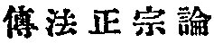
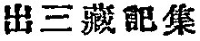
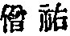
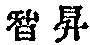

  
[Intangible Textual Heritage](../../index)  [Buddhism](../index.md) 
[Index](index)  [Previous](taf09)  [Next](taf11.md) 

------------------------------------------------------------------------

### LISTS OF PATRIARCHS.

The incorrectness of the Tibetan story, as to the conversion of
Açvaghosha by Âryadeva above referred to, is further shown by a list of
the Buddhist patriarchs in India appearing in various Buddhist books
either translated from Sanskrit into Chinese or compiled

p. 33

in China from sundry sources. In every one of them Açvaghosha is placed
after Parçva or Puṇyayaças

<table style="width:100%;" data-border="1" width="100%">
<colgroup>
<col style="width: 16%" />
<col style="width: 16%" />
<col style="width: 16%" />
<col style="width: 16%" />
<col style="width: 16%" />
<col style="width: 16%" />
</colgroup>
<tbody>
<tr class="odd">
<td data-valign="top" width="98">
 
</td>
<td data-valign="top" width="104">
THE FO TSU T‘UNG TSAI
</td>
<td data-valign="top" width="104">
THE FO TSU T‘UNG CHI
</td>
<td data-valign="top" width="170">
THE FU FA TSANG CHUAN
</td>
<td data-valign="top" width="178">
BHUDDABHADRA <a href="#fn_50">1</a>
</td>
<td data-valign="top" width="104">
SARVASTI-VADIN
</td>
</tr>
<tr class="even">
<td data-valign="top" width="98">
1
</td>
<td data-valign="top" width="104">
Mahâkâçyapa
</td>
<td data-valign="top" width="104">
Mahâkâçyapa
</td>
<td data-valign="top" width="170">
Mahâkâçyapa
</td>
<td data-valign="top" width="178">
Ânanda
</td>
<td data-valign="top" width="104">
Mahâkâçyapa
</td>
</tr>
<tr class="odd">
<td data-valign="top" width="98">
2
</td>
<td data-valign="top" width="104">
Ânanda
</td>
<td data-valign="top" width="104">
Ânanda
</td>
<td data-valign="top" width="170">
Ânanda
</td>
<td data-valign="top" width="178">
Madhyântika
</td>
<td data-valign="top" width="104">
Ânanda
</td>
</tr>
<tr class="even">
<td data-valign="top" width="98">
3
</td>
<td data-valign="top" width="104">
Çaṇavâsa
</td>
<td data-valign="top" width="104">
Çaṇavâsa
</td>
<td data-valign="top" width="170">
Çaṇavâsa
</td>
<td data-valign="top" width="178">
Çaṇavâsa
</td>
<td data-valign="top" width="104">
Madhyântika
</td>
</tr>
<tr class="odd">
<td data-valign="top" width="98">
4
</td>
<td data-valign="top" width="104">
Upagupta
</td>
<td data-valign="top" width="104">
Upagupta
</td>
<td data-valign="top" width="170">
Upagupta
</td>
<td data-valign="top" width="178">
Upagupta
</td>
<td data-valign="top" width="104">
Çaṇavâsa
</td>
</tr>
<tr class="even">
<td data-valign="top" width="98">
5
</td>
<td data-valign="top" width="104">
Dṛtaka
</td>
<td data-valign="top" width="104">
Dṛtaka
</td>
<td data-valign="top" width="170">
Dṛtaka
</td>
<td data-valign="top" width="178">
Kâtyâyana
</td>
<td data-valign="top" width="104">
Upagupta
</td>
</tr>
<tr class="odd">
<td data-valign="top" width="98">
6
</td>
<td data-valign="top" width="104">
Micchaka
</td>
<td data-valign="top" width="104">
Micchaka
</td>
<td data-valign="top" width="170">
Micchaka
</td>
<td data-valign="top" width="178">
Vasumitra
</td>
<td data-valign="top" width="104">
Maitreya
</td>
</tr>
<tr class="even">
<td data-valign="top" width="98">
7
</td>
<td data-valign="top" width="104">
Vasumitra
</td>
<td data-valign="top" width="104">
Buddhanandi
</td>
<td data-valign="top" width="170">
Buddhanandi
</td>
<td data-valign="top" width="178">
Kṛshṇa
</td>
<td data-valign="top" width="104">
Kâtyâyana
</td>
</tr>
<tr class="odd">
<td data-valign="top" width="98">
8
</td>
<td data-valign="top" width="104">
Buddhânandi
</td>
<td data-valign="top" width="104">
Buddhamitra
</td>
<td data-valign="top" width="170">
Buddhamitra
</td>
<td data-valign="top" width="178">
Parçva
</td>
<td data-valign="top" width="104">
Vasumitra
</td>
</tr>
<tr class="even">
<td data-valign="top" width="98">
9
</td>
<td data-valign="top" width="104">
Buddhamitra
</td>
<td data-valign="top" width="104">
Parçva
</td>
<td data-valign="top" width="170">
Parçva
</td>
<td data-valign="top" width="178">
Açvaghosha
</td>
<td data-valign="top" width="104">
Kṛshṇa
</td>
</tr>
<tr class="odd">
<td data-valign="top" width="98">
10
</td>
<td data-valign="top" width="104">
Parçva
</td>
<td data-valign="top" width="104">
Puṇyayaças
</td>
<td data-valign="top" width="170">
Puṇyayaças
</td>
<td data-valign="top" width="178">
Ghosha
</td>
<td data-valign="top" width="104">
Parçva
</td>
</tr>
<tr class="even">
<td data-valign="top" width="98">
11
</td>
<td data-valign="top" width="104">
Puṇyayaças
</td>
<td data-valign="top" width="104">
Açvaghosha
</td>
<td data-valign="top" width="170">
Açvaghosha
</td>
<td data-valign="top" width="178">
 
</td>
<td data-valign="top" width="104">
Açvaghosha
</td>
</tr>
<tr class="odd">
<td data-valign="top" width="98">
12
</td>
<td data-valign="top" width="104">
Açvaghosha
</td>
<td data-valign="top" width="104">
Kapi
</td>
<td data-valign="top" width="170">
Kapimala
</td>
<td data-valign="top" width="178">
 
</td>
<td data-valign="top" width="104">
Kumârata
</td>
</tr>
<tr class="even">
<td data-valign="top" width="98">
13
</td>
<td data-valign="top" width="104">
Kapimala
</td>
<td data-valign="top" width="104">
Nâgârjuna
</td>
<td data-valign="top" width="170">
Nâgârjuna
</td>
<td data-valign="top" width="178">
 
</td>
<td data-valign="top" width="104">
 
</td>
</tr>
<tr class="odd">
<td data-valign="top" width="98">
14
</td>
<td data-valign="top" width="104">
Nâgârjuna
</td>
<td data-valign="top" width="104">
Kanadeva
</td>
<td data-valign="top" width="170">
 
</td>
<td data-valign="top" width="178">
 
</td>
<td data-valign="top" width="104">
 
</td>
</tr>
<tr class="even">
<td data-valign="top" width="98">
15
</td>
<td data-valign="top" width="104">
Kanadeva 
  (Âryadeva)
</td>
<td data-valign="top" width="104">
 
</td>
<td data-valign="top" width="170">
 
</td>
<td data-valign="top" width="178">
 
</td>
<td data-valign="top" width="104">
 
</td>
</tr>
<tr class="odd">
<td data-valign="top" width="98">
34
</td>
<td data-valign="top" width="104">
 
</td>
<td data-valign="top" width="104">
 
</td>
<td data-valign="top" width="170">
 
</td>
<td data-valign="top" width="178">
 
</td>
<td data-valign="top" width="104">
Nâgârjuna
</td>
</tr>
<tr class="even">
<td data-valign="top" width="98">
35
</td>
<td data-valign="top" width="104">
 
</td>
<td data-valign="top" width="104">
 
</td>
<td data-valign="top" width="170">
 
</td>
<td data-valign="top" width="178">
 
</td>
<td data-valign="top" width="104">
Deva
</td>
</tr>
</tbody>
</table>

p. 34

and before both Nâgârjuna and Âryadeva, the most brilliant disciple of
the former. The list on the opposite page, therefore, as noticed
elsewhere, will furnish good material for fixing the time of Açvaghosha.
It does not make any practical difference whether he was converted by
Parçva himself or his immediate successor and disciple Puṇyayaças,
because it is most probable they all were contemporaneous. The list
generally gives twenty-three or twenty-eight patriarchs beginning with
Mahâkâçyapa, but not deeming it necessary to give a complete list, I
have cut it short at Deva.

Chieh-sung [1](#fn_51.md) refutes in his *Chuan fa
chang tsung lun*   (*A
Treatise on the Right Transmission of the Dharma*) the authority of the
Transmission of the Dharmapitaka (*Fu fa tsang chuan*), but he agrees
with it down to the seventeenth patriarch. The principal point of his
refutation is simply that Bodhidharma, the founder of the Chinese Dhyâna
school, should be included in the list.

------------------------------------------------------------------------

### Footnotes

[33:1](taf10.htm#fr_50.md) He was a native of
Kapilavastu and came to China A D. 406. A translator of many Sanskrit
works. His list belongs to the Sarvâstivâdin, though it is a little
different from the succeeding one. The former contains fifty-four and
the latter fifty-three patriarchs. See the *Ch‘u san tsang chi chi*
  by   (Nanjo's Catalogue, No. 1476).

[34:1](taf10.htm#fr_51.md)  , a priest of the Dhyâna school
who died A. D. 1071 or 1072. He wrote among other works one on the
fundamental identicalness of Confucianism and Buddhism.

------------------------------------------------------------------------

[Next: As an Artist](taf11.md)
