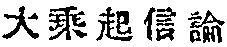
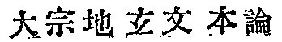
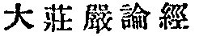
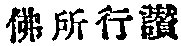
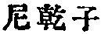
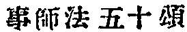
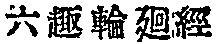

  
[Intangible Textual Heritage](../../index)  [Buddhism](../index.md) 
[Index](index)  [Previous](taf11)  [Next](taf13.md) 

------------------------------------------------------------------------

### WORKS IN CHINESE TRANSLATIONS.

The works ascribed to Açvaghosha and still existing in Chinese
translations are eight in number. They are: (1) The   *Tai shêng ch‘i hsin lun*
(*Mahâyânaçraddhotpâdaçâstra*): *discourse on the awakening of* 

p. 37

*faith in the Mahâyâna*. It is the principal work of Açvaghosha, and
through this we are able to recognise what an important position he
occupies in the development of the Mahayanistic world-conception and
theory of final emancipation. Its outlines and the accounts of its
Chinese translation will be given below. (2) The   *Ta sung ti hsüan wên pên
lun*, a fundamental treatise on the spiritual stages for reaching final
deliverance. The book has a decided tendency to mysticism, explaining a
gradual development of religious consciousness through fifty-one
different spiritual stages. It may be considered a precursory work out
of which Vajrabodhi's Mantrism finally made a full manifestation. It was
translated by Paramârtha between A. D. 557-569. Twenty *fasciculi*,
forty chapters. (3) The 
*Ta chuang yen lun ching* (*Mahâlamkârasûtraçâstra*),
the *Book of Great Glory*, or a compilation of stories illustrating the
retribution of karma. The stories relate mostly to the events that
occurred in Western India. Beal translated some of them in his *Buddhist
Literature in China*. The Chinese translator is Kumârajîva, circa A. D.
405. Fifteen fasciculi.. (4) The 
 *Fo shu hing tsan* (*Buddha-caritakâvya*), a well
known poem on the life of Buddha. The Chinese translation is by
Dharmaraksha between A. D. 414-421. Five *fasciculi*, twenty eight
chapters, Beal's English translation forms Vol. XIX. of *The Sacred
Books of the East*; and Cowell's translation from Sanskrit, Vol. XLIX of
the same. (5) The  

p. 38

\[paragraph continues\]  
*Ni kan tzŭ wên wu wu i ching*, *a sûtra on a Nirgrantha's asking about
the theory of non-ego*. The book foreshadows the Mâdhyamika philosophy
of Nâgârjuna, for the two forms of truth are distinguished there, Pure
Truth (*Parmârtha-satya*) and Practical Truth (*Samvṛtti-satya*), [1](taf13.htm#fn_54.md) and the *Çûnyatâ* theory also is
proclaimed. (6) The  
*Shih pu shan yeh tao ching*, *a sûtra on the ten no-good deeds*. (7)
The   *Shih shih fa wu
shih sung*, fifty verses on the rules of serving a master or teacher.
(8) The   *Lu tao lun ‘hui
ching*, *a sûtra on transmigration through the six states of existence*.
These last four works are very short, all translated by Jih-ch‘êng
(Divayaças?), between A. D. 1004-1058.

------------------------------------------------------------------------

[Next: Chinese Translations of the ''Discourse on the Awakening of
Faith.''](taf13.md)
