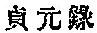
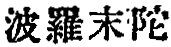
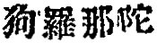
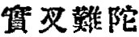
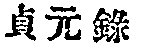
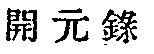
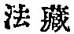
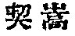

  
[Intangible Textual Heritage](../../index)  [Buddhism](../index.md) 
[Index](index)  [Previous](taf12)  [Next](taf14.md) 

------------------------------------------------------------------------

### CHINESE TRANSLATIONS OF THE "DISCOURSE ON THE AWAKENING OF FAITH."

Let us give here some remarks on the Chinese translations of
Açvaghosha's principal and best known work *The Awakening of Faith*. The
Sanskrit original is long lost, probably owing to the repeated
persecutions of Buddhism by Chinese emperors at different times.
According to the *Chêng yüan catalogue* 
 (compiled between A. D. 785-804) the Sanskrit text is
said to have existed at that time. It is a great pity that such an
important Buddhist philosophical work

p. 39

as the present çâstra can be studied only through translations. [1](#fn_55.md)

There are two Chinese translations still existing in the Tripitaka
collection. The first translation was made by Paramârtha ( ) otherwise called Kulanâtha
( ) of Ujjayana (or
Ujjayini, modern Oujein) in Western India. He came to China A. D. 546
and died A. D. 569 when he was 71 years old. Among many other
translations, the present one came from his pen on the tenth day of
September, A. D. 554.

The second one is by Çikshânanda (
), of Kusutana (Khoten), who began his work on the
eighth of October, A. D. 700. He died in China A. D. 710 at the age of
59.

As to the problem whether the original of the two Chinese translations
is the same or different, my impression is that they were not the same
text, the one having been brought from Ujjayana and the other from
Khoten. But the difference, as far as we can judge from the comparison
of the two versions, is not fundamental.

In the preface to the second translation of the Kao

p. 40

li edition, the unknown writer states to the following effect: "The
present Çâstra has two translations. The first one is by Paramârtha and
the second one is from the Sanskrit text brought by Çikshânanda who
found also the older Sanskrit original in the Tz‘u an tower. As soon as
he had finished the rendering of the Avatamsakasûtra into Chinese, he
began a translation of his own text with the assistance of several
native Buddhist priests. The new translation occasionally deviates from
the older one, partly because each translator had his own views and
partly because the texts themselves were not the same."

Though the *Chêng yüan*  
as well as the *K‘ai yüan* [1](#fn_56.md)   catalogue affirm that the two
translations were from the same text, this can only mean that they were
not radically divergent. For if any two editions differ so slightly as
not to affect the essential points, they can be said to be practically
the same text.

Which of the two translations then is the more correct? To this question
we cannot give any definite answer as the originals are missing. The
first translation has found a more popular acceptance in Japan as well
as in China, not because it is more faithful to the original, but
because a most learned and illustrious Buddhist scholar called Fa tsang
  (A. D.

p. 41

\[paragraph continues\] 643-712) wrote a commentary on it. And on that
account the commentary is more studied than the text itself. Fa tsang
assisted Çikshânanda in preparing the second translation, but he
preferred the first one for his commentary work, partly because the
first one had already found a wide circulation and some commentators
before his time, and partly because both translations agreeing in all
their important points, he did not like to show his "partiality," as a
commentator on Fa tsang says, to the one in the preparation of which he
himself took part.

The present English translation is made from the second Chinese version
by Çikshânanda, but the first version has been carefully compared with
it, and wherever disagreements occur between them they have been noticed
in footnotes.

------------------------------------------------------------------------

### Footnotes

[38:1](taf12.htm#fr_54.md) Notice Açvaghosha's
discussion with Puṇyayaças as above mentioned.

[39:1](taf13.htm#fr_55.md) An inquiry has been made
by the present English translator as to whether the original Sanskrit
copy could be found either in India or in Nepal; but Prof. Satis Chandra
Âchâryya, of the Buddhist Text Society, Calcutta, with whom he has been
communicating on the subject, informs him that as far as India is
concerned there is almost no hope of securing it, and also that his
friend in Nepal has been unable so far to discover the original.

[40:1](taf13.htm#fr_56.md) A catalogue of Buddhist
books collected in the K'ai yüan period (A. D. 713-741) of the Tung
Dynasty, by   Chih-shang,
A.D. 730. Its full name *K‘ai yüan shih chiao lu*. Twenty *fasciculi*.

------------------------------------------------------------------------

[Next: Outlines of the ''Discourse on the Awakening of Faith.''](taf14.md)
