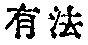
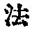
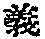
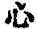
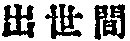

  
[Intangible Textual Heritage](../../index)  [Buddhism](../index) 
[Index](index)  [Previous](taf17)  [Next](taf19) 

------------------------------------------------------------------------

### II. GENERAL STATEMENT.

In what does the general statement consist?

The Mahâyâna can be briefly treated as to two aspects, namely, What it
is, and What it signifies. [1](#fn_68)

p. 53

What is the Mahâyâna? It is the soul [1](#fn_69)
of all sentient beings (*sarvasattva*), that constitutes all things in
the world, phenomenal and supra-phenomenal; [2](#fn_70) and through this soul we can disclose what
the Mahâyâna signifies.

Because the soul in itself, involving the quintessence of the Mahâyâna,
is suchness (*bhûtatathatâ*), but it becomes \[in its relative or
transitory aspect, through the law of causation\] birth-and-death
(*samsâra*) in which are revealed the quintessence, the attributes, and
the activity of the Mahâyâna.

The Mahâyâna has a triple significance. [3](#fn_71)

The first is the greatness of quintessence. Because the quintessence of
the Mahâyâna as suchness

p. 54

exists in all things, remains unchanged in the pure as well as in the
defiled, is always one and the same (*samatâ*), neither increases nor
decreases, and is void of distinction.

The second is the greatness of attributes. Here we have the
Tathâgata's [1](#fn_72) womb [2](#fn_73) (*tathâgatagarbha*) which in exuberance
contains immeasurable and innumerable merits (*punya*) as its
characteristics.

The third is the greatness of activity, for it \[i.e., Mahâyâna\]
produces all kinds of good work in the world, phenomenal and
supra-phenomenal. \[Hence the name Mahâyâna (great vehicle).\]

\[Again this Dharma is called the Mahâyâna;\] because it is the
vehicle} [3](#fn_74) (*yâna*) in which all
Buddhas

p. 55

from the beginning have been riding, and Bodhisattvas [1](#fn_75) when riding in it will enter into the
state of Buddhahood.

------------------------------------------------------------------------

### Footnotes

[52:1](taf18.htm#fr_68) "What is" and "What
signifies" are respectively in Chinese *yu fa*   and *fa*  , but in the older translation
*fa*   and *i*  . This is a little puzzling,
but if we bear in mind that in Chinese as well as in Sanskrit *fa* or
*dharma* means both the substance itself and its attribute or
significance, or law that regulates its movements, we will understand
that Paramârtha, the first translator, used *fa* here in the sense of
substance or "what is," while Çikshânanda, the second translator, used
the word in the sense of significance or that by which a thing is
conceived, the ordinary meaning of *i*.

[53:1](taf18.htm#fr_69) "Soul '' is not used
here in a dualistic sense, but as Dr. Paul Carus defines it in the last
chapter of *The Soul of Man*. Speaking of the soul of the universe he
defines the term as "the formative principle which gave and still gives
shape to the world" (*loc. cit.*, first edition, p. 437). The literal
translation of the Chinese character 
 *hsin* is kernel, or heart, or essence of all things.
The Chinese *hsin*, however, is rather indiscriminately used in our text
for both Sanskrit terms, *Hrdaya* (kernel or heart) and *Citta* (mind,
the thinking faculty). These terms are more or less synonymous,
especially from Açvaghosha's standpoint, that does not allow the
transcendental existence of a metaphysical soul-entity. In this
translation soul denotes the absolute aspect of suchness, and mind its
relative aspect, wherever this distinction is noticeable.

[53:2](taf18.htm#fr_70) This is a literal
translation of the Chinese *chu shi chien* 
. It signifies anything transcending conditionality or
worldliness.

[53:3](taf18.htm#fr_71) This triad which has a
striking similarity to Spinoza's conception of substance, attributes and
modes, also reminds us of the first principles (*padârtha*) of the
Vaiçeshika philosophy, that is, substance (*dravya*), qualities
(*guna*), and action (*karma*).

[54:1](taf18.htm#fr_72) Tathâgata literally
means one who thus or truly comes. That the omnipresent principle of
suchness could come or go appeared contradictory and seemed to render an
explanation necessary. The Vajracchedikâ-Sûtra, Max Müller's English
translation, Chap. XXIX: "And again, O Subhûti, if anybody were to say
that the Tathâgata goes, or comes, or stands, or sits, or lies down, he,
O Subhûti, does not understand the meaning of my preaching. And why?
Because the word Tathâgata means one who does not go anywhere, and does
not come from anywhere; and therefore he is called the Tathâgata (truly
come), holy and fully enlightened."

[54:2](taf18.htm#fr_73) Cf. the *Bhavadgîtâ*
(*Sacred Books of the East*, Vol. VIII., Chap. XIV., p. 107): "The great
Brahman is a womb for me, in which I cast the seed. From that, O
descendant of Bharata! is the birth of all things. Of the bodies, O son
of Kuntî! which are born from all wombs, the main womb is the great
Brahman, and I am the father, the giver of the seed."

[54:3](taf18.htm#fr_74) Cf. the
*Saddharma-pundarîka*, Chap. II. (*Sacred Books of the East*, Vol. XXI.,
p. 40): "By means of one sole vehicle, to wit, the Buddha-vehicle,
Çâriputra, do I teach creatures the law; there is no second, nor a
third."

[55:1](taf18.htm#fr_75) Literally, one who seeks
perfect enlightenment, or one who is full of wisdom and compassion.

------------------------------------------------------------------------

[Next: III. The Explanation](taf19)
