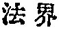

  
[Intangible Textual Heritage](../../index)  [Buddhism](../index.md) 
[Index](index)  [Previous](taf20)  [Next](taf22.md) 

------------------------------------------------------------------------

##### *A. The Soul as Suchness.*

What is meant by the soul as suchness (*bhûtatathatâ*), is the oneness
of the totality of things (*dharmadhâtu*), [2](#fn_76.md) the great all-including whole, the
quintessence

p. 56

of the Doctrine. For the essential nature of the soul is uncreate and
eternal.

All things, simply on account of our confused subjectivity
(*smrti*), [1](#fn_77.md) appear under the forms of
individuation. If we could overcome our confused subjectivity, the signs
of individuation would disappear, and there would be no trace of a world
of \[individual and isolated\] objects. [2](#fn_78.md)

Therefore all things in their fundamental nature are not namable or
explicable. They cannot be adequately expressed in any form of language.
They are

p. 57

without the range of apperception. \[They are universals.\] They
\[things in their fundamental nature\] have no signs of distinction.
\[They are not particulars.\] They possess absolute sameness (*samatâ*).
\[They are universals.\] They are subject neither to transformation, nor
to destruction. They are nothing but the one soul, for which suchness is
another designation. Therefore they cannot be \[fully\] explained by
words or exhausted by reasoning. [1](#fn_79.md)

While all words and expressions are nothing but representations and not
realities, and their existence depends simply on our confused
subjectivity, suchness has no attribute \[of particularity\] to speak
of.

But the term suchness is all that can be expressed in language, and
through this term all other terms may be disposed of.

In the essence of suchness, there is neither anything which has to be
excluded, nor anything which has to be added. [2](#fn_80.md)

p. 58

Now the question arises: If that be so, how can all beings conform to
and have an insight into \[suchness\]?

The answer is: As soon as you understand that when the totality of
existence is spoken of, or thought of, there is neither that which
speaks nor that which is spoken of, there is neither that which thinks
nor that which is thought of; then you conform to suchness; and when
your subjectivity is thus completely obliterated, it is said to have the
insight.

Again there is a twofold aspect in suchness if viewed from the point of
its explicability. The first is trueness as negation (*çûnyatâ*), [1](#fn_81.md) in the sense that

p. 59

it is completely set apart from the attributes of all things unreal,
that it is the real reality. The second is trueness as affirmation
(*açûnyatâ*), in the sense that it contains infinite merits, that it is
self-existent.

And again by trueness as negation we mean that in its \[metaphysical\]
origin it has nothing to do with things defiled \[i.e., conditional\],
that it is free from all signs of distinction existing among phenomenal
objects, that it is independent of unreal, particularising
consciousness.

Thus we understand that suchness (*bhûtatathatâ*) is neither that which
is existence, nor that which is non-existence, nor that which is at once
existence and non-existence, nor that which is not at once existence and
non-existence; that it is neither that which is unity, nor that which is
plurality, nor that which is at once unity and plurality, nor that which
is not at once unity and plurality. [1](#fn_82.md)

p. 60

In a word, as suchness cannot be comprehended by the particularising
consciousness of all beings, we call it the negation \[or nothingness,
*çûnyatâ*\].

The truth is that subjectivity does not exist by itself, that the
negation (*çûnyatâ*) is also void (*çûnya*) in its nature, that neither
that which is negated \[viz., the external world\] nor that which
negates \[viz., the mind\] is an independent entity. [1](#fn_83.md)

By the so-called trueness as affirmation, we mean that \[as soon as we
understand\] subjectivity is empty and unreal, we perceive the pure soul
manifesting itself as eternal, permanent, immutable and completely
comprising all things that are pure. On that account we call it
affirmation \[or reality, or nonemptiness, a*çûnyatâ*\]. Nevertheless,
there is no trace of affirmation in it, because it is not the product of
a confused subjectivity, because only by transcending subjectivity
(*smrti*) can it be grasped.

------------------------------------------------------------------------

### Footnotes

[55:2](taf21.htm#fr_76.md) S. Beal in his English
translation of Açvaghosha's *Buddha-carita* (*Sacred Books of the East*,
Vol. XIX., p. 324, footnote) considers *dharmadhâtu* to be "the mystic
or ideal world of the Northern Buddhists" and says it means literally
the "limit of dharma." The interpretation is evidently wrong, not only
because *dhâtu* according to the Madhyanta-vibhâga-çastra by Vasubandhu
p. 56 (two Chinese translations: one by
Paramârtha A. D. 557-569, and the other by Hsüan-tsang A. D. 691) means
root, base, cause, or principle; but because *Dharmadhâtu*, *fa kai*
  in Chinese, is not used
by the Northern Buddhists in the sense that Beal gives. It means on the
other hand this actual world considered from the point of its forming
the basis of the law; or, to use modern scientific terminology, it is
existence in its organised totality. Açvaghosha uses the term here in
this sense.

[56:1](taf21.htm#fr_77.md) The term is usually
rendered by recollection or memory, but Açvaghosha uses it apparently in
a different sense. It must mean subjectivity, or the perception of
particularity, or that mental activity which is not in accordance with
the suchness of things; if otherwise, the whole drift of the present
Discourse becomes totally unintelligible. *Smrti* is in some degree
obviously synonymous with *Avidya* (ignorance) which is more general and
more primordial than the former. Ignorance appears first and when it
starts the world-process, "subjectivity" is evolved, which in its turn
causes particularisation to take place. Particularisation does not
annihilate suchness, but it overshadows the light of its perfect
spiritual wisdom.

[56:2](taf21.htm#fr_78.md) Schopenhauer who says,
"no subject without object," seems to express a similar idea that
without subjectivity, "the objective world," i.e., "the world as
*Vorstellung*, as representation of objects" would vanish.

[57:1](taf21.htm#fr_79.md) If I understand
Açvaghosha correctly, he intends to say that to the sentient subject the
world consists of a number of isolated objects. The nature of
subjectivity is sense-apperception; and in sense-apperception the
particular things are represented in the particularity only, not in
their suchness as momentarily materialised universals. We must overcome
subjectivity in order to discover suchness; but when suchness is
recognised, it is at once understood to constitute the essence and only
true reality of things.

[57:2](taf21.htm#fr_80.md) The older translation
has: "In the essence of suchness, there is nothing to be excluded, for
all things are true; nor is there anything to be added, for all things
are such as they are. Be it known therefore that as thus all things are
undemonstrable and unrepresentable \[by our confused understanding\],
they are called suchness."

[58:1](taf21.htm#fr_81.md) The term *çûnyatâ* which
means literally void or emptiness, has suffered a great deal of
misunderstanding by those who are not well acquainted with Buddhist
phraseology. If Mahâyânists used the term, as imagined by some critics,
in the sense of absolute nothingness, denying the existence of
everything conditional as well as unconditional, relative as well as
independent, how could they speak about the highest truth
(*paramârthasatya*) or the most excellent perfect enlightenment
(*anuttarasamyaksambodhi*) which all conveys the sense of affirmation?
What the Çûnyatâ doctrine positively insists on, is the denial of
sensationalism, and the annihilation of the imagination that weaves a
dualistic world-conception. If this could be called a nihilism, every
intellectual attempt to reach a unitary view of the universe would be
nihilistic, for it declares the untenability of a separate existence of
matter and thought, me and not-me, etc. It is odd enough that such a
self-evident truth should have escaped the keen observance of Christian
critics. Açvaghosha here states that the bhûtatathatâ is at once çunya
and açunya. It is çunya because it transcends all forms of separation
and individuation; it is açunya because all possible things in the world
emanate from it. Even Nâgârjuna p. 59 who is
supposed to be the founder of the nihilistic Prajñâpâramitâ system by
Christian students of Buddhism, says in his *Mâdhyamika-çâstra*, Chap.
XXII., that the idea of çûnyatâ and that of açûnyatâ are both wrong, but
that from the deficiency of language to denote the exact state of things
he has made use of these terms. (Observe that Açvaghosha says the very
same thing in the preceding passages.) Nâgârjuna therefore apparently
had something in his mind to define, but that something having nothing
in common with things we daily encounter in our sense-world, he
designated it çûnya, empty, and he hoped by thus abnegating all
phenomenal existences, we could reach the highest reality, for ignorant
minds are deeply saturated with wrong affirmations and false judgements.

[59:1](taf21.htm#fr_82.md) Cf. Nâgârjuna's "Eight
No's" doctrine which says: "There is no production (*utpâda*), no
destruction (*uccheda*), no annihilation (*nirodha*), no persistence
(*çâçvata*), no unity (*ekârtha*), no p. 60
plurality (*nânârtha*), no coming in (*âgamana*), no going out
(*nirgama*)." The statement means that pure truth (*paramârtha*)
transcends all modes of relativity. (See the first chapter of the
*Mâdhyamika-çâstra*.)

[60:1](taf21.htm#fr_83.md) In the Kantian sense of
''things in themselves." The Mâdhyamika school would say they are all
*Atyanta-çûnyatâ*, complete void, meaning that things are subject to
transformation and have no absolute existence.

------------------------------------------------------------------------

[Next: B. The Soul as Birth-and-Death](taf22.md)
