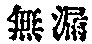
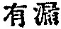

  
[Intangible Textual Heritage](../../index)  [Buddhism](../index.md) 
[Index](index)  [Previous](taf21)  [Next](taf23.md) 

------------------------------------------------------------------------

##### *b. The Soul as Birth-and-Death.*

The soul as birth-and-death (samsâra) comes forth \[as the law of
causation\] from the Tathâgata's womb (*Tathâgatagarbha*). But the
immortal \[i.e., such-ness\]

p. 61

and the mortal \[i.e., birth-and-death\] coincide with each other. [1](#fn_84.md) Though they are not identical, they are
not a duality. \[Thus when the absolute soul assumes a relative aspect
by its self-affirmation\] it is called the all-conserving mind
(*âlaya-vijñâna*). [2](#fn_85.md)

The same mind has a twofold significance as the organiser and the
producer of all things.

Again it embraces two principles: (1) Enlightenment; (2)
Non-enlightenment.

Enlightenment is the highest quality of the mind; it is free from all
\[the limiting\] attributes of subjectivity (*smrti*). As it is free
from all \[limiting\] attributes

p. 62

of subjectivity, it is like unto space (*âkâça*), penetrating
everywhere, as the unity of all (*dharmadhâtu*). That is to say, it is
the universal Dharmakâya [1](#fn_86.md) of all
Tathâgatas.

On account of this Dharmakâya, all Tathâgatas are spoken of as abiding
in enlightenment *a priori*.

Enlightenment *a priori* is contrasted with enlightenment *a
posteriori*. Through enlightenment *a posteriori* is gained no more than
enlightenment *a priori*.

Now we speak of enlightenment *a posteriori*; because there is
enlightenment *a priori*, there is non-enlightenment,

p. 63

and because there is non-enlightenment we can speak of enlightenment *a
posteriori*.

Again, when the mind is enlightened as to its own ultimate nature, it is
called perfect enlightenment; when it is not enlightened as to its
ultimate nature, it is not perfect enlightenment.

Common people [1](#fn_87) (*prthagjana*.md), who,
becoming conscious of errors that occur in a succession of their mental
states, abstain from making conclusions, may be spoken of as
enlightened; but in reality theirs is non-enlightenment.

Çrâvakas, [2](#fn_88.md) Pratyekabuddhas, and those
Bodhisattvas

p. 64

who have just entered their course, recognising the difference between
subjectivity and the [transcending](errata.htm#7.md) of subjectivity both
in essence and attributes, have become emancipated from the coarse form
of particularisation. This is called enlightenment in appearance.

Bodhisattvas of the Dharmakâya, [1](#fn_89.md)
having recognised that subjectivity and the transcending of subjectivity
have no reality of their own \[i.e., are relative\], have become
emancipated from the intermediate form of particularisation. This is
called approximate enlightenment.

Those who have transcended the stage of Bodhisattvahood and attained the
ultimate goal, possess a consciousness which is consistent and
harmonious;

p. 65

they have recognised the origin from which consciousness \[or
mentation\] starts. [1](#fn_90.md) This will truly
be called enlightenment.

Having transcended the attributes of enlightenment and the subtlest form
of particularisation, they \[i.e., Buddhas\] have gained a perfect and
eternal insight into the very nature of the soul \[i.e., suchness\],
because the latter now presents itself to them in its absolute and
immutable form. [2](#fn_91.md) Therefore they are
called Tathâgatas, and theirs is perfect enlightenment; and therefore it
is said in the Sûtra [3](#fn_92.md) that those who
have an insight into the non-reality of all subjectivity, attain to the
wisdom of the Tathâgata.

In the preceding statement we referred to the origin from which
consciousness \[or mentation\] starts according to the popular
expression. In truth there is no such thing as the origin of
consciousness \[or mentation\]; for consciousness \[being purely
subjective\] has no absolute \[but only a phenomenal\] existence. How
can we then speak of its origin?

The multitude of people (*bahujana*) are said to be

p. 66

lacking in enlightenment, because ignorance (*avidya*) prevails there
from all eternity, because there is a constant succession of confused
subjective states (*smrti*) from which they have never been emancipated.

But when they transcend their subjectivity, they can then recognise that
all states of mentation, viz., their appearance, presence, change, and
disappearance \[in the field of consciousness\] have no \[genuine\]
reality. [1](#fn_93.md) They are neither in a
temporal nor in a spatial relation with the one soul, [2](#fn_94.md) for they are not self-existent.

When you understand this, you also understand that enlightenment *a
posteriori* cannot be manufactured, for it is no other thing than
enlightenment *a priori* \[which is uncreate and must be
discovered\]. [3](#fn_95.md)

And again enlightenment *a priori*, when implicated in the domain of
defilement \[i.e., relativity\], is differentiated into two kinds of
attributes:

\(1\) Pure wisdom (*prajñâ*?); (2) Incomprehensible activity
(*karma*?). [4](#fn_96.md)

p. 67

By pure wisdom we understand that when one, by virtue of the
perfuming [1](#fn_97.md) power of the Dharma,
disciplines himself truthfully \[i.e., according to the Dharma\], and
accomplishes meritorious deeds, the mind \[i.e., *âlaya-vijñâna*\] which
implicates itself with birth-and-death will be broken down, and the
modes of the evolving-consciousness [2](#fn_98.md)
will be annulled; while the pure and genuine wisdom of the Dharmakâya
manifests itself. [3](#fn_99.md)

Though all modes of consciousness and mentation are mere products of
ignorance, ignorance in its ultimate nature is identical and
not-identical [4](#fn_100.md) with enlightenment
*a priori*; and therefore ignorance in one sense is destructible, while
in the other sense it is indestructible.

This may be illustrated by \[the simile of\] the water and the waves
which are stirred up in the ocean. Here the water can be said to be
identical \[in one sense\] and not-identical \[in the other
sense\] [5](#fn_101.md) with the waves. The waves
are stirred up by the wind, but the water remains the same. When the
wind ceases, the motion of the waves subsides; but the water remains the
same.

p. 68

Likewise, when the mind of all creatures which in, its own nature is
pure and clean, is stirred up by the wind of ignorance (*avidya*), the
waves of mentality (*vijñâna*) make their appearance. These three
\[i.e., the mind, ignorance, and mentality\], however, have no
\[absolute\] existence, and they are neither unity nor plurality. [1](#fn_102.md)

But the mind though pure in its essence is the source of the awakened
\[or disturbed\] mentality. When ignorance is annihilated, the awakened
mentality is tranquilised, whilst the essence of the wisdom remains
unmolested. [2](#fn_103.md)

Incomprehensible activity which we know proceeds from pure wisdom,
uninterruptedly produces all excellent spiritual states. That is to say,
the personality (*kâya*) of the Tathâgata, [3](#fn_104.md) which in exuberance contains
immeasurable and ever-growing merits, reveals itself to all beings
according to their various predispositions \[or characters\], and
accomplishes for them innumerable \[spiritual\] benefits.

Further there is a fourfold significance in the nature

p. 69

of enlightenment whose purity may be likened unto space or a bright
mirror.

The first great significance which may be likened unto space and a
bright mirror, is trueness as negation (*çûnyatâ*), in the sense that
enlightenment is absolutely unobtainable by any modes of relativity or
by any outward signs of enlightenment.

The second great significance which may be likened unto space and a
bright mirror, is trueness as affirmation (*açûnyatâ*), in the sense
that all things \[in their ultimate nature\] are perfect and complete,
and not subject to destruction; in the sense that all events in the
phenomenal world are reflected in enlightenment, so that they neither
pass out of it, nor enter into it, and that they neither disappear nor
are destroyed; that they are in one eternal and immutable soul which by
none of the defiled things can be defiled and whose wisdom-essence
enveloping immeasurable and innumerable merits, becomes the cause of
perfuming the minds of all beings.

The third great significance which may be likened unto space and a
bright mirror, is the affirmation as free from the hindrances
(*âvarana*), in the sense that enlightenment is forever cut off from the
hindrances both affectional (*kleçâvarana*) and intellectual
(*jñeyâ-varana*), as well as from the mind \[i.e., *âlaya-vijñâna*\]
which implicates itself with birth-and-death, since it is in its true
nature clean, pure, eternal, calm, and immutable.

p. 70

The fourth great significance which may be likened unto space and a
bright mirror, is the affirmation as unfolding itself, in the sense that
on account of a liberation from the hindrances, it transforms and
unfolds itself, wherever conditions are favorable, in the form of a
Tathâgata or in some other forms' in order that all beings might be
induced thereby to bring their root [1](#fn_105) of merit (*kuçalamûla*.md) to
maturity. [2](#fn_106.md)

By the so-called non-enlightenment, we mean that as the true Dharma
\[i.e., suchness\] is from all eternity not truthfully recognised in its
oneness, there issues forth an unenlightened mind and then subjectivity
(*smrti*). But this subjectivity has no self-existence independent of
enlightenment *a priori*.

To illustrate: a man who is lost goes astray because he is bent on
pursuing a certain direction; and his confusion has no valid foundation
other than that he is bent on a certain direction.

It is even the same with all beings. They become

p. 71

unenlightened, foster their subjectivity and go astray, because they are
bent on enlightenment. But non-enlightenment has no existence of its
own, aside from its relation with enlightenment *a priori*. And as
enlightenment *a priori* is spoken of only in contrast to
non-enlightenment, and as non-enlightenment is a non-entity, true
enlightenment in turn loses its significance too. \[That is to say, they
are simply relative.\]

In blindness [1](#fn_107.md) there arose
non-enlightenment of which three aspects are to be noted. These three
are not independent.

The first aspect is ignorant action (*avidyakarma*?). [2](#fn_108.md) A disturbance [3](#fn_109.md) of the mind \[i.e., âlaya-vijñâna\]
caused by non-enlightenment characterises the beginning of karma. When
enlightened, the mind is no more disturbed.

p. 72

\[paragraph continues\] But by its disturbance misery (*duhkha*) is
produced according to the law of causation.

The second aspect is that which perceives \[i.e., the ego or subject\].
In consequence of the disturbance of the mind there originates that
which perceives an external world. When the mind is not disturbed,
perception does not take place.

The third aspect is the external world. Through perception an unreal
external world originates. Independent of that which perceives \[i.e.,
the ego or subject\], there is no surrounding world \[or the
object\]. [1](#fn_110.md)

Conditioned by the unreal external world, six kinds of phenomena arise
in succession.

The first phenomenon is intelligence \[i.e., sensation\]. Being affected
by the external world the mind becomes conscious of the difference
between the agreeable and the disagreeable.

The second phenomenon is succession \[i.e., memory\]. Following upon
intelligence, memory retains the sensations agreeable as well as
disagreeable in a continuous succession of subjective states.

The third phenomenon is clinging. Through the retention and succession
of sensations agreeable as well as disagreeable, there arises the desire
of clinging.

The fourth phenomenon is an attachment to names

p. 73

\[paragraph continues\] \[or ideas, *samjñâ*\], etc. [1](#fn_111.md) By clinging the mind hypostasises all
names whereby to give definitions to all things.

The fifth phenomenon is the performance of deeds (*karma*). On account
of attachment to names, etc., there arise all the variations of deeds,
productive of individuality.

The sixth phenomenon is the suffering due to the fetter of deeds.
Through deeds suffering arises in which the mind finds itself entangled
and curtailed of its freedom.

Be it therefore known that all defiled things do not exist by
themselves, for all of them have arisen from ignorance.

Now there is a twofold relation between enlightenment and
non-enlightenment: (1) identity; (2) nonidentity.

The relation of identity may be illustrated by the

p. 74

simile of all kinds of pottery which though different are all made of
the same clay. Likewise the undefiled (*anâçrava*) [1](#fn_112) and ignorance (avidya.md) and their various
[transient](errata.htm#8.md) forms come all from one and the same entity.
Therefore Buddha teaches [2](#fn_113.md) that all
beings are from all eternity ever abiding in Nirvâna. [3](#fn_114.md) In truth enlightenment cannot be
manufactured, nor can it be created; it is absolutely intangible; it is
no material existence that is an object of sensation.

The reason why enlightenment nevertheless assumes tangible material form
is that it suffers defilement [4](#fn_115.md)
which is the source of all transient forms of manifestation. Wisdom
itself has nothing to do with material phenomena whose characteristic
feature is

p. 75

extension in space, and there are no attributes there by which wisdom
can become tangible. This is the meaning of Buddha's brief statement
just referred to.

The relation of non-identity may be illustrated by the difference that
obtains among the various kinds of pottery. The relation among the
undefiled and ignorance and their various transient forms of
manifestation is similar to it.

And again, by the law of causation (*hetupratyaya*) in the domain of
birth-and-death (*samsâra*) we mean that depending on the mind \[i.e.,
*âlaya-vijñâna*\] an evolution of the ego (*manas*) and consciousness
(*vijñâna*) [1](#fn_116.md) takes place in all
beings.

What is meant by this?

In the all-conserving mind (*âlaya-vijñâna*) ignorance obtains; and from
the non-enlightenment starts that which sees, that which represents,
that which apprehends an objective world, and that which constantly
particularises. This is called the ego (*manas*).

p. 76

Five different names are given to the ego \[according to its different
modes of operation\].

The first name is activity-consciousness (*Karma-vijñâna*?) in the sense
that through the agency of ignorance an unenlightened mind begins to be
disturbed \[or awakened\].

The second name is evolving-consciousness \[*pravrtti-vijñâna*, i.e.,
the subject\], in the sense that when the mind is disturbed, there
evolves that which sees an external world.

The third name is representation-consciousness, in the sense that the
ego (*manas*) represents \[or reflects\] an external world. As a clean
mirror reflects the images of all description, it is even so with the
representation-consciousness. When it is confronted, for instance, with
the five objects of sense, it represents them at once, instantaneously,
and without any effort.

The fourth name is particularisation-consciousness, in the sense that it
discriminates between different things defiled as well as pure.

The fifth name is succession-consciousness \[i.e., memory\], in the
sense that continuously directed by the awakening consciousness \[or
attention, *manaskara*\] it \[*manas*\] retains and never loses or
suffers the destruction of any karma, good as well as evil, which had
been sown in the past, and whose retribution, painful as well as
agreeable, it never fails to mature, be it in the present or in the
future; and also in the

p. 77

sense that it unconsciously recollects things gone by, and in
imagination anticipates things to come.

Therefore the three domains [1](#fn_117.md)
(*triloka*) are nothing but the self-manifestation of the mind \[i.e.,
*âlaya-vijñâna* which is practically identical with suchness,
*bhûtatathatâ*\]. [2](#fn_118.md) Separated from
the mind, there would be no such things as the six objects of sense.

Why?

Since all things, owing the principle of their existence to the mind
(*âlaya-vijñâna*), are produced by subjectivity (*smrti*), all the modes
of particularisation are the self-particularisation of the mind. The
mind in itself \[or the soul\] being, however, free from all attributes,
is not differentiated. Therefore we come to the conclusion that all
things and conditions in the phenomenal world, hypostasised and
established only through ignorance (*avidya*) and subjectivity (*smrti*)
on the part of all beings, have no more reality than the images in a
mirror [3](#fn_119.md) They evolve simply from

p. 78

the ideality of a particularising mind. When the mind is disturbed, the
multiplicity of things is produced; but when the mind is quieted, the
multiplicity of things disappears.

By ego-consciousness (*manovijñâna*) we mean that all ignorant minds
through their succession-consciousness cling to the conception of I and
not-I \[i.e., a separate objective world\] and misapprehend the nature
of the six objects of sense. The ego-consciousness is also called
separation-consciousness, or phenomena-particularising-consciousness,
because it is nourished by the perfuming [1](#fn_120) influence of the prejudices (*âçrava*.md),
intellectual as well as affectional.

The mind \[or consciousness, *vijñâna*\] that starts from the perfuming
influence of ignorance which has no beginning cannot be comprehended by
the intellect of common people (*prthagjana*), Çrâvakas and
Pratyekabuddhas.

It is partially comprehended by those Bodhisattvas at the stage of
knowledge-and-practice, who discipline themselves., practise
contemplation and become the Bodhisattvas of the Dharmakâya; while even
those who have reached the highest stage of Bodhisattvahood cannot
thoroughly comprehend it.

The only one who can have a clear and consummate knowledge of it is the
Tathâgata. [2](#fn_121.md)

p. 79

Why?

While the essence of the mind is eternally clean and pure, the influence
of ignorance makes possible the existence of a defiled mind. But in
spite of the defiled mind, the mind \[itself\] is eternal, clear, pure,
and not subject to transformation.

Further as its original nature is free from particularisation, it knows
in itself no change whatever, though it produces everywhere the various
modes of existence.

When the oneness of the totality of things (*dharmadhâtu*) is not
recognised, then ignorance as well as particularisation arises, and all
phases of the defiled mind are thus developed. But the significance of
this doctrine is so extremely deep and unfathomable that

p. 80

it can be fully comprehended by Buddhas and by no others. Now there are
six different phases of the defiled [1](#fn_122.md) mind thus developed:

1\. Interrelated \[or secondary\] defilement by attachment, from which
Çrâvakas, Pratyekabuddhas and those Bodhisattvas at the stage of
faith-adaptation can be freed.

2\. Interrelated \[or secondary\] defilement by succession, from which
Bodhisattvas with strenuous efforts at the stage of faith, can partially
be freed, and at the stage of pure-heartedness, completely.

3\. Interrelated \[or secondary\] defilement by the particularising
intelligence, from which Bodhisattvas are gradually freed during their
advancement from the stage of morality to the stage of wisdom, while
upon reaching the stage of spirituality, they are eternally freed from
it.

4\. Non-interrelated \[or primary\] defilement by belief

p. 81

in an external world, which can be exterminated at the stage of
matter-emancipation.

5\. Non-interrelated \[or primary\] defilement by belief in a perceiving
mind, which can be exterminated at the stage of mind-emancipation.

6\. Non-interrelated \[or primary\] defilement by the fundamental
activity, which can be exterminated in entering upon the stage of
Tathâgatahood, passing through the highest stage of Bodhisattvahood.

From not recognising the oneness of the totality of things
(*dharmadhâtu*), Bodhisattvas can partially be liberated by passing
first from the stage of faith and the stage of contemplation to the
stage of pure-heartedness; while when they enter upon the stage of
Tathâgatahood, they can once for all put an end \[to the illusion\].

By "interrelated" we mean that there is \[in this case\] a distinction
\[or consciousness of a duality\] between the mind in itself and
particularisation, that there is \[here\] a distinction \[or
consciousness of a duality\] between the defiled and the pure, \[and
therefore\] that there is \[here\] an interrelation between that which
perceives and that which determines.

By "non-interrelated" we mean that the mind \[in this case\] is
perfectly identified with non-enlightenment, so that there is no
distinction \[or consciousness of a duality\] between these two, \[and
therefore\] that there is no consciousness of interrelation between that
which perceives and that which determines.

p. 82

The defiled mind is called affectional hindrance (*kleçâvarana*),
because it obscures the fundamental wisdom of suchness (*bhûtatathatâ*).
Ignorance is called intellectual hindrance (*jñeyâvarana*), because it
obscures the spontaneous exercise of wisdom from which evolve all modes
of activity in the world.

What is meant by this?

On account of the defiled mind attachment affirms itself in innumerable
ways; and there arises a distinction \[or consciousness\] between that
which apprehends and that which is apprehended. Thus believing in the
external world produced by subjectivity, the mind becomes oblivious of
the principle of sameness (*samatâ*) that underlies all things.

The essence of all things is one and the same, perfectly calm and
tranquil, and shows no sign of becoming; ignorance, however, is in its
blindness and delusion oblivious of enlightenment, and, on that account,
cannot recognise truthfully all those conditions, differences, and
activities which characterise the phenomena of the universe.

Further we distinguish two phases of the self-manifestation of the mind
\[i.e., *âlaya-vijñâna*, under the law of causation\] as birth-and-death
(*samsâra*). The first is the cruder phase, being the state of an
interrelated mind; the second is the more refined phase, being the state
of a non-interrelated mind. The crudest phase is the subjective
condition of common people (*prthagjana*); the more refined of the crude
or

p. 83

the cruder of the refined is the subjective state of a
Bodhisattva. [1](#fn_123.md) These two phases \[of
the *âlaya-vijñâna* as the principle of birth-and-death\] originate
through the perfuming power of ignorance.

The birth-and-death (*samsâra*) has its *raison d’être* (*hetu*) and its
cause \[or condition, *pratyaya*\]. Non-enlightenment is the *raison
d’être*, and the external world as produced by subjectivity is the
condition. When the *raison d’être* is annihilated, the condition is
annihilated \[i.e., loses its conditioning power\]. When the condition
is annihilated, the state of an interrelated mind is annihilated. When
the *raison d’être* is annihilated, the state of a non-interrelated mind
\[too\] is annihilated.

It may be asked: If the mind be annihilated, how can there be mentation?
If mentation really occurs, how can there be annihilation?

In reply we say that while the objection is well founded, we understand
by the annihilation, not that of the mind itself, but of its modes
\[only\].

To illustrate: the water shows the symptoms of disturbance when stirred
up by the wind. Have the wind annihilated, and the symptoms of
disturbance on the water will also be annihilated, the water itself
remaining the same. Let the water itself, however, be annihilated, the
symptoms of disturbance would no more be perceptible; because there is
nothing

p. 84

there through which it can show itself. Only so long as the water is not
annihilated, the symptoms of disturbance may continue.

It is even the same with all beings. Through ignorance their minds
become disturbed. Let ignorance be annihilated, and the symptom of
disturbance will also be annihilated, while the essence of the mind
\[i.e., suchness\] remains the same. Only if the mind itself were
annihilated, then all beings would cease to exist, because there would
be nothing there by which they could manifest themselves. But so long as
the mind be not annihilated, its disturbance may continue.

A constant production of things defiled and pure is taking place on
account of the inter-perfuming of the four different powers which are as
follows: the first is the pure dharma, that is, suchness
(*bhûatathatâ*); the second is the principle of defilement, that is,
ignorance (*avidya*); the third is the subjective mind, that is,
activity-consciousness (*karmavijñâna*?); the fourth is the external
world (*vishaya*) of subjectivity, that is, the six objects of sense.

By "perfuming" we mean that while our worldly clothes \[viz., those
which we wear\] have no odor of their own, neither offensive nor
agreeable, they acquire one or the other according to the nature of the
substance with which they are perfumed.

Now suchness is a pure dharma free from defilement. It acquires,
however, a quality of defilement owing to the perfuming power of
ignorance. On the

p. 85

other hand, ignorance has nothing to do with purity. Nevertheless, we
speak of its being able to do the work of purity, because it in its turn
is perfumed by suchness.

How are defiled things continually produced by perfuming?

Determined by suchness \[in its relative aspect\], ignorance becomes the
*raison d’être* of all forms of defilement. And this ignorance perfumes
suchness, and, by perfuming suchness, it produces subjectivity
(*smrti*). This subjectivity in its turn perfumes ignorance. On account
of this \[reciprocal\] perfuming, the truth is misunderstood. On account
of its being misunderstood, an external world of subjectivity appears
\[viz., a conception of particulars as particulars\]. Further, on
account of the perfuming power of subjectivity, various modes of
individuation are produced. And by clinging to them, various deeds are
done, and we suffer as the result miseries, mentally as well as bodily.

There are two senses in what we call the perfuming power of the external
world of subjectivity": (1) that which strengthens
particularisation; [1](#fn_124) (2.md) that which
strengthens attachment.

There are again two senses in what we call-the perfuming power of the
subjective mind": (1) that

p. 86

which strengthens the fundamental activity-consciousness, whereby
Arhats, Pratyekabuddhas and Bodhisattvas are subject to the miseries of
birth and death; (2) that which strengthens the
phenomena-particularising-consciousness, whereby all common people
(*prthagjana*) are subject to the miseries of being fettered by prior
deeds (*karma*).

There are also two senses in what we call "the perfuming power of
ignorance": (1) a fundamental perfuming, in the sense that the
activity-consciousness is thereby actualised; (2) a perfuming of
intellect and affection, in the sense that the
phenomena-particularising-consciousness is thereby actualised.

How are pure things constantly produced by perfuming?

Suchness perfumes ignorance, and in consequence of this perfuming the
mind involved in subjectivity is caused to loathe the misery of birth
and death [1](#fn_125.md) and to seek after the
blessing of Nirvâna. This longing and loathing on the part of the
subjective mind in turn perfumes suchness. On account of this perfuming
influence we are enabled to believe that we are in possession within
ourselves of suchness whose essential nature is pure and immaculate; and
we also recognise that all phenomena in the world are nothing but the
illusory manifestation of the mind (*âlaya-vijñâna*) and have no reality
of their own. Since we

p. 87

thus rightly understand the truth, we can practise the means of
liberation, can perform those actions which are in accordance \[with the
Dharma\]. Neither do we particularise, nor cling to. By virtue of this
discipline and habituation during the lapse of innumerable
asamkhyeyakalpas, [1](#fn_126.md) we have
ignorance annihilated.

As ignorance is thus annihilated, the mind \[i.e., *âlaya-vijñâna*\] is
no more disturbed so as to be subject to individuation. As the mind is
no more disturbed, the particularisation of the surrounding world is
annihilated. When in this wise the principle and the condition of
defilement, their products, and the mental disturbances are all
annihilated, it is said that we attain to Nirvâna and that various
spontaneous displays of activity are accomplished. [2](#fn_127.md)

p. 88

There are two senses in what we call "the perfuming of the subjective
mind": (1) the perfuming of the phenomena-particularising-consciousness,
whereby all common people (*prthagjana*), Çrâvakas, and Pratyekabuddhas
are induced to loathe the misery of birth and death, and, each according
to his own capacity, to step towards the most excellent knowledge
(*bodhiparinishpatti*); (2) the perfuming of the ego (*manas*), whereby
courageously making up their minds, Bodhisattvas unhesitatingly step
towards and enter into Nirvâna, that has no fixed abode.

There are also two senses in what we call "the perfuming of suchness":
(1) essence-perfuming, and (2) activity-perfuming.

*The Essence-Perfuming*.--Embracing in full from all eternity infinite
spotless virtues (*anâçrava*) and incomprehensibly excellent spiritual
states that can efficiently exercise an eternal and incessant influence
upon all beings, suchness thereby perfumes the minds of all
beings. [1](#fn_128.md)

In consequence of this perfuming power, they are caused to loathe the
misery of birth and death, and to long for the blessing of Nirvâna, and
believing that they are in possession within themselves of the true,

p. 89

valid Dharma, to call forth their aspiration (*cittotpâda*) [1](#fn_129.md) and to discipline themselves.

Here a question arises: If all beings are uniformly in possession of
suchness and are therefore equally perfumed by it, how is it that there
are some who do not believe in it, while others do; and that there are
such immeasurable stages and inequalities among them, which divide the
path from the first stage of aspiration up to the last stage of Nirvâna,
while according to the Doctrine all these differences should be
equalised?

In reply we say this: Though all beings are uniformly in possession of
suchness, the intensity \[of the influence\] of ignorance, the principle
of individuation, that works from all eternity, varies in such manifold
grades as to outnumber the sands of the Ganges. And it is even so with
such entangling prejudices (*kleça* or *âçrava*) as the ego-conception,
intellectual and affectional prejudices, etc. \[whose perfuming
efficiency varies according to the karma previously accumulated by each
individual\],--all these things being comprehended only by the
Tathâgata. Hence such immeasurable degrees of difference as regards
belief, etc. [2](#fn_130.md)

p. 90

Further, there is made in the doctrine of all Buddhas a distinction
between *raison d’être* (*hetu*) and cause (*pratyaya*). When both are
fully satisfied, the final goal \[of Buddhism\] is attained and
actualised.

To illustrate: the combustible nature of the wood is the *raison d’être*
of a fire. But if a man is not acquainted with the fact, or, though
acquainted with it, does not apply any method \[whereby the potential
principle can be actualised\], how could he produce a fire and burn the
wood?

It is even so with all beings. Although they are in possession of
suchness as the perfuming *raison d’être*, yet how could they attain to
Nirvâna, if they do not happen, as the cause, to see Buddhas or
Bodhisattvas, or good sages, or even if they see them, do not practise
good deeds (*caryâ*), do not exercise wisdom (*prajñâ*), do not destroy
prejudices (*kleça*)?

Conversely, by the cause alone, i.e., by their mere happening to see all
good sages, it is not sure for them that they will be induced to loathe
the misery

p. 91

of birth and death and to long for the blessing of Nirvâna, unless
indeed they were in possession within themselves of the intrinsic
perfuming principle as the *raison d’être*. It is, therefore, only when
both the *raison d’être* and the cause are fully actualised that they
can do so.

How are the *raison d’être* and the cause to be fully actualised?

Now, there is an inherent perfuming principle in one's own being, which,
embraced and protected by the love (*maitrî*) and compassion (*karunâ*)
of all Buddhas and Bodhisattvas, is caused to loathe the misery of birth
and death, to believe in Nirvâna, to cultivate their root of merit
(*kuçalamûla*), to habituate oneself to it, and to bring it to maturity.

In consequence of this, one is enabled to see all Buddhas and
Bodhisattvas, and, receiving instructions from them, is benefited,
gladdened, induced to practise good deeds, etc., till one attain to
Buddhahood and enter into Nirvâna.

*The Activity-Perfuming*.--By this is meant nothing else than the
perfuming influence of the external cause over all beings. It asserts
itself in innumerable ways. Briefly speaking we may distinguish two
kinds of it: (1) individual; and (2) universal.

*The Individual Cause*.--All beings since their first aspiration
(*cittotpâda*) till the attainment of Buddhahood are sheltered under the
guardianship of all Buddhas and Bodhisattvas who, responding to the
requirements

p. 92

of the occasion, transform themselves and assume the actual forms of
personality.

Thus for the sake of all beings Buddhas and Bodhisattvas become
sometimes their parents, sometimes their wives and children, sometimes
their kinsmen, sometimes their servants, sometimes their friends,
sometimes their enemies, sometimes reveal themselves as devas or in some
other forms.

Again Buddhas and Bodhisattvas treat all beings sometimes with the four
methods of entertainment, [1](#fn_131.md)
sometimes with the six pâramitâs, [2](#fn_132.md)
or with some other deeds, all of which are the inducement for them to
make their knowledge (*bodhi*) perfect.

Thus embracing all beings with their deep compassion (*mahâkarunâ*),
with their meek and tender heart, as well as their immense treasure of
blissful wisdom, Buddhas convert them in such a way as to suit their
\[all beings’\] needs and conditions; while all beings thereby are
enabled to hear or to see Buddhas, and, thinking of Tathâgatas or some
other personages, to increase their root of merit (*kuçalamûla*.).

This individual cause is divided into two kinds: (1) that which takes
effect immediately, enabling one without delay to attain to Buddhahood;
(2) that which takes effect gradually, enabling one to attain to
Buddhahood only after a long interval.

p. 93

Each of these two is further divided into two kinds: (1) that which
increases one's root of merit; (2) that which induces one to enter into
the path (*mârga*).

*The Universal Cause*.--With universal wisdom (*samatâjñâna*?) and
universal wishes (*samatâpranidhâna*?) all Buddhas and Bodhisattvas
desire to achieve a universal emancipation of all beings. This desire is
eternal and spontaneous on their part. And now as this wisdom and these
wishes have the perfuming power over all beings, the latter are caused
to think of or to recollect all Buddhas and Bodhisattvas, so that
sometimes hearing them, sometimes seeing them, all beings thereby
acquire \[spiritual\] benefits (*hitatâ*). That is, entering into the
samâdhi of purity, they destroy hindrances wherever they are met with,
and obtain all-penetrating insight, [1](#fn_133.md) that enables one to become conscious of
the absolute oneness (*samatâ*) of the universe (*sarvaloka*) and to see
innumerable Buddhas and Bodhisattvas. [2](#fn_134.md)

Again, this perfuming of the essence and the activity may be divided
into two categories: (1) that which is not yet in unison \[with
suchness\]; (2) that which is already in unison \[with suchness\].

By that perfuming which is not yet in unison \[with suchness\] we
understand the religious discipline of

p. 94

common people (*prthagjana*), Çrâvakas, Pratyekabuddhas, and novice
Bodhisattvas. While their strength of faith (*çraddhâbala*) perfumed by
the ego (*manas*) and the ego-consciousness (*manovijñâna*) enables them
to continue their religious discipline, they have not yet attained to
the state of non-particularisation, because their discipline is not yet
in unison with the essence of suchness; nor have they yet attained to
the spontaneity of action (*svayamkarma*?) [1](#fn_135.md), because their discipline is not yet in
unison with the activity of suchness.

By that perfuming which is already in unison \[with suchness\], we
understand the religious discipline of Bodhisattvas of the Dharmakâya.
They have attended to the state of non-particularisation, because their
discipline is in unison with the self-essence of all Tathâgatas; they
have attained to the spontaneity of action, because their discipline is
in unison with the wisdom and activity of all Tathâgatas. Allowing
themselves

p. 95

to be influenced only by the power of the Dharma, their discipline
acquires a nature of spontaneity and thereby perfumes suchness and
destroys ignorance.

Again the incessant perfuming of the defiled dharma \[i.e., ignorance\]
from all eternity works on; but when one attains to Buddhahood, one at
once puts an end to it.

The perfuming of the pure dharma \[i.e., suchness\] works on to
eternity, and there is no interruption of it. Because by virtue of the
perfuming of the Dharma, that is, suchness, subjectivity is on the one
hand annihilated, and the Dharmakâya is on the other hand revealed, and
the perfuming process of the activity \[of suchness\] thus originated
forever goes on.

------------------------------------------------------------------------

### Footnotes

[61:1](taf22.htm#fr_84.md) Cf. the *Bhagavadgîtâ*,
Chap. IX., p. 84: "I am immortality and also death; and I, O Arjuna! am
that which is and that which is not," See also Chap. X., [p.
90](#page_90.md).

[61:2](taf22.htm#fr_85.md) Âlaya or Alaya comes
from the root *lî*, which means: adhere; melt, dissolve; sit upon, dwell
in, stay in, etc.; while its nominal form *laya* means: act of clinging;
melting, fusion, solution, dissolution; rest, repose; place of rest,
residence, house, dwelling. According to Paramârtha, who belongs to the
so-called "Older Translators," the original Sanskrit equivalent of the
"all-conserving mind" seems to be *alaya* or *aliya*, for he translates
it by *Wu mo shih*, not-disappearing mind, in the sense that this mind
retains everything in it. But Hsüan-tsang, the leader of the "New
Translators," renders it by *tsang shih*, that is, the mind that hoards
or preserves, or dwelling-mind or receptacle-mind, according to which
the original seems to be *âlaya*, or *laya* with the prefix *â* instead
of its negative form with the particle *a*. The ultimate significance of
the term in question, however, does not materially differ, whether it is
wu mo, not-disappearing, or tsang, house, place of keeping things. My
translation of the same is rather liberal, in order to make it more
intelligible to the general reader. Some other names given to the
*âlaya-vijñâna* are *citta*, mind; *âdâna*, the supporting; *âçraya*,
foundation or seeds.

[62:1](taf22.htm#fr_86.md) There seems to be a
general misconception about the exact significance of the term
*Dharmakâya* which constitutes the central point of the Mahâyâna system.
Most Western Buddhist scholars render it the Body or Personality of the
Law, understanding by law the doctrine of Buddha. This may be correct in
the Southern Buddhism as well as in its historical sense, because after
the Nirvâna of Buddha it was quite natural for his disciples to
personify the doctrine of their teacher, as their now only living
spiritual leader. But in the course of time it acquired entirely
different significance and ceased to mean the personification of the
Doctrine. Now *dharma*, as aforesaid, does not only mean law or
doctrine, but also it means an individual object, an idea, a substance,
or, when it is used in its broadest sense, existence in general. *Kâya*
means a body or person, but not in the sense of an animated, sentient
being; it denotes a system in which parts are connected, a unified
whole, that which forms a basis, etc. Dharmakâya therefore signifies
that which constitutes the ultimate foundation of existence, one great
whole in which all forms of individuation are obliterated, in a word,
the Absolute. This objective absolute being meanwhile has been idealised
by Mahâyânists so that that which knows is now identical with that which
is known, because they say that the essence of existence is nothing but
intelligence pure, perfect, and free from all possible worries and
evils.

[63:1](taf22.htm#fr_87.md) *Prthagjana* has a
technical sense in Buddhism, for any one that is ignorant of the
doctrine of non-Atman and commits all those actions which lead one to a
constant transmigration, is counted among the *profanum vulgus*, to
distinguish him from the Çrâvaka, Pratyekabuddha, and Bodhisattva.

[63:2](taf22.htm#fr_88.md) The
*Saddharmapundarîka-Sûtra* contains an explanation of these terms
generally adopted by Mahâyânists, which read as follows (see Kern's
English translation of the same, Chap. III., p. 80): "Now, Çâriputra,
the beings who have become wise have faith in the Tathâgata, the father
of the world, and consequently apply themselves to his commandments.
Amongst them there are some who, wishing to follow the dictates of an
authoritative voice, apply themselves to the commandment of the
Tathâgata to acquire the knowledge of the *four great truths*, for the
sake of *their own* complete Nirvâna. These one may say to be those who,
coveting the vehicle of the disciple (Çrâvaka), fly from the triple
world." . . . This is the definition given to the Çrâvakayâna. We
proceed next to that of the Pratyekabuddhayâna: "Other beings, desirous
of the science without a master, of self-restraint and tranquillity,
apply themselves to the commandment of the Tathâgata to learn to
understand *causes and effects* (i.e., *the twelve chains of relation*)
for the sake of *their own* complete Nirvâna. These one may say to be
those who, coveting the vehicle of the Pratyekabuddha, p. 64 fly from the triple world." Those who belong
to these two classes desire to achieve only the salvation of their own,
and not that of all mankind, in which respect Bodhisattvas stand far
superior to them. We read in the same Sûtra to the following effect:
"Others again, desirous of the knowledge of the all-knowing, the
knowledge of Buddha, the knowledge of the self-born one, the science
without a master, apply themselves to the commandment of the Tathâgata
to learn to understand the knowledge, powers, and freedom from
hesitation, of the Tathâgata, for the sake of the *common weal and
happiness, out of compassion to the world, for the benefit, weal, and
happiness of the world at large, both gods and men, for the sake of the
complete Nirvâna of all beings*. These one may say to be those who,
coveting the great vehicle (mahâyâna), fly from the triple world.
Therefore they are called Bodhisattva Mahâsattva." (The italics are
mine.)

[64:1](taf22.htm#fr_89.md) Those who have
recognised the all-prevailing Dharmakâya, but who have not as yet been
able to perfectly identify themselves with it.

[65:1](taf22.htm#fr_90.md) Consciousness, i.e.,
mentation or mental activity, is transient, it takes place in time, and
must not be confused with soul, or suchness, or eternal wisdom.

[65:2](taf22.htm#fr_91.md) In the older translation
these passages are somewhat simplified.

[65:3](taf22.htm#fr_92.md) The *Lankâvatâra Sûtra*.
There are three Chinese translations of the same still extant among the
Japanese Tripitaka collection: (1) by Guṇabhadra, A. D. 443, four
fasciculi; (2) by Bodhiruci, A. D. 513, ten fasciculi; (3) by
Çikshânanda, A. D. 700-704, seven fasciculi.

[66:1](taf22.htm#fr_93.md) The older translation
differs a little, but agrees in the main.

[66:2](taf22.htm#fr_94.md) The older translation
reads: "The four states of mentation are simultaneous \[they belong
together in time, i.e., they are in uninterrupted succession\], but have
no self-existence, because enlightenment *a priori* always remains in
its sameness."

[66:3](taf22.htm#fr_95.md) This passage is wanting
in the older translation.

[66:4](taf22.htm#fr_96.md) The differentiation of
enlightenment into two distinct qualities, wisdom and action, or,
according to the terminology of later Mahâyânists, wisdom and love,
constitutes one of the principal thoughts of the Mahâyâna Buddhism and
shows a striking similarity to the Christian conception of God who is
considered to be full of infinite love and wisdom.

[67:1](taf22.htm#fr_97.md) This term will be
explained later on. See p. 84.

[67:2](taf22.htm#fr_98.md) For the explanation see
below, p. 76.

[67:3](taf22.htm#fr_99.md) Note that the Dharmakâya
is not the "Body of the Law," but suchness (*bhûtatathatâ*) itself,
which transcends the limits of time and space as well as the law of
causation.

[67:4](taf22.htm#fr_100.md) Literally, "neither
identical nor not-identical."

[67:5](taf22.htm#fr_101.md) Literally, "neither
identical nor not-identical."

[68:1](taf22.htm#fr_102.md) That is, they are one
in one sense, but different in the other sense.

[68:2](taf22.htm#fr_103.md) In the older
translation the last two paragraphs read:

"Likewise the mind of all beings though clean and pure in its own nature
is disturbed \[or awakened\] through the wind of ignorance. Neither the
mind nor ignorance has any form and attribute (of its own\]. They
condition each other. But the mind itself not being the principle of
disturbance its movability will cease when ignorance is gone, though its
essence, wisdom, remains unmolested."

[68:3](taf22.htm#fr_104.md) Or the
*Tathâgatagarbha*.

[70:1](taf22.htm#fr_105.md) Max Müller renders the
term by "stock of merit," but I think "stock" is not very fitly adopted
to denote the sense usually attached to it by Buddhists. According to
them, karma, be it meritorious or not-meritorious, has an efficient
power to bear the fruit; therefore every act done by us like the root of
a plant has a regenerative force potentially reserved within itself, and
does not, like a stock of things which are not necessarily alive, remain
dormant lacking productive powers in it.

[70:2](taf22.htm#fr_106.md) According to the older
translation, the first significance is called the "mirror of
transcendental (or empty) trueness"; the second, the "mirror of the
perfuming principle"; the third, the "mirror of the dharma of
liberation"; and the fourth, the "mirror of the perfuming cause."

[71:1](taf22.htm#fr_107.md) Rather "carelessness."
This is missing in the older translation.

[71:2](taf22.htm#fr_108.md) The term "ignorant
action" reminds us of Schopenhauer's "blind will" and we might translate
the Chinese terms *pu chiao* 
 ignorant or unconscious, by "blind." On the other
hand, the expression reminds one of Goethe's words in Faust: Im Anfang
war die That," i.e., in the beginning there was karma; and this karma
starting in an unenlightened condition was blind or ignorant, it was as
yet unconscious of its goal which is the attainment of the eternal
truth, the discovery of enlightenment *a priori*. Cf. also the
*Chândogya Upanisad*, VI, 2.

[71:3](taf22.htm#fr_109.md) By "disturbance" is
meant that the mind or soul, awaking from a state of perfect sameness
and tranquillity, discriminates the subject and the object, me and
not-me. The "disturbance" itself, however, is neither good nor bad; the
fault lies in clinging to this dual aspect of existence as absolute,
utterly ignoring their fundamental identity. Efface the clinging from
your mind, and you are purified and saved.

[72:1](taf22.htm#fr_110.md) This is the idealistic
phase of the Mahâyâna Buddhism. Berkeley says: "Take away the perceiving
mind and you take away the objective world."

[73:1](taf22.htm#fr_111.md) Here is again a
strange agreement with Western philosophy. The nominalists speak of
names as mere *flatus vocis* and the things-in-themselves (i.e., what is
conceived by names) are declared to be unknowable by Kant. Dr. Paul
Carus goes one step further by declaring that there are no
things-in-themselves, but forms-in-themselves, viz., the eternal types
of beings or Plato's ideas. The clinging to names is based on the
metaphysical error of interpreting names as entities or
things-in-themselves, which exhibits the nominalistic phase of Buddhism.
On the other hand, the strong emphasis laid on the reality of suchness,
or what Dr. Carus calls the purely formal, shows the realistic phase of
Buddhism. The word "hypostasises" used in the next passage means
literally in the younger translation "firmly builds a basis for," in the
older one we read literally "one sets separately forth what is unreal,
i.e., names and words."

[74:1](taf22.htm#fr_112.md) A dharma not subject
to the transformation of birth and death is called   *wu lou* in Chinese and
*anâçrava* in Sanskrit. It is commonly used in contrast to   *yu lou* and *sâçrava*, which
means "defiled" or "conditional."

[74:2](taf22.htm#fr_113.md) This teaching is set
forth in the fourth chapter of the *Vimalakîrtinirdeça Sûtra*, one of
the most popular Mahâyâna texts in China as well as in Japan. There are
several Chinese translations still extant, the earliest of which was
produced during the first half of the third century of the Christian
era.

[74:3](taf22.htm#fr_114.md) Observe that Nirvâna
is here used as a synonym of suchness (*bhûtatathatâ*).

[74:4](taf22.htm#fr_115.md) That is to say, being
mixed up in the material world. "Defilement" does not necessarily mean
evil or immorality. Anything that does not come directly from the
fountain-head of suchness, but is in some way or other "perfumed" by
ignorance, the principle of individuation, is called defiled or impure.
From the ethical point of view it may be good or bad, according to our
subjective attitude towards it. All that should be avoided is a clinging
to the phenomenal existence.

[75:1](taf22.htm#fr_116.md) *Manovijñâna* in the
older translation. Now *vijñâna* (or *manovijñâna*), *manas* and *citta*
are to a certain extent synonymous and interchangeable, as all
designating that which feels, thinks and wills, or what is commonly
called mind. According to a general interpretation of Mahâyânists, the
following distinction is made among them: *citta*, mind, is more
fundamental, somehow corresponding to the conception of the soul, for it
has the inherent capacity for ideation as well as for the power of
storing up within itself the results of experience; the most
characteristic feature of the *manas*, the ego, is to constantly reflect
on itself and to unconsciously assert the existence of the ego; the
*vijñâna*, consciousness, is principally the faculty of feeling,
perceiving, discriminating, judging, etc., in short, general mental
activity or consciousness.

[77:1](taf22.htm#fr_117) They are: (1.md) Domain
of feeling (*kâmaloka*); (2) Domain of bodily existence (*rûpaloka*);
(3) Domain of incorporeality (*arûpaloka*).

[77:2](taf22.htm#fr_118.md) The mind or
*âlaya-vijñâna* is suchness (or, as Dr. Carus would say, "purely formal
thought,") in its operation, where it may be called the rational
principle in nature or the *Gesetzmässigkeit* of the cosmos. It
manifests itself not only in human reason, but appears also as the
principle of individuation, determining all particular forms of
existence, as will be explained in the following lines.

[77:3](taf22.htm#fr_119.md) Compare Schopenhauer's
conception of the world as *Vorstellung*.

[78:1](taf22.htm#fr_120.md) The term will be
explained later.

[78:2](taf22.htm#fr_121.md) The same idea is
expressed in the *Crîmâlâ Sûtra* as well as in the *Lankâvatara Sûtra*
where Buddha preaches the unfathomableness p.
79 of the nature of suchness which, though pure in its essence,
is yet subject to defilement or conditionality,--the mystery that can be
comprehended only by a fully enlightened mind. Referring to this
incomprehensibility of the relation of suchness and ignorance, let me
quote what Herbert Spencer says in his *First Principles* (American ed.,
p. 45): "For every religion, setting out though it does with tacit
assertion of a mystery, forthwith proceeds to give some solution of this
mystery; and so asserts that it is not a mystery passing human
comprehension. But an examination of the solutions they severally
propose, shows them to be uniformly invalid. The analysis of every
possible hypothesis proves, not simply that no hypothesis is sufficient,
but that no hypothesis is even thinkable. And thus the mystery which all
religions recognise, turns out to be a far more transcendent mystery
than any of them suppose--not a relative, but an absolute mystery." Is
not the relation of suchness and ignorance the very mystery to which
Spencer makes the allusion here? Açvaghosha's solution is that only
Buddha can grasp it.

[80:1](taf22.htm#fr_122.md) The defilement which
is the product of the evolution of the *âlaya-vijñâna*, is of two kinds,
primary and secondary. The primary defilement is *a priori*, originating
with the birth of the mind. There is as yet no distinct consciousness in
it of the duality of the subject and the object, though this is of
course tacitly asserted. Açvaghosha calls the primary defilement
"non-interrelated," meaning that there is no deliberate reflexion in the
ego to assert itself. The secondary defilement called "interrelated" on
the other hand explicitly assumes the ego in contradistinction to the
non-ego and firmly clings to this conception, which brings forth all
selfish desires and actions on the part of the defiled mind. The former
being more fundamental than the latter is completely effaced from the
mind only after going through all different stages of religious
discipline.

[83:1](taf22.htm#fr_123.md) The older translation
adds: The most refined of the refined is the spiritual state of a
Buddha.

[85:1](taf22.htm#fr_124.md) The older translation
has "subjectivity" instead of "particularisation." These two terms are
synonymous and frequently interchanged in the later translation as well
as in the older one.

[86:1](taf22.htm#fr_125.md) Birth and death do not
necessarily refer to our life only, but in their widest sense to the
phenomenal world.

[87:1](taf22.htm#fr_126.md) Literally, countless
ages, but it has a technical meaning. Childer's Pali Dictionary, *sub
voce*: "The term *kalpa* is given to certain vast periods or cycles of
time, of which there are three, *Mahâkalpa*, *Asamkhyeyakalpa* and
*Antarakalpa*. All the *Cakravâtas* are subject to an alternate process
of destruction and renovation, and a *Mahâkalpa* is a period which
elapses from the commencement of a *cakravâta* to its complete
destruction. Each *Mahâkalpa* is subdivided into four
*Asamkhyeyakalpâs*. . . . Each *Asamkhyeyakalpa* contains twenty
*Antarakalpas*, an *Antarakalpa* being the interval that elapses while
the age of man increases from ten years to an *asamkhyeya*, and then
decreases again to ten years; this period is of immense duration." See
also the third *Koçathâna* (chapter) of the *Abhidharmakoça* by
Vasubandhu.

[87:2](taf22.htm#fr_127.md) Notice that Nirvâna is
not inactivity or nothingness as commonly supposed. It is, according to
Açvaghosha, the annihilation p. 88 of the
ego-conception, freedom from subjectivity, insight into the essence of
suchness, or the recognition of the oneness of existence.

[88:1](taf22.htm#fr_128.md) The older translation:
"(1) Embracing from all eternity things spotless and possessing in full
some inconceivable activity and (2) being capable to objectify itself,
suchness through these two attributes constantly and eternally exercises
its perfuming power."

[89:1](taf22.htm#fr_129.md) This has a technical
sense and is explained below.

[89:2](taf22.htm#fr_130.md) The view here set
forth is illustrated in the fifth chapter of the *Saddharma-pundarîka
Sûtra* by the relation of the rain and plants. "Then, Kâçyapa, the
grasses, shrubs, herbs, and wild trees in this universe, such as have
young and tender stalks, twigs, leaves, and foliage, and such as have
middle-sized stalks, twigs, leaves, and foliage, and such as have the
same fully developed, all those grasses, shrubs, herbs, and wild trees,
smaller and greater p. 90 (other) trees will
each, according to its faculty and power, suck the humid element from
the water emitted by that great cloud, and by that water which, *all of
one essence*, has been abundantly poured down by the cloud, they will
each, according to its germ \[i.e., karma\], acquire a regular
development, growth, shooting up, and bigness; and they will produce
blossoms and fruits, and will receive, *each severally*, their names.
Rooted in *one and the same* soil, *all those* \[*different*\]
*families* of plants and germs are drenched and vivified by water *of
one essence throughout*." (Kern's English Translation, p. 119. The
italics and words in brackets are by the present translator.)

[92:1](taf22.htm#fr_131.md)
*Catvâri-sangrahavastûni* in Sanskrit. They are (1) *dâna*, charity; (2)
*priyavacana*, endearing speech; (3) *arthacaryâ*, beneficial action;
(4) *samânârthâ*, co-operation.

[92:2](taf22.htm#fr_132.md) This is explained
below.

[93:1](taf22.htm#fr_133.md) Literally, an
unimpeded eye.

[93:2](taf22.htm#fr_134.md) The older translation
differs a little, but without any considerable change in the meaning.

[94:1](taf22.htm#fr_135.md) The spontaneity of
action means action without attachment or free from the ego-conception.
It is somewhat similar to Lao-Tze's idea of *wu wei*, non-assertion. Cf.
also the following passages from the *Bhagavadgîtâ*, Chap. IV., p. 59:
"Actions defile me not. I have no attachment to the fruit of actions."
p. 60: "He is wise among men, he is possessed of devotion, who sees
inaction in action and action in inaction." . . . "Forsaking all
attachment to the fruit of action, always contented, dependent on none,
he does nothing at all, though he engages in action." p. 64: "He . . .
who identifies his self with every being, is not tainted though he
performs (action)." "Action in inaction and inaction in action" exactly
coincides with the practical side of Açvaghosha's doctrine of suchness
(*bhûtatathatâ*).

------------------------------------------------------------------------

[Next: C. The Threefold Significance of the Mahâyâna Explained](taf23.md)
