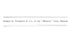

  
[Intangible Textual Heritage](../../index)  [Buddhism](../index) 
[Index](index)  [Next](tbc01) 

------------------------------------------------------------------------

[Buy this Book at
Amazon.com](https://www.amazon.com/exec/obidos/ASIN/B002D48Q84/internetsacredte)

------------------------------------------------------------------------

  
*The Buddhist Catechism*, by Henry S. Olcott \[1908\], at Intangible
Textual Heritage

------------------------------------------------------------------------

p. i

 

*Namô Tassa Bhagavatô Arahatô Sammâ Sambudhassa*.

# THE BUDDHIST CATECHISM,

## BY HENRY S. OLCOTT,

##### PRESIDENT-FOUNDER OF THE THEOSOPHICAL SOCIETY.

*Approved and recommended for use in Buddhist schools by* H. Sumangala, *Pradhâna Nayaka Sthavira, High
Priest of the Sripada and Western Province and Principal of the
Vidyodaya Parivêna*.

##### \_\_\_\_\_\_\_\_\_\_\_ Forty-Second Edition. Corrected. \_\_\_\_\_\_\_\_\_\_\_

#### Madras:

#### The "Theosophist" Office, Adyar.

#### LONDON AND BENARES: THEOSOPHICAL PUBLISHING SOCIETY.

#### \[1903\]

 

Scanned, proofed, formatted at Intangible Textual Heritage, May 2009, by
John Bruno Hare. This text is in the public domain in the US because it
was published prior to 1923.

 

p. ii

==========================================  
Printed by Thompson & Co., at the "Minerva" Press, Madras.  
==========================================

  [  
Click to enlarge](img/cover.jpg)  
Front Cover and Spine  

  [  
Click to enlarge](img/title.jpg)  
Title Page  

 
[  
Click to enlarge](img/verso.jpg)  
Verso  

------------------------------------------------------------------------

[Next: Dedication](tbc01)

